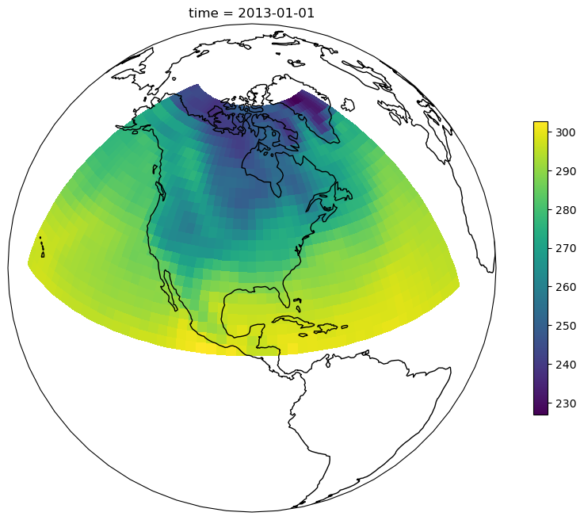
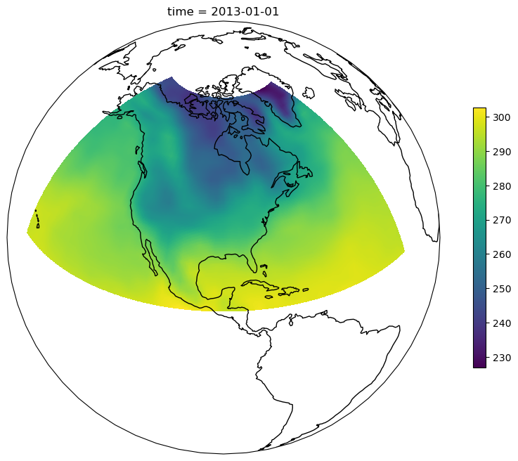
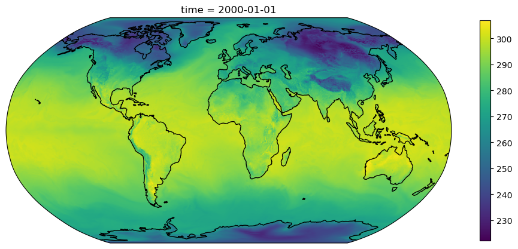

# Running computations in parallel on gridded data with Xarray and Dask

> Converted from Jupyter. This notebook gives an example of the use of XArray on large multi-dimensional data sets. This section stands out from the others, which deal with purely tabulated data. Usually there is a bit of a digotomy in data handling between the use of tables and dense datasets. We need to serve both. This episode can fill the gap of explaining how to deal with large 3 or 4 dimensional datasets, while also teaching the use of profilers.

Xarray makes working with labelled multi-dimensional arrays in Python simple, efficient, and fun!

Use Dask and Xarray to churn through terabytes of multi-dimensional array data in formats like HDF, NetCDF, TIFF, or Zarr.  


```python
from distributed import LocalCluster
import dask
import cartopy.crs
import matplotlib.pyplot as plt
import numpy as np
import xarray as xr
```

Helper function for plotting data on a map


```python
def plot_map(da: xr.DataArray, projection=cartopy.crs.Robinson()) -> None:
    """Create a map plot."""
    plt.figure(figsize=[12,8])
    p = da.plot(
        subplot_kws={
            "projection": projection,
        },
        add_colorbar=False,
        transform=cartopy.crs.PlateCarree(),
    )
    plt.colorbar(p, shrink=0.6)
    p.axes.set_global()
    p.axes.coastlines()
```

## Explore the tutorial data

We will use the xarray tutorial data, a small dataset that xarray can automatically download. When loading large data with xarray, the `chunks` keyword argument should be provided to ensure data is not loaded into memory. Specifying `chunks={}` will load the data with chunks as they are on disk. This is useful for inspection, but should generally not be used for computations as the chunks on disk are typically of the order of a few megabytes, while a good chunks size for computations with Dask is about 100 megabyte. The `chunks="auto"` option will automatically choose a good chunk size for running computations with Dask, while aligning the Dask chunks with the chunks on Disk for efficient reading.


```python
ds = xr.tutorial.open_dataset("air_temperature", chunks="auto")
ds
```


<div><svg style="position: absolute; width: 0; height: 0; overflow: hidden">
<defs>
<symbol id="icon-database" viewBox="0 0 32 32">
<path d="M16 0c-8.837 0-16 2.239-16 5v4c0 2.761 7.163 5 16 5s16-2.239 16-5v-4c0-2.761-7.163-5-16-5z"></path>
<path d="M16 17c-8.837 0-16-2.239-16-5v6c0 2.761 7.163 5 16 5s16-2.239 16-5v-6c0 2.761-7.163 5-16 5z"></path>
<path d="M16 26c-8.837 0-16-2.239-16-5v6c0 2.761 7.163 5 16 5s16-2.239 16-5v-6c0 2.761-7.163 5-16 5z"></path>
</symbol>
<symbol id="icon-file-text2" viewBox="0 0 32 32">
<path d="M28.681 7.159c-0.694-0.947-1.662-2.053-2.724-3.116s-2.169-2.030-3.116-2.724c-1.612-1.182-2.393-1.319-2.841-1.319h-15.5c-1.378 0-2.5 1.121-2.5 2.5v27c0 1.378 1.122 2.5 2.5 2.5h23c1.378 0 2.5-1.122 2.5-2.5v-19.5c0-0.448-0.137-1.23-1.319-2.841zM24.543 5.457c0.959 0.959 1.712 1.825 2.268 2.543h-4.811v-4.811c0.718 0.556 1.584 1.309 2.543 2.268zM28 29.5c0 0.271-0.229 0.5-0.5 0.5h-23c-0.271 0-0.5-0.229-0.5-0.5v-27c0-0.271 0.229-0.5 0.5-0.5 0 0 15.499-0 15.5 0v7c0 0.552 0.448 1 1 1h7v19.5z"></path>
<path d="M23 26h-14c-0.552 0-1-0.448-1-1s0.448-1 1-1h14c0.552 0 1 0.448 1 1s-0.448 1-1 1z"></path>
<path d="M23 22h-14c-0.552 0-1-0.448-1-1s0.448-1 1-1h14c0.552 0 1 0.448 1 1s-0.448 1-1 1z"></path>
<path d="M23 18h-14c-0.552 0-1-0.448-1-1s0.448-1 1-1h14c0.552 0 1 0.448 1 1s-0.448 1-1 1z"></path>
</symbol>
</defs>
</svg>
<style>/* CSS stylesheet for displaying xarray objects in notebooks */

:root {
  --xr-font-color0: var(
    --jp-content-font-color0,
    var(--pst-color-text-base rgba(0, 0, 0, 1))
  );
  --xr-font-color2: var(
    --jp-content-font-color2,
    var(--pst-color-text-base, rgba(0, 0, 0, 0.54))
  );
  --xr-font-color3: var(
    --jp-content-font-color3,
    var(--pst-color-text-base, rgba(0, 0, 0, 0.38))
  );
  --xr-border-color: var(
    --jp-border-color2,
    hsl(from var(--pst-color-on-background, white) h s calc(l - 10))
  );
  --xr-disabled-color: var(
    --jp-layout-color3,
    hsl(from var(--pst-color-on-background, white) h s calc(l - 40))
  );
  --xr-background-color: var(
    --jp-layout-color0,
    var(--pst-color-on-background, white)
  );
  --xr-background-color-row-even: var(
    --jp-layout-color1,
    hsl(from var(--pst-color-on-background, white) h s calc(l - 5))
  );
  --xr-background-color-row-odd: var(
    --jp-layout-color2,
    hsl(from var(--pst-color-on-background, white) h s calc(l - 15))
  );
}

html[theme="dark"],
html[data-theme="dark"],
body[data-theme="dark"],
body.vscode-dark {
  --xr-font-color0: var(
    --jp-content-font-color0,
    var(--pst-color-text-base, rgba(255, 255, 255, 1))
  );
  --xr-font-color2: var(
    --jp-content-font-color2,
    var(--pst-color-text-base, rgba(255, 255, 255, 0.54))
  );
  --xr-font-color3: var(
    --jp-content-font-color3,
    var(--pst-color-text-base, rgba(255, 255, 255, 0.38))
  );
  --xr-border-color: var(
    --jp-border-color2,
    hsl(from var(--pst-color-on-background, #111111) h s calc(l + 10))
  );
  --xr-disabled-color: var(
    --jp-layout-color3,
    hsl(from var(--pst-color-on-background, #111111) h s calc(l + 40))
  );
  --xr-background-color: var(
    --jp-layout-color0,
    var(--pst-color-on-background, #111111)
  );
  --xr-background-color-row-even: var(
    --jp-layout-color1,
    hsl(from var(--pst-color-on-background, #111111) h s calc(l + 5))
  );
  --xr-background-color-row-odd: var(
    --jp-layout-color2,
    hsl(from var(--pst-color-on-background, #111111) h s calc(l + 15))
  );
}

.xr-wrap {
  display: block !important;
  min-width: 300px;
  max-width: 700px;
  line-height: 1.6;
  padding-bottom: 4px;
}

.xr-text-repr-fallback {
  /* fallback to plain text repr when CSS is not injected (untrusted notebook) */
  display: none;
}

.xr-header {
  padding-top: 6px;
  padding-bottom: 6px;
}

.xr-header {
  border-bottom: solid 1px var(--xr-border-color);
  margin-bottom: 4px;
}

.xr-header > div,
.xr-header > ul {
  display: inline;
  margin-top: 0;
  margin-bottom: 0;
}

.xr-obj-type,
.xr-obj-name {
  margin-left: 2px;
  margin-right: 10px;
}

.xr-obj-type,
.xr-group-box-contents > label {
  color: var(--xr-font-color2);
  display: block;
}

.xr-sections {
  padding-left: 0 !important;
  display: grid;
  grid-template-columns: 150px auto auto 1fr 0 20px 0 20px;
  margin-block-start: 0;
  margin-block-end: 0;
}

.xr-section-item {
  display: contents;
}

.xr-section-item > input,
.xr-group-box-contents > input,
.xr-array-wrap > input {
  display: block;
  opacity: 0;
  height: 0;
  margin: 0;
}

.xr-section-item > input + label,
.xr-var-item > input + label {
  color: var(--xr-disabled-color);
}

.xr-section-item > input:enabled + label,
.xr-var-item > input:enabled + label,
.xr-array-wrap > input:enabled + label,
.xr-group-box-contents > input:enabled + label {
  cursor: pointer;
  color: var(--xr-font-color2);
}

.xr-section-item > input:focus-visible + label,
.xr-var-item > input:focus-visible + label,
.xr-array-wrap > input:focus-visible + label,
.xr-group-box-contents > input:focus-visible + label {
  outline: auto;
}

.xr-section-item > input:enabled + label:hover,
.xr-var-item > input:enabled + label:hover,
.xr-array-wrap > input:enabled + label:hover,
.xr-group-box-contents > input:enabled + label:hover {
  color: var(--xr-font-color0);
}

.xr-section-summary {
  grid-column: 1;
  color: var(--xr-font-color2);
  font-weight: 500;
  white-space: nowrap;
}

.xr-section-summary > em {
  font-weight: normal;
}

.xr-span-grid {
  grid-column-end: -1;
}

.xr-section-summary > span {
  display: inline-block;
  padding-left: 0.3em;
}

.xr-group-box-contents > input:checked + label > span {
  display: inline-block;
  padding-left: 0.6em;
}

.xr-section-summary-in:disabled + label {
  color: var(--xr-font-color2);
}

.xr-section-summary-in + label:before {
  display: inline-block;
  content: "►";
  font-size: 11px;
  width: 15px;
  text-align: center;
}

.xr-section-summary-in:disabled + label:before {
  color: var(--xr-disabled-color);
}

.xr-section-summary-in:checked + label:before {
  content: "▼";
}

.xr-section-summary-in:checked + label > span {
  display: none;
}

.xr-section-summary,
.xr-section-inline-details,
.xr-group-box-contents > label {
  padding-top: 4px;
}

.xr-section-inline-details {
  grid-column: 2 / -1;
}

.xr-section-details {
  grid-column: 1 / -1;
  margin-top: 4px;
  margin-bottom: 5px;
}

.xr-section-summary-in ~ .xr-section-details {
  display: none;
}

.xr-section-summary-in:checked ~ .xr-section-details {
  display: contents;
}

.xr-children {
  display: inline-grid;
  grid-template-columns: 100%;
  grid-column: 1 / -1;
  padding-top: 4px;
}

.xr-group-box {
  display: inline-grid;
  grid-template-columns: 0px 30px auto;
}

.xr-group-box-vline {
  grid-column-start: 1;
  border-right: 0.2em solid;
  border-color: var(--xr-border-color);
  width: 0px;
}

.xr-group-box-hline {
  grid-column-start: 2;
  grid-row-start: 1;
  height: 1em;
  width: 26px;
  border-bottom: 0.2em solid;
  border-color: var(--xr-border-color);
}

.xr-group-box-contents {
  grid-column-start: 3;
  padding-bottom: 4px;
}

.xr-group-box-contents > label::before {
  content: "📂";
  padding-right: 0.3em;
}

.xr-group-box-contents > input:checked + label::before {
  content: "📁";
}

.xr-group-box-contents > input:checked + label {
  padding-bottom: 0px;
}

.xr-group-box-contents > input:checked ~ .xr-sections {
  display: none;
}

.xr-group-box-contents > input + label > span {
  display: none;
}

.xr-group-box-ellipsis {
  font-size: 1.4em;
  font-weight: 900;
  color: var(--xr-font-color2);
  letter-spacing: 0.15em;
  cursor: default;
}

.xr-array-wrap {
  grid-column: 1 / -1;
  display: grid;
  grid-template-columns: 20px auto;
}

.xr-array-wrap > label {
  grid-column: 1;
  vertical-align: top;
}

.xr-preview {
  color: var(--xr-font-color3);
}

.xr-array-preview,
.xr-array-data {
  padding: 0 5px !important;
  grid-column: 2;
}

.xr-array-data,
.xr-array-in:checked ~ .xr-array-preview {
  display: none;
}

.xr-array-in:checked ~ .xr-array-data,
.xr-array-preview {
  display: inline-block;
}

.xr-dim-list {
  display: inline-block !important;
  list-style: none;
  padding: 0 !important;
  margin: 0;
}

.xr-dim-list li {
  display: inline-block;
  padding: 0;
  margin: 0;
}

.xr-dim-list:before {
  content: "(";
}

.xr-dim-list:after {
  content: ")";
}

.xr-dim-list li:not(:last-child):after {
  content: ",";
  padding-right: 5px;
}

.xr-has-index {
  font-weight: bold;
}

.xr-var-list,
.xr-var-item {
  display: contents;
}

.xr-var-item > div,
.xr-var-item label,
.xr-var-item > .xr-var-name span {
  background-color: var(--xr-background-color-row-even);
  border-color: var(--xr-background-color-row-odd);
  margin-bottom: 0;
  padding-top: 2px;
}

.xr-var-item > .xr-var-name:hover span {
  padding-right: 5px;
}

.xr-var-list > li:nth-child(odd) > div,
.xr-var-list > li:nth-child(odd) > label,
.xr-var-list > li:nth-child(odd) > .xr-var-name span {
  background-color: var(--xr-background-color-row-odd);
  border-color: var(--xr-background-color-row-even);
}

.xr-var-name {
  grid-column: 1;
}

.xr-var-dims {
  grid-column: 2;
}

.xr-var-dtype {
  grid-column: 3;
  text-align: right;
  color: var(--xr-font-color2);
}

.xr-var-preview {
  grid-column: 4;
}

.xr-index-preview {
  grid-column: 2 / 5;
  color: var(--xr-font-color2);
}

.xr-var-name,
.xr-var-dims,
.xr-var-dtype,
.xr-preview,
.xr-attrs dt {
  white-space: nowrap;
  overflow: hidden;
  text-overflow: ellipsis;
  padding-right: 10px;
}

.xr-var-name:hover,
.xr-var-dims:hover,
.xr-var-dtype:hover,
.xr-attrs dt:hover {
  overflow: visible;
  width: auto;
  z-index: 1;
}

.xr-var-attrs,
.xr-var-data,
.xr-index-data {
  display: none;
  border-top: 2px dotted var(--xr-background-color);
  padding-bottom: 20px !important;
  padding-top: 10px !important;
}

.xr-var-attrs-in + label,
.xr-var-data-in + label,
.xr-index-data-in + label {
  padding: 0 1px;
}

.xr-var-attrs-in:checked ~ .xr-var-attrs,
.xr-var-data-in:checked ~ .xr-var-data,
.xr-index-data-in:checked ~ .xr-index-data {
  display: block;
}

.xr-var-data > table {
  float: right;
}

.xr-var-data > pre,
.xr-index-data > pre,
.xr-var-data > table > tbody > tr {
  background-color: transparent !important;
}

.xr-var-name span,
.xr-var-data,
.xr-index-name div,
.xr-index-data,
.xr-attrs {
  padding-left: 25px !important;
}

.xr-attrs,
.xr-var-attrs,
.xr-var-data,
.xr-index-data {
  grid-column: 1 / -1;
}

dl.xr-attrs {
  padding: 0;
  margin: 0;
  display: grid;
  grid-template-columns: 125px auto;
}

.xr-attrs dt,
.xr-attrs dd {
  padding: 0;
  margin: 0;
  float: left;
  padding-right: 10px;
  width: auto;
}

.xr-attrs dt {
  font-weight: normal;
  grid-column: 1;
}

.xr-attrs dt:hover span {
  display: inline-block;
  background: var(--xr-background-color);
  padding-right: 10px;
}

.xr-attrs dd {
  grid-column: 2;
  white-space: pre-wrap;
  word-break: break-all;
}

.xr-icon-database,
.xr-icon-file-text2,
.xr-no-icon {
  display: inline-block;
  vertical-align: middle;
  width: 1em;
  height: 1.5em !important;
  stroke-width: 0;
  stroke: currentColor;
  fill: currentColor;
}

.xr-var-attrs-in:checked + label > .xr-icon-file-text2,
.xr-var-data-in:checked + label > .xr-icon-database,
.xr-index-data-in:checked + label > .xr-icon-database {
  color: var(--xr-font-color0);
  filter: drop-shadow(1px 1px 5px var(--xr-font-color2));
  stroke-width: 0.8px;
}
</style><pre class='xr-text-repr-fallback'>&lt;xarray.Dataset&gt; Size: 31MB
Dimensions:  (time: 2920, lat: 25, lon: 53)
Coordinates:
  * time     (time) datetime64[ns] 23kB 2013-01-01 ... 2014-12-31T18:00:00
  * lat      (lat) float32 100B 75.0 72.5 70.0 67.5 65.0 ... 22.5 20.0 17.5 15.0
  * lon      (lon) float32 212B 200.0 202.5 205.0 207.5 ... 325.0 327.5 330.0
Data variables:
    air      (time, lat, lon) float64 31MB dask.array&lt;chunksize=(2920, 25, 53), meta=np.ndarray&gt;
Attributes:
    Conventions:  COARDS
    title:        4x daily NMC reanalysis (1948)
    description:  Data is from NMC initialized reanalysis\n(4x/day).  These a...
    platform:     Model
    references:   http://www.esrl.noaa.gov/psd/data/gridded/data.ncep.reanaly...</pre><div class='xr-wrap' style='display:none'><div class='xr-header'><div class='xr-obj-type'>xarray.Dataset</div></div><ul class='xr-sections'><li class='xr-section-item'><input id='section-7bf4082d-c374-47bc-8a76-4ad31a00a66c' class='xr-section-summary-in' type='checkbox' disabled /><label for='section-7bf4082d-c374-47bc-8a76-4ad31a00a66c' class='xr-section-summary'>Dimensions:</label><div class='xr-section-inline-details'><ul class='xr-dim-list'><li><span class='xr-has-index'>time</span>: 2920</li><li><span class='xr-has-index'>lat</span>: 25</li><li><span class='xr-has-index'>lon</span>: 53</li></ul></div></li><li class='xr-section-item'><input id='section-719e2a63-c225-49d9-ab5e-fcdd68a51660' class='xr-section-summary-in' type='checkbox' checked /><label for='section-719e2a63-c225-49d9-ab5e-fcdd68a51660' class='xr-section-summary' title='Expand/collapse section'>Coordinates: <span>(3)</span></label><div class='xr-section-inline-details'></div><div class='xr-section-details'><ul class='xr-var-list'><li class='xr-var-item'><div class='xr-var-name'><span class='xr-has-index'>time</span></div><div class='xr-var-dims'>(time)</div><div class='xr-var-dtype'>datetime64[ns]</div><div class='xr-var-preview xr-preview'>2013-01-01 ... 2014-12-31T18:00:00</div><input id='attrs-ee194d52-1d20-4f5e-8925-97874f8d08d0' class='xr-var-attrs-in' type='checkbox' ><label for='attrs-ee194d52-1d20-4f5e-8925-97874f8d08d0' title='Show/Hide attributes'><svg class='icon xr-icon-file-text2'><use xlink:href='#icon-file-text2'></use></svg></label><input id='data-e4eb6632-d886-4d65-9688-7c95729b6438' class='xr-var-data-in' type='checkbox'><label for='data-e4eb6632-d886-4d65-9688-7c95729b6438' title='Show/Hide data repr'><svg class='icon xr-icon-database'><use xlink:href='#icon-database'></use></svg></label><div class='xr-var-attrs'><dl class='xr-attrs'><dt><span>standard_name :</span></dt><dd>time</dd><dt><span>long_name :</span></dt><dd>Time</dd></dl></div><div class='xr-var-data'><pre>array([&#x27;2013-01-01T00:00:00.000000000&#x27;, &#x27;2013-01-01T06:00:00.000000000&#x27;,
       &#x27;2013-01-01T12:00:00.000000000&#x27;, ..., &#x27;2014-12-31T06:00:00.000000000&#x27;,
       &#x27;2014-12-31T12:00:00.000000000&#x27;, &#x27;2014-12-31T18:00:00.000000000&#x27;],
      shape=(2920,), dtype=&#x27;datetime64[ns]&#x27;)</pre></div></li><li class='xr-var-item'><div class='xr-var-name'><span class='xr-has-index'>lat</span></div><div class='xr-var-dims'>(lat)</div><div class='xr-var-dtype'>float32</div><div class='xr-var-preview xr-preview'>75.0 72.5 70.0 ... 20.0 17.5 15.0</div><input id='attrs-5b48bd0f-3010-4d45-81cf-d36cafad5c9a' class='xr-var-attrs-in' type='checkbox' ><label for='attrs-5b48bd0f-3010-4d45-81cf-d36cafad5c9a' title='Show/Hide attributes'><svg class='icon xr-icon-file-text2'><use xlink:href='#icon-file-text2'></use></svg></label><input id='data-1f3c84ae-f6a8-4b01-8293-0abd972f48ba' class='xr-var-data-in' type='checkbox'><label for='data-1f3c84ae-f6a8-4b01-8293-0abd972f48ba' title='Show/Hide data repr'><svg class='icon xr-icon-database'><use xlink:href='#icon-database'></use></svg></label><div class='xr-var-attrs'><dl class='xr-attrs'><dt><span>standard_name :</span></dt><dd>latitude</dd><dt><span>long_name :</span></dt><dd>Latitude</dd><dt><span>units :</span></dt><dd>degrees_north</dd><dt><span>axis :</span></dt><dd>Y</dd></dl></div><div class='xr-var-data'><pre>array([75. , 72.5, 70. , 67.5, 65. , 62.5, 60. , 57.5, 55. , 52.5, 50. , 47.5,
       45. , 42.5, 40. , 37.5, 35. , 32.5, 30. , 27.5, 25. , 22.5, 20. , 17.5,
       15. ], dtype=float32)</pre></div></li><li class='xr-var-item'><div class='xr-var-name'><span class='xr-has-index'>lon</span></div><div class='xr-var-dims'>(lon)</div><div class='xr-var-dtype'>float32</div><div class='xr-var-preview xr-preview'>200.0 202.5 205.0 ... 327.5 330.0</div><input id='attrs-1fdd5b1c-38ba-4b92-94f3-1600a80979a7' class='xr-var-attrs-in' type='checkbox' ><label for='attrs-1fdd5b1c-38ba-4b92-94f3-1600a80979a7' title='Show/Hide attributes'><svg class='icon xr-icon-file-text2'><use xlink:href='#icon-file-text2'></use></svg></label><input id='data-d292255e-222e-4153-a0e8-f6c2ce22b488' class='xr-var-data-in' type='checkbox'><label for='data-d292255e-222e-4153-a0e8-f6c2ce22b488' title='Show/Hide data repr'><svg class='icon xr-icon-database'><use xlink:href='#icon-database'></use></svg></label><div class='xr-var-attrs'><dl class='xr-attrs'><dt><span>standard_name :</span></dt><dd>longitude</dd><dt><span>long_name :</span></dt><dd>Longitude</dd><dt><span>units :</span></dt><dd>degrees_east</dd><dt><span>axis :</span></dt><dd>X</dd></dl></div><div class='xr-var-data'><pre>array([200. , 202.5, 205. , 207.5, 210. , 212.5, 215. , 217.5, 220. , 222.5,
       225. , 227.5, 230. , 232.5, 235. , 237.5, 240. , 242.5, 245. , 247.5,
       250. , 252.5, 255. , 257.5, 260. , 262.5, 265. , 267.5, 270. , 272.5,
       275. , 277.5, 280. , 282.5, 285. , 287.5, 290. , 292.5, 295. , 297.5,
       300. , 302.5, 305. , 307.5, 310. , 312.5, 315. , 317.5, 320. , 322.5,
       325. , 327.5, 330. ], dtype=float32)</pre></div></li></ul></div></li><li class='xr-section-item'><input id='section-b958a1e9-5ba2-4fec-b45f-4b9bd508744b' class='xr-section-summary-in' type='checkbox' checked /><label for='section-b958a1e9-5ba2-4fec-b45f-4b9bd508744b' class='xr-section-summary' title='Expand/collapse section'>Data variables: <span>(1)</span></label><div class='xr-section-inline-details'></div><div class='xr-section-details'><ul class='xr-var-list'><li class='xr-var-item'><div class='xr-var-name'><span>air</span></div><div class='xr-var-dims'>(time, lat, lon)</div><div class='xr-var-dtype'>float64</div><div class='xr-var-preview xr-preview'>dask.array&lt;chunksize=(2920, 25, 53), meta=np.ndarray&gt;</div><input id='attrs-2da57793-4001-46a3-8333-da16a7a7484e' class='xr-var-attrs-in' type='checkbox' ><label for='attrs-2da57793-4001-46a3-8333-da16a7a7484e' title='Show/Hide attributes'><svg class='icon xr-icon-file-text2'><use xlink:href='#icon-file-text2'></use></svg></label><input id='data-2b79affd-49fe-44dc-80d5-6c15f92a14dd' class='xr-var-data-in' type='checkbox'><label for='data-2b79affd-49fe-44dc-80d5-6c15f92a14dd' title='Show/Hide data repr'><svg class='icon xr-icon-database'><use xlink:href='#icon-database'></use></svg></label><div class='xr-var-attrs'><dl class='xr-attrs'><dt><span>long_name :</span></dt><dd>4xDaily Air temperature at sigma level 995</dd><dt><span>units :</span></dt><dd>degK</dd><dt><span>precision :</span></dt><dd>2</dd><dt><span>GRIB_id :</span></dt><dd>11</dd><dt><span>GRIB_name :</span></dt><dd>TMP</dd><dt><span>var_desc :</span></dt><dd>Air temperature</dd><dt><span>dataset :</span></dt><dd>NMC Reanalysis</dd><dt><span>level_desc :</span></dt><dd>Surface</dd><dt><span>statistic :</span></dt><dd>Individual Obs</dd><dt><span>parent_stat :</span></dt><dd>Other</dd><dt><span>actual_range :</span></dt><dd>[185.16 322.1 ]</dd></dl></div><div class='xr-var-data'><table>
    <tr>
        <td>
            <table style="border-collapse: collapse;">
                <thead>
                    <tr>
                        <td> </td>
                        <th> Array </th>
                        <th> Chunk </th>
                    </tr>
                </thead>
                <tbody>

                    <tr>
                        <th> Bytes </th>
                        <td> 29.52 MiB </td>
                        <td> 29.52 MiB </td>
                    </tr>

                    <tr>
                        <th> Shape </th>
                        <td> (2920, 25, 53) </td>
                        <td> (2920, 25, 53) </td>
                    </tr>
                    <tr>
                        <th> Dask graph </th>
                        <td colspan="2"> 1 chunks in 2 graph layers </td>
                    </tr>
                    <tr>
                        <th> Data type </th>
                        <td colspan="2"> float64 numpy.ndarray </td>
                    </tr>
                </tbody>
            </table>
        </td>
        <td>
        <svg width="159" height="146" style="stroke:rgb(0,0,0);stroke-width:1" >

  <!-- Horizontal lines -->
  <line x1="10" y1="0" x2="80" y2="70" style="stroke-width:2" />
  <line x1="10" y1="25" x2="80" y2="96" style="stroke-width:2" />

  <!-- Vertical lines -->
  <line x1="10" y1="0" x2="10" y2="25" style="stroke-width:2" />
  <line x1="80" y1="70" x2="80" y2="96" style="stroke-width:2" />

  <!-- Colored Rectangle -->
  <polygon points="10.0,0.0 80.58823529411765,70.58823529411765 80.58823529411765,96.00085180870013 10.0,25.41261651458249" style="fill:#ECB172A0;stroke-width:0"/>

  <!-- Horizontal lines -->
  <line x1="10" y1="0" x2="38" y2="0" style="stroke-width:2" />
  <line x1="80" y1="70" x2="109" y2="70" style="stroke-width:2" />

  <!-- Vertical lines -->
  <line x1="10" y1="0" x2="80" y2="70" style="stroke-width:2" />
  <line x1="38" y1="0" x2="109" y2="70" style="stroke-width:2" />

  <!-- Colored Rectangle -->
  <polygon points="10.0,0.0 38.48973265594604,0.0 109.0779679500637,70.58823529411765 80.58823529411765,70.58823529411765" style="fill:#ECB172A0;stroke-width:0"/>

  <!-- Horizontal lines -->
  <line x1="80" y1="70" x2="109" y2="70" style="stroke-width:2" />
  <line x1="80" y1="96" x2="109" y2="96" style="stroke-width:2" />

  <!-- Vertical lines -->
  <line x1="80" y1="70" x2="80" y2="96" style="stroke-width:2" />
  <line x1="109" y1="70" x2="109" y2="96" style="stroke-width:2" />

  <!-- Colored Rectangle -->
  <polygon points="80.58823529411765,70.58823529411765 109.0779679500637,70.58823529411765 109.0779679500637,96.00085180870013 80.58823529411765,96.00085180870013" style="fill:#ECB172A0;stroke-width:0"/>

  <!-- Text -->
  <text x="94.83310162209068" y="116.00085180870013" font-size="1.0rem" font-weight="100" text-anchor="middle" >53</text>
  <text x="129.07796795006368" y="83.29454355140889" font-size="1.0rem" font-weight="100" text-anchor="middle" transform="rotate(0,129.07796795006368,83.29454355140889)">25</text>
  <text x="35.294117647058826" y="80.70673416164131" font-size="1.0rem" font-weight="100" text-anchor="middle" transform="rotate(45,35.294117647058826,80.70673416164131)">2920</text>
</svg>
        </td>
    </tr>
</table></div></li></ul></div></li><li class='xr-section-item'><input id='section-1ad8fb4c-15e4-4543-8ac7-04ae89d588c5' class='xr-section-summary-in' type='checkbox' checked /><label for='section-1ad8fb4c-15e4-4543-8ac7-04ae89d588c5' class='xr-section-summary' title='Expand/collapse section'>Attributes: <span>(5)</span></label><div class='xr-section-inline-details'></div><div class='xr-section-details'><dl class='xr-attrs'><dt><span>Conventions :</span></dt><dd>COARDS</dd><dt><span>title :</span></dt><dd>4x daily NMC reanalysis (1948)</dd><dt><span>description :</span></dt><dd>Data is from NMC initialized reanalysis
(4x/day).  These are the 0.9950 sigma level values.</dd><dt><span>platform :</span></dt><dd>Model</dd><dt><span>references :</span></dt><dd>http://www.esrl.noaa.gov/psd/data/gridded/data.ncep.reanalysis.html</dd></dl></div></li></ul></div></div>


We see that it is a three dimensional dataset of air temperature. The data has been interpreted as a single Dask chunk because it is so small.


```python
ds.air
```


<div><svg style="position: absolute; width: 0; height: 0; overflow: hidden">
<defs>
<symbol id="icon-database" viewBox="0 0 32 32">
<path d="M16 0c-8.837 0-16 2.239-16 5v4c0 2.761 7.163 5 16 5s16-2.239 16-5v-4c0-2.761-7.163-5-16-5z"></path>
<path d="M16 17c-8.837 0-16-2.239-16-5v6c0 2.761 7.163 5 16 5s16-2.239 16-5v-6c0 2.761-7.163 5-16 5z"></path>
<path d="M16 26c-8.837 0-16-2.239-16-5v6c0 2.761 7.163 5 16 5s16-2.239 16-5v-6c0 2.761-7.163 5-16 5z"></path>
</symbol>
<symbol id="icon-file-text2" viewBox="0 0 32 32">
<path d="M28.681 7.159c-0.694-0.947-1.662-2.053-2.724-3.116s-2.169-2.030-3.116-2.724c-1.612-1.182-2.393-1.319-2.841-1.319h-15.5c-1.378 0-2.5 1.121-2.5 2.5v27c0 1.378 1.122 2.5 2.5 2.5h23c1.378 0 2.5-1.122 2.5-2.5v-19.5c0-0.448-0.137-1.23-1.319-2.841zM24.543 5.457c0.959 0.959 1.712 1.825 2.268 2.543h-4.811v-4.811c0.718 0.556 1.584 1.309 2.543 2.268zM28 29.5c0 0.271-0.229 0.5-0.5 0.5h-23c-0.271 0-0.5-0.229-0.5-0.5v-27c0-0.271 0.229-0.5 0.5-0.5 0 0 15.499-0 15.5 0v7c0 0.552 0.448 1 1 1h7v19.5z"></path>
<path d="M23 26h-14c-0.552 0-1-0.448-1-1s0.448-1 1-1h14c0.552 0 1 0.448 1 1s-0.448 1-1 1z"></path>
<path d="M23 22h-14c-0.552 0-1-0.448-1-1s0.448-1 1-1h14c0.552 0 1 0.448 1 1s-0.448 1-1 1z"></path>
<path d="M23 18h-14c-0.552 0-1-0.448-1-1s0.448-1 1-1h14c0.552 0 1 0.448 1 1s-0.448 1-1 1z"></path>
</symbol>
</defs>
</svg>
<style>/* CSS stylesheet for displaying xarray objects in notebooks */

:root {
  --xr-font-color0: var(
    --jp-content-font-color0,
    var(--pst-color-text-base rgba(0, 0, 0, 1))
  );
  --xr-font-color2: var(
    --jp-content-font-color2,
    var(--pst-color-text-base, rgba(0, 0, 0, 0.54))
  );
  --xr-font-color3: var(
    --jp-content-font-color3,
    var(--pst-color-text-base, rgba(0, 0, 0, 0.38))
  );
  --xr-border-color: var(
    --jp-border-color2,
    hsl(from var(--pst-color-on-background, white) h s calc(l - 10))
  );
  --xr-disabled-color: var(
    --jp-layout-color3,
    hsl(from var(--pst-color-on-background, white) h s calc(l - 40))
  );
  --xr-background-color: var(
    --jp-layout-color0,
    var(--pst-color-on-background, white)
  );
  --xr-background-color-row-even: var(
    --jp-layout-color1,
    hsl(from var(--pst-color-on-background, white) h s calc(l - 5))
  );
  --xr-background-color-row-odd: var(
    --jp-layout-color2,
    hsl(from var(--pst-color-on-background, white) h s calc(l - 15))
  );
}

html[theme="dark"],
html[data-theme="dark"],
body[data-theme="dark"],
body.vscode-dark {
  --xr-font-color0: var(
    --jp-content-font-color0,
    var(--pst-color-text-base, rgba(255, 255, 255, 1))
  );
  --xr-font-color2: var(
    --jp-content-font-color2,
    var(--pst-color-text-base, rgba(255, 255, 255, 0.54))
  );
  --xr-font-color3: var(
    --jp-content-font-color3,
    var(--pst-color-text-base, rgba(255, 255, 255, 0.38))
  );
  --xr-border-color: var(
    --jp-border-color2,
    hsl(from var(--pst-color-on-background, #111111) h s calc(l + 10))
  );
  --xr-disabled-color: var(
    --jp-layout-color3,
    hsl(from var(--pst-color-on-background, #111111) h s calc(l + 40))
  );
  --xr-background-color: var(
    --jp-layout-color0,
    var(--pst-color-on-background, #111111)
  );
  --xr-background-color-row-even: var(
    --jp-layout-color1,
    hsl(from var(--pst-color-on-background, #111111) h s calc(l + 5))
  );
  --xr-background-color-row-odd: var(
    --jp-layout-color2,
    hsl(from var(--pst-color-on-background, #111111) h s calc(l + 15))
  );
}

.xr-wrap {
  display: block !important;
  min-width: 300px;
  max-width: 700px;
  line-height: 1.6;
  padding-bottom: 4px;
}

.xr-text-repr-fallback {
  /* fallback to plain text repr when CSS is not injected (untrusted notebook) */
  display: none;
}

.xr-header {
  padding-top: 6px;
  padding-bottom: 6px;
}

.xr-header {
  border-bottom: solid 1px var(--xr-border-color);
  margin-bottom: 4px;
}

.xr-header > div,
.xr-header > ul {
  display: inline;
  margin-top: 0;
  margin-bottom: 0;
}

.xr-obj-type,
.xr-obj-name {
  margin-left: 2px;
  margin-right: 10px;
}

.xr-obj-type,
.xr-group-box-contents > label {
  color: var(--xr-font-color2);
  display: block;
}

.xr-sections {
  padding-left: 0 !important;
  display: grid;
  grid-template-columns: 150px auto auto 1fr 0 20px 0 20px;
  margin-block-start: 0;
  margin-block-end: 0;
}

.xr-section-item {
  display: contents;
}

.xr-section-item > input,
.xr-group-box-contents > input,
.xr-array-wrap > input {
  display: block;
  opacity: 0;
  height: 0;
  margin: 0;
}

.xr-section-item > input + label,
.xr-var-item > input + label {
  color: var(--xr-disabled-color);
}

.xr-section-item > input:enabled + label,
.xr-var-item > input:enabled + label,
.xr-array-wrap > input:enabled + label,
.xr-group-box-contents > input:enabled + label {
  cursor: pointer;
  color: var(--xr-font-color2);
}

.xr-section-item > input:focus-visible + label,
.xr-var-item > input:focus-visible + label,
.xr-array-wrap > input:focus-visible + label,
.xr-group-box-contents > input:focus-visible + label {
  outline: auto;
}

.xr-section-item > input:enabled + label:hover,
.xr-var-item > input:enabled + label:hover,
.xr-array-wrap > input:enabled + label:hover,
.xr-group-box-contents > input:enabled + label:hover {
  color: var(--xr-font-color0);
}

.xr-section-summary {
  grid-column: 1;
  color: var(--xr-font-color2);
  font-weight: 500;
  white-space: nowrap;
}

.xr-section-summary > em {
  font-weight: normal;
}

.xr-span-grid {
  grid-column-end: -1;
}

.xr-section-summary > span {
  display: inline-block;
  padding-left: 0.3em;
}

.xr-group-box-contents > input:checked + label > span {
  display: inline-block;
  padding-left: 0.6em;
}

.xr-section-summary-in:disabled + label {
  color: var(--xr-font-color2);
}

.xr-section-summary-in + label:before {
  display: inline-block;
  content: "►";
  font-size: 11px;
  width: 15px;
  text-align: center;
}

.xr-section-summary-in:disabled + label:before {
  color: var(--xr-disabled-color);
}

.xr-section-summary-in:checked + label:before {
  content: "▼";
}

.xr-section-summary-in:checked + label > span {
  display: none;
}

.xr-section-summary,
.xr-section-inline-details,
.xr-group-box-contents > label {
  padding-top: 4px;
}

.xr-section-inline-details {
  grid-column: 2 / -1;
}

.xr-section-details {
  grid-column: 1 / -1;
  margin-top: 4px;
  margin-bottom: 5px;
}

.xr-section-summary-in ~ .xr-section-details {
  display: none;
}

.xr-section-summary-in:checked ~ .xr-section-details {
  display: contents;
}

.xr-children {
  display: inline-grid;
  grid-template-columns: 100%;
  grid-column: 1 / -1;
  padding-top: 4px;
}

.xr-group-box {
  display: inline-grid;
  grid-template-columns: 0px 30px auto;
}

.xr-group-box-vline {
  grid-column-start: 1;
  border-right: 0.2em solid;
  border-color: var(--xr-border-color);
  width: 0px;
}

.xr-group-box-hline {
  grid-column-start: 2;
  grid-row-start: 1;
  height: 1em;
  width: 26px;
  border-bottom: 0.2em solid;
  border-color: var(--xr-border-color);
}

.xr-group-box-contents {
  grid-column-start: 3;
  padding-bottom: 4px;
}

.xr-group-box-contents > label::before {
  content: "📂";
  padding-right: 0.3em;
}

.xr-group-box-contents > input:checked + label::before {
  content: "📁";
}

.xr-group-box-contents > input:checked + label {
  padding-bottom: 0px;
}

.xr-group-box-contents > input:checked ~ .xr-sections {
  display: none;
}

.xr-group-box-contents > input + label > span {
  display: none;
}

.xr-group-box-ellipsis {
  font-size: 1.4em;
  font-weight: 900;
  color: var(--xr-font-color2);
  letter-spacing: 0.15em;
  cursor: default;
}

.xr-array-wrap {
  grid-column: 1 / -1;
  display: grid;
  grid-template-columns: 20px auto;
}

.xr-array-wrap > label {
  grid-column: 1;
  vertical-align: top;
}

.xr-preview {
  color: var(--xr-font-color3);
}

.xr-array-preview,
.xr-array-data {
  padding: 0 5px !important;
  grid-column: 2;
}

.xr-array-data,
.xr-array-in:checked ~ .xr-array-preview {
  display: none;
}

.xr-array-in:checked ~ .xr-array-data,
.xr-array-preview {
  display: inline-block;
}

.xr-dim-list {
  display: inline-block !important;
  list-style: none;
  padding: 0 !important;
  margin: 0;
}

.xr-dim-list li {
  display: inline-block;
  padding: 0;
  margin: 0;
}

.xr-dim-list:before {
  content: "(";
}

.xr-dim-list:after {
  content: ")";
}

.xr-dim-list li:not(:last-child):after {
  content: ",";
  padding-right: 5px;
}

.xr-has-index {
  font-weight: bold;
}

.xr-var-list,
.xr-var-item {
  display: contents;
}

.xr-var-item > div,
.xr-var-item label,
.xr-var-item > .xr-var-name span {
  background-color: var(--xr-background-color-row-even);
  border-color: var(--xr-background-color-row-odd);
  margin-bottom: 0;
  padding-top: 2px;
}

.xr-var-item > .xr-var-name:hover span {
  padding-right: 5px;
}

.xr-var-list > li:nth-child(odd) > div,
.xr-var-list > li:nth-child(odd) > label,
.xr-var-list > li:nth-child(odd) > .xr-var-name span {
  background-color: var(--xr-background-color-row-odd);
  border-color: var(--xr-background-color-row-even);
}

.xr-var-name {
  grid-column: 1;
}

.xr-var-dims {
  grid-column: 2;
}

.xr-var-dtype {
  grid-column: 3;
  text-align: right;
  color: var(--xr-font-color2);
}

.xr-var-preview {
  grid-column: 4;
}

.xr-index-preview {
  grid-column: 2 / 5;
  color: var(--xr-font-color2);
}

.xr-var-name,
.xr-var-dims,
.xr-var-dtype,
.xr-preview,
.xr-attrs dt {
  white-space: nowrap;
  overflow: hidden;
  text-overflow: ellipsis;
  padding-right: 10px;
}

.xr-var-name:hover,
.xr-var-dims:hover,
.xr-var-dtype:hover,
.xr-attrs dt:hover {
  overflow: visible;
  width: auto;
  z-index: 1;
}

.xr-var-attrs,
.xr-var-data,
.xr-index-data {
  display: none;
  border-top: 2px dotted var(--xr-background-color);
  padding-bottom: 20px !important;
  padding-top: 10px !important;
}

.xr-var-attrs-in + label,
.xr-var-data-in + label,
.xr-index-data-in + label {
  padding: 0 1px;
}

.xr-var-attrs-in:checked ~ .xr-var-attrs,
.xr-var-data-in:checked ~ .xr-var-data,
.xr-index-data-in:checked ~ .xr-index-data {
  display: block;
}

.xr-var-data > table {
  float: right;
}

.xr-var-data > pre,
.xr-index-data > pre,
.xr-var-data > table > tbody > tr {
  background-color: transparent !important;
}

.xr-var-name span,
.xr-var-data,
.xr-index-name div,
.xr-index-data,
.xr-attrs {
  padding-left: 25px !important;
}

.xr-attrs,
.xr-var-attrs,
.xr-var-data,
.xr-index-data {
  grid-column: 1 / -1;
}

dl.xr-attrs {
  padding: 0;
  margin: 0;
  display: grid;
  grid-template-columns: 125px auto;
}

.xr-attrs dt,
.xr-attrs dd {
  padding: 0;
  margin: 0;
  float: left;
  padding-right: 10px;
  width: auto;
}

.xr-attrs dt {
  font-weight: normal;
  grid-column: 1;
}

.xr-attrs dt:hover span {
  display: inline-block;
  background: var(--xr-background-color);
  padding-right: 10px;
}

.xr-attrs dd {
  grid-column: 2;
  white-space: pre-wrap;
  word-break: break-all;
}

.xr-icon-database,
.xr-icon-file-text2,
.xr-no-icon {
  display: inline-block;
  vertical-align: middle;
  width: 1em;
  height: 1.5em !important;
  stroke-width: 0;
  stroke: currentColor;
  fill: currentColor;
}

.xr-var-attrs-in:checked + label > .xr-icon-file-text2,
.xr-var-data-in:checked + label > .xr-icon-database,
.xr-index-data-in:checked + label > .xr-icon-database {
  color: var(--xr-font-color0);
  filter: drop-shadow(1px 1px 5px var(--xr-font-color2));
  stroke-width: 0.8px;
}
</style><pre class='xr-text-repr-fallback'>&lt;xarray.DataArray &#x27;air&#x27; (time: 2920, lat: 25, lon: 53)&gt; Size: 31MB
dask.array&lt;open_dataset-air, shape=(2920, 25, 53), dtype=float64, chunksize=(2920, 25, 53), chunktype=numpy.ndarray&gt;
Coordinates:
  * time     (time) datetime64[ns] 23kB 2013-01-01 ... 2014-12-31T18:00:00
  * lat      (lat) float32 100B 75.0 72.5 70.0 67.5 65.0 ... 22.5 20.0 17.5 15.0
  * lon      (lon) float32 212B 200.0 202.5 205.0 207.5 ... 325.0 327.5 330.0
Attributes:
    long_name:     4xDaily Air temperature at sigma level 995
    units:         degK
    precision:     2
    GRIB_id:       11
    GRIB_name:     TMP
    var_desc:      Air temperature
    dataset:       NMC Reanalysis
    level_desc:    Surface
    statistic:     Individual Obs
    parent_stat:   Other
    actual_range:  [185.16 322.1 ]</pre><div class='xr-wrap' style='display:none'><div class='xr-header'><div class='xr-obj-type'>xarray.DataArray</div><div class='xr-obj-name'>&#x27;air&#x27;</div><ul class='xr-dim-list'><li><span class='xr-has-index'>time</span>: 2920</li><li><span class='xr-has-index'>lat</span>: 25</li><li><span class='xr-has-index'>lon</span>: 53</li></ul></div><ul class='xr-sections'><li class='xr-section-item'><div class='xr-array-wrap'><input id='section-f8b87c9c-96cc-4c57-8d73-2bbbc250aec9' class='xr-array-in' type='checkbox' checked><label for='section-f8b87c9c-96cc-4c57-8d73-2bbbc250aec9' title='Show/hide data repr'><svg class='icon xr-icon-database'><use xlink:href='#icon-database'></use></svg></label><div class='xr-array-preview xr-preview'><span>dask.array&lt;chunksize=(2920, 25, 53), meta=np.ndarray&gt;</span></div><div class='xr-array-data'><table>
    <tr>
        <td>
            <table style="border-collapse: collapse;">
                <thead>
                    <tr>
                        <td> </td>
                        <th> Array </th>
                        <th> Chunk </th>
                    </tr>
                </thead>
                <tbody>

                    <tr>
                        <th> Bytes </th>
                        <td> 29.52 MiB </td>
                        <td> 29.52 MiB </td>
                    </tr>

                    <tr>
                        <th> Shape </th>
                        <td> (2920, 25, 53) </td>
                        <td> (2920, 25, 53) </td>
                    </tr>
                    <tr>
                        <th> Dask graph </th>
                        <td colspan="2"> 1 chunks in 2 graph layers </td>
                    </tr>
                    <tr>
                        <th> Data type </th>
                        <td colspan="2"> float64 numpy.ndarray </td>
                    </tr>
                </tbody>
            </table>
        </td>
        <td>
        <svg width="159" height="146" style="stroke:rgb(0,0,0);stroke-width:1" >

  <!-- Horizontal lines -->
  <line x1="10" y1="0" x2="80" y2="70" style="stroke-width:2" />
  <line x1="10" y1="25" x2="80" y2="96" style="stroke-width:2" />

  <!-- Vertical lines -->
  <line x1="10" y1="0" x2="10" y2="25" style="stroke-width:2" />
  <line x1="80" y1="70" x2="80" y2="96" style="stroke-width:2" />

  <!-- Colored Rectangle -->
  <polygon points="10.0,0.0 80.58823529411765,70.58823529411765 80.58823529411765,96.00085180870013 10.0,25.41261651458249" style="fill:#ECB172A0;stroke-width:0"/>

  <!-- Horizontal lines -->
  <line x1="10" y1="0" x2="38" y2="0" style="stroke-width:2" />
  <line x1="80" y1="70" x2="109" y2="70" style="stroke-width:2" />

  <!-- Vertical lines -->
  <line x1="10" y1="0" x2="80" y2="70" style="stroke-width:2" />
  <line x1="38" y1="0" x2="109" y2="70" style="stroke-width:2" />

  <!-- Colored Rectangle -->
  <polygon points="10.0,0.0 38.48973265594604,0.0 109.0779679500637,70.58823529411765 80.58823529411765,70.58823529411765" style="fill:#ECB172A0;stroke-width:0"/>

  <!-- Horizontal lines -->
  <line x1="80" y1="70" x2="109" y2="70" style="stroke-width:2" />
  <line x1="80" y1="96" x2="109" y2="96" style="stroke-width:2" />

  <!-- Vertical lines -->
  <line x1="80" y1="70" x2="80" y2="96" style="stroke-width:2" />
  <line x1="109" y1="70" x2="109" y2="96" style="stroke-width:2" />

  <!-- Colored Rectangle -->
  <polygon points="80.58823529411765,70.58823529411765 109.0779679500637,70.58823529411765 109.0779679500637,96.00085180870013 80.58823529411765,96.00085180870013" style="fill:#ECB172A0;stroke-width:0"/>

  <!-- Text -->
  <text x="94.83310162209068" y="116.00085180870013" font-size="1.0rem" font-weight="100" text-anchor="middle" >53</text>
  <text x="129.07796795006368" y="83.29454355140889" font-size="1.0rem" font-weight="100" text-anchor="middle" transform="rotate(0,129.07796795006368,83.29454355140889)">25</text>
  <text x="35.294117647058826" y="80.70673416164131" font-size="1.0rem" font-weight="100" text-anchor="middle" transform="rotate(45,35.294117647058826,80.70673416164131)">2920</text>
</svg>
        </td>
    </tr>
</table></div></div></li><li class='xr-section-item'><input id='section-edce233f-1da7-4075-bcd6-2f0b282f57ff' class='xr-section-summary-in' type='checkbox' checked /><label for='section-edce233f-1da7-4075-bcd6-2f0b282f57ff' class='xr-section-summary' title='Expand/collapse section'>Coordinates: <span>(3)</span></label><div class='xr-section-inline-details'></div><div class='xr-section-details'><ul class='xr-var-list'><li class='xr-var-item'><div class='xr-var-name'><span class='xr-has-index'>time</span></div><div class='xr-var-dims'>(time)</div><div class='xr-var-dtype'>datetime64[ns]</div><div class='xr-var-preview xr-preview'>2013-01-01 ... 2014-12-31T18:00:00</div><input id='attrs-8e227a57-0fa4-4019-8d3a-641ab1674447' class='xr-var-attrs-in' type='checkbox' ><label for='attrs-8e227a57-0fa4-4019-8d3a-641ab1674447' title='Show/Hide attributes'><svg class='icon xr-icon-file-text2'><use xlink:href='#icon-file-text2'></use></svg></label><input id='data-ba846f72-679a-4eb3-be39-49c237364995' class='xr-var-data-in' type='checkbox'><label for='data-ba846f72-679a-4eb3-be39-49c237364995' title='Show/Hide data repr'><svg class='icon xr-icon-database'><use xlink:href='#icon-database'></use></svg></label><div class='xr-var-attrs'><dl class='xr-attrs'><dt><span>standard_name :</span></dt><dd>time</dd><dt><span>long_name :</span></dt><dd>Time</dd></dl></div><div class='xr-var-data'><pre>array([&#x27;2013-01-01T00:00:00.000000000&#x27;, &#x27;2013-01-01T06:00:00.000000000&#x27;,
       &#x27;2013-01-01T12:00:00.000000000&#x27;, ..., &#x27;2014-12-31T06:00:00.000000000&#x27;,
       &#x27;2014-12-31T12:00:00.000000000&#x27;, &#x27;2014-12-31T18:00:00.000000000&#x27;],
      shape=(2920,), dtype=&#x27;datetime64[ns]&#x27;)</pre></div></li><li class='xr-var-item'><div class='xr-var-name'><span class='xr-has-index'>lat</span></div><div class='xr-var-dims'>(lat)</div><div class='xr-var-dtype'>float32</div><div class='xr-var-preview xr-preview'>75.0 72.5 70.0 ... 20.0 17.5 15.0</div><input id='attrs-7e20c010-4698-4d1f-944a-52cdcce9d2c8' class='xr-var-attrs-in' type='checkbox' ><label for='attrs-7e20c010-4698-4d1f-944a-52cdcce9d2c8' title='Show/Hide attributes'><svg class='icon xr-icon-file-text2'><use xlink:href='#icon-file-text2'></use></svg></label><input id='data-59e84fda-8588-4d63-b38a-c00fab34f7ef' class='xr-var-data-in' type='checkbox'><label for='data-59e84fda-8588-4d63-b38a-c00fab34f7ef' title='Show/Hide data repr'><svg class='icon xr-icon-database'><use xlink:href='#icon-database'></use></svg></label><div class='xr-var-attrs'><dl class='xr-attrs'><dt><span>standard_name :</span></dt><dd>latitude</dd><dt><span>long_name :</span></dt><dd>Latitude</dd><dt><span>units :</span></dt><dd>degrees_north</dd><dt><span>axis :</span></dt><dd>Y</dd></dl></div><div class='xr-var-data'><pre>array([75. , 72.5, 70. , 67.5, 65. , 62.5, 60. , 57.5, 55. , 52.5, 50. , 47.5,
       45. , 42.5, 40. , 37.5, 35. , 32.5, 30. , 27.5, 25. , 22.5, 20. , 17.5,
       15. ], dtype=float32)</pre></div></li><li class='xr-var-item'><div class='xr-var-name'><span class='xr-has-index'>lon</span></div><div class='xr-var-dims'>(lon)</div><div class='xr-var-dtype'>float32</div><div class='xr-var-preview xr-preview'>200.0 202.5 205.0 ... 327.5 330.0</div><input id='attrs-cb7b17a2-50c4-4321-8b14-4e74dc7c4be3' class='xr-var-attrs-in' type='checkbox' ><label for='attrs-cb7b17a2-50c4-4321-8b14-4e74dc7c4be3' title='Show/Hide attributes'><svg class='icon xr-icon-file-text2'><use xlink:href='#icon-file-text2'></use></svg></label><input id='data-539eb7e9-7b36-4a7d-b21c-85cd355b11d9' class='xr-var-data-in' type='checkbox'><label for='data-539eb7e9-7b36-4a7d-b21c-85cd355b11d9' title='Show/Hide data repr'><svg class='icon xr-icon-database'><use xlink:href='#icon-database'></use></svg></label><div class='xr-var-attrs'><dl class='xr-attrs'><dt><span>standard_name :</span></dt><dd>longitude</dd><dt><span>long_name :</span></dt><dd>Longitude</dd><dt><span>units :</span></dt><dd>degrees_east</dd><dt><span>axis :</span></dt><dd>X</dd></dl></div><div class='xr-var-data'><pre>array([200. , 202.5, 205. , 207.5, 210. , 212.5, 215. , 217.5, 220. , 222.5,
       225. , 227.5, 230. , 232.5, 235. , 237.5, 240. , 242.5, 245. , 247.5,
       250. , 252.5, 255. , 257.5, 260. , 262.5, 265. , 267.5, 270. , 272.5,
       275. , 277.5, 280. , 282.5, 285. , 287.5, 290. , 292.5, 295. , 297.5,
       300. , 302.5, 305. , 307.5, 310. , 312.5, 315. , 317.5, 320. , 322.5,
       325. , 327.5, 330. ], dtype=float32)</pre></div></li></ul></div></li><li class='xr-section-item'><input id='section-9a7498ce-4d4c-404c-a755-9dbabfcbfc30' class='xr-section-summary-in' type='checkbox' /><label for='section-9a7498ce-4d4c-404c-a755-9dbabfcbfc30' class='xr-section-summary' title='Expand/collapse section'>Attributes: <span>(11)</span></label><div class='xr-section-inline-details'></div><div class='xr-section-details'><dl class='xr-attrs'><dt><span>long_name :</span></dt><dd>4xDaily Air temperature at sigma level 995</dd><dt><span>units :</span></dt><dd>degK</dd><dt><span>precision :</span></dt><dd>2</dd><dt><span>GRIB_id :</span></dt><dd>11</dd><dt><span>GRIB_name :</span></dt><dd>TMP</dd><dt><span>var_desc :</span></dt><dd>Air temperature</dd><dt><span>dataset :</span></dt><dd>NMC Reanalysis</dd><dt><span>level_desc :</span></dt><dd>Surface</dd><dt><span>statistic :</span></dt><dd>Individual Obs</dd><dt><span>parent_stat :</span></dt><dd>Other</dd><dt><span>actual_range :</span></dt><dd>[185.16 322.1 ]</dd></dl></div></li></ul></div></div>


Let's plot the first time point of the data to get an idea of what we are working with:


```python
north_america = cartopy.crs.Orthographic(-90, 35)
plot_map(ds.air.isel(time=0), projection=north_america)
```


    

    


So, this datasets is air temperature over North America from 2013 and 2014 at four time points a day.

## Prepare the tutorial data

We will increase the spatial resolution of the tutorial dataset to make the computation that we are going to perform more interesting and then save to to zarr format.


```python
scale_factor = 10
ds = xr.tutorial.open_dataset(
    "air_temperature",
    chunks={"time": 100}  # We choose the input chunks here such the resulting high-resolution dataset has reasonably sized chunks.
)
ds = ds.interp(
    lat=np.linspace(ds.lat.data[0], ds.lat.data[-1], len(ds.lat) * scale_factor),
    lon=np.linspace(ds.lon.data[0], ds.lon.data[-1], len(ds.lon) * scale_factor),
    method="linear",
)
ds.air
```


<div><svg style="position: absolute; width: 0; height: 0; overflow: hidden">
<defs>
<symbol id="icon-database" viewBox="0 0 32 32">
<path d="M16 0c-8.837 0-16 2.239-16 5v4c0 2.761 7.163 5 16 5s16-2.239 16-5v-4c0-2.761-7.163-5-16-5z"></path>
<path d="M16 17c-8.837 0-16-2.239-16-5v6c0 2.761 7.163 5 16 5s16-2.239 16-5v-6c0 2.761-7.163 5-16 5z"></path>
<path d="M16 26c-8.837 0-16-2.239-16-5v6c0 2.761 7.163 5 16 5s16-2.239 16-5v-6c0 2.761-7.163 5-16 5z"></path>
</symbol>
<symbol id="icon-file-text2" viewBox="0 0 32 32">
<path d="M28.681 7.159c-0.694-0.947-1.662-2.053-2.724-3.116s-2.169-2.030-3.116-2.724c-1.612-1.182-2.393-1.319-2.841-1.319h-15.5c-1.378 0-2.5 1.121-2.5 2.5v27c0 1.378 1.122 2.5 2.5 2.5h23c1.378 0 2.5-1.122 2.5-2.5v-19.5c0-0.448-0.137-1.23-1.319-2.841zM24.543 5.457c0.959 0.959 1.712 1.825 2.268 2.543h-4.811v-4.811c0.718 0.556 1.584 1.309 2.543 2.268zM28 29.5c0 0.271-0.229 0.5-0.5 0.5h-23c-0.271 0-0.5-0.229-0.5-0.5v-27c0-0.271 0.229-0.5 0.5-0.5 0 0 15.499-0 15.5 0v7c0 0.552 0.448 1 1 1h7v19.5z"></path>
<path d="M23 26h-14c-0.552 0-1-0.448-1-1s0.448-1 1-1h14c0.552 0 1 0.448 1 1s-0.448 1-1 1z"></path>
<path d="M23 22h-14c-0.552 0-1-0.448-1-1s0.448-1 1-1h14c0.552 0 1 0.448 1 1s-0.448 1-1 1z"></path>
<path d="M23 18h-14c-0.552 0-1-0.448-1-1s0.448-1 1-1h14c0.552 0 1 0.448 1 1s-0.448 1-1 1z"></path>
</symbol>
</defs>
</svg>
<style>/* CSS stylesheet for displaying xarray objects in notebooks */

:root {
  --xr-font-color0: var(
    --jp-content-font-color0,
    var(--pst-color-text-base rgba(0, 0, 0, 1))
  );
  --xr-font-color2: var(
    --jp-content-font-color2,
    var(--pst-color-text-base, rgba(0, 0, 0, 0.54))
  );
  --xr-font-color3: var(
    --jp-content-font-color3,
    var(--pst-color-text-base, rgba(0, 0, 0, 0.38))
  );
  --xr-border-color: var(
    --jp-border-color2,
    hsl(from var(--pst-color-on-background, white) h s calc(l - 10))
  );
  --xr-disabled-color: var(
    --jp-layout-color3,
    hsl(from var(--pst-color-on-background, white) h s calc(l - 40))
  );
  --xr-background-color: var(
    --jp-layout-color0,
    var(--pst-color-on-background, white)
  );
  --xr-background-color-row-even: var(
    --jp-layout-color1,
    hsl(from var(--pst-color-on-background, white) h s calc(l - 5))
  );
  --xr-background-color-row-odd: var(
    --jp-layout-color2,
    hsl(from var(--pst-color-on-background, white) h s calc(l - 15))
  );
}

html[theme="dark"],
html[data-theme="dark"],
body[data-theme="dark"],
body.vscode-dark {
  --xr-font-color0: var(
    --jp-content-font-color0,
    var(--pst-color-text-base, rgba(255, 255, 255, 1))
  );
  --xr-font-color2: var(
    --jp-content-font-color2,
    var(--pst-color-text-base, rgba(255, 255, 255, 0.54))
  );
  --xr-font-color3: var(
    --jp-content-font-color3,
    var(--pst-color-text-base, rgba(255, 255, 255, 0.38))
  );
  --xr-border-color: var(
    --jp-border-color2,
    hsl(from var(--pst-color-on-background, #111111) h s calc(l + 10))
  );
  --xr-disabled-color: var(
    --jp-layout-color3,
    hsl(from var(--pst-color-on-background, #111111) h s calc(l + 40))
  );
  --xr-background-color: var(
    --jp-layout-color0,
    var(--pst-color-on-background, #111111)
  );
  --xr-background-color-row-even: var(
    --jp-layout-color1,
    hsl(from var(--pst-color-on-background, #111111) h s calc(l + 5))
  );
  --xr-background-color-row-odd: var(
    --jp-layout-color2,
    hsl(from var(--pst-color-on-background, #111111) h s calc(l + 15))
  );
}

.xr-wrap {
  display: block !important;
  min-width: 300px;
  max-width: 700px;
  line-height: 1.6;
  padding-bottom: 4px;
}

.xr-text-repr-fallback {
  /* fallback to plain text repr when CSS is not injected (untrusted notebook) */
  display: none;
}

.xr-header {
  padding-top: 6px;
  padding-bottom: 6px;
}

.xr-header {
  border-bottom: solid 1px var(--xr-border-color);
  margin-bottom: 4px;
}

.xr-header > div,
.xr-header > ul {
  display: inline;
  margin-top: 0;
  margin-bottom: 0;
}

.xr-obj-type,
.xr-obj-name {
  margin-left: 2px;
  margin-right: 10px;
}

.xr-obj-type,
.xr-group-box-contents > label {
  color: var(--xr-font-color2);
  display: block;
}

.xr-sections {
  padding-left: 0 !important;
  display: grid;
  grid-template-columns: 150px auto auto 1fr 0 20px 0 20px;
  margin-block-start: 0;
  margin-block-end: 0;
}

.xr-section-item {
  display: contents;
}

.xr-section-item > input,
.xr-group-box-contents > input,
.xr-array-wrap > input {
  display: block;
  opacity: 0;
  height: 0;
  margin: 0;
}

.xr-section-item > input + label,
.xr-var-item > input + label {
  color: var(--xr-disabled-color);
}

.xr-section-item > input:enabled + label,
.xr-var-item > input:enabled + label,
.xr-array-wrap > input:enabled + label,
.xr-group-box-contents > input:enabled + label {
  cursor: pointer;
  color: var(--xr-font-color2);
}

.xr-section-item > input:focus-visible + label,
.xr-var-item > input:focus-visible + label,
.xr-array-wrap > input:focus-visible + label,
.xr-group-box-contents > input:focus-visible + label {
  outline: auto;
}

.xr-section-item > input:enabled + label:hover,
.xr-var-item > input:enabled + label:hover,
.xr-array-wrap > input:enabled + label:hover,
.xr-group-box-contents > input:enabled + label:hover {
  color: var(--xr-font-color0);
}

.xr-section-summary {
  grid-column: 1;
  color: var(--xr-font-color2);
  font-weight: 500;
  white-space: nowrap;
}

.xr-section-summary > em {
  font-weight: normal;
}

.xr-span-grid {
  grid-column-end: -1;
}

.xr-section-summary > span {
  display: inline-block;
  padding-left: 0.3em;
}

.xr-group-box-contents > input:checked + label > span {
  display: inline-block;
  padding-left: 0.6em;
}

.xr-section-summary-in:disabled + label {
  color: var(--xr-font-color2);
}

.xr-section-summary-in + label:before {
  display: inline-block;
  content: "►";
  font-size: 11px;
  width: 15px;
  text-align: center;
}

.xr-section-summary-in:disabled + label:before {
  color: var(--xr-disabled-color);
}

.xr-section-summary-in:checked + label:before {
  content: "▼";
}

.xr-section-summary-in:checked + label > span {
  display: none;
}

.xr-section-summary,
.xr-section-inline-details,
.xr-group-box-contents > label {
  padding-top: 4px;
}

.xr-section-inline-details {
  grid-column: 2 / -1;
}

.xr-section-details {
  grid-column: 1 / -1;
  margin-top: 4px;
  margin-bottom: 5px;
}

.xr-section-summary-in ~ .xr-section-details {
  display: none;
}

.xr-section-summary-in:checked ~ .xr-section-details {
  display: contents;
}

.xr-children {
  display: inline-grid;
  grid-template-columns: 100%;
  grid-column: 1 / -1;
  padding-top: 4px;
}

.xr-group-box {
  display: inline-grid;
  grid-template-columns: 0px 30px auto;
}

.xr-group-box-vline {
  grid-column-start: 1;
  border-right: 0.2em solid;
  border-color: var(--xr-border-color);
  width: 0px;
}

.xr-group-box-hline {
  grid-column-start: 2;
  grid-row-start: 1;
  height: 1em;
  width: 26px;
  border-bottom: 0.2em solid;
  border-color: var(--xr-border-color);
}

.xr-group-box-contents {
  grid-column-start: 3;
  padding-bottom: 4px;
}

.xr-group-box-contents > label::before {
  content: "📂";
  padding-right: 0.3em;
}

.xr-group-box-contents > input:checked + label::before {
  content: "📁";
}

.xr-group-box-contents > input:checked + label {
  padding-bottom: 0px;
}

.xr-group-box-contents > input:checked ~ .xr-sections {
  display: none;
}

.xr-group-box-contents > input + label > span {
  display: none;
}

.xr-group-box-ellipsis {
  font-size: 1.4em;
  font-weight: 900;
  color: var(--xr-font-color2);
  letter-spacing: 0.15em;
  cursor: default;
}

.xr-array-wrap {
  grid-column: 1 / -1;
  display: grid;
  grid-template-columns: 20px auto;
}

.xr-array-wrap > label {
  grid-column: 1;
  vertical-align: top;
}

.xr-preview {
  color: var(--xr-font-color3);
}

.xr-array-preview,
.xr-array-data {
  padding: 0 5px !important;
  grid-column: 2;
}

.xr-array-data,
.xr-array-in:checked ~ .xr-array-preview {
  display: none;
}

.xr-array-in:checked ~ .xr-array-data,
.xr-array-preview {
  display: inline-block;
}

.xr-dim-list {
  display: inline-block !important;
  list-style: none;
  padding: 0 !important;
  margin: 0;
}

.xr-dim-list li {
  display: inline-block;
  padding: 0;
  margin: 0;
}

.xr-dim-list:before {
  content: "(";
}

.xr-dim-list:after {
  content: ")";
}

.xr-dim-list li:not(:last-child):after {
  content: ",";
  padding-right: 5px;
}

.xr-has-index {
  font-weight: bold;
}

.xr-var-list,
.xr-var-item {
  display: contents;
}

.xr-var-item > div,
.xr-var-item label,
.xr-var-item > .xr-var-name span {
  background-color: var(--xr-background-color-row-even);
  border-color: var(--xr-background-color-row-odd);
  margin-bottom: 0;
  padding-top: 2px;
}

.xr-var-item > .xr-var-name:hover span {
  padding-right: 5px;
}

.xr-var-list > li:nth-child(odd) > div,
.xr-var-list > li:nth-child(odd) > label,
.xr-var-list > li:nth-child(odd) > .xr-var-name span {
  background-color: var(--xr-background-color-row-odd);
  border-color: var(--xr-background-color-row-even);
}

.xr-var-name {
  grid-column: 1;
}

.xr-var-dims {
  grid-column: 2;
}

.xr-var-dtype {
  grid-column: 3;
  text-align: right;
  color: var(--xr-font-color2);
}

.xr-var-preview {
  grid-column: 4;
}

.xr-index-preview {
  grid-column: 2 / 5;
  color: var(--xr-font-color2);
}

.xr-var-name,
.xr-var-dims,
.xr-var-dtype,
.xr-preview,
.xr-attrs dt {
  white-space: nowrap;
  overflow: hidden;
  text-overflow: ellipsis;
  padding-right: 10px;
}

.xr-var-name:hover,
.xr-var-dims:hover,
.xr-var-dtype:hover,
.xr-attrs dt:hover {
  overflow: visible;
  width: auto;
  z-index: 1;
}

.xr-var-attrs,
.xr-var-data,
.xr-index-data {
  display: none;
  border-top: 2px dotted var(--xr-background-color);
  padding-bottom: 20px !important;
  padding-top: 10px !important;
}

.xr-var-attrs-in + label,
.xr-var-data-in + label,
.xr-index-data-in + label {
  padding: 0 1px;
}

.xr-var-attrs-in:checked ~ .xr-var-attrs,
.xr-var-data-in:checked ~ .xr-var-data,
.xr-index-data-in:checked ~ .xr-index-data {
  display: block;
}

.xr-var-data > table {
  float: right;
}

.xr-var-data > pre,
.xr-index-data > pre,
.xr-var-data > table > tbody > tr {
  background-color: transparent !important;
}

.xr-var-name span,
.xr-var-data,
.xr-index-name div,
.xr-index-data,
.xr-attrs {
  padding-left: 25px !important;
}

.xr-attrs,
.xr-var-attrs,
.xr-var-data,
.xr-index-data {
  grid-column: 1 / -1;
}

dl.xr-attrs {
  padding: 0;
  margin: 0;
  display: grid;
  grid-template-columns: 125px auto;
}

.xr-attrs dt,
.xr-attrs dd {
  padding: 0;
  margin: 0;
  float: left;
  padding-right: 10px;
  width: auto;
}

.xr-attrs dt {
  font-weight: normal;
  grid-column: 1;
}

.xr-attrs dt:hover span {
  display: inline-block;
  background: var(--xr-background-color);
  padding-right: 10px;
}

.xr-attrs dd {
  grid-column: 2;
  white-space: pre-wrap;
  word-break: break-all;
}

.xr-icon-database,
.xr-icon-file-text2,
.xr-no-icon {
  display: inline-block;
  vertical-align: middle;
  width: 1em;
  height: 1.5em !important;
  stroke-width: 0;
  stroke: currentColor;
  fill: currentColor;
}

.xr-var-attrs-in:checked + label > .xr-icon-file-text2,
.xr-var-data-in:checked + label > .xr-icon-database,
.xr-index-data-in:checked + label > .xr-icon-database {
  color: var(--xr-font-color0);
  filter: drop-shadow(1px 1px 5px var(--xr-font-color2));
  stroke-width: 0.8px;
}
</style><pre class='xr-text-repr-fallback'>&lt;xarray.DataArray &#x27;air&#x27; (time: 2920, lat: 250, lon: 530)&gt; Size: 3GB
dask.array&lt;transpose, shape=(2920, 250, 530), dtype=float64, chunksize=(100, 250, 530), chunktype=numpy.ndarray&gt;
Coordinates:
  * time     (time) datetime64[ns] 23kB 2013-01-01 ... 2014-12-31T18:00:00
  * lat      (lat) float32 1kB 75.0 74.76 74.52 74.28 ... 15.72 15.48 15.24 15.0
  * lon      (lon) float32 2kB 200.0 200.2 200.5 200.7 ... 329.5 329.8 330.0
Attributes:
    long_name:     4xDaily Air temperature at sigma level 995
    units:         degK
    precision:     2
    GRIB_id:       11
    GRIB_name:     TMP
    var_desc:      Air temperature
    dataset:       NMC Reanalysis
    level_desc:    Surface
    statistic:     Individual Obs
    parent_stat:   Other
    actual_range:  [185.16 322.1 ]</pre><div class='xr-wrap' style='display:none'><div class='xr-header'><div class='xr-obj-type'>xarray.DataArray</div><div class='xr-obj-name'>&#x27;air&#x27;</div><ul class='xr-dim-list'><li><span class='xr-has-index'>time</span>: 2920</li><li><span class='xr-has-index'>lat</span>: 250</li><li><span class='xr-has-index'>lon</span>: 530</li></ul></div><ul class='xr-sections'><li class='xr-section-item'><div class='xr-array-wrap'><input id='section-77bce442-de14-4d62-8c99-4b64fd515222' class='xr-array-in' type='checkbox' checked><label for='section-77bce442-de14-4d62-8c99-4b64fd515222' title='Show/hide data repr'><svg class='icon xr-icon-database'><use xlink:href='#icon-database'></use></svg></label><div class='xr-array-preview xr-preview'><span>dask.array&lt;chunksize=(100, 250, 530), meta=np.ndarray&gt;</span></div><div class='xr-array-data'><table>
    <tr>
        <td>
            <table style="border-collapse: collapse;">
                <thead>
                    <tr>
                        <td> </td>
                        <th> Array </th>
                        <th> Chunk </th>
                    </tr>
                </thead>
                <tbody>

                    <tr>
                        <th> Bytes </th>
                        <td> 2.88 GiB </td>
                        <td> 101.09 MiB </td>
                    </tr>

                    <tr>
                        <th> Shape </th>
                        <td> (2920, 250, 530) </td>
                        <td> (100, 250, 530) </td>
                    </tr>
                    <tr>
                        <th> Dask graph </th>
                        <td colspan="2"> 30 chunks in 18 graph layers </td>
                    </tr>
                    <tr>
                        <th> Data type </th>
                        <td colspan="2"> float64 numpy.ndarray </td>
                    </tr>
                </tbody>
            </table>
        </td>
        <td>
        <svg width="172" height="158" style="stroke:rgb(0,0,0);stroke-width:1" >

  <!-- Horizontal lines -->
  <line x1="10" y1="0" x2="80" y2="70" style="stroke-width:2" />
  <line x1="10" y1="37" x2="80" y2="108" style="stroke-width:2" />

  <!-- Vertical lines -->
  <line x1="10" y1="0" x2="10" y2="37" style="stroke-width:2" />
  <line x1="12" y1="2" x2="12" y2="40" />
  <line x1="17" y1="7" x2="17" y2="44" />
  <line x1="19" y1="9" x2="19" y2="47" />
  <line x1="24" y1="14" x2="24" y2="52" />
  <line x1="26" y1="16" x2="26" y2="54" />
  <line x1="31" y1="21" x2="31" y2="59" />
  <line x1="36" y1="26" x2="36" y2="64" />
  <line x1="39" y1="29" x2="39" y2="66" />
  <line x1="43" y1="33" x2="43" y2="71" />
  <line x1="46" y1="36" x2="46" y2="73" />
  <line x1="51" y1="41" x2="51" y2="78" />
  <line x1="53" y1="43" x2="53" y2="81" />
  <line x1="58" y1="48" x2="58" y2="86" />
  <line x1="63" y1="53" x2="63" y2="90" />
  <line x1="65" y1="55" x2="65" y2="93" />
  <line x1="70" y1="60" x2="70" y2="98" />
  <line x1="72" y1="62" x2="72" y2="100" />
  <line x1="77" y1="67" x2="77" y2="105" />
  <line x1="80" y1="70" x2="80" y2="108" style="stroke-width:2" />

  <!-- Colored Rectangle -->
  <polygon points="10.0,0.0 80.58823529411765,70.58823529411765 80.58823529411765,108.30769630721674 10.0,37.71946101309909" style="fill:#8B4903A0;stroke-width:0"/>

  <!-- Horizontal lines -->
  <line x1="10" y1="0" x2="51" y2="0" style="stroke-width:2" />
  <line x1="12" y1="2" x2="54" y2="2" />
  <line x1="17" y1="7" x2="58" y2="7" />
  <line x1="19" y1="9" x2="61" y2="9" />
  <line x1="24" y1="14" x2="66" y2="14" />
  <line x1="26" y1="16" x2="68" y2="16" />
  <line x1="31" y1="21" x2="73" y2="21" />
  <line x1="36" y1="26" x2="78" y2="26" />
  <line x1="39" y1="29" x2="80" y2="29" />
  <line x1="43" y1="33" x2="85" y2="33" />
  <line x1="46" y1="36" x2="87" y2="36" />
  <line x1="51" y1="41" x2="92" y2="41" />
  <line x1="53" y1="43" x2="95" y2="43" />
  <line x1="58" y1="48" x2="99" y2="48" />
  <line x1="63" y1="53" x2="104" y2="53" />
  <line x1="65" y1="55" x2="107" y2="55" />
  <line x1="70" y1="60" x2="112" y2="60" />
  <line x1="72" y1="62" x2="114" y2="62" />
  <line x1="77" y1="67" x2="119" y2="67" />
  <line x1="80" y1="70" x2="122" y2="70" style="stroke-width:2" />

  <!-- Vertical lines -->
  <line x1="10" y1="0" x2="80" y2="70" style="stroke-width:2" />
  <line x1="51" y1="0" x2="122" y2="70" style="stroke-width:2" />

  <!-- Colored Rectangle -->
  <polygon points="10.0,0.0 51.58973128116142,0.0 122.17796657527907,70.58823529411765 80.58823529411765,70.58823529411765" style="fill:#8B4903A0;stroke-width:0"/>

  <!-- Horizontal lines -->
  <line x1="80" y1="70" x2="122" y2="70" style="stroke-width:2" />
  <line x1="80" y1="108" x2="122" y2="108" style="stroke-width:2" />

  <!-- Vertical lines -->
  <line x1="80" y1="70" x2="80" y2="108" style="stroke-width:2" />
  <line x1="122" y1="70" x2="122" y2="108" style="stroke-width:2" />

  <!-- Colored Rectangle -->
  <polygon points="80.58823529411765,70.58823529411765 122.17796657527907,70.58823529411765 122.17796657527907,108.30769630721674 80.58823529411765,108.30769630721674" style="fill:#ECB172A0;stroke-width:0"/>

  <!-- Text -->
  <text x="101.38310093469836" y="128.30769630721676" font-size="1.0rem" font-weight="100" text-anchor="middle" >530</text>
  <text x="142.17796657527907" y="89.44796580066719" font-size="1.0rem" font-weight="100" text-anchor="middle" transform="rotate(-90,142.17796657527907,89.44796580066719)">250</text>
  <text x="35.294117647058826" y="93.01357866015792" font-size="1.0rem" font-weight="100" text-anchor="middle" transform="rotate(45,35.294117647058826,93.01357866015792)">2920</text>
</svg>
        </td>
    </tr>
</table></div></div></li><li class='xr-section-item'><input id='section-56dfa4e6-b6f7-4b5c-aba4-0e724211cc5b' class='xr-section-summary-in' type='checkbox' checked /><label for='section-56dfa4e6-b6f7-4b5c-aba4-0e724211cc5b' class='xr-section-summary' title='Expand/collapse section'>Coordinates: <span>(3)</span></label><div class='xr-section-inline-details'></div><div class='xr-section-details'><ul class='xr-var-list'><li class='xr-var-item'><div class='xr-var-name'><span class='xr-has-index'>time</span></div><div class='xr-var-dims'>(time)</div><div class='xr-var-dtype'>datetime64[ns]</div><div class='xr-var-preview xr-preview'>2013-01-01 ... 2014-12-31T18:00:00</div><input id='attrs-2cba766d-d4cc-478b-af91-12beafb79277' class='xr-var-attrs-in' type='checkbox' ><label for='attrs-2cba766d-d4cc-478b-af91-12beafb79277' title='Show/Hide attributes'><svg class='icon xr-icon-file-text2'><use xlink:href='#icon-file-text2'></use></svg></label><input id='data-027e10d1-350d-4c1a-8101-cb62566f419e' class='xr-var-data-in' type='checkbox'><label for='data-027e10d1-350d-4c1a-8101-cb62566f419e' title='Show/Hide data repr'><svg class='icon xr-icon-database'><use xlink:href='#icon-database'></use></svg></label><div class='xr-var-attrs'><dl class='xr-attrs'><dt><span>standard_name :</span></dt><dd>time</dd><dt><span>long_name :</span></dt><dd>Time</dd></dl></div><div class='xr-var-data'><pre>array([&#x27;2013-01-01T00:00:00.000000000&#x27;, &#x27;2013-01-01T06:00:00.000000000&#x27;,
       &#x27;2013-01-01T12:00:00.000000000&#x27;, ..., &#x27;2014-12-31T06:00:00.000000000&#x27;,
       &#x27;2014-12-31T12:00:00.000000000&#x27;, &#x27;2014-12-31T18:00:00.000000000&#x27;],
      shape=(2920,), dtype=&#x27;datetime64[ns]&#x27;)</pre></div></li><li class='xr-var-item'><div class='xr-var-name'><span class='xr-has-index'>lat</span></div><div class='xr-var-dims'>(lat)</div><div class='xr-var-dtype'>float32</div><div class='xr-var-preview xr-preview'>75.0 74.76 74.52 ... 15.24 15.0</div><input id='attrs-9e5dde5e-6297-4365-84f3-5241a48e8db5' class='xr-var-attrs-in' type='checkbox' ><label for='attrs-9e5dde5e-6297-4365-84f3-5241a48e8db5' title='Show/Hide attributes'><svg class='icon xr-icon-file-text2'><use xlink:href='#icon-file-text2'></use></svg></label><input id='data-3d576127-ce61-482d-aa30-8e4a80a05bdd' class='xr-var-data-in' type='checkbox'><label for='data-3d576127-ce61-482d-aa30-8e4a80a05bdd' title='Show/Hide data repr'><svg class='icon xr-icon-database'><use xlink:href='#icon-database'></use></svg></label><div class='xr-var-attrs'><dl class='xr-attrs'><dt><span>standard_name :</span></dt><dd>latitude</dd><dt><span>long_name :</span></dt><dd>Latitude</dd><dt><span>units :</span></dt><dd>degrees_north</dd><dt><span>axis :</span></dt><dd>Y</dd></dl></div><div class='xr-var-data'><pre>array([75.      , 74.75903 , 74.518074, ..., 15.481926, 15.240963, 15.      ],
      shape=(250,), dtype=float32)</pre></div></li><li class='xr-var-item'><div class='xr-var-name'><span class='xr-has-index'>lon</span></div><div class='xr-var-dims'>(lon)</div><div class='xr-var-dtype'>float32</div><div class='xr-var-preview xr-preview'>200.0 200.2 200.5 ... 329.8 330.0</div><input id='attrs-d0eb33ca-6a71-494b-8796-cbdc770ff1d1' class='xr-var-attrs-in' type='checkbox' ><label for='attrs-d0eb33ca-6a71-494b-8796-cbdc770ff1d1' title='Show/Hide attributes'><svg class='icon xr-icon-file-text2'><use xlink:href='#icon-file-text2'></use></svg></label><input id='data-116d99f2-ea87-4e10-b753-a717ba7f3e18' class='xr-var-data-in' type='checkbox'><label for='data-116d99f2-ea87-4e10-b753-a717ba7f3e18' title='Show/Hide data repr'><svg class='icon xr-icon-database'><use xlink:href='#icon-database'></use></svg></label><div class='xr-var-attrs'><dl class='xr-attrs'><dt><span>standard_name :</span></dt><dd>longitude</dd><dt><span>long_name :</span></dt><dd>Longitude</dd><dt><span>units :</span></dt><dd>degrees_east</dd><dt><span>axis :</span></dt><dd>X</dd></dl></div><div class='xr-var-data'><pre>array([200.     , 200.24574, 200.4915 , ..., 329.50848, 329.75427, 330.     ],
      shape=(530,), dtype=float32)</pre></div></li></ul></div></li><li class='xr-section-item'><input id='section-f841c97c-ec77-4e1c-82e2-ba274ec781a9' class='xr-section-summary-in' type='checkbox' /><label for='section-f841c97c-ec77-4e1c-82e2-ba274ec781a9' class='xr-section-summary' title='Expand/collapse section'>Attributes: <span>(11)</span></label><div class='xr-section-inline-details'></div><div class='xr-section-details'><dl class='xr-attrs'><dt><span>long_name :</span></dt><dd>4xDaily Air temperature at sigma level 995</dd><dt><span>units :</span></dt><dd>degK</dd><dt><span>precision :</span></dt><dd>2</dd><dt><span>GRIB_id :</span></dt><dd>11</dd><dt><span>GRIB_name :</span></dt><dd>TMP</dd><dt><span>var_desc :</span></dt><dd>Air temperature</dd><dt><span>dataset :</span></dt><dd>NMC Reanalysis</dd><dt><span>level_desc :</span></dt><dd>Surface</dd><dt><span>statistic :</span></dt><dd>Individual Obs</dd><dt><span>parent_stat :</span></dt><dd>Other</dd><dt><span>actual_range :</span></dt><dd>[185.16 322.1 ]</dd></dl></div></li></ul></div></div>


Let's plot the data again to see that it is now much higher resolution:


```python
plot_map(ds.air.isel(time=0), projection=north_america)
```


    

    


Let's save the data to disk for usage in the remainder of the tutorial. We use chunks of the order of a megabyte for saving to disk.


```python
# If you do not know how the data is going to be read when saving the file,
# a reasonable choice my be to chunk along all dimensions.
n_splits = 10
zarr_chunks = {
    d: int(s/n_splits)
    for d, s in ds.sizes.items()
}
zarr_chunks
```


    {'time': 292, 'lat': 25, 'lon': 53}


```python
# In this tutorial we will apply some temporal operations, so we will
# split up the data along the time axis only.
n_splits = 500
zarr_chunks = {
    d: int(s/n_splits) if d == "time" else s
    for d, s in ds.sizes.items()
}
zarr_chunks
```


    {'time': 5, 'lat': 250, 'lon': 530}


```python
ds.chunk(zarr_chunks).air
```


<div><svg style="position: absolute; width: 0; height: 0; overflow: hidden">
<defs>
<symbol id="icon-database" viewBox="0 0 32 32">
<path d="M16 0c-8.837 0-16 2.239-16 5v4c0 2.761 7.163 5 16 5s16-2.239 16-5v-4c0-2.761-7.163-5-16-5z"></path>
<path d="M16 17c-8.837 0-16-2.239-16-5v6c0 2.761 7.163 5 16 5s16-2.239 16-5v-6c0 2.761-7.163 5-16 5z"></path>
<path d="M16 26c-8.837 0-16-2.239-16-5v6c0 2.761 7.163 5 16 5s16-2.239 16-5v-6c0 2.761-7.163 5-16 5z"></path>
</symbol>
<symbol id="icon-file-text2" viewBox="0 0 32 32">
<path d="M28.681 7.159c-0.694-0.947-1.662-2.053-2.724-3.116s-2.169-2.030-3.116-2.724c-1.612-1.182-2.393-1.319-2.841-1.319h-15.5c-1.378 0-2.5 1.121-2.5 2.5v27c0 1.378 1.122 2.5 2.5 2.5h23c1.378 0 2.5-1.122 2.5-2.5v-19.5c0-0.448-0.137-1.23-1.319-2.841zM24.543 5.457c0.959 0.959 1.712 1.825 2.268 2.543h-4.811v-4.811c0.718 0.556 1.584 1.309 2.543 2.268zM28 29.5c0 0.271-0.229 0.5-0.5 0.5h-23c-0.271 0-0.5-0.229-0.5-0.5v-27c0-0.271 0.229-0.5 0.5-0.5 0 0 15.499-0 15.5 0v7c0 0.552 0.448 1 1 1h7v19.5z"></path>
<path d="M23 26h-14c-0.552 0-1-0.448-1-1s0.448-1 1-1h14c0.552 0 1 0.448 1 1s-0.448 1-1 1z"></path>
<path d="M23 22h-14c-0.552 0-1-0.448-1-1s0.448-1 1-1h14c0.552 0 1 0.448 1 1s-0.448 1-1 1z"></path>
<path d="M23 18h-14c-0.552 0-1-0.448-1-1s0.448-1 1-1h14c0.552 0 1 0.448 1 1s-0.448 1-1 1z"></path>
</symbol>
</defs>
</svg>
<style>/* CSS stylesheet for displaying xarray objects in notebooks */

:root {
  --xr-font-color0: var(
    --jp-content-font-color0,
    var(--pst-color-text-base rgba(0, 0, 0, 1))
  );
  --xr-font-color2: var(
    --jp-content-font-color2,
    var(--pst-color-text-base, rgba(0, 0, 0, 0.54))
  );
  --xr-font-color3: var(
    --jp-content-font-color3,
    var(--pst-color-text-base, rgba(0, 0, 0, 0.38))
  );
  --xr-border-color: var(
    --jp-border-color2,
    hsl(from var(--pst-color-on-background, white) h s calc(l - 10))
  );
  --xr-disabled-color: var(
    --jp-layout-color3,
    hsl(from var(--pst-color-on-background, white) h s calc(l - 40))
  );
  --xr-background-color: var(
    --jp-layout-color0,
    var(--pst-color-on-background, white)
  );
  --xr-background-color-row-even: var(
    --jp-layout-color1,
    hsl(from var(--pst-color-on-background, white) h s calc(l - 5))
  );
  --xr-background-color-row-odd: var(
    --jp-layout-color2,
    hsl(from var(--pst-color-on-background, white) h s calc(l - 15))
  );
}

html[theme="dark"],
html[data-theme="dark"],
body[data-theme="dark"],
body.vscode-dark {
  --xr-font-color0: var(
    --jp-content-font-color0,
    var(--pst-color-text-base, rgba(255, 255, 255, 1))
  );
  --xr-font-color2: var(
    --jp-content-font-color2,
    var(--pst-color-text-base, rgba(255, 255, 255, 0.54))
  );
  --xr-font-color3: var(
    --jp-content-font-color3,
    var(--pst-color-text-base, rgba(255, 255, 255, 0.38))
  );
  --xr-border-color: var(
    --jp-border-color2,
    hsl(from var(--pst-color-on-background, #111111) h s calc(l + 10))
  );
  --xr-disabled-color: var(
    --jp-layout-color3,
    hsl(from var(--pst-color-on-background, #111111) h s calc(l + 40))
  );
  --xr-background-color: var(
    --jp-layout-color0,
    var(--pst-color-on-background, #111111)
  );
  --xr-background-color-row-even: var(
    --jp-layout-color1,
    hsl(from var(--pst-color-on-background, #111111) h s calc(l + 5))
  );
  --xr-background-color-row-odd: var(
    --jp-layout-color2,
    hsl(from var(--pst-color-on-background, #111111) h s calc(l + 15))
  );
}

.xr-wrap {
  display: block !important;
  min-width: 300px;
  max-width: 700px;
  line-height: 1.6;
  padding-bottom: 4px;
}

.xr-text-repr-fallback {
  /* fallback to plain text repr when CSS is not injected (untrusted notebook) */
  display: none;
}

.xr-header {
  padding-top: 6px;
  padding-bottom: 6px;
}

.xr-header {
  border-bottom: solid 1px var(--xr-border-color);
  margin-bottom: 4px;
}

.xr-header > div,
.xr-header > ul {
  display: inline;
  margin-top: 0;
  margin-bottom: 0;
}

.xr-obj-type,
.xr-obj-name {
  margin-left: 2px;
  margin-right: 10px;
}

.xr-obj-type,
.xr-group-box-contents > label {
  color: var(--xr-font-color2);
  display: block;
}

.xr-sections {
  padding-left: 0 !important;
  display: grid;
  grid-template-columns: 150px auto auto 1fr 0 20px 0 20px;
  margin-block-start: 0;
  margin-block-end: 0;
}

.xr-section-item {
  display: contents;
}

.xr-section-item > input,
.xr-group-box-contents > input,
.xr-array-wrap > input {
  display: block;
  opacity: 0;
  height: 0;
  margin: 0;
}

.xr-section-item > input + label,
.xr-var-item > input + label {
  color: var(--xr-disabled-color);
}

.xr-section-item > input:enabled + label,
.xr-var-item > input:enabled + label,
.xr-array-wrap > input:enabled + label,
.xr-group-box-contents > input:enabled + label {
  cursor: pointer;
  color: var(--xr-font-color2);
}

.xr-section-item > input:focus-visible + label,
.xr-var-item > input:focus-visible + label,
.xr-array-wrap > input:focus-visible + label,
.xr-group-box-contents > input:focus-visible + label {
  outline: auto;
}

.xr-section-item > input:enabled + label:hover,
.xr-var-item > input:enabled + label:hover,
.xr-array-wrap > input:enabled + label:hover,
.xr-group-box-contents > input:enabled + label:hover {
  color: var(--xr-font-color0);
}

.xr-section-summary {
  grid-column: 1;
  color: var(--xr-font-color2);
  font-weight: 500;
  white-space: nowrap;
}

.xr-section-summary > em {
  font-weight: normal;
}

.xr-span-grid {
  grid-column-end: -1;
}

.xr-section-summary > span {
  display: inline-block;
  padding-left: 0.3em;
}

.xr-group-box-contents > input:checked + label > span {
  display: inline-block;
  padding-left: 0.6em;
}

.xr-section-summary-in:disabled + label {
  color: var(--xr-font-color2);
}

.xr-section-summary-in + label:before {
  display: inline-block;
  content: "►";
  font-size: 11px;
  width: 15px;
  text-align: center;
}

.xr-section-summary-in:disabled + label:before {
  color: var(--xr-disabled-color);
}

.xr-section-summary-in:checked + label:before {
  content: "▼";
}

.xr-section-summary-in:checked + label > span {
  display: none;
}

.xr-section-summary,
.xr-section-inline-details,
.xr-group-box-contents > label {
  padding-top: 4px;
}

.xr-section-inline-details {
  grid-column: 2 / -1;
}

.xr-section-details {
  grid-column: 1 / -1;
  margin-top: 4px;
  margin-bottom: 5px;
}

.xr-section-summary-in ~ .xr-section-details {
  display: none;
}

.xr-section-summary-in:checked ~ .xr-section-details {
  display: contents;
}

.xr-children {
  display: inline-grid;
  grid-template-columns: 100%;
  grid-column: 1 / -1;
  padding-top: 4px;
}

.xr-group-box {
  display: inline-grid;
  grid-template-columns: 0px 30px auto;
}

.xr-group-box-vline {
  grid-column-start: 1;
  border-right: 0.2em solid;
  border-color: var(--xr-border-color);
  width: 0px;
}

.xr-group-box-hline {
  grid-column-start: 2;
  grid-row-start: 1;
  height: 1em;
  width: 26px;
  border-bottom: 0.2em solid;
  border-color: var(--xr-border-color);
}

.xr-group-box-contents {
  grid-column-start: 3;
  padding-bottom: 4px;
}

.xr-group-box-contents > label::before {
  content: "📂";
  padding-right: 0.3em;
}

.xr-group-box-contents > input:checked + label::before {
  content: "📁";
}

.xr-group-box-contents > input:checked + label {
  padding-bottom: 0px;
}

.xr-group-box-contents > input:checked ~ .xr-sections {
  display: none;
}

.xr-group-box-contents > input + label > span {
  display: none;
}

.xr-group-box-ellipsis {
  font-size: 1.4em;
  font-weight: 900;
  color: var(--xr-font-color2);
  letter-spacing: 0.15em;
  cursor: default;
}

.xr-array-wrap {
  grid-column: 1 / -1;
  display: grid;
  grid-template-columns: 20px auto;
}

.xr-array-wrap > label {
  grid-column: 1;
  vertical-align: top;
}

.xr-preview {
  color: var(--xr-font-color3);
}

.xr-array-preview,
.xr-array-data {
  padding: 0 5px !important;
  grid-column: 2;
}

.xr-array-data,
.xr-array-in:checked ~ .xr-array-preview {
  display: none;
}

.xr-array-in:checked ~ .xr-array-data,
.xr-array-preview {
  display: inline-block;
}

.xr-dim-list {
  display: inline-block !important;
  list-style: none;
  padding: 0 !important;
  margin: 0;
}

.xr-dim-list li {
  display: inline-block;
  padding: 0;
  margin: 0;
}

.xr-dim-list:before {
  content: "(";
}

.xr-dim-list:after {
  content: ")";
}

.xr-dim-list li:not(:last-child):after {
  content: ",";
  padding-right: 5px;
}

.xr-has-index {
  font-weight: bold;
}

.xr-var-list,
.xr-var-item {
  display: contents;
}

.xr-var-item > div,
.xr-var-item label,
.xr-var-item > .xr-var-name span {
  background-color: var(--xr-background-color-row-even);
  border-color: var(--xr-background-color-row-odd);
  margin-bottom: 0;
  padding-top: 2px;
}

.xr-var-item > .xr-var-name:hover span {
  padding-right: 5px;
}

.xr-var-list > li:nth-child(odd) > div,
.xr-var-list > li:nth-child(odd) > label,
.xr-var-list > li:nth-child(odd) > .xr-var-name span {
  background-color: var(--xr-background-color-row-odd);
  border-color: var(--xr-background-color-row-even);
}

.xr-var-name {
  grid-column: 1;
}

.xr-var-dims {
  grid-column: 2;
}

.xr-var-dtype {
  grid-column: 3;
  text-align: right;
  color: var(--xr-font-color2);
}

.xr-var-preview {
  grid-column: 4;
}

.xr-index-preview {
  grid-column: 2 / 5;
  color: var(--xr-font-color2);
}

.xr-var-name,
.xr-var-dims,
.xr-var-dtype,
.xr-preview,
.xr-attrs dt {
  white-space: nowrap;
  overflow: hidden;
  text-overflow: ellipsis;
  padding-right: 10px;
}

.xr-var-name:hover,
.xr-var-dims:hover,
.xr-var-dtype:hover,
.xr-attrs dt:hover {
  overflow: visible;
  width: auto;
  z-index: 1;
}

.xr-var-attrs,
.xr-var-data,
.xr-index-data {
  display: none;
  border-top: 2px dotted var(--xr-background-color);
  padding-bottom: 20px !important;
  padding-top: 10px !important;
}

.xr-var-attrs-in + label,
.xr-var-data-in + label,
.xr-index-data-in + label {
  padding: 0 1px;
}

.xr-var-attrs-in:checked ~ .xr-var-attrs,
.xr-var-data-in:checked ~ .xr-var-data,
.xr-index-data-in:checked ~ .xr-index-data {
  display: block;
}

.xr-var-data > table {
  float: right;
}

.xr-var-data > pre,
.xr-index-data > pre,
.xr-var-data > table > tbody > tr {
  background-color: transparent !important;
}

.xr-var-name span,
.xr-var-data,
.xr-index-name div,
.xr-index-data,
.xr-attrs {
  padding-left: 25px !important;
}

.xr-attrs,
.xr-var-attrs,
.xr-var-data,
.xr-index-data {
  grid-column: 1 / -1;
}

dl.xr-attrs {
  padding: 0;
  margin: 0;
  display: grid;
  grid-template-columns: 125px auto;
}

.xr-attrs dt,
.xr-attrs dd {
  padding: 0;
  margin: 0;
  float: left;
  padding-right: 10px;
  width: auto;
}

.xr-attrs dt {
  font-weight: normal;
  grid-column: 1;
}

.xr-attrs dt:hover span {
  display: inline-block;
  background: var(--xr-background-color);
  padding-right: 10px;
}

.xr-attrs dd {
  grid-column: 2;
  white-space: pre-wrap;
  word-break: break-all;
}

.xr-icon-database,
.xr-icon-file-text2,
.xr-no-icon {
  display: inline-block;
  vertical-align: middle;
  width: 1em;
  height: 1.5em !important;
  stroke-width: 0;
  stroke: currentColor;
  fill: currentColor;
}

.xr-var-attrs-in:checked + label > .xr-icon-file-text2,
.xr-var-data-in:checked + label > .xr-icon-database,
.xr-index-data-in:checked + label > .xr-icon-database {
  color: var(--xr-font-color0);
  filter: drop-shadow(1px 1px 5px var(--xr-font-color2));
  stroke-width: 0.8px;
}
</style><pre class='xr-text-repr-fallback'>&lt;xarray.DataArray &#x27;air&#x27; (time: 2920, lat: 250, lon: 530)&gt; Size: 3GB
dask.array&lt;rechunk-merge, shape=(2920, 250, 530), dtype=float64, chunksize=(5, 250, 530), chunktype=numpy.ndarray&gt;
Coordinates:
  * time     (time) datetime64[ns] 23kB 2013-01-01 ... 2014-12-31T18:00:00
  * lat      (lat) float32 1kB 75.0 74.76 74.52 74.28 ... 15.72 15.48 15.24 15.0
  * lon      (lon) float32 2kB 200.0 200.2 200.5 200.7 ... 329.5 329.8 330.0
Attributes:
    long_name:     4xDaily Air temperature at sigma level 995
    units:         degK
    precision:     2
    GRIB_id:       11
    GRIB_name:     TMP
    var_desc:      Air temperature
    dataset:       NMC Reanalysis
    level_desc:    Surface
    statistic:     Individual Obs
    parent_stat:   Other
    actual_range:  [185.16 322.1 ]</pre><div class='xr-wrap' style='display:none'><div class='xr-header'><div class='xr-obj-type'>xarray.DataArray</div><div class='xr-obj-name'>&#x27;air&#x27;</div><ul class='xr-dim-list'><li><span class='xr-has-index'>time</span>: 2920</li><li><span class='xr-has-index'>lat</span>: 250</li><li><span class='xr-has-index'>lon</span>: 530</li></ul></div><ul class='xr-sections'><li class='xr-section-item'><div class='xr-array-wrap'><input id='section-ac1526bb-c592-4513-b6e7-9b38630f2aaa' class='xr-array-in' type='checkbox' checked><label for='section-ac1526bb-c592-4513-b6e7-9b38630f2aaa' title='Show/hide data repr'><svg class='icon xr-icon-database'><use xlink:href='#icon-database'></use></svg></label><div class='xr-array-preview xr-preview'><span>dask.array&lt;chunksize=(5, 250, 530), meta=np.ndarray&gt;</span></div><div class='xr-array-data'><table>
    <tr>
        <td>
            <table style="border-collapse: collapse;">
                <thead>
                    <tr>
                        <td> </td>
                        <th> Array </th>
                        <th> Chunk </th>
                    </tr>
                </thead>
                <tbody>

                    <tr>
                        <th> Bytes </th>
                        <td> 2.88 GiB </td>
                        <td> 5.05 MiB </td>
                    </tr>

                    <tr>
                        <th> Shape </th>
                        <td> (2920, 250, 530) </td>
                        <td> (5, 250, 530) </td>
                    </tr>
                    <tr>
                        <th> Dask graph </th>
                        <td colspan="2"> 584 chunks in 19 graph layers </td>
                    </tr>
                    <tr>
                        <th> Data type </th>
                        <td colspan="2"> float64 numpy.ndarray </td>
                    </tr>
                </tbody>
            </table>
        </td>
        <td>
        <svg width="172" height="158" style="stroke:rgb(0,0,0);stroke-width:1" >

  <!-- Horizontal lines -->
  <line x1="10" y1="0" x2="80" y2="70" style="stroke-width:2" />
  <line x1="10" y1="37" x2="80" y2="108" style="stroke-width:2" />

  <!-- Vertical lines -->
  <line x1="10" y1="0" x2="10" y2="37" style="stroke-width:2" />
  <line x1="13" y1="3" x2="13" y2="41" />
  <line x1="17" y1="7" x2="17" y2="45" />
  <line x1="21" y1="11" x2="21" y2="48" />
  <line x1="24" y1="14" x2="24" y2="52" />
  <line x1="28" y1="18" x2="28" y2="56" />
  <line x1="32" y1="22" x2="32" y2="59" />
  <line x1="35" y1="25" x2="35" y2="63" />
  <line x1="39" y1="29" x2="39" y2="67" />
  <line x1="43" y1="33" x2="43" y2="71" />
  <line x1="47" y1="37" x2="47" y2="74" />
  <line x1="50" y1="40" x2="50" y2="78" />
  <line x1="54" y1="44" x2="54" y2="82" />
  <line x1="58" y1="48" x2="58" y2="85" />
  <line x1="61" y1="51" x2="61" y2="89" />
  <line x1="65" y1="55" x2="65" y2="93" />
  <line x1="69" y1="59" x2="69" y2="97" />
  <line x1="73" y1="63" x2="73" y2="100" />
  <line x1="76" y1="66" x2="76" y2="104" />
  <line x1="80" y1="70" x2="80" y2="108" style="stroke-width:2" />

  <!-- Colored Rectangle -->
  <polygon points="10.0,0.0 80.58823529411765,70.58823529411765 80.58823529411765,108.30769630721674 10.0,37.71946101309909" style="fill:#8B4903A0;stroke-width:0"/>

  <!-- Horizontal lines -->
  <line x1="10" y1="0" x2="51" y2="0" style="stroke-width:2" />
  <line x1="13" y1="3" x2="55" y2="3" />
  <line x1="17" y1="7" x2="58" y2="7" />
  <line x1="21" y1="11" x2="62" y2="11" />
  <line x1="24" y1="14" x2="66" y2="14" />
  <line x1="28" y1="18" x2="70" y2="18" />
  <line x1="32" y1="22" x2="73" y2="22" />
  <line x1="35" y1="25" x2="77" y2="25" />
  <line x1="39" y1="29" x2="81" y2="29" />
  <line x1="43" y1="33" x2="84" y2="33" />
  <line x1="47" y1="37" x2="88" y2="37" />
  <line x1="50" y1="40" x2="92" y2="40" />
  <line x1="54" y1="44" x2="96" y2="44" />
  <line x1="58" y1="48" x2="99" y2="48" />
  <line x1="61" y1="51" x2="103" y2="51" />
  <line x1="65" y1="55" x2="107" y2="55" />
  <line x1="69" y1="59" x2="110" y2="59" />
  <line x1="73" y1="63" x2="114" y2="63" />
  <line x1="76" y1="66" x2="118" y2="66" />
  <line x1="80" y1="70" x2="122" y2="70" style="stroke-width:2" />

  <!-- Vertical lines -->
  <line x1="10" y1="0" x2="80" y2="70" style="stroke-width:2" />
  <line x1="51" y1="0" x2="122" y2="70" style="stroke-width:2" />

  <!-- Colored Rectangle -->
  <polygon points="10.0,0.0 51.58973128116142,0.0 122.17796657527907,70.58823529411765 80.58823529411765,70.58823529411765" style="fill:#8B4903A0;stroke-width:0"/>

  <!-- Horizontal lines -->
  <line x1="80" y1="70" x2="122" y2="70" style="stroke-width:2" />
  <line x1="80" y1="108" x2="122" y2="108" style="stroke-width:2" />

  <!-- Vertical lines -->
  <line x1="80" y1="70" x2="80" y2="108" style="stroke-width:2" />
  <line x1="122" y1="70" x2="122" y2="108" style="stroke-width:2" />

  <!-- Colored Rectangle -->
  <polygon points="80.58823529411765,70.58823529411765 122.17796657527907,70.58823529411765 122.17796657527907,108.30769630721674 80.58823529411765,108.30769630721674" style="fill:#ECB172A0;stroke-width:0"/>

  <!-- Text -->
  <text x="101.38310093469836" y="128.30769630721676" font-size="1.0rem" font-weight="100" text-anchor="middle" >530</text>
  <text x="142.17796657527907" y="89.44796580066719" font-size="1.0rem" font-weight="100" text-anchor="middle" transform="rotate(-90,142.17796657527907,89.44796580066719)">250</text>
  <text x="35.294117647058826" y="93.01357866015792" font-size="1.0rem" font-weight="100" text-anchor="middle" transform="rotate(45,35.294117647058826,93.01357866015792)">2920</text>
</svg>
        </td>
    </tr>
</table></div></div></li><li class='xr-section-item'><input id='section-937510f3-2109-4233-be80-9037a42a7e9a' class='xr-section-summary-in' type='checkbox' checked /><label for='section-937510f3-2109-4233-be80-9037a42a7e9a' class='xr-section-summary' title='Expand/collapse section'>Coordinates: <span>(3)</span></label><div class='xr-section-inline-details'></div><div class='xr-section-details'><ul class='xr-var-list'><li class='xr-var-item'><div class='xr-var-name'><span class='xr-has-index'>time</span></div><div class='xr-var-dims'>(time)</div><div class='xr-var-dtype'>datetime64[ns]</div><div class='xr-var-preview xr-preview'>2013-01-01 ... 2014-12-31T18:00:00</div><input id='attrs-57b62309-8935-4ef7-80ac-aa8de0abd282' class='xr-var-attrs-in' type='checkbox' ><label for='attrs-57b62309-8935-4ef7-80ac-aa8de0abd282' title='Show/Hide attributes'><svg class='icon xr-icon-file-text2'><use xlink:href='#icon-file-text2'></use></svg></label><input id='data-b164d2ec-e4dc-4841-8194-e79285dc347e' class='xr-var-data-in' type='checkbox'><label for='data-b164d2ec-e4dc-4841-8194-e79285dc347e' title='Show/Hide data repr'><svg class='icon xr-icon-database'><use xlink:href='#icon-database'></use></svg></label><div class='xr-var-attrs'><dl class='xr-attrs'><dt><span>standard_name :</span></dt><dd>time</dd><dt><span>long_name :</span></dt><dd>Time</dd></dl></div><div class='xr-var-data'><pre>array([&#x27;2013-01-01T00:00:00.000000000&#x27;, &#x27;2013-01-01T06:00:00.000000000&#x27;,
       &#x27;2013-01-01T12:00:00.000000000&#x27;, ..., &#x27;2014-12-31T06:00:00.000000000&#x27;,
       &#x27;2014-12-31T12:00:00.000000000&#x27;, &#x27;2014-12-31T18:00:00.000000000&#x27;],
      shape=(2920,), dtype=&#x27;datetime64[ns]&#x27;)</pre></div></li><li class='xr-var-item'><div class='xr-var-name'><span class='xr-has-index'>lat</span></div><div class='xr-var-dims'>(lat)</div><div class='xr-var-dtype'>float32</div><div class='xr-var-preview xr-preview'>75.0 74.76 74.52 ... 15.24 15.0</div><input id='attrs-784bf73d-b4cc-43f5-a310-890daa05284b' class='xr-var-attrs-in' type='checkbox' ><label for='attrs-784bf73d-b4cc-43f5-a310-890daa05284b' title='Show/Hide attributes'><svg class='icon xr-icon-file-text2'><use xlink:href='#icon-file-text2'></use></svg></label><input id='data-4ffb27d0-1896-40b2-8402-6fca2edcedd0' class='xr-var-data-in' type='checkbox'><label for='data-4ffb27d0-1896-40b2-8402-6fca2edcedd0' title='Show/Hide data repr'><svg class='icon xr-icon-database'><use xlink:href='#icon-database'></use></svg></label><div class='xr-var-attrs'><dl class='xr-attrs'><dt><span>standard_name :</span></dt><dd>latitude</dd><dt><span>long_name :</span></dt><dd>Latitude</dd><dt><span>units :</span></dt><dd>degrees_north</dd><dt><span>axis :</span></dt><dd>Y</dd></dl></div><div class='xr-var-data'><pre>array([75.      , 74.75903 , 74.518074, ..., 15.481926, 15.240963, 15.      ],
      shape=(250,), dtype=float32)</pre></div></li><li class='xr-var-item'><div class='xr-var-name'><span class='xr-has-index'>lon</span></div><div class='xr-var-dims'>(lon)</div><div class='xr-var-dtype'>float32</div><div class='xr-var-preview xr-preview'>200.0 200.2 200.5 ... 329.8 330.0</div><input id='attrs-09d5d6bf-fe5d-4359-aefa-9c192a20ad35' class='xr-var-attrs-in' type='checkbox' ><label for='attrs-09d5d6bf-fe5d-4359-aefa-9c192a20ad35' title='Show/Hide attributes'><svg class='icon xr-icon-file-text2'><use xlink:href='#icon-file-text2'></use></svg></label><input id='data-25514a9d-fa65-4800-9d4d-dff5f2f82680' class='xr-var-data-in' type='checkbox'><label for='data-25514a9d-fa65-4800-9d4d-dff5f2f82680' title='Show/Hide data repr'><svg class='icon xr-icon-database'><use xlink:href='#icon-database'></use></svg></label><div class='xr-var-attrs'><dl class='xr-attrs'><dt><span>standard_name :</span></dt><dd>longitude</dd><dt><span>long_name :</span></dt><dd>Longitude</dd><dt><span>units :</span></dt><dd>degrees_east</dd><dt><span>axis :</span></dt><dd>X</dd></dl></div><div class='xr-var-data'><pre>array([200.     , 200.24574, 200.4915 , ..., 329.50848, 329.75427, 330.     ],
      shape=(530,), dtype=float32)</pre></div></li></ul></div></li><li class='xr-section-item'><input id='section-d3d9394e-cf34-43af-9f3d-199d989a81c8' class='xr-section-summary-in' type='checkbox' /><label for='section-d3d9394e-cf34-43af-9f3d-199d989a81c8' class='xr-section-summary' title='Expand/collapse section'>Attributes: <span>(11)</span></label><div class='xr-section-inline-details'></div><div class='xr-section-details'><dl class='xr-attrs'><dt><span>long_name :</span></dt><dd>4xDaily Air temperature at sigma level 995</dd><dt><span>units :</span></dt><dd>degK</dd><dt><span>precision :</span></dt><dd>2</dd><dt><span>GRIB_id :</span></dt><dd>11</dd><dt><span>GRIB_name :</span></dt><dd>TMP</dd><dt><span>var_desc :</span></dt><dd>Air temperature</dd><dt><span>dataset :</span></dt><dd>NMC Reanalysis</dd><dt><span>level_desc :</span></dt><dd>Surface</dd><dt><span>statistic :</span></dt><dd>Individual Obs</dd><dt><span>parent_stat :</span></dt><dd>Other</dd><dt><span>actual_range :</span></dt><dd>[185.16 322.1 ]</dd></dl></div></li></ul></div></div>


```python
ds.chunk(zarr_chunks).to_zarr(
    "tutorial.zarr",
    mode="w",
)
```

    /home/bandela/src/bouweandela/parallel-python-xarray-dask-example/.pixi/envs/default/lib/python3.14/site-packages/zarr/api/asynchronous.py:247: ZarrUserWarning: Consolidated metadata is currently not part in the Zarr format 3 specification. It may not be supported by other zarr implementations and may change in the future.
      warnings.warn(


    <xarray.backends.zarr.ZarrStore at 0x779de3266160>


## Running computations in parallel

The example computation we will use in this tutorial is a computation that is commonly used in climate science: we compute the average monthly temperature. This is called a "climatology".


```python
ds = xr.open_zarr(
    "tutorial.zarr",
    chunks="auto",
)
ds.air
```


<div><svg style="position: absolute; width: 0; height: 0; overflow: hidden">
<defs>
<symbol id="icon-database" viewBox="0 0 32 32">
<path d="M16 0c-8.837 0-16 2.239-16 5v4c0 2.761 7.163 5 16 5s16-2.239 16-5v-4c0-2.761-7.163-5-16-5z"></path>
<path d="M16 17c-8.837 0-16-2.239-16-5v6c0 2.761 7.163 5 16 5s16-2.239 16-5v-6c0 2.761-7.163 5-16 5z"></path>
<path d="M16 26c-8.837 0-16-2.239-16-5v6c0 2.761 7.163 5 16 5s16-2.239 16-5v-6c0 2.761-7.163 5-16 5z"></path>
</symbol>
<symbol id="icon-file-text2" viewBox="0 0 32 32">
<path d="M28.681 7.159c-0.694-0.947-1.662-2.053-2.724-3.116s-2.169-2.030-3.116-2.724c-1.612-1.182-2.393-1.319-2.841-1.319h-15.5c-1.378 0-2.5 1.121-2.5 2.5v27c0 1.378 1.122 2.5 2.5 2.5h23c1.378 0 2.5-1.122 2.5-2.5v-19.5c0-0.448-0.137-1.23-1.319-2.841zM24.543 5.457c0.959 0.959 1.712 1.825 2.268 2.543h-4.811v-4.811c0.718 0.556 1.584 1.309 2.543 2.268zM28 29.5c0 0.271-0.229 0.5-0.5 0.5h-23c-0.271 0-0.5-0.229-0.5-0.5v-27c0-0.271 0.229-0.5 0.5-0.5 0 0 15.499-0 15.5 0v7c0 0.552 0.448 1 1 1h7v19.5z"></path>
<path d="M23 26h-14c-0.552 0-1-0.448-1-1s0.448-1 1-1h14c0.552 0 1 0.448 1 1s-0.448 1-1 1z"></path>
<path d="M23 22h-14c-0.552 0-1-0.448-1-1s0.448-1 1-1h14c0.552 0 1 0.448 1 1s-0.448 1-1 1z"></path>
<path d="M23 18h-14c-0.552 0-1-0.448-1-1s0.448-1 1-1h14c0.552 0 1 0.448 1 1s-0.448 1-1 1z"></path>
</symbol>
</defs>
</svg>
<style>/* CSS stylesheet for displaying xarray objects in notebooks */

:root {
  --xr-font-color0: var(
    --jp-content-font-color0,
    var(--pst-color-text-base rgba(0, 0, 0, 1))
  );
  --xr-font-color2: var(
    --jp-content-font-color2,
    var(--pst-color-text-base, rgba(0, 0, 0, 0.54))
  );
  --xr-font-color3: var(
    --jp-content-font-color3,
    var(--pst-color-text-base, rgba(0, 0, 0, 0.38))
  );
  --xr-border-color: var(
    --jp-border-color2,
    hsl(from var(--pst-color-on-background, white) h s calc(l - 10))
  );
  --xr-disabled-color: var(
    --jp-layout-color3,
    hsl(from var(--pst-color-on-background, white) h s calc(l - 40))
  );
  --xr-background-color: var(
    --jp-layout-color0,
    var(--pst-color-on-background, white)
  );
  --xr-background-color-row-even: var(
    --jp-layout-color1,
    hsl(from var(--pst-color-on-background, white) h s calc(l - 5))
  );
  --xr-background-color-row-odd: var(
    --jp-layout-color2,
    hsl(from var(--pst-color-on-background, white) h s calc(l - 15))
  );
}

html[theme="dark"],
html[data-theme="dark"],
body[data-theme="dark"],
body.vscode-dark {
  --xr-font-color0: var(
    --jp-content-font-color0,
    var(--pst-color-text-base, rgba(255, 255, 255, 1))
  );
  --xr-font-color2: var(
    --jp-content-font-color2,
    var(--pst-color-text-base, rgba(255, 255, 255, 0.54))
  );
  --xr-font-color3: var(
    --jp-content-font-color3,
    var(--pst-color-text-base, rgba(255, 255, 255, 0.38))
  );
  --xr-border-color: var(
    --jp-border-color2,
    hsl(from var(--pst-color-on-background, #111111) h s calc(l + 10))
  );
  --xr-disabled-color: var(
    --jp-layout-color3,
    hsl(from var(--pst-color-on-background, #111111) h s calc(l + 40))
  );
  --xr-background-color: var(
    --jp-layout-color0,
    var(--pst-color-on-background, #111111)
  );
  --xr-background-color-row-even: var(
    --jp-layout-color1,
    hsl(from var(--pst-color-on-background, #111111) h s calc(l + 5))
  );
  --xr-background-color-row-odd: var(
    --jp-layout-color2,
    hsl(from var(--pst-color-on-background, #111111) h s calc(l + 15))
  );
}

.xr-wrap {
  display: block !important;
  min-width: 300px;
  max-width: 700px;
  line-height: 1.6;
  padding-bottom: 4px;
}

.xr-text-repr-fallback {
  /* fallback to plain text repr when CSS is not injected (untrusted notebook) */
  display: none;
}

.xr-header {
  padding-top: 6px;
  padding-bottom: 6px;
}

.xr-header {
  border-bottom: solid 1px var(--xr-border-color);
  margin-bottom: 4px;
}

.xr-header > div,
.xr-header > ul {
  display: inline;
  margin-top: 0;
  margin-bottom: 0;
}

.xr-obj-type,
.xr-obj-name {
  margin-left: 2px;
  margin-right: 10px;
}

.xr-obj-type,
.xr-group-box-contents > label {
  color: var(--xr-font-color2);
  display: block;
}

.xr-sections {
  padding-left: 0 !important;
  display: grid;
  grid-template-columns: 150px auto auto 1fr 0 20px 0 20px;
  margin-block-start: 0;
  margin-block-end: 0;
}

.xr-section-item {
  display: contents;
}

.xr-section-item > input,
.xr-group-box-contents > input,
.xr-array-wrap > input {
  display: block;
  opacity: 0;
  height: 0;
  margin: 0;
}

.xr-section-item > input + label,
.xr-var-item > input + label {
  color: var(--xr-disabled-color);
}

.xr-section-item > input:enabled + label,
.xr-var-item > input:enabled + label,
.xr-array-wrap > input:enabled + label,
.xr-group-box-contents > input:enabled + label {
  cursor: pointer;
  color: var(--xr-font-color2);
}

.xr-section-item > input:focus-visible + label,
.xr-var-item > input:focus-visible + label,
.xr-array-wrap > input:focus-visible + label,
.xr-group-box-contents > input:focus-visible + label {
  outline: auto;
}

.xr-section-item > input:enabled + label:hover,
.xr-var-item > input:enabled + label:hover,
.xr-array-wrap > input:enabled + label:hover,
.xr-group-box-contents > input:enabled + label:hover {
  color: var(--xr-font-color0);
}

.xr-section-summary {
  grid-column: 1;
  color: var(--xr-font-color2);
  font-weight: 500;
  white-space: nowrap;
}

.xr-section-summary > em {
  font-weight: normal;
}

.xr-span-grid {
  grid-column-end: -1;
}

.xr-section-summary > span {
  display: inline-block;
  padding-left: 0.3em;
}

.xr-group-box-contents > input:checked + label > span {
  display: inline-block;
  padding-left: 0.6em;
}

.xr-section-summary-in:disabled + label {
  color: var(--xr-font-color2);
}

.xr-section-summary-in + label:before {
  display: inline-block;
  content: "►";
  font-size: 11px;
  width: 15px;
  text-align: center;
}

.xr-section-summary-in:disabled + label:before {
  color: var(--xr-disabled-color);
}

.xr-section-summary-in:checked + label:before {
  content: "▼";
}

.xr-section-summary-in:checked + label > span {
  display: none;
}

.xr-section-summary,
.xr-section-inline-details,
.xr-group-box-contents > label {
  padding-top: 4px;
}

.xr-section-inline-details {
  grid-column: 2 / -1;
}

.xr-section-details {
  grid-column: 1 / -1;
  margin-top: 4px;
  margin-bottom: 5px;
}

.xr-section-summary-in ~ .xr-section-details {
  display: none;
}

.xr-section-summary-in:checked ~ .xr-section-details {
  display: contents;
}

.xr-children {
  display: inline-grid;
  grid-template-columns: 100%;
  grid-column: 1 / -1;
  padding-top: 4px;
}

.xr-group-box {
  display: inline-grid;
  grid-template-columns: 0px 30px auto;
}

.xr-group-box-vline {
  grid-column-start: 1;
  border-right: 0.2em solid;
  border-color: var(--xr-border-color);
  width: 0px;
}

.xr-group-box-hline {
  grid-column-start: 2;
  grid-row-start: 1;
  height: 1em;
  width: 26px;
  border-bottom: 0.2em solid;
  border-color: var(--xr-border-color);
}

.xr-group-box-contents {
  grid-column-start: 3;
  padding-bottom: 4px;
}

.xr-group-box-contents > label::before {
  content: "📂";
  padding-right: 0.3em;
}

.xr-group-box-contents > input:checked + label::before {
  content: "📁";
}

.xr-group-box-contents > input:checked + label {
  padding-bottom: 0px;
}

.xr-group-box-contents > input:checked ~ .xr-sections {
  display: none;
}

.xr-group-box-contents > input + label > span {
  display: none;
}

.xr-group-box-ellipsis {
  font-size: 1.4em;
  font-weight: 900;
  color: var(--xr-font-color2);
  letter-spacing: 0.15em;
  cursor: default;
}

.xr-array-wrap {
  grid-column: 1 / -1;
  display: grid;
  grid-template-columns: 20px auto;
}

.xr-array-wrap > label {
  grid-column: 1;
  vertical-align: top;
}

.xr-preview {
  color: var(--xr-font-color3);
}

.xr-array-preview,
.xr-array-data {
  padding: 0 5px !important;
  grid-column: 2;
}

.xr-array-data,
.xr-array-in:checked ~ .xr-array-preview {
  display: none;
}

.xr-array-in:checked ~ .xr-array-data,
.xr-array-preview {
  display: inline-block;
}

.xr-dim-list {
  display: inline-block !important;
  list-style: none;
  padding: 0 !important;
  margin: 0;
}

.xr-dim-list li {
  display: inline-block;
  padding: 0;
  margin: 0;
}

.xr-dim-list:before {
  content: "(";
}

.xr-dim-list:after {
  content: ")";
}

.xr-dim-list li:not(:last-child):after {
  content: ",";
  padding-right: 5px;
}

.xr-has-index {
  font-weight: bold;
}

.xr-var-list,
.xr-var-item {
  display: contents;
}

.xr-var-item > div,
.xr-var-item label,
.xr-var-item > .xr-var-name span {
  background-color: var(--xr-background-color-row-even);
  border-color: var(--xr-background-color-row-odd);
  margin-bottom: 0;
  padding-top: 2px;
}

.xr-var-item > .xr-var-name:hover span {
  padding-right: 5px;
}

.xr-var-list > li:nth-child(odd) > div,
.xr-var-list > li:nth-child(odd) > label,
.xr-var-list > li:nth-child(odd) > .xr-var-name span {
  background-color: var(--xr-background-color-row-odd);
  border-color: var(--xr-background-color-row-even);
}

.xr-var-name {
  grid-column: 1;
}

.xr-var-dims {
  grid-column: 2;
}

.xr-var-dtype {
  grid-column: 3;
  text-align: right;
  color: var(--xr-font-color2);
}

.xr-var-preview {
  grid-column: 4;
}

.xr-index-preview {
  grid-column: 2 / 5;
  color: var(--xr-font-color2);
}

.xr-var-name,
.xr-var-dims,
.xr-var-dtype,
.xr-preview,
.xr-attrs dt {
  white-space: nowrap;
  overflow: hidden;
  text-overflow: ellipsis;
  padding-right: 10px;
}

.xr-var-name:hover,
.xr-var-dims:hover,
.xr-var-dtype:hover,
.xr-attrs dt:hover {
  overflow: visible;
  width: auto;
  z-index: 1;
}

.xr-var-attrs,
.xr-var-data,
.xr-index-data {
  display: none;
  border-top: 2px dotted var(--xr-background-color);
  padding-bottom: 20px !important;
  padding-top: 10px !important;
}

.xr-var-attrs-in + label,
.xr-var-data-in + label,
.xr-index-data-in + label {
  padding: 0 1px;
}

.xr-var-attrs-in:checked ~ .xr-var-attrs,
.xr-var-data-in:checked ~ .xr-var-data,
.xr-index-data-in:checked ~ .xr-index-data {
  display: block;
}

.xr-var-data > table {
  float: right;
}

.xr-var-data > pre,
.xr-index-data > pre,
.xr-var-data > table > tbody > tr {
  background-color: transparent !important;
}

.xr-var-name span,
.xr-var-data,
.xr-index-name div,
.xr-index-data,
.xr-attrs {
  padding-left: 25px !important;
}

.xr-attrs,
.xr-var-attrs,
.xr-var-data,
.xr-index-data {
  grid-column: 1 / -1;
}

dl.xr-attrs {
  padding: 0;
  margin: 0;
  display: grid;
  grid-template-columns: 125px auto;
}

.xr-attrs dt,
.xr-attrs dd {
  padding: 0;
  margin: 0;
  float: left;
  padding-right: 10px;
  width: auto;
}

.xr-attrs dt {
  font-weight: normal;
  grid-column: 1;
}

.xr-attrs dt:hover span {
  display: inline-block;
  background: var(--xr-background-color);
  padding-right: 10px;
}

.xr-attrs dd {
  grid-column: 2;
  white-space: pre-wrap;
  word-break: break-all;
}

.xr-icon-database,
.xr-icon-file-text2,
.xr-no-icon {
  display: inline-block;
  vertical-align: middle;
  width: 1em;
  height: 1.5em !important;
  stroke-width: 0;
  stroke: currentColor;
  fill: currentColor;
}

.xr-var-attrs-in:checked + label > .xr-icon-file-text2,
.xr-var-data-in:checked + label > .xr-icon-database,
.xr-index-data-in:checked + label > .xr-icon-database {
  color: var(--xr-font-color0);
  filter: drop-shadow(1px 1px 5px var(--xr-font-color2));
  stroke-width: 0.8px;
}
</style><pre class='xr-text-repr-fallback'>&lt;xarray.DataArray &#x27;air&#x27; (time: 2920, lat: 250, lon: 530)&gt; Size: 3GB
dask.array&lt;open_dataset-air, shape=(2920, 250, 530), dtype=float64, chunksize=(125, 250, 530), chunktype=numpy.ndarray&gt;
Coordinates:
  * time     (time) datetime64[ns] 23kB 2013-01-01 ... 2014-12-31T18:00:00
  * lat      (lat) float32 1kB 75.0 74.76 74.52 74.28 ... 15.72 15.48 15.24 15.0
  * lon      (lon) float32 2kB 200.0 200.2 200.5 200.7 ... 329.5 329.8 330.0
Attributes:
    long_name:     4xDaily Air temperature at sigma level 995
    units:         degK
    precision:     2
    GRIB_id:       11
    GRIB_name:     TMP
    var_desc:      Air temperature
    dataset:       NMC Reanalysis
    level_desc:    Surface
    statistic:     Individual Obs
    parent_stat:   Other
    actual_range:  [185.16000366210938, 322.1000061035156]</pre><div class='xr-wrap' style='display:none'><div class='xr-header'><div class='xr-obj-type'>xarray.DataArray</div><div class='xr-obj-name'>&#x27;air&#x27;</div><ul class='xr-dim-list'><li><span class='xr-has-index'>time</span>: 2920</li><li><span class='xr-has-index'>lat</span>: 250</li><li><span class='xr-has-index'>lon</span>: 530</li></ul></div><ul class='xr-sections'><li class='xr-section-item'><div class='xr-array-wrap'><input id='section-0b7761c6-674a-44d8-bc2c-bddd00148dcd' class='xr-array-in' type='checkbox' checked><label for='section-0b7761c6-674a-44d8-bc2c-bddd00148dcd' title='Show/hide data repr'><svg class='icon xr-icon-database'><use xlink:href='#icon-database'></use></svg></label><div class='xr-array-preview xr-preview'><span>dask.array&lt;chunksize=(125, 250, 530), meta=np.ndarray&gt;</span></div><div class='xr-array-data'><table>
    <tr>
        <td>
            <table style="border-collapse: collapse;">
                <thead>
                    <tr>
                        <td> </td>
                        <th> Array </th>
                        <th> Chunk </th>
                    </tr>
                </thead>
                <tbody>

                    <tr>
                        <th> Bytes </th>
                        <td> 2.88 GiB </td>
                        <td> 126.36 MiB </td>
                    </tr>

                    <tr>
                        <th> Shape </th>
                        <td> (2920, 250, 530) </td>
                        <td> (125, 250, 530) </td>
                    </tr>
                    <tr>
                        <th> Dask graph </th>
                        <td colspan="2"> 24 chunks in 2 graph layers </td>
                    </tr>
                    <tr>
                        <th> Data type </th>
                        <td colspan="2"> float64 numpy.ndarray </td>
                    </tr>
                </tbody>
            </table>
        </td>
        <td>
        <svg width="172" height="158" style="stroke:rgb(0,0,0);stroke-width:1" >

  <!-- Horizontal lines -->
  <line x1="10" y1="0" x2="80" y2="70" style="stroke-width:2" />
  <line x1="10" y1="37" x2="80" y2="108" style="stroke-width:2" />

  <!-- Vertical lines -->
  <line x1="10" y1="0" x2="10" y2="37" style="stroke-width:2" />
  <line x1="13" y1="3" x2="13" y2="40" />
  <line x1="16" y1="6" x2="16" y2="43" />
  <line x1="19" y1="9" x2="19" y2="46" />
  <line x1="25" y1="15" x2="25" y2="52" />
  <line x1="28" y1="18" x2="28" y2="55" />
  <line x1="31" y1="21" x2="31" y2="58" />
  <line x1="34" y1="24" x2="34" y2="61" />
  <line x1="40" y1="30" x2="40" y2="67" />
  <line x1="43" y1="33" x2="43" y2="70" />
  <line x1="46" y1="36" x2="46" y2="73" />
  <line x1="49" y1="39" x2="49" y2="77" />
  <line x1="55" y1="45" x2="55" y2="83" />
  <line x1="58" y1="48" x2="58" y2="86" />
  <line x1="61" y1="51" x2="61" y2="89" />
  <line x1="64" y1="54" x2="64" y2="92" />
  <line x1="70" y1="60" x2="70" y2="98" />
  <line x1="73" y1="63" x2="73" y2="101" />
  <line x1="76" y1="66" x2="76" y2="104" />
  <line x1="80" y1="70" x2="80" y2="108" style="stroke-width:2" />

  <!-- Colored Rectangle -->
  <polygon points="10.0,0.0 80.58823529411765,70.58823529411765 80.58823529411765,108.30769630721674 10.0,37.71946101309909" style="fill:#8B4903A0;stroke-width:0"/>

  <!-- Horizontal lines -->
  <line x1="10" y1="0" x2="51" y2="0" style="stroke-width:2" />
  <line x1="13" y1="3" x2="54" y2="3" />
  <line x1="16" y1="6" x2="57" y2="6" />
  <line x1="19" y1="9" x2="60" y2="9" />
  <line x1="25" y1="15" x2="66" y2="15" />
  <line x1="28" y1="18" x2="69" y2="18" />
  <line x1="31" y1="21" x2="72" y2="21" />
  <line x1="34" y1="24" x2="75" y2="24" />
  <line x1="40" y1="30" x2="81" y2="30" />
  <line x1="43" y1="33" x2="84" y2="33" />
  <line x1="46" y1="36" x2="87" y2="36" />
  <line x1="49" y1="39" x2="90" y2="39" />
  <line x1="55" y1="45" x2="96" y2="45" />
  <line x1="58" y1="48" x2="99" y2="48" />
  <line x1="61" y1="51" x2="102" y2="51" />
  <line x1="64" y1="54" x2="105" y2="54" />
  <line x1="70" y1="60" x2="112" y2="60" />
  <line x1="73" y1="63" x2="115" y2="63" />
  <line x1="76" y1="66" x2="118" y2="66" />
  <line x1="80" y1="70" x2="122" y2="70" style="stroke-width:2" />

  <!-- Vertical lines -->
  <line x1="10" y1="0" x2="80" y2="70" style="stroke-width:2" />
  <line x1="51" y1="0" x2="122" y2="70" style="stroke-width:2" />

  <!-- Colored Rectangle -->
  <polygon points="10.0,0.0 51.58973128116142,0.0 122.17796657527907,70.58823529411765 80.58823529411765,70.58823529411765" style="fill:#8B4903A0;stroke-width:0"/>

  <!-- Horizontal lines -->
  <line x1="80" y1="70" x2="122" y2="70" style="stroke-width:2" />
  <line x1="80" y1="108" x2="122" y2="108" style="stroke-width:2" />

  <!-- Vertical lines -->
  <line x1="80" y1="70" x2="80" y2="108" style="stroke-width:2" />
  <line x1="122" y1="70" x2="122" y2="108" style="stroke-width:2" />

  <!-- Colored Rectangle -->
  <polygon points="80.58823529411765,70.58823529411765 122.17796657527907,70.58823529411765 122.17796657527907,108.30769630721674 80.58823529411765,108.30769630721674" style="fill:#ECB172A0;stroke-width:0"/>

  <!-- Text -->
  <text x="101.38310093469836" y="128.30769630721676" font-size="1.0rem" font-weight="100" text-anchor="middle" >530</text>
  <text x="142.17796657527907" y="89.44796580066719" font-size="1.0rem" font-weight="100" text-anchor="middle" transform="rotate(-90,142.17796657527907,89.44796580066719)">250</text>
  <text x="35.294117647058826" y="93.01357866015792" font-size="1.0rem" font-weight="100" text-anchor="middle" transform="rotate(45,35.294117647058826,93.01357866015792)">2920</text>
</svg>
        </td>
    </tr>
</table></div></div></li><li class='xr-section-item'><input id='section-31b00545-e507-4dbf-b630-774188c6eeba' class='xr-section-summary-in' type='checkbox' checked /><label for='section-31b00545-e507-4dbf-b630-774188c6eeba' class='xr-section-summary' title='Expand/collapse section'>Coordinates: <span>(3)</span></label><div class='xr-section-inline-details'></div><div class='xr-section-details'><ul class='xr-var-list'><li class='xr-var-item'><div class='xr-var-name'><span class='xr-has-index'>time</span></div><div class='xr-var-dims'>(time)</div><div class='xr-var-dtype'>datetime64[ns]</div><div class='xr-var-preview xr-preview'>2013-01-01 ... 2014-12-31T18:00:00</div><input id='attrs-810f5a8a-22df-46e6-b2a4-db08f55f7ef0' class='xr-var-attrs-in' type='checkbox' ><label for='attrs-810f5a8a-22df-46e6-b2a4-db08f55f7ef0' title='Show/Hide attributes'><svg class='icon xr-icon-file-text2'><use xlink:href='#icon-file-text2'></use></svg></label><input id='data-53cd4741-92b1-464d-b319-0dc0dc8f7ac4' class='xr-var-data-in' type='checkbox'><label for='data-53cd4741-92b1-464d-b319-0dc0dc8f7ac4' title='Show/Hide data repr'><svg class='icon xr-icon-database'><use xlink:href='#icon-database'></use></svg></label><div class='xr-var-attrs'><dl class='xr-attrs'><dt><span>standard_name :</span></dt><dd>time</dd><dt><span>long_name :</span></dt><dd>Time</dd></dl></div><div class='xr-var-data'><pre>array([&#x27;2013-01-01T00:00:00.000000000&#x27;, &#x27;2013-01-01T06:00:00.000000000&#x27;,
       &#x27;2013-01-01T12:00:00.000000000&#x27;, ..., &#x27;2014-12-31T06:00:00.000000000&#x27;,
       &#x27;2014-12-31T12:00:00.000000000&#x27;, &#x27;2014-12-31T18:00:00.000000000&#x27;],
      shape=(2920,), dtype=&#x27;datetime64[ns]&#x27;)</pre></div></li><li class='xr-var-item'><div class='xr-var-name'><span class='xr-has-index'>lat</span></div><div class='xr-var-dims'>(lat)</div><div class='xr-var-dtype'>float32</div><div class='xr-var-preview xr-preview'>75.0 74.76 74.52 ... 15.24 15.0</div><input id='attrs-0dd2f5b5-eb81-4d41-b3bd-937de08dcb57' class='xr-var-attrs-in' type='checkbox' ><label for='attrs-0dd2f5b5-eb81-4d41-b3bd-937de08dcb57' title='Show/Hide attributes'><svg class='icon xr-icon-file-text2'><use xlink:href='#icon-file-text2'></use></svg></label><input id='data-83afdbae-abf1-4552-b7cd-67c40802e932' class='xr-var-data-in' type='checkbox'><label for='data-83afdbae-abf1-4552-b7cd-67c40802e932' title='Show/Hide data repr'><svg class='icon xr-icon-database'><use xlink:href='#icon-database'></use></svg></label><div class='xr-var-attrs'><dl class='xr-attrs'><dt><span>standard_name :</span></dt><dd>latitude</dd><dt><span>long_name :</span></dt><dd>Latitude</dd><dt><span>units :</span></dt><dd>degrees_north</dd><dt><span>axis :</span></dt><dd>Y</dd></dl></div><div class='xr-var-data'><pre>array([75.      , 74.75903 , 74.518074, ..., 15.481926, 15.240963, 15.      ],
      shape=(250,), dtype=float32)</pre></div></li><li class='xr-var-item'><div class='xr-var-name'><span class='xr-has-index'>lon</span></div><div class='xr-var-dims'>(lon)</div><div class='xr-var-dtype'>float32</div><div class='xr-var-preview xr-preview'>200.0 200.2 200.5 ... 329.8 330.0</div><input id='attrs-9d5294ba-4bbf-4c56-a7e5-d541ededa97b' class='xr-var-attrs-in' type='checkbox' ><label for='attrs-9d5294ba-4bbf-4c56-a7e5-d541ededa97b' title='Show/Hide attributes'><svg class='icon xr-icon-file-text2'><use xlink:href='#icon-file-text2'></use></svg></label><input id='data-13eb7f86-d13e-4eae-bed1-7d8f5e1f4944' class='xr-var-data-in' type='checkbox'><label for='data-13eb7f86-d13e-4eae-bed1-7d8f5e1f4944' title='Show/Hide data repr'><svg class='icon xr-icon-database'><use xlink:href='#icon-database'></use></svg></label><div class='xr-var-attrs'><dl class='xr-attrs'><dt><span>standard_name :</span></dt><dd>longitude</dd><dt><span>long_name :</span></dt><dd>Longitude</dd><dt><span>units :</span></dt><dd>degrees_east</dd><dt><span>axis :</span></dt><dd>X</dd></dl></div><div class='xr-var-data'><pre>array([200.     , 200.24574, 200.4915 , ..., 329.50848, 329.75427, 330.     ],
      shape=(530,), dtype=float32)</pre></div></li></ul></div></li><li class='xr-section-item'><input id='section-be437351-9f68-4a2e-bcbd-857073cfd45b' class='xr-section-summary-in' type='checkbox' /><label for='section-be437351-9f68-4a2e-bcbd-857073cfd45b' class='xr-section-summary' title='Expand/collapse section'>Attributes: <span>(11)</span></label><div class='xr-section-inline-details'></div><div class='xr-section-details'><dl class='xr-attrs'><dt><span>long_name :</span></dt><dd>4xDaily Air temperature at sigma level 995</dd><dt><span>units :</span></dt><dd>degK</dd><dt><span>precision :</span></dt><dd>2</dd><dt><span>GRIB_id :</span></dt><dd>11</dd><dt><span>GRIB_name :</span></dt><dd>TMP</dd><dt><span>var_desc :</span></dt><dd>Air temperature</dd><dt><span>dataset :</span></dt><dd>NMC Reanalysis</dd><dt><span>level_desc :</span></dt><dd>Surface</dd><dt><span>statistic :</span></dt><dd>Individual Obs</dd><dt><span>parent_stat :</span></dt><dd>Other</dd><dt><span>actual_range :</span></dt><dd>[185.16000366210938, 322.1000061035156]</dd></dl></div></li></ul></div></div>


```python
climatology = ds.groupby("time.month").mean("time")
climatology.air
```


<div><svg style="position: absolute; width: 0; height: 0; overflow: hidden">
<defs>
<symbol id="icon-database" viewBox="0 0 32 32">
<path d="M16 0c-8.837 0-16 2.239-16 5v4c0 2.761 7.163 5 16 5s16-2.239 16-5v-4c0-2.761-7.163-5-16-5z"></path>
<path d="M16 17c-8.837 0-16-2.239-16-5v6c0 2.761 7.163 5 16 5s16-2.239 16-5v-6c0 2.761-7.163 5-16 5z"></path>
<path d="M16 26c-8.837 0-16-2.239-16-5v6c0 2.761 7.163 5 16 5s16-2.239 16-5v-6c0 2.761-7.163 5-16 5z"></path>
</symbol>
<symbol id="icon-file-text2" viewBox="0 0 32 32">
<path d="M28.681 7.159c-0.694-0.947-1.662-2.053-2.724-3.116s-2.169-2.030-3.116-2.724c-1.612-1.182-2.393-1.319-2.841-1.319h-15.5c-1.378 0-2.5 1.121-2.5 2.5v27c0 1.378 1.122 2.5 2.5 2.5h23c1.378 0 2.5-1.122 2.5-2.5v-19.5c0-0.448-0.137-1.23-1.319-2.841zM24.543 5.457c0.959 0.959 1.712 1.825 2.268 2.543h-4.811v-4.811c0.718 0.556 1.584 1.309 2.543 2.268zM28 29.5c0 0.271-0.229 0.5-0.5 0.5h-23c-0.271 0-0.5-0.229-0.5-0.5v-27c0-0.271 0.229-0.5 0.5-0.5 0 0 15.499-0 15.5 0v7c0 0.552 0.448 1 1 1h7v19.5z"></path>
<path d="M23 26h-14c-0.552 0-1-0.448-1-1s0.448-1 1-1h14c0.552 0 1 0.448 1 1s-0.448 1-1 1z"></path>
<path d="M23 22h-14c-0.552 0-1-0.448-1-1s0.448-1 1-1h14c0.552 0 1 0.448 1 1s-0.448 1-1 1z"></path>
<path d="M23 18h-14c-0.552 0-1-0.448-1-1s0.448-1 1-1h14c0.552 0 1 0.448 1 1s-0.448 1-1 1z"></path>
</symbol>
</defs>
</svg>
<style>/* CSS stylesheet for displaying xarray objects in notebooks */

:root {
  --xr-font-color0: var(
    --jp-content-font-color0,
    var(--pst-color-text-base rgba(0, 0, 0, 1))
  );
  --xr-font-color2: var(
    --jp-content-font-color2,
    var(--pst-color-text-base, rgba(0, 0, 0, 0.54))
  );
  --xr-font-color3: var(
    --jp-content-font-color3,
    var(--pst-color-text-base, rgba(0, 0, 0, 0.38))
  );
  --xr-border-color: var(
    --jp-border-color2,
    hsl(from var(--pst-color-on-background, white) h s calc(l - 10))
  );
  --xr-disabled-color: var(
    --jp-layout-color3,
    hsl(from var(--pst-color-on-background, white) h s calc(l - 40))
  );
  --xr-background-color: var(
    --jp-layout-color0,
    var(--pst-color-on-background, white)
  );
  --xr-background-color-row-even: var(
    --jp-layout-color1,
    hsl(from var(--pst-color-on-background, white) h s calc(l - 5))
  );
  --xr-background-color-row-odd: var(
    --jp-layout-color2,
    hsl(from var(--pst-color-on-background, white) h s calc(l - 15))
  );
}

html[theme="dark"],
html[data-theme="dark"],
body[data-theme="dark"],
body.vscode-dark {
  --xr-font-color0: var(
    --jp-content-font-color0,
    var(--pst-color-text-base, rgba(255, 255, 255, 1))
  );
  --xr-font-color2: var(
    --jp-content-font-color2,
    var(--pst-color-text-base, rgba(255, 255, 255, 0.54))
  );
  --xr-font-color3: var(
    --jp-content-font-color3,
    var(--pst-color-text-base, rgba(255, 255, 255, 0.38))
  );
  --xr-border-color: var(
    --jp-border-color2,
    hsl(from var(--pst-color-on-background, #111111) h s calc(l + 10))
  );
  --xr-disabled-color: var(
    --jp-layout-color3,
    hsl(from var(--pst-color-on-background, #111111) h s calc(l + 40))
  );
  --xr-background-color: var(
    --jp-layout-color0,
    var(--pst-color-on-background, #111111)
  );
  --xr-background-color-row-even: var(
    --jp-layout-color1,
    hsl(from var(--pst-color-on-background, #111111) h s calc(l + 5))
  );
  --xr-background-color-row-odd: var(
    --jp-layout-color2,
    hsl(from var(--pst-color-on-background, #111111) h s calc(l + 15))
  );
}

.xr-wrap {
  display: block !important;
  min-width: 300px;
  max-width: 700px;
  line-height: 1.6;
  padding-bottom: 4px;
}

.xr-text-repr-fallback {
  /* fallback to plain text repr when CSS is not injected (untrusted notebook) */
  display: none;
}

.xr-header {
  padding-top: 6px;
  padding-bottom: 6px;
}

.xr-header {
  border-bottom: solid 1px var(--xr-border-color);
  margin-bottom: 4px;
}

.xr-header > div,
.xr-header > ul {
  display: inline;
  margin-top: 0;
  margin-bottom: 0;
}

.xr-obj-type,
.xr-obj-name {
  margin-left: 2px;
  margin-right: 10px;
}

.xr-obj-type,
.xr-group-box-contents > label {
  color: var(--xr-font-color2);
  display: block;
}

.xr-sections {
  padding-left: 0 !important;
  display: grid;
  grid-template-columns: 150px auto auto 1fr 0 20px 0 20px;
  margin-block-start: 0;
  margin-block-end: 0;
}

.xr-section-item {
  display: contents;
}

.xr-section-item > input,
.xr-group-box-contents > input,
.xr-array-wrap > input {
  display: block;
  opacity: 0;
  height: 0;
  margin: 0;
}

.xr-section-item > input + label,
.xr-var-item > input + label {
  color: var(--xr-disabled-color);
}

.xr-section-item > input:enabled + label,
.xr-var-item > input:enabled + label,
.xr-array-wrap > input:enabled + label,
.xr-group-box-contents > input:enabled + label {
  cursor: pointer;
  color: var(--xr-font-color2);
}

.xr-section-item > input:focus-visible + label,
.xr-var-item > input:focus-visible + label,
.xr-array-wrap > input:focus-visible + label,
.xr-group-box-contents > input:focus-visible + label {
  outline: auto;
}

.xr-section-item > input:enabled + label:hover,
.xr-var-item > input:enabled + label:hover,
.xr-array-wrap > input:enabled + label:hover,
.xr-group-box-contents > input:enabled + label:hover {
  color: var(--xr-font-color0);
}

.xr-section-summary {
  grid-column: 1;
  color: var(--xr-font-color2);
  font-weight: 500;
  white-space: nowrap;
}

.xr-section-summary > em {
  font-weight: normal;
}

.xr-span-grid {
  grid-column-end: -1;
}

.xr-section-summary > span {
  display: inline-block;
  padding-left: 0.3em;
}

.xr-group-box-contents > input:checked + label > span {
  display: inline-block;
  padding-left: 0.6em;
}

.xr-section-summary-in:disabled + label {
  color: var(--xr-font-color2);
}

.xr-section-summary-in + label:before {
  display: inline-block;
  content: "►";
  font-size: 11px;
  width: 15px;
  text-align: center;
}

.xr-section-summary-in:disabled + label:before {
  color: var(--xr-disabled-color);
}

.xr-section-summary-in:checked + label:before {
  content: "▼";
}

.xr-section-summary-in:checked + label > span {
  display: none;
}

.xr-section-summary,
.xr-section-inline-details,
.xr-group-box-contents > label {
  padding-top: 4px;
}

.xr-section-inline-details {
  grid-column: 2 / -1;
}

.xr-section-details {
  grid-column: 1 / -1;
  margin-top: 4px;
  margin-bottom: 5px;
}

.xr-section-summary-in ~ .xr-section-details {
  display: none;
}

.xr-section-summary-in:checked ~ .xr-section-details {
  display: contents;
}

.xr-children {
  display: inline-grid;
  grid-template-columns: 100%;
  grid-column: 1 / -1;
  padding-top: 4px;
}

.xr-group-box {
  display: inline-grid;
  grid-template-columns: 0px 30px auto;
}

.xr-group-box-vline {
  grid-column-start: 1;
  border-right: 0.2em solid;
  border-color: var(--xr-border-color);
  width: 0px;
}

.xr-group-box-hline {
  grid-column-start: 2;
  grid-row-start: 1;
  height: 1em;
  width: 26px;
  border-bottom: 0.2em solid;
  border-color: var(--xr-border-color);
}

.xr-group-box-contents {
  grid-column-start: 3;
  padding-bottom: 4px;
}

.xr-group-box-contents > label::before {
  content: "📂";
  padding-right: 0.3em;
}

.xr-group-box-contents > input:checked + label::before {
  content: "📁";
}

.xr-group-box-contents > input:checked + label {
  padding-bottom: 0px;
}

.xr-group-box-contents > input:checked ~ .xr-sections {
  display: none;
}

.xr-group-box-contents > input + label > span {
  display: none;
}

.xr-group-box-ellipsis {
  font-size: 1.4em;
  font-weight: 900;
  color: var(--xr-font-color2);
  letter-spacing: 0.15em;
  cursor: default;
}

.xr-array-wrap {
  grid-column: 1 / -1;
  display: grid;
  grid-template-columns: 20px auto;
}

.xr-array-wrap > label {
  grid-column: 1;
  vertical-align: top;
}

.xr-preview {
  color: var(--xr-font-color3);
}

.xr-array-preview,
.xr-array-data {
  padding: 0 5px !important;
  grid-column: 2;
}

.xr-array-data,
.xr-array-in:checked ~ .xr-array-preview {
  display: none;
}

.xr-array-in:checked ~ .xr-array-data,
.xr-array-preview {
  display: inline-block;
}

.xr-dim-list {
  display: inline-block !important;
  list-style: none;
  padding: 0 !important;
  margin: 0;
}

.xr-dim-list li {
  display: inline-block;
  padding: 0;
  margin: 0;
}

.xr-dim-list:before {
  content: "(";
}

.xr-dim-list:after {
  content: ")";
}

.xr-dim-list li:not(:last-child):after {
  content: ",";
  padding-right: 5px;
}

.xr-has-index {
  font-weight: bold;
}

.xr-var-list,
.xr-var-item {
  display: contents;
}

.xr-var-item > div,
.xr-var-item label,
.xr-var-item > .xr-var-name span {
  background-color: var(--xr-background-color-row-even);
  border-color: var(--xr-background-color-row-odd);
  margin-bottom: 0;
  padding-top: 2px;
}

.xr-var-item > .xr-var-name:hover span {
  padding-right: 5px;
}

.xr-var-list > li:nth-child(odd) > div,
.xr-var-list > li:nth-child(odd) > label,
.xr-var-list > li:nth-child(odd) > .xr-var-name span {
  background-color: var(--xr-background-color-row-odd);
  border-color: var(--xr-background-color-row-even);
}

.xr-var-name {
  grid-column: 1;
}

.xr-var-dims {
  grid-column: 2;
}

.xr-var-dtype {
  grid-column: 3;
  text-align: right;
  color: var(--xr-font-color2);
}

.xr-var-preview {
  grid-column: 4;
}

.xr-index-preview {
  grid-column: 2 / 5;
  color: var(--xr-font-color2);
}

.xr-var-name,
.xr-var-dims,
.xr-var-dtype,
.xr-preview,
.xr-attrs dt {
  white-space: nowrap;
  overflow: hidden;
  text-overflow: ellipsis;
  padding-right: 10px;
}

.xr-var-name:hover,
.xr-var-dims:hover,
.xr-var-dtype:hover,
.xr-attrs dt:hover {
  overflow: visible;
  width: auto;
  z-index: 1;
}

.xr-var-attrs,
.xr-var-data,
.xr-index-data {
  display: none;
  border-top: 2px dotted var(--xr-background-color);
  padding-bottom: 20px !important;
  padding-top: 10px !important;
}

.xr-var-attrs-in + label,
.xr-var-data-in + label,
.xr-index-data-in + label {
  padding: 0 1px;
}

.xr-var-attrs-in:checked ~ .xr-var-attrs,
.xr-var-data-in:checked ~ .xr-var-data,
.xr-index-data-in:checked ~ .xr-index-data {
  display: block;
}

.xr-var-data > table {
  float: right;
}

.xr-var-data > pre,
.xr-index-data > pre,
.xr-var-data > table > tbody > tr {
  background-color: transparent !important;
}

.xr-var-name span,
.xr-var-data,
.xr-index-name div,
.xr-index-data,
.xr-attrs {
  padding-left: 25px !important;
}

.xr-attrs,
.xr-var-attrs,
.xr-var-data,
.xr-index-data {
  grid-column: 1 / -1;
}

dl.xr-attrs {
  padding: 0;
  margin: 0;
  display: grid;
  grid-template-columns: 125px auto;
}

.xr-attrs dt,
.xr-attrs dd {
  padding: 0;
  margin: 0;
  float: left;
  padding-right: 10px;
  width: auto;
}

.xr-attrs dt {
  font-weight: normal;
  grid-column: 1;
}

.xr-attrs dt:hover span {
  display: inline-block;
  background: var(--xr-background-color);
  padding-right: 10px;
}

.xr-attrs dd {
  grid-column: 2;
  white-space: pre-wrap;
  word-break: break-all;
}

.xr-icon-database,
.xr-icon-file-text2,
.xr-no-icon {
  display: inline-block;
  vertical-align: middle;
  width: 1em;
  height: 1.5em !important;
  stroke-width: 0;
  stroke: currentColor;
  fill: currentColor;
}

.xr-var-attrs-in:checked + label > .xr-icon-file-text2,
.xr-var-data-in:checked + label > .xr-icon-database,
.xr-index-data-in:checked + label > .xr-icon-database {
  color: var(--xr-font-color0);
  filter: drop-shadow(1px 1px 5px var(--xr-font-color2));
  stroke-width: 0.8px;
}
</style><pre class='xr-text-repr-fallback'>&lt;xarray.DataArray &#x27;air&#x27; (month: 12, lat: 250, lon: 530)&gt; Size: 13MB
dask.array&lt;transpose, shape=(12, 250, 530), dtype=float64, chunksize=(1, 250, 530), chunktype=numpy.ndarray&gt;
Coordinates:
  * month    (month) int64 96B 1 2 3 4 5 6 7 8 9 10 11 12
  * lat      (lat) float32 1kB 75.0 74.76 74.52 74.28 ... 15.72 15.48 15.24 15.0
  * lon      (lon) float32 2kB 200.0 200.2 200.5 200.7 ... 329.5 329.8 330.0
Attributes:
    long_name:     4xDaily Air temperature at sigma level 995
    units:         degK
    precision:     2
    GRIB_id:       11
    GRIB_name:     TMP
    var_desc:      Air temperature
    dataset:       NMC Reanalysis
    level_desc:    Surface
    statistic:     Individual Obs
    parent_stat:   Other
    actual_range:  [185.16000366210938, 322.1000061035156]</pre><div class='xr-wrap' style='display:none'><div class='xr-header'><div class='xr-obj-type'>xarray.DataArray</div><div class='xr-obj-name'>&#x27;air&#x27;</div><ul class='xr-dim-list'><li><span class='xr-has-index'>month</span>: 12</li><li><span class='xr-has-index'>lat</span>: 250</li><li><span class='xr-has-index'>lon</span>: 530</li></ul></div><ul class='xr-sections'><li class='xr-section-item'><div class='xr-array-wrap'><input id='section-c9f557dc-12b6-4a76-b7d3-33fef6e8c4bf' class='xr-array-in' type='checkbox' checked><label for='section-c9f557dc-12b6-4a76-b7d3-33fef6e8c4bf' title='Show/hide data repr'><svg class='icon xr-icon-database'><use xlink:href='#icon-database'></use></svg></label><div class='xr-array-preview xr-preview'><span>dask.array&lt;chunksize=(1, 250, 530), meta=np.ndarray&gt;</span></div><div class='xr-array-data'><table>
    <tr>
        <td>
            <table style="border-collapse: collapse;">
                <thead>
                    <tr>
                        <td> </td>
                        <th> Array </th>
                        <th> Chunk </th>
                    </tr>
                </thead>
                <tbody>

                    <tr>
                        <th> Bytes </th>
                        <td> 12.13 MiB </td>
                        <td> 1.01 MiB </td>
                    </tr>

                    <tr>
                        <th> Shape </th>
                        <td> (12, 250, 530) </td>
                        <td> (1, 250, 530) </td>
                    </tr>
                    <tr>
                        <th> Dask graph </th>
                        <td colspan="2"> 12 chunks in 8 graph layers </td>
                    </tr>
                    <tr>
                        <th> Data type </th>
                        <td colspan="2"> float64 numpy.ndarray </td>
                    </tr>
                </tbody>
            </table>
        </td>
        <td>
        <svg width="197" height="124" style="stroke:rgb(0,0,0);stroke-width:1" >

  <!-- Horizontal lines -->
  <line x1="10" y1="0" x2="27" y2="17" style="stroke-width:2" />
  <line x1="10" y1="56" x2="27" y2="74" style="stroke-width:2" />

  <!-- Vertical lines -->
  <line x1="10" y1="0" x2="10" y2="56" style="stroke-width:2" />
  <line x1="11" y1="1" x2="11" y2="58" />
  <line x1="12" y1="2" x2="12" y2="59" />
  <line x1="14" y1="4" x2="14" y2="60" />
  <line x1="15" y1="5" x2="15" y2="62" />
  <line x1="17" y1="7" x2="17" y2="63" />
  <line x1="18" y1="8" x2="18" y2="65" />
  <line x1="20" y1="10" x2="20" y2="66" />
  <line x1="21" y1="11" x2="21" y2="68" />
  <line x1="23" y1="13" x2="23" y2="69" />
  <line x1="24" y1="14" x2="24" y2="71" />
  <line x1="26" y1="16" x2="26" y2="72" />
  <line x1="27" y1="17" x2="27" y2="74" style="stroke-width:2" />

  <!-- Colored Rectangle -->
  <polygon points="10.0,0.0 27.49216620096405,17.49216620096405 27.49216620096405,74.09593978586972 10.0,56.60377358490566" style="fill:#ECB172A0;stroke-width:0"/>

  <!-- Horizontal lines -->
  <line x1="10" y1="0" x2="130" y2="0" style="stroke-width:2" />
  <line x1="11" y1="1" x2="131" y2="1" />
  <line x1="12" y1="2" x2="132" y2="2" />
  <line x1="14" y1="4" x2="134" y2="4" />
  <line x1="15" y1="5" x2="135" y2="5" />
  <line x1="17" y1="7" x2="137" y2="7" />
  <line x1="18" y1="8" x2="138" y2="8" />
  <line x1="20" y1="10" x2="140" y2="10" />
  <line x1="21" y1="11" x2="141" y2="11" />
  <line x1="23" y1="13" x2="143" y2="13" />
  <line x1="24" y1="14" x2="144" y2="14" />
  <line x1="26" y1="16" x2="146" y2="16" />
  <line x1="27" y1="17" x2="147" y2="17" style="stroke-width:2" />

  <!-- Vertical lines -->
  <line x1="10" y1="0" x2="27" y2="17" style="stroke-width:2" />
  <line x1="130" y1="0" x2="147" y2="17" style="stroke-width:2" />

  <!-- Colored Rectangle -->
  <polygon points="10.0,0.0 130.0,0.0 147.49216620096405,17.49216620096405 27.49216620096405,17.49216620096405" style="fill:#ECB172A0;stroke-width:0"/>

  <!-- Horizontal lines -->
  <line x1="27" y1="17" x2="147" y2="17" style="stroke-width:2" />
  <line x1="27" y1="74" x2="147" y2="74" style="stroke-width:2" />

  <!-- Vertical lines -->
  <line x1="27" y1="17" x2="27" y2="74" style="stroke-width:2" />
  <line x1="147" y1="17" x2="147" y2="74" style="stroke-width:2" />

  <!-- Colored Rectangle -->
  <polygon points="27.49216620096405,17.49216620096405 147.49216620096405,17.49216620096405 147.49216620096405,74.09593978586972 27.49216620096405,74.09593978586972" style="fill:#ECB172A0;stroke-width:0"/>

  <!-- Text -->
  <text x="87.49216620096405" y="94.09593978586972" font-size="1.0rem" font-weight="100" text-anchor="middle" >530</text>
  <text x="167.49216620096405" y="45.794052993416884" font-size="1.0rem" font-weight="100" text-anchor="middle" transform="rotate(-90,167.49216620096405,45.794052993416884)">250</text>
  <text x="8.746083100482025" y="85.34985668538769" font-size="1.0rem" font-weight="100" text-anchor="middle" transform="rotate(45,8.746083100482025,85.34985668538769)">12</text>
</svg>
        </td>
    </tr>
</table></div></div></li><li class='xr-section-item'><input id='section-28451541-5604-44ec-bfcb-cd6c3da54826' class='xr-section-summary-in' type='checkbox' checked /><label for='section-28451541-5604-44ec-bfcb-cd6c3da54826' class='xr-section-summary' title='Expand/collapse section'>Coordinates: <span>(3)</span></label><div class='xr-section-inline-details'></div><div class='xr-section-details'><ul class='xr-var-list'><li class='xr-var-item'><div class='xr-var-name'><span class='xr-has-index'>month</span></div><div class='xr-var-dims'>(month)</div><div class='xr-var-dtype'>int64</div><div class='xr-var-preview xr-preview'>1 2 3 4 5 6 7 8 9 10 11 12</div><input id='attrs-53d23003-c3a6-4f41-a560-47e5a909b6bf' class='xr-var-attrs-in' type='checkbox' disabled><label for='attrs-53d23003-c3a6-4f41-a560-47e5a909b6bf' title='Show/Hide attributes'><svg class='icon xr-icon-file-text2'><use xlink:href='#icon-file-text2'></use></svg></label><input id='data-8b2ceed9-aaaa-4068-bcc7-481abbd28e88' class='xr-var-data-in' type='checkbox'><label for='data-8b2ceed9-aaaa-4068-bcc7-481abbd28e88' title='Show/Hide data repr'><svg class='icon xr-icon-database'><use xlink:href='#icon-database'></use></svg></label><div class='xr-var-attrs'><dl class='xr-attrs'></dl></div><div class='xr-var-data'><pre>array([ 1,  2,  3,  4,  5,  6,  7,  8,  9, 10, 11, 12])</pre></div></li><li class='xr-var-item'><div class='xr-var-name'><span class='xr-has-index'>lat</span></div><div class='xr-var-dims'>(lat)</div><div class='xr-var-dtype'>float32</div><div class='xr-var-preview xr-preview'>75.0 74.76 74.52 ... 15.24 15.0</div><input id='attrs-db1dc70b-42dc-4f71-b488-6c7dad2e616b' class='xr-var-attrs-in' type='checkbox' ><label for='attrs-db1dc70b-42dc-4f71-b488-6c7dad2e616b' title='Show/Hide attributes'><svg class='icon xr-icon-file-text2'><use xlink:href='#icon-file-text2'></use></svg></label><input id='data-d0a32770-544e-4c31-ad0e-ab67b341be2a' class='xr-var-data-in' type='checkbox'><label for='data-d0a32770-544e-4c31-ad0e-ab67b341be2a' title='Show/Hide data repr'><svg class='icon xr-icon-database'><use xlink:href='#icon-database'></use></svg></label><div class='xr-var-attrs'><dl class='xr-attrs'><dt><span>standard_name :</span></dt><dd>latitude</dd><dt><span>long_name :</span></dt><dd>Latitude</dd><dt><span>units :</span></dt><dd>degrees_north</dd><dt><span>axis :</span></dt><dd>Y</dd></dl></div><div class='xr-var-data'><pre>array([75.      , 74.75903 , 74.518074, ..., 15.481926, 15.240963, 15.      ],
      shape=(250,), dtype=float32)</pre></div></li><li class='xr-var-item'><div class='xr-var-name'><span class='xr-has-index'>lon</span></div><div class='xr-var-dims'>(lon)</div><div class='xr-var-dtype'>float32</div><div class='xr-var-preview xr-preview'>200.0 200.2 200.5 ... 329.8 330.0</div><input id='attrs-5aafea52-bbdb-4842-a1ed-a7b3ec5e7a0f' class='xr-var-attrs-in' type='checkbox' ><label for='attrs-5aafea52-bbdb-4842-a1ed-a7b3ec5e7a0f' title='Show/Hide attributes'><svg class='icon xr-icon-file-text2'><use xlink:href='#icon-file-text2'></use></svg></label><input id='data-41b7a074-82b6-4985-94c7-00b8e783b946' class='xr-var-data-in' type='checkbox'><label for='data-41b7a074-82b6-4985-94c7-00b8e783b946' title='Show/Hide data repr'><svg class='icon xr-icon-database'><use xlink:href='#icon-database'></use></svg></label><div class='xr-var-attrs'><dl class='xr-attrs'><dt><span>standard_name :</span></dt><dd>longitude</dd><dt><span>long_name :</span></dt><dd>Longitude</dd><dt><span>units :</span></dt><dd>degrees_east</dd><dt><span>axis :</span></dt><dd>X</dd></dl></div><div class='xr-var-data'><pre>array([200.     , 200.24574, 200.4915 , ..., 329.50848, 329.75427, 330.     ],
      shape=(530,), dtype=float32)</pre></div></li></ul></div></li><li class='xr-section-item'><input id='section-94b1e01d-d6f4-49f8-b931-d0ca0884116b' class='xr-section-summary-in' type='checkbox' /><label for='section-94b1e01d-d6f4-49f8-b931-d0ca0884116b' class='xr-section-summary' title='Expand/collapse section'>Attributes: <span>(11)</span></label><div class='xr-section-inline-details'></div><div class='xr-section-details'><dl class='xr-attrs'><dt><span>long_name :</span></dt><dd>4xDaily Air temperature at sigma level 995</dd><dt><span>units :</span></dt><dd>degK</dd><dt><span>precision :</span></dt><dd>2</dd><dt><span>GRIB_id :</span></dt><dd>11</dd><dt><span>GRIB_name :</span></dt><dd>TMP</dd><dt><span>var_desc :</span></dt><dd>Air temperature</dd><dt><span>dataset :</span></dt><dd>NMC Reanalysis</dd><dt><span>level_desc :</span></dt><dd>Surface</dd><dt><span>statistic :</span></dt><dd>Individual Obs</dd><dt><span>parent_stat :</span></dt><dd>Other</dd><dt><span>actual_range :</span></dt><dd>[185.16000366210938, 322.1000061035156]</dd></dl></div></li></ul></div></div>


### Compute with the threaded scheduler

Recommended if all these conditions are true:
- the computation has a small task graph
- the computation has a simple task graph
- the computation should be run on a single computer


```python
# Run the computation on a single CPU core.
with dask.config.set({"scheduler": "threads", "num_workers": 1}):
    %time climatology.air.compute();
```

    CPU times: user 6.84 s, sys: 2.45 s, total: 9.3 s
    Wall time: 5.74 s


```python
# Run the computation in parallel on two CPU cores and notice it is faster.
with dask.config.set({"scheduler": "threads", "num_workers": 2}):
    %time climatology.air.compute();
```

    CPU times: user 7.38 s, sys: 2.81 s, total: 10.2 s
    Wall time: 3.51 s


```python
# Run the computation in parallel on four CPU cores. It is slightly faster still than two CPU cores, but not nearly two times as fast.
with dask.config.set({"scheduler": "threads", "num_workers": 4}):
    %time climatology.air.compute();
```

    CPU times: user 9.23 s, sys: 3.46 s, total: 12.7 s
    Wall time: 2.67 s


```python
# Run the computation in parallel on eight CPU cores. It is slightly faster still than four CPU cores, but the speedup is clearly dimisishing.
with dask.config.set({"scheduler": "threads", "num_workers": 8}):
    %time climatology.air.compute();
```

    CPU times: user 12.4 s, sys: 3.71 s, total: 16.1 s
    Wall time: 2.5 s


### Compute with the distributed scheduler

Recommended if any of these conditions is true:
- the computation has a large task graph
- the computation has a complex task graph
- the computation should be run on multiple computers


```python
cluster = LocalCluster(
    n_workers=4,
    threads_per_worker=2,
    memory_limit="2GiB",  # per worker
)
client = cluster.get_client()
client
```


<div>
    <div style="width: 24px; height: 24px; background-color: #e1e1e1; border: 3px solid #9D9D9D; border-radius: 5px; position: absolute;"> </div>
    <div style="margin-left: 48px;">
        <h3 style="margin-bottom: 0px;">Client</h3>
        <p style="color: #9D9D9D; margin-bottom: 0px;">Client-78758580-4577-11f1-801a-a05950d63da0</p>
        <table style="width: 100%; text-align: left;">

        <tr>

            <td style="text-align: left;"><strong>Connection method:</strong> Cluster object</td>
            <td style="text-align: left;"><strong>Cluster type:</strong> distributed.LocalCluster</td>

        </tr>


            <tr>
                <td style="text-align: left;">
                    <strong>Dashboard: </strong> <a href="http://127.0.0.1:8787/status" target="_blank">http://127.0.0.1:8787/status</a>
                </td>
                <td style="text-align: left;"></td>
            </tr>


        </table>


            <details>
            <summary style="margin-bottom: 20px;"><h3 style="display: inline;">Cluster Info</h3></summary>
            <div class="jp-RenderedHTMLCommon jp-RenderedHTML jp-mod-trusted jp-OutputArea-output">
    <div style="width: 24px; height: 24px; background-color: #e1e1e1; border: 3px solid #9D9D9D; border-radius: 5px; position: absolute;">
    </div>
    <div style="margin-left: 48px;">
        <h3 style="margin-bottom: 0px; margin-top: 0px;">LocalCluster</h3>
        <p style="color: #9D9D9D; margin-bottom: 0px;">21960d41</p>
        <table style="width: 100%; text-align: left;">
            <tr>
                <td style="text-align: left;">
                    <strong>Dashboard:</strong> <a href="http://127.0.0.1:8787/status" target="_blank">http://127.0.0.1:8787/status</a>
                </td>
                <td style="text-align: left;">
                    <strong>Workers:</strong> 4
                </td>
            </tr>
            <tr>
                <td style="text-align: left;">
                    <strong>Total threads:</strong> 8
                </td>
                <td style="text-align: left;">
                    <strong>Total memory:</strong> 8.00 GiB
                </td>
            </tr>

            <tr>
    <td style="text-align: left;"><strong>Status:</strong> running</td>
    <td style="text-align: left;"><strong>Using processes:</strong> True</td>
</tr>


        </table>

        <details>
            <summary style="margin-bottom: 20px;">
                <h3 style="display: inline;">Scheduler Info</h3>
            </summary>

            <div style="">
    <div>
        <div style="width: 24px; height: 24px; background-color: #FFF7E5; border: 3px solid #FF6132; border-radius: 5px; position: absolute;"> </div>
        <div style="margin-left: 48px;">
            <h3 style="margin-bottom: 0px;">Scheduler</h3>
            <p style="color: #9D9D9D; margin-bottom: 0px;">Scheduler-53e14709-a394-45ee-ae8a-17a15b946c7f</p>
            <table style="width: 100%; text-align: left;">
                <tr>
                    <td style="text-align: left;">
                        <strong>Comm:</strong> tcp://127.0.0.1:41995
                    </td>
                    <td style="text-align: left;">
                        <strong>Workers:</strong> 0 
                    </td>
                </tr>
                <tr>
                    <td style="text-align: left;">
                        <strong>Dashboard:</strong> <a href="http://127.0.0.1:8787/status" target="_blank">http://127.0.0.1:8787/status</a>
                    </td>
                    <td style="text-align: left;">
                        <strong>Total threads:</strong> 0
                    </td>
                </tr>
                <tr>
                    <td style="text-align: left;">
                        <strong>Started:</strong> Just now
                    </td>
                    <td style="text-align: left;">
                        <strong>Total memory:</strong> 0 B
                    </td>
                </tr>
            </table>
        </div>
    </div>

    <details style="margin-left: 48px;">
        <summary style="margin-bottom: 20px;">
            <h3 style="display: inline;">Workers</h3>
        </summary>


        <div style="margin-bottom: 20px;">
            <div style="width: 24px; height: 24px; background-color: #DBF5FF; border: 3px solid #4CC9FF; border-radius: 5px; position: absolute;"> </div>
            <div style="margin-left: 48px;">
            <details>
                <summary>
                    <h4 style="margin-bottom: 0px; display: inline;">Worker: 0</h4>
                </summary>
                <table style="width: 100%; text-align: left;">
                    <tr>
                        <td style="text-align: left;">
                            <strong>Comm: </strong> tcp://127.0.0.1:33123
                        </td>
                        <td style="text-align: left;">
                            <strong>Total threads: </strong> 2
                        </td>
                    </tr>
                    <tr>
                        <td style="text-align: left;">
                            <strong>Dashboard: </strong> <a href="http://127.0.0.1:39275/status" target="_blank">http://127.0.0.1:39275/status</a>
                        </td>
                        <td style="text-align: left;">
                            <strong>Memory: </strong> 2.00 GiB
                        </td>
                    </tr>
                    <tr>
                        <td style="text-align: left;">
                            <strong>Nanny: </strong> tcp://127.0.0.1:40297
                        </td>
                        <td style="text-align: left;"></td>
                    </tr>
                    <tr>
                        <td colspan="2" style="text-align: left;">
                            <strong>Local directory: </strong> /tmp/dask-scratch-space/worker-wakou4q1
                        </td>
                    </tr>


                </table>
            </details>
            </div>
        </div>

        <div style="margin-bottom: 20px;">
            <div style="width: 24px; height: 24px; background-color: #DBF5FF; border: 3px solid #4CC9FF; border-radius: 5px; position: absolute;"> </div>
            <div style="margin-left: 48px;">
            <details>
                <summary>
                    <h4 style="margin-bottom: 0px; display: inline;">Worker: 1</h4>
                </summary>
                <table style="width: 100%; text-align: left;">
                    <tr>
                        <td style="text-align: left;">
                            <strong>Comm: </strong> tcp://127.0.0.1:34597
                        </td>
                        <td style="text-align: left;">
                            <strong>Total threads: </strong> 2
                        </td>
                    </tr>
                    <tr>
                        <td style="text-align: left;">
                            <strong>Dashboard: </strong> <a href="http://127.0.0.1:40589/status" target="_blank">http://127.0.0.1:40589/status</a>
                        </td>
                        <td style="text-align: left;">
                            <strong>Memory: </strong> 2.00 GiB
                        </td>
                    </tr>
                    <tr>
                        <td style="text-align: left;">
                            <strong>Nanny: </strong> tcp://127.0.0.1:41841
                        </td>
                        <td style="text-align: left;"></td>
                    </tr>
                    <tr>
                        <td colspan="2" style="text-align: left;">
                            <strong>Local directory: </strong> /tmp/dask-scratch-space/worker-xcnsx6_q
                        </td>
                    </tr>


                </table>
            </details>
            </div>
        </div>

        <div style="margin-bottom: 20px;">
            <div style="width: 24px; height: 24px; background-color: #DBF5FF; border: 3px solid #4CC9FF; border-radius: 5px; position: absolute;"> </div>
            <div style="margin-left: 48px;">
            <details>
                <summary>
                    <h4 style="margin-bottom: 0px; display: inline;">Worker: 2</h4>
                </summary>
                <table style="width: 100%; text-align: left;">
                    <tr>
                        <td style="text-align: left;">
                            <strong>Comm: </strong> tcp://127.0.0.1:40815
                        </td>
                        <td style="text-align: left;">
                            <strong>Total threads: </strong> 2
                        </td>
                    </tr>
                    <tr>
                        <td style="text-align: left;">
                            <strong>Dashboard: </strong> <a href="http://127.0.0.1:45747/status" target="_blank">http://127.0.0.1:45747/status</a>
                        </td>
                        <td style="text-align: left;">
                            <strong>Memory: </strong> 2.00 GiB
                        </td>
                    </tr>
                    <tr>
                        <td style="text-align: left;">
                            <strong>Nanny: </strong> tcp://127.0.0.1:35029
                        </td>
                        <td style="text-align: left;"></td>
                    </tr>
                    <tr>
                        <td colspan="2" style="text-align: left;">
                            <strong>Local directory: </strong> /tmp/dask-scratch-space/worker-j14wch4h
                        </td>
                    </tr>


                </table>
            </details>
            </div>
        </div>

        <div style="margin-bottom: 20px;">
            <div style="width: 24px; height: 24px; background-color: #DBF5FF; border: 3px solid #4CC9FF; border-radius: 5px; position: absolute;"> </div>
            <div style="margin-left: 48px;">
            <details>
                <summary>
                    <h4 style="margin-bottom: 0px; display: inline;">Worker: 3</h4>
                </summary>
                <table style="width: 100%; text-align: left;">
                    <tr>
                        <td style="text-align: left;">
                            <strong>Comm: </strong> tcp://127.0.0.1:39755
                        </td>
                        <td style="text-align: left;">
                            <strong>Total threads: </strong> 2
                        </td>
                    </tr>
                    <tr>
                        <td style="text-align: left;">
                            <strong>Dashboard: </strong> <a href="http://127.0.0.1:38343/status" target="_blank">http://127.0.0.1:38343/status</a>
                        </td>
                        <td style="text-align: left;">
                            <strong>Memory: </strong> 2.00 GiB
                        </td>
                    </tr>
                    <tr>
                        <td style="text-align: left;">
                            <strong>Nanny: </strong> tcp://127.0.0.1:40881
                        </td>
                        <td style="text-align: left;"></td>
                    </tr>
                    <tr>
                        <td colspan="2" style="text-align: left;">
                            <strong>Local directory: </strong> /tmp/dask-scratch-space/worker-ximuccip
                        </td>
                    </tr>


                </table>
            </details>
            </div>
        </div>


    </details>
</div>

        </details>
    </div>
</div>
            </details>


    </div>
</div>


```python
%time climatology.air.compute();
```

    CPU times: user 289 ms, sys: 57.7 ms, total: 347 ms
    Wall time: 2.84 s


```python
client.shutdown()
```

### Why is the computation slow

Use a profiler to find out why the computation is slow.


```python
from pathlib import Path

Path("program.py").write_text(
"""
import dask.config
import xarray as xr

def main() -> None:
    ds = xr.open_zarr(
        "tutorial.zarr",
        chunks="auto",
    )
    climatology = ds.groupby("time.month").mean("time")
    with dask.config.set({"scheduler": "threads", "num_workers": 4}):
        climatology.air.compute();

if __name__ == "__main__":
    main()   
    """
)
!py-spy record --format speedscope --output profile.json -- python program.py
```

    py-spy> Sampling process 100 times a second. Press Control-C to exit.
    
    
    py-spy> Stopped sampling because process exited
    py-spy> Wrote speedscope file to 'profile.json'. Samples: 2166 Errors: 0
    py-spy> Visit https://www.speedscope.app/ to view


## ERA5 data

If you would like to run the computation above on some real data, you can take a look at the ERA5 data. ERA5 is a popular reanalysis dataset. A reanalysis dataset is produced by a weather or climate model that is contiously fed with observational data to make it match reality as closely as possible, thus combinging many different observations and filling in gaps. We use a version that has been reformatted by Google into an Analysis Ready Cloud Optimized (ARCO) format because it is much easier to work with.


```python
# Data description at: https://github.com/google-research/arco-era5
era5 = xr.open_zarr(
    "gs://gcp-public-data-arco-era5/ar/full_37-1h-0p25deg-chunk-1.zarr-v3",
    chunks=None,
    storage_options={"token": "anon"},
)
era5
```


<div><svg style="position: absolute; width: 0; height: 0; overflow: hidden">
<defs>
<symbol id="icon-database" viewBox="0 0 32 32">
<path d="M16 0c-8.837 0-16 2.239-16 5v4c0 2.761 7.163 5 16 5s16-2.239 16-5v-4c0-2.761-7.163-5-16-5z"></path>
<path d="M16 17c-8.837 0-16-2.239-16-5v6c0 2.761 7.163 5 16 5s16-2.239 16-5v-6c0 2.761-7.163 5-16 5z"></path>
<path d="M16 26c-8.837 0-16-2.239-16-5v6c0 2.761 7.163 5 16 5s16-2.239 16-5v-6c0 2.761-7.163 5-16 5z"></path>
</symbol>
<symbol id="icon-file-text2" viewBox="0 0 32 32">
<path d="M28.681 7.159c-0.694-0.947-1.662-2.053-2.724-3.116s-2.169-2.030-3.116-2.724c-1.612-1.182-2.393-1.319-2.841-1.319h-15.5c-1.378 0-2.5 1.121-2.5 2.5v27c0 1.378 1.122 2.5 2.5 2.5h23c1.378 0 2.5-1.122 2.5-2.5v-19.5c0-0.448-0.137-1.23-1.319-2.841zM24.543 5.457c0.959 0.959 1.712 1.825 2.268 2.543h-4.811v-4.811c0.718 0.556 1.584 1.309 2.543 2.268zM28 29.5c0 0.271-0.229 0.5-0.5 0.5h-23c-0.271 0-0.5-0.229-0.5-0.5v-27c0-0.271 0.229-0.5 0.5-0.5 0 0 15.499-0 15.5 0v7c0 0.552 0.448 1 1 1h7v19.5z"></path>
<path d="M23 26h-14c-0.552 0-1-0.448-1-1s0.448-1 1-1h14c0.552 0 1 0.448 1 1s-0.448 1-1 1z"></path>
<path d="M23 22h-14c-0.552 0-1-0.448-1-1s0.448-1 1-1h14c0.552 0 1 0.448 1 1s-0.448 1-1 1z"></path>
<path d="M23 18h-14c-0.552 0-1-0.448-1-1s0.448-1 1-1h14c0.552 0 1 0.448 1 1s-0.448 1-1 1z"></path>
</symbol>
</defs>
</svg>
<style>/* CSS stylesheet for displaying xarray objects in notebooks */

:root {
  --xr-font-color0: var(
    --jp-content-font-color0,
    var(--pst-color-text-base rgba(0, 0, 0, 1))
  );
  --xr-font-color2: var(
    --jp-content-font-color2,
    var(--pst-color-text-base, rgba(0, 0, 0, 0.54))
  );
  --xr-font-color3: var(
    --jp-content-font-color3,
    var(--pst-color-text-base, rgba(0, 0, 0, 0.38))
  );
  --xr-border-color: var(
    --jp-border-color2,
    hsl(from var(--pst-color-on-background, white) h s calc(l - 10))
  );
  --xr-disabled-color: var(
    --jp-layout-color3,
    hsl(from var(--pst-color-on-background, white) h s calc(l - 40))
  );
  --xr-background-color: var(
    --jp-layout-color0,
    var(--pst-color-on-background, white)
  );
  --xr-background-color-row-even: var(
    --jp-layout-color1,
    hsl(from var(--pst-color-on-background, white) h s calc(l - 5))
  );
  --xr-background-color-row-odd: var(
    --jp-layout-color2,
    hsl(from var(--pst-color-on-background, white) h s calc(l - 15))
  );
}

html[theme="dark"],
html[data-theme="dark"],
body[data-theme="dark"],
body.vscode-dark {
  --xr-font-color0: var(
    --jp-content-font-color0,
    var(--pst-color-text-base, rgba(255, 255, 255, 1))
  );
  --xr-font-color2: var(
    --jp-content-font-color2,
    var(--pst-color-text-base, rgba(255, 255, 255, 0.54))
  );
  --xr-font-color3: var(
    --jp-content-font-color3,
    var(--pst-color-text-base, rgba(255, 255, 255, 0.38))
  );
  --xr-border-color: var(
    --jp-border-color2,
    hsl(from var(--pst-color-on-background, #111111) h s calc(l + 10))
  );
  --xr-disabled-color: var(
    --jp-layout-color3,
    hsl(from var(--pst-color-on-background, #111111) h s calc(l + 40))
  );
  --xr-background-color: var(
    --jp-layout-color0,
    var(--pst-color-on-background, #111111)
  );
  --xr-background-color-row-even: var(
    --jp-layout-color1,
    hsl(from var(--pst-color-on-background, #111111) h s calc(l + 5))
  );
  --xr-background-color-row-odd: var(
    --jp-layout-color2,
    hsl(from var(--pst-color-on-background, #111111) h s calc(l + 15))
  );
}

.xr-wrap {
  display: block !important;
  min-width: 300px;
  max-width: 700px;
  line-height: 1.6;
  padding-bottom: 4px;
}

.xr-text-repr-fallback {
  /* fallback to plain text repr when CSS is not injected (untrusted notebook) */
  display: none;
}

.xr-header {
  padding-top: 6px;
  padding-bottom: 6px;
}

.xr-header {
  border-bottom: solid 1px var(--xr-border-color);
  margin-bottom: 4px;
}

.xr-header > div,
.xr-header > ul {
  display: inline;
  margin-top: 0;
  margin-bottom: 0;
}

.xr-obj-type,
.xr-obj-name {
  margin-left: 2px;
  margin-right: 10px;
}

.xr-obj-type,
.xr-group-box-contents > label {
  color: var(--xr-font-color2);
  display: block;
}

.xr-sections {
  padding-left: 0 !important;
  display: grid;
  grid-template-columns: 150px auto auto 1fr 0 20px 0 20px;
  margin-block-start: 0;
  margin-block-end: 0;
}

.xr-section-item {
  display: contents;
}

.xr-section-item > input,
.xr-group-box-contents > input,
.xr-array-wrap > input {
  display: block;
  opacity: 0;
  height: 0;
  margin: 0;
}

.xr-section-item > input + label,
.xr-var-item > input + label {
  color: var(--xr-disabled-color);
}

.xr-section-item > input:enabled + label,
.xr-var-item > input:enabled + label,
.xr-array-wrap > input:enabled + label,
.xr-group-box-contents > input:enabled + label {
  cursor: pointer;
  color: var(--xr-font-color2);
}

.xr-section-item > input:focus-visible + label,
.xr-var-item > input:focus-visible + label,
.xr-array-wrap > input:focus-visible + label,
.xr-group-box-contents > input:focus-visible + label {
  outline: auto;
}

.xr-section-item > input:enabled + label:hover,
.xr-var-item > input:enabled + label:hover,
.xr-array-wrap > input:enabled + label:hover,
.xr-group-box-contents > input:enabled + label:hover {
  color: var(--xr-font-color0);
}

.xr-section-summary {
  grid-column: 1;
  color: var(--xr-font-color2);
  font-weight: 500;
  white-space: nowrap;
}

.xr-section-summary > em {
  font-weight: normal;
}

.xr-span-grid {
  grid-column-end: -1;
}

.xr-section-summary > span {
  display: inline-block;
  padding-left: 0.3em;
}

.xr-group-box-contents > input:checked + label > span {
  display: inline-block;
  padding-left: 0.6em;
}

.xr-section-summary-in:disabled + label {
  color: var(--xr-font-color2);
}

.xr-section-summary-in + label:before {
  display: inline-block;
  content: "►";
  font-size: 11px;
  width: 15px;
  text-align: center;
}

.xr-section-summary-in:disabled + label:before {
  color: var(--xr-disabled-color);
}

.xr-section-summary-in:checked + label:before {
  content: "▼";
}

.xr-section-summary-in:checked + label > span {
  display: none;
}

.xr-section-summary,
.xr-section-inline-details,
.xr-group-box-contents > label {
  padding-top: 4px;
}

.xr-section-inline-details {
  grid-column: 2 / -1;
}

.xr-section-details {
  grid-column: 1 / -1;
  margin-top: 4px;
  margin-bottom: 5px;
}

.xr-section-summary-in ~ .xr-section-details {
  display: none;
}

.xr-section-summary-in:checked ~ .xr-section-details {
  display: contents;
}

.xr-children {
  display: inline-grid;
  grid-template-columns: 100%;
  grid-column: 1 / -1;
  padding-top: 4px;
}

.xr-group-box {
  display: inline-grid;
  grid-template-columns: 0px 30px auto;
}

.xr-group-box-vline {
  grid-column-start: 1;
  border-right: 0.2em solid;
  border-color: var(--xr-border-color);
  width: 0px;
}

.xr-group-box-hline {
  grid-column-start: 2;
  grid-row-start: 1;
  height: 1em;
  width: 26px;
  border-bottom: 0.2em solid;
  border-color: var(--xr-border-color);
}

.xr-group-box-contents {
  grid-column-start: 3;
  padding-bottom: 4px;
}

.xr-group-box-contents > label::before {
  content: "📂";
  padding-right: 0.3em;
}

.xr-group-box-contents > input:checked + label::before {
  content: "📁";
}

.xr-group-box-contents > input:checked + label {
  padding-bottom: 0px;
}

.xr-group-box-contents > input:checked ~ .xr-sections {
  display: none;
}

.xr-group-box-contents > input + label > span {
  display: none;
}

.xr-group-box-ellipsis {
  font-size: 1.4em;
  font-weight: 900;
  color: var(--xr-font-color2);
  letter-spacing: 0.15em;
  cursor: default;
}

.xr-array-wrap {
  grid-column: 1 / -1;
  display: grid;
  grid-template-columns: 20px auto;
}

.xr-array-wrap > label {
  grid-column: 1;
  vertical-align: top;
}

.xr-preview {
  color: var(--xr-font-color3);
}

.xr-array-preview,
.xr-array-data {
  padding: 0 5px !important;
  grid-column: 2;
}

.xr-array-data,
.xr-array-in:checked ~ .xr-array-preview {
  display: none;
}

.xr-array-in:checked ~ .xr-array-data,
.xr-array-preview {
  display: inline-block;
}

.xr-dim-list {
  display: inline-block !important;
  list-style: none;
  padding: 0 !important;
  margin: 0;
}

.xr-dim-list li {
  display: inline-block;
  padding: 0;
  margin: 0;
}

.xr-dim-list:before {
  content: "(";
}

.xr-dim-list:after {
  content: ")";
}

.xr-dim-list li:not(:last-child):after {
  content: ",";
  padding-right: 5px;
}

.xr-has-index {
  font-weight: bold;
}

.xr-var-list,
.xr-var-item {
  display: contents;
}

.xr-var-item > div,
.xr-var-item label,
.xr-var-item > .xr-var-name span {
  background-color: var(--xr-background-color-row-even);
  border-color: var(--xr-background-color-row-odd);
  margin-bottom: 0;
  padding-top: 2px;
}

.xr-var-item > .xr-var-name:hover span {
  padding-right: 5px;
}

.xr-var-list > li:nth-child(odd) > div,
.xr-var-list > li:nth-child(odd) > label,
.xr-var-list > li:nth-child(odd) > .xr-var-name span {
  background-color: var(--xr-background-color-row-odd);
  border-color: var(--xr-background-color-row-even);
}

.xr-var-name {
  grid-column: 1;
}

.xr-var-dims {
  grid-column: 2;
}

.xr-var-dtype {
  grid-column: 3;
  text-align: right;
  color: var(--xr-font-color2);
}

.xr-var-preview {
  grid-column: 4;
}

.xr-index-preview {
  grid-column: 2 / 5;
  color: var(--xr-font-color2);
}

.xr-var-name,
.xr-var-dims,
.xr-var-dtype,
.xr-preview,
.xr-attrs dt {
  white-space: nowrap;
  overflow: hidden;
  text-overflow: ellipsis;
  padding-right: 10px;
}

.xr-var-name:hover,
.xr-var-dims:hover,
.xr-var-dtype:hover,
.xr-attrs dt:hover {
  overflow: visible;
  width: auto;
  z-index: 1;
}

.xr-var-attrs,
.xr-var-data,
.xr-index-data {
  display: none;
  border-top: 2px dotted var(--xr-background-color);
  padding-bottom: 20px !important;
  padding-top: 10px !important;
}

.xr-var-attrs-in + label,
.xr-var-data-in + label,
.xr-index-data-in + label {
  padding: 0 1px;
}

.xr-var-attrs-in:checked ~ .xr-var-attrs,
.xr-var-data-in:checked ~ .xr-var-data,
.xr-index-data-in:checked ~ .xr-index-data {
  display: block;
}

.xr-var-data > table {
  float: right;
}

.xr-var-data > pre,
.xr-index-data > pre,
.xr-var-data > table > tbody > tr {
  background-color: transparent !important;
}

.xr-var-name span,
.xr-var-data,
.xr-index-name div,
.xr-index-data,
.xr-attrs {
  padding-left: 25px !important;
}

.xr-attrs,
.xr-var-attrs,
.xr-var-data,
.xr-index-data {
  grid-column: 1 / -1;
}

dl.xr-attrs {
  padding: 0;
  margin: 0;
  display: grid;
  grid-template-columns: 125px auto;
}

.xr-attrs dt,
.xr-attrs dd {
  padding: 0;
  margin: 0;
  float: left;
  padding-right: 10px;
  width: auto;
}

.xr-attrs dt {
  font-weight: normal;
  grid-column: 1;
}

.xr-attrs dt:hover span {
  display: inline-block;
  background: var(--xr-background-color);
  padding-right: 10px;
}

.xr-attrs dd {
  grid-column: 2;
  white-space: pre-wrap;
  word-break: break-all;
}

.xr-icon-database,
.xr-icon-file-text2,
.xr-no-icon {
  display: inline-block;
  vertical-align: middle;
  width: 1em;
  height: 1.5em !important;
  stroke-width: 0;
  stroke: currentColor;
  fill: currentColor;
}

.xr-var-attrs-in:checked + label > .xr-icon-file-text2,
.xr-var-data-in:checked + label > .xr-icon-database,
.xr-index-data-in:checked + label > .xr-icon-database {
  color: var(--xr-font-color0);
  filter: drop-shadow(1px 1px 5px var(--xr-font-color2));
  stroke-width: 0.8px;
}
</style><pre class='xr-text-repr-fallback'>&lt;xarray.Dataset&gt; Size: 4PB
Dimensions:                                                          (
                                                                      time: 1323648,
                                                                      latitude: 721,
                                                                      longitude: 1440,
                                                                      level: 37)
Coordinates:
  * time                                                             (time) datetime64[ns] 11MB ...
  * latitude                                                         (latitude) float32 3kB ...
  * longitude                                                        (longitude) float32 6kB ...
  * level                                                            (level) int64 296B ...
Data variables: (12/273)
    100m_u_component_of_wind                                         (time, latitude, longitude) float32 5TB ...
    100m_v_component_of_wind                                         (time, latitude, longitude) float32 5TB ...
    10m_u_component_of_neutral_wind                                  (time, latitude, longitude) float32 5TB ...
    10m_u_component_of_wind                                          (time, latitude, longitude) float32 5TB ...
    10m_v_component_of_neutral_wind                                  (time, latitude, longitude) float32 5TB ...
    10m_v_component_of_wind                                          (time, latitude, longitude) float32 5TB ...
    ...                                                               ...
    wave_spectral_directional_width_for_swell                        (time, latitude, longitude) float32 5TB ...
    wave_spectral_directional_width_for_wind_waves                   (time, latitude, longitude) float32 5TB ...
    wave_spectral_kurtosis                                           (time, latitude, longitude) float32 5TB ...
    wave_spectral_peakedness                                         (time, latitude, longitude) float32 5TB ...
    wave_spectral_skewness                                           (time, latitude, longitude) float32 5TB ...
    zero_degree_level                                                (time, latitude, longitude) float32 5TB ...
Attributes:
    last_updated:           2026-05-01 03:09:50.041810+00:00
    valid_time_start:       1940-01-01
    valid_time_stop:        2025-12-31
    valid_time_stop_era5t:  2026-04-25</pre><div class='xr-wrap' style='display:none'><div class='xr-header'><div class='xr-obj-type'>xarray.Dataset</div></div><ul class='xr-sections'><li class='xr-section-item'><input id='section-21efbc00-9acb-4186-8a9f-6e0e1239a1b8' class='xr-section-summary-in' type='checkbox' disabled /><label for='section-21efbc00-9acb-4186-8a9f-6e0e1239a1b8' class='xr-section-summary'>Dimensions:</label><div class='xr-section-inline-details'><ul class='xr-dim-list'><li><span class='xr-has-index'>time</span>: 1323648</li><li><span class='xr-has-index'>latitude</span>: 721</li><li><span class='xr-has-index'>longitude</span>: 1440</li><li><span class='xr-has-index'>level</span>: 37</li></ul></div></li><li class='xr-section-item'><input id='section-3c01fa23-866a-40d9-a17a-ec2fcdb0d4e1' class='xr-section-summary-in' type='checkbox' checked /><label for='section-3c01fa23-866a-40d9-a17a-ec2fcdb0d4e1' class='xr-section-summary' title='Expand/collapse section'>Coordinates: <span>(4)</span></label><div class='xr-section-inline-details'></div><div class='xr-section-details'><ul class='xr-var-list'><li class='xr-var-item'><div class='xr-var-name'><span class='xr-has-index'>time</span></div><div class='xr-var-dims'>(time)</div><div class='xr-var-dtype'>datetime64[ns]</div><div class='xr-var-preview xr-preview'>1900-01-01 ... 2050-12-31T23:00:00</div><input id='attrs-d5e76904-f871-4ca2-be9e-ff128c99622a' class='xr-var-attrs-in' type='checkbox' disabled><label for='attrs-d5e76904-f871-4ca2-be9e-ff128c99622a' title='Show/Hide attributes'><svg class='icon xr-icon-file-text2'><use xlink:href='#icon-file-text2'></use></svg></label><input id='data-3ca7cdab-c91b-4f78-8be3-bb414409f26b' class='xr-var-data-in' type='checkbox'><label for='data-3ca7cdab-c91b-4f78-8be3-bb414409f26b' title='Show/Hide data repr'><svg class='icon xr-icon-database'><use xlink:href='#icon-database'></use></svg></label><div class='xr-var-attrs'><dl class='xr-attrs'></dl></div><div class='xr-var-data'><pre>array([&#x27;1900-01-01T00:00:00.000000000&#x27;, &#x27;1900-01-01T01:00:00.000000000&#x27;,
       &#x27;1900-01-01T02:00:00.000000000&#x27;, ..., &#x27;2050-12-31T21:00:00.000000000&#x27;,
       &#x27;2050-12-31T22:00:00.000000000&#x27;, &#x27;2050-12-31T23:00:00.000000000&#x27;],
      shape=(1323648,), dtype=&#x27;datetime64[ns]&#x27;)</pre></div></li><li class='xr-var-item'><div class='xr-var-name'><span class='xr-has-index'>latitude</span></div><div class='xr-var-dims'>(latitude)</div><div class='xr-var-dtype'>float32</div><div class='xr-var-preview xr-preview'>90.0 89.75 89.5 ... -89.75 -90.0</div><input id='attrs-916c73fb-7bf0-4f37-8d4e-35566ed3ee6f' class='xr-var-attrs-in' type='checkbox' ><label for='attrs-916c73fb-7bf0-4f37-8d4e-35566ed3ee6f' title='Show/Hide attributes'><svg class='icon xr-icon-file-text2'><use xlink:href='#icon-file-text2'></use></svg></label><input id='data-db59614f-5c7d-43ce-b99a-153d23124b5e' class='xr-var-data-in' type='checkbox'><label for='data-db59614f-5c7d-43ce-b99a-153d23124b5e' title='Show/Hide data repr'><svg class='icon xr-icon-database'><use xlink:href='#icon-database'></use></svg></label><div class='xr-var-attrs'><dl class='xr-attrs'><dt><span>long_name :</span></dt><dd>latitude</dd><dt><span>units :</span></dt><dd>degrees_north</dd></dl></div><div class='xr-var-data'><pre>array([ 90.  ,  89.75,  89.5 , ..., -89.5 , -89.75, -90.  ],
      shape=(721,), dtype=float32)</pre></div></li><li class='xr-var-item'><div class='xr-var-name'><span class='xr-has-index'>longitude</span></div><div class='xr-var-dims'>(longitude)</div><div class='xr-var-dtype'>float32</div><div class='xr-var-preview xr-preview'>0.0 0.25 0.5 ... 359.2 359.5 359.8</div><input id='attrs-98737fe7-5bc8-48da-a94d-c6fa3c7c5168' class='xr-var-attrs-in' type='checkbox' ><label for='attrs-98737fe7-5bc8-48da-a94d-c6fa3c7c5168' title='Show/Hide attributes'><svg class='icon xr-icon-file-text2'><use xlink:href='#icon-file-text2'></use></svg></label><input id='data-2a6a2f2f-3116-4bb0-9c6d-7d0f4b4b02bd' class='xr-var-data-in' type='checkbox'><label for='data-2a6a2f2f-3116-4bb0-9c6d-7d0f4b4b02bd' title='Show/Hide data repr'><svg class='icon xr-icon-database'><use xlink:href='#icon-database'></use></svg></label><div class='xr-var-attrs'><dl class='xr-attrs'><dt><span>long_name :</span></dt><dd>longitude</dd><dt><span>units :</span></dt><dd>degrees_east</dd></dl></div><div class='xr-var-data'><pre>array([0.0000e+00, 2.5000e-01, 5.0000e-01, ..., 3.5925e+02, 3.5950e+02,
       3.5975e+02], shape=(1440,), dtype=float32)</pre></div></li><li class='xr-var-item'><div class='xr-var-name'><span class='xr-has-index'>level</span></div><div class='xr-var-dims'>(level)</div><div class='xr-var-dtype'>int64</div><div class='xr-var-preview xr-preview'>1 2 3 5 7 ... 900 925 950 975 1000</div><input id='attrs-83d34d44-20c6-4d5c-be73-1f439c699c33' class='xr-var-attrs-in' type='checkbox' ><label for='attrs-83d34d44-20c6-4d5c-be73-1f439c699c33' title='Show/Hide attributes'><svg class='icon xr-icon-file-text2'><use xlink:href='#icon-file-text2'></use></svg></label><input id='data-1041d9fd-f8f7-4462-a31c-cce0a84ef980' class='xr-var-data-in' type='checkbox'><label for='data-1041d9fd-f8f7-4462-a31c-cce0a84ef980' title='Show/Hide data repr'><svg class='icon xr-icon-database'><use xlink:href='#icon-database'></use></svg></label><div class='xr-var-attrs'><dl class='xr-attrs'><dt><span>long_name :</span></dt><dd>level</dd><dt><span>units :</span></dt><dd>Hectopascal(hPa)</dd></dl></div><div class='xr-var-data'><pre>array([   1,    2,    3,    5,    7,   10,   20,   30,   50,   70,  100,  125,
        150,  175,  200,  225,  250,  300,  350,  400,  450,  500,  550,  600,
        650,  700,  750,  775,  800,  825,  850,  875,  900,  925,  950,  975,
       1000])</pre></div></li></ul></div></li><li class='xr-section-item'><input id='section-a4e370dd-4151-455a-ab33-496454f5d3cb' class='xr-section-summary-in' type='checkbox' /><label for='section-a4e370dd-4151-455a-ab33-496454f5d3cb' class='xr-section-summary' title='Expand/collapse section'>Data variables: <span>(273)</span></label><div class='xr-section-inline-details'></div><div class='xr-section-details'><ul class='xr-var-list'><li class='xr-var-item'><div class='xr-var-name'><span>100m_u_component_of_wind</span></div><div class='xr-var-dims'>(time, latitude, longitude)</div><div class='xr-var-dtype'>float32</div><div class='xr-var-preview xr-preview'>...</div><input id='attrs-97ee3778-f400-4b61-bf7e-f5841f7594f1' class='xr-var-attrs-in' type='checkbox' ><label for='attrs-97ee3778-f400-4b61-bf7e-f5841f7594f1' title='Show/Hide attributes'><svg class='icon xr-icon-file-text2'><use xlink:href='#icon-file-text2'></use></svg></label><input id='data-1355dc95-383a-43d5-806a-56cb5669a6cc' class='xr-var-data-in' type='checkbox'><label for='data-1355dc95-383a-43d5-806a-56cb5669a6cc' title='Show/Hide data repr'><svg class='icon xr-icon-database'><use xlink:href='#icon-database'></use></svg></label><div class='xr-var-attrs'><dl class='xr-attrs'><dt><span>long_name :</span></dt><dd>100 metre U wind component</dd><dt><span>short_name :</span></dt><dd>u100</dd><dt><span>units :</span></dt><dd>m s**-1</dd></dl></div><div class='xr-var-data'><pre>[1374264299520 values with dtype=float32]</pre></div></li><li class='xr-var-item'><div class='xr-var-name'><span>100m_v_component_of_wind</span></div><div class='xr-var-dims'>(time, latitude, longitude)</div><div class='xr-var-dtype'>float32</div><div class='xr-var-preview xr-preview'>...</div><input id='attrs-aad2b19f-1742-46b0-a55f-3fde2caa0c91' class='xr-var-attrs-in' type='checkbox' ><label for='attrs-aad2b19f-1742-46b0-a55f-3fde2caa0c91' title='Show/Hide attributes'><svg class='icon xr-icon-file-text2'><use xlink:href='#icon-file-text2'></use></svg></label><input id='data-6e94f423-2f10-4833-8012-47be8656388e' class='xr-var-data-in' type='checkbox'><label for='data-6e94f423-2f10-4833-8012-47be8656388e' title='Show/Hide data repr'><svg class='icon xr-icon-database'><use xlink:href='#icon-database'></use></svg></label><div class='xr-var-attrs'><dl class='xr-attrs'><dt><span>long_name :</span></dt><dd>100 metre V wind component</dd><dt><span>short_name :</span></dt><dd>v100</dd><dt><span>units :</span></dt><dd>m s**-1</dd></dl></div><div class='xr-var-data'><pre>[1374264299520 values with dtype=float32]</pre></div></li><li class='xr-var-item'><div class='xr-var-name'><span>10m_u_component_of_neutral_wind</span></div><div class='xr-var-dims'>(time, latitude, longitude)</div><div class='xr-var-dtype'>float32</div><div class='xr-var-preview xr-preview'>...</div><input id='attrs-e334c322-9c5c-42d9-bfec-7666d17cc403' class='xr-var-attrs-in' type='checkbox' ><label for='attrs-e334c322-9c5c-42d9-bfec-7666d17cc403' title='Show/Hide attributes'><svg class='icon xr-icon-file-text2'><use xlink:href='#icon-file-text2'></use></svg></label><input id='data-bca2c351-fb96-4ca4-a3cf-a255eb6a476d' class='xr-var-data-in' type='checkbox'><label for='data-bca2c351-fb96-4ca4-a3cf-a255eb6a476d' title='Show/Hide data repr'><svg class='icon xr-icon-database'><use xlink:href='#icon-database'></use></svg></label><div class='xr-var-attrs'><dl class='xr-attrs'><dt><span>long_name :</span></dt><dd>Neutral wind at 10 m u-component</dd><dt><span>short_name :</span></dt><dd>u10n</dd><dt><span>units :</span></dt><dd>m s**-1</dd></dl></div><div class='xr-var-data'><pre>[1374264299520 values with dtype=float32]</pre></div></li><li class='xr-var-item'><div class='xr-var-name'><span>10m_u_component_of_wind</span></div><div class='xr-var-dims'>(time, latitude, longitude)</div><div class='xr-var-dtype'>float32</div><div class='xr-var-preview xr-preview'>...</div><input id='attrs-e8479c74-c8fe-4feb-aa93-c8c5726a3879' class='xr-var-attrs-in' type='checkbox' ><label for='attrs-e8479c74-c8fe-4feb-aa93-c8c5726a3879' title='Show/Hide attributes'><svg class='icon xr-icon-file-text2'><use xlink:href='#icon-file-text2'></use></svg></label><input id='data-519a36a7-c076-45bd-bb55-c0ed191a1ae8' class='xr-var-data-in' type='checkbox'><label for='data-519a36a7-c076-45bd-bb55-c0ed191a1ae8' title='Show/Hide data repr'><svg class='icon xr-icon-database'><use xlink:href='#icon-database'></use></svg></label><div class='xr-var-attrs'><dl class='xr-attrs'><dt><span>long_name :</span></dt><dd>10 metre U wind component</dd><dt><span>short_name :</span></dt><dd>u10</dd><dt><span>units :</span></dt><dd>m s**-1</dd></dl></div><div class='xr-var-data'><pre>[1374264299520 values with dtype=float32]</pre></div></li><li class='xr-var-item'><div class='xr-var-name'><span>10m_v_component_of_neutral_wind</span></div><div class='xr-var-dims'>(time, latitude, longitude)</div><div class='xr-var-dtype'>float32</div><div class='xr-var-preview xr-preview'>...</div><input id='attrs-5db967f0-d695-41c7-89ef-9b6709268b23' class='xr-var-attrs-in' type='checkbox' ><label for='attrs-5db967f0-d695-41c7-89ef-9b6709268b23' title='Show/Hide attributes'><svg class='icon xr-icon-file-text2'><use xlink:href='#icon-file-text2'></use></svg></label><input id='data-d662e6e3-1b2f-42f7-8341-f7fc042826e4' class='xr-var-data-in' type='checkbox'><label for='data-d662e6e3-1b2f-42f7-8341-f7fc042826e4' title='Show/Hide data repr'><svg class='icon xr-icon-database'><use xlink:href='#icon-database'></use></svg></label><div class='xr-var-attrs'><dl class='xr-attrs'><dt><span>long_name :</span></dt><dd>Neutral wind at 10 m v-component</dd><dt><span>short_name :</span></dt><dd>v10n</dd><dt><span>units :</span></dt><dd>m s**-1</dd></dl></div><div class='xr-var-data'><pre>[1374264299520 values with dtype=float32]</pre></div></li><li class='xr-var-item'><div class='xr-var-name'><span>10m_v_component_of_wind</span></div><div class='xr-var-dims'>(time, latitude, longitude)</div><div class='xr-var-dtype'>float32</div><div class='xr-var-preview xr-preview'>...</div><input id='attrs-9756f453-b926-4396-a4ed-63f9c53acabd' class='xr-var-attrs-in' type='checkbox' ><label for='attrs-9756f453-b926-4396-a4ed-63f9c53acabd' title='Show/Hide attributes'><svg class='icon xr-icon-file-text2'><use xlink:href='#icon-file-text2'></use></svg></label><input id='data-f26fdbfe-cd9d-400c-a740-3b9722f3d69e' class='xr-var-data-in' type='checkbox'><label for='data-f26fdbfe-cd9d-400c-a740-3b9722f3d69e' title='Show/Hide data repr'><svg class='icon xr-icon-database'><use xlink:href='#icon-database'></use></svg></label><div class='xr-var-attrs'><dl class='xr-attrs'><dt><span>long_name :</span></dt><dd>10 metre V wind component</dd><dt><span>short_name :</span></dt><dd>v10</dd><dt><span>units :</span></dt><dd>m s**-1</dd></dl></div><div class='xr-var-data'><pre>[1374264299520 values with dtype=float32]</pre></div></li><li class='xr-var-item'><div class='xr-var-name'><span>10m_wind_gust_since_previous_post_processing</span></div><div class='xr-var-dims'>(time, latitude, longitude)</div><div class='xr-var-dtype'>float32</div><div class='xr-var-preview xr-preview'>...</div><input id='attrs-4d8845de-5e8b-4cbc-af27-ae47371dfecd' class='xr-var-attrs-in' type='checkbox' ><label for='attrs-4d8845de-5e8b-4cbc-af27-ae47371dfecd' title='Show/Hide attributes'><svg class='icon xr-icon-file-text2'><use xlink:href='#icon-file-text2'></use></svg></label><input id='data-b4a81dd0-1a63-4208-9a0f-4c81a68202e2' class='xr-var-data-in' type='checkbox'><label for='data-b4a81dd0-1a63-4208-9a0f-4c81a68202e2' title='Show/Hide data repr'><svg class='icon xr-icon-database'><use xlink:href='#icon-database'></use></svg></label><div class='xr-var-attrs'><dl class='xr-attrs'><dt><span>long_name :</span></dt><dd>10 metre wind gust since previous post-processing</dd><dt><span>short_name :</span></dt><dd>fg10</dd><dt><span>units :</span></dt><dd>m s**-1</dd></dl></div><div class='xr-var-data'><pre>[1374264299520 values with dtype=float32]</pre></div></li><li class='xr-var-item'><div class='xr-var-name'><span>2m_dewpoint_temperature</span></div><div class='xr-var-dims'>(time, latitude, longitude)</div><div class='xr-var-dtype'>float32</div><div class='xr-var-preview xr-preview'>...</div><input id='attrs-576ae5e5-df53-48ab-9eb5-8091dfe959f5' class='xr-var-attrs-in' type='checkbox' ><label for='attrs-576ae5e5-df53-48ab-9eb5-8091dfe959f5' title='Show/Hide attributes'><svg class='icon xr-icon-file-text2'><use xlink:href='#icon-file-text2'></use></svg></label><input id='data-4a44f526-22d8-49ec-95ed-ef91c9d835cb' class='xr-var-data-in' type='checkbox'><label for='data-4a44f526-22d8-49ec-95ed-ef91c9d835cb' title='Show/Hide data repr'><svg class='icon xr-icon-database'><use xlink:href='#icon-database'></use></svg></label><div class='xr-var-attrs'><dl class='xr-attrs'><dt><span>long_name :</span></dt><dd>2 metre dewpoint temperature</dd><dt><span>short_name :</span></dt><dd>d2m</dd><dt><span>units :</span></dt><dd>K</dd></dl></div><div class='xr-var-data'><pre>[1374264299520 values with dtype=float32]</pre></div></li><li class='xr-var-item'><div class='xr-var-name'><span>2m_temperature</span></div><div class='xr-var-dims'>(time, latitude, longitude)</div><div class='xr-var-dtype'>float32</div><div class='xr-var-preview xr-preview'>...</div><input id='attrs-699b24ae-9b2b-49ec-bfed-c3cc0c3e77db' class='xr-var-attrs-in' type='checkbox' ><label for='attrs-699b24ae-9b2b-49ec-bfed-c3cc0c3e77db' title='Show/Hide attributes'><svg class='icon xr-icon-file-text2'><use xlink:href='#icon-file-text2'></use></svg></label><input id='data-d7b6a577-4d22-4473-8d9e-11d6784fd8c3' class='xr-var-data-in' type='checkbox'><label for='data-d7b6a577-4d22-4473-8d9e-11d6784fd8c3' title='Show/Hide data repr'><svg class='icon xr-icon-database'><use xlink:href='#icon-database'></use></svg></label><div class='xr-var-attrs'><dl class='xr-attrs'><dt><span>long_name :</span></dt><dd>2 metre temperature</dd><dt><span>short_name :</span></dt><dd>t2m</dd><dt><span>units :</span></dt><dd>K</dd></dl></div><div class='xr-var-data'><pre>[1374264299520 values with dtype=float32]</pre></div></li><li class='xr-var-item'><div class='xr-var-name'><span>air_density_over_the_oceans</span></div><div class='xr-var-dims'>(time, latitude, longitude)</div><div class='xr-var-dtype'>float32</div><div class='xr-var-preview xr-preview'>...</div><input id='attrs-7d65dc9e-7d49-4c6a-9ac1-76630828a5ad' class='xr-var-attrs-in' type='checkbox' ><label for='attrs-7d65dc9e-7d49-4c6a-9ac1-76630828a5ad' title='Show/Hide attributes'><svg class='icon xr-icon-file-text2'><use xlink:href='#icon-file-text2'></use></svg></label><input id='data-e5cdf492-94bf-457a-8755-3e383907acb4' class='xr-var-data-in' type='checkbox'><label for='data-e5cdf492-94bf-457a-8755-3e383907acb4' title='Show/Hide data repr'><svg class='icon xr-icon-database'><use xlink:href='#icon-database'></use></svg></label><div class='xr-var-attrs'><dl class='xr-attrs'><dt><span>long_name :</span></dt><dd>Air density over the oceans</dd><dt><span>short_name :</span></dt><dd>p140209</dd><dt><span>units :</span></dt><dd>kg m**-3</dd></dl></div><div class='xr-var-data'><pre>[1374264299520 values with dtype=float32]</pre></div></li><li class='xr-var-item'><div class='xr-var-name'><span>angle_of_sub_gridscale_orography</span></div><div class='xr-var-dims'>(time, latitude, longitude)</div><div class='xr-var-dtype'>float32</div><div class='xr-var-preview xr-preview'>...</div><input id='attrs-5af215a7-7f59-4d79-a370-df8506b0ed34' class='xr-var-attrs-in' type='checkbox' ><label for='attrs-5af215a7-7f59-4d79-a370-df8506b0ed34' title='Show/Hide attributes'><svg class='icon xr-icon-file-text2'><use xlink:href='#icon-file-text2'></use></svg></label><input id='data-40c7b4fd-76df-4879-961c-67ae6e005602' class='xr-var-data-in' type='checkbox'><label for='data-40c7b4fd-76df-4879-961c-67ae6e005602' title='Show/Hide data repr'><svg class='icon xr-icon-database'><use xlink:href='#icon-database'></use></svg></label><div class='xr-var-attrs'><dl class='xr-attrs'><dt><span>long_name :</span></dt><dd>Angle of sub-gridscale orography</dd><dt><span>short_name :</span></dt><dd>anor</dd><dt><span>units :</span></dt><dd>radians</dd></dl></div><div class='xr-var-data'><pre>[1374264299520 values with dtype=float32]</pre></div></li><li class='xr-var-item'><div class='xr-var-name'><span>anisotropy_of_sub_gridscale_orography</span></div><div class='xr-var-dims'>(time, latitude, longitude)</div><div class='xr-var-dtype'>float32</div><div class='xr-var-preview xr-preview'>...</div><input id='attrs-d13c8da1-19e5-4004-a4e0-0360e1bf66f1' class='xr-var-attrs-in' type='checkbox' ><label for='attrs-d13c8da1-19e5-4004-a4e0-0360e1bf66f1' title='Show/Hide attributes'><svg class='icon xr-icon-file-text2'><use xlink:href='#icon-file-text2'></use></svg></label><input id='data-dbd23f1b-63f6-4e81-b086-35bd2ee06290' class='xr-var-data-in' type='checkbox'><label for='data-dbd23f1b-63f6-4e81-b086-35bd2ee06290' title='Show/Hide data repr'><svg class='icon xr-icon-database'><use xlink:href='#icon-database'></use></svg></label><div class='xr-var-attrs'><dl class='xr-attrs'><dt><span>long_name :</span></dt><dd>Anisotropy of sub-gridscale orography</dd><dt><span>short_name :</span></dt><dd>isor</dd><dt><span>units :</span></dt><dd>~</dd></dl></div><div class='xr-var-data'><pre>[1374264299520 values with dtype=float32]</pre></div></li><li class='xr-var-item'><div class='xr-var-name'><span>benjamin_feir_index</span></div><div class='xr-var-dims'>(time, latitude, longitude)</div><div class='xr-var-dtype'>float32</div><div class='xr-var-preview xr-preview'>...</div><input id='attrs-120a168b-a70c-4621-8170-4429b8a8e04a' class='xr-var-attrs-in' type='checkbox' ><label for='attrs-120a168b-a70c-4621-8170-4429b8a8e04a' title='Show/Hide attributes'><svg class='icon xr-icon-file-text2'><use xlink:href='#icon-file-text2'></use></svg></label><input id='data-55af1738-a485-4c3e-bb41-872b9d364a29' class='xr-var-data-in' type='checkbox'><label for='data-55af1738-a485-4c3e-bb41-872b9d364a29' title='Show/Hide data repr'><svg class='icon xr-icon-database'><use xlink:href='#icon-database'></use></svg></label><div class='xr-var-attrs'><dl class='xr-attrs'><dt><span>long_name :</span></dt><dd>Benjamin-Feir index</dd><dt><span>short_name :</span></dt><dd>bfi</dd><dt><span>units :</span></dt><dd>dimensionless</dd></dl></div><div class='xr-var-data'><pre>[1374264299520 values with dtype=float32]</pre></div></li><li class='xr-var-item'><div class='xr-var-name'><span>boundary_layer_dissipation</span></div><div class='xr-var-dims'>(time, latitude, longitude)</div><div class='xr-var-dtype'>float32</div><div class='xr-var-preview xr-preview'>...</div><input id='attrs-d6096173-2218-4824-ad15-253c37e7d97b' class='xr-var-attrs-in' type='checkbox' ><label for='attrs-d6096173-2218-4824-ad15-253c37e7d97b' title='Show/Hide attributes'><svg class='icon xr-icon-file-text2'><use xlink:href='#icon-file-text2'></use></svg></label><input id='data-c8f0e73e-d55a-430a-a86f-80b51f5f2e3c' class='xr-var-data-in' type='checkbox'><label for='data-c8f0e73e-d55a-430a-a86f-80b51f5f2e3c' title='Show/Hide data repr'><svg class='icon xr-icon-database'><use xlink:href='#icon-database'></use></svg></label><div class='xr-var-attrs'><dl class='xr-attrs'><dt><span>long_name :</span></dt><dd>Boundary layer dissipation</dd><dt><span>short_name :</span></dt><dd>bld</dd><dt><span>standard_name :</span></dt><dd>kinetic_energy_dissipation_in_atmosphere_boundary_layer</dd><dt><span>units :</span></dt><dd>J m**-2</dd></dl></div><div class='xr-var-data'><pre>[1374264299520 values with dtype=float32]</pre></div></li><li class='xr-var-item'><div class='xr-var-name'><span>boundary_layer_height</span></div><div class='xr-var-dims'>(time, latitude, longitude)</div><div class='xr-var-dtype'>float32</div><div class='xr-var-preview xr-preview'>...</div><input id='attrs-876cf57c-481f-498d-b9f5-88426ecd2e23' class='xr-var-attrs-in' type='checkbox' ><label for='attrs-876cf57c-481f-498d-b9f5-88426ecd2e23' title='Show/Hide attributes'><svg class='icon xr-icon-file-text2'><use xlink:href='#icon-file-text2'></use></svg></label><input id='data-665b3952-35b3-4915-8c0a-ebcc9df0e06e' class='xr-var-data-in' type='checkbox'><label for='data-665b3952-35b3-4915-8c0a-ebcc9df0e06e' title='Show/Hide data repr'><svg class='icon xr-icon-database'><use xlink:href='#icon-database'></use></svg></label><div class='xr-var-attrs'><dl class='xr-attrs'><dt><span>long_name :</span></dt><dd>Boundary layer height</dd><dt><span>short_name :</span></dt><dd>blh</dd><dt><span>units :</span></dt><dd>m</dd></dl></div><div class='xr-var-data'><pre>[1374264299520 values with dtype=float32]</pre></div></li><li class='xr-var-item'><div class='xr-var-name'><span>charnock</span></div><div class='xr-var-dims'>(time, latitude, longitude)</div><div class='xr-var-dtype'>float32</div><div class='xr-var-preview xr-preview'>...</div><input id='attrs-762284c0-10d7-42e0-a1c3-f919ac6fae20' class='xr-var-attrs-in' type='checkbox' ><label for='attrs-762284c0-10d7-42e0-a1c3-f919ac6fae20' title='Show/Hide attributes'><svg class='icon xr-icon-file-text2'><use xlink:href='#icon-file-text2'></use></svg></label><input id='data-27d017d5-d1a5-406d-be88-ec04e7fed3f9' class='xr-var-data-in' type='checkbox'><label for='data-27d017d5-d1a5-406d-be88-ec04e7fed3f9' title='Show/Hide data repr'><svg class='icon xr-icon-database'><use xlink:href='#icon-database'></use></svg></label><div class='xr-var-attrs'><dl class='xr-attrs'><dt><span>long_name :</span></dt><dd>Charnock</dd><dt><span>short_name :</span></dt><dd>chnk</dd><dt><span>units :</span></dt><dd>~</dd></dl></div><div class='xr-var-data'><pre>[1374264299520 values with dtype=float32]</pre></div></li><li class='xr-var-item'><div class='xr-var-name'><span>clear_sky_direct_solar_radiation_at_surface</span></div><div class='xr-var-dims'>(time, latitude, longitude)</div><div class='xr-var-dtype'>float32</div><div class='xr-var-preview xr-preview'>...</div><input id='attrs-f19e4758-9d6c-4305-9e10-58fa24fe6605' class='xr-var-attrs-in' type='checkbox' ><label for='attrs-f19e4758-9d6c-4305-9e10-58fa24fe6605' title='Show/Hide attributes'><svg class='icon xr-icon-file-text2'><use xlink:href='#icon-file-text2'></use></svg></label><input id='data-ebf4cf68-801c-4a70-ad47-ffb137918bbc' class='xr-var-data-in' type='checkbox'><label for='data-ebf4cf68-801c-4a70-ad47-ffb137918bbc' title='Show/Hide data repr'><svg class='icon xr-icon-database'><use xlink:href='#icon-database'></use></svg></label><div class='xr-var-attrs'><dl class='xr-attrs'><dt><span>long_name :</span></dt><dd>Clear-sky direct solar radiation at surface</dd><dt><span>short_name :</span></dt><dd>cdir</dd><dt><span>units :</span></dt><dd>J m**-2</dd></dl></div><div class='xr-var-data'><pre>[1374264299520 values with dtype=float32]</pre></div></li><li class='xr-var-item'><div class='xr-var-name'><span>cloud_base_height</span></div><div class='xr-var-dims'>(time, latitude, longitude)</div><div class='xr-var-dtype'>float32</div><div class='xr-var-preview xr-preview'>...</div><input id='attrs-7cba86b0-dda8-47f5-b69c-86dd466db7f2' class='xr-var-attrs-in' type='checkbox' ><label for='attrs-7cba86b0-dda8-47f5-b69c-86dd466db7f2' title='Show/Hide attributes'><svg class='icon xr-icon-file-text2'><use xlink:href='#icon-file-text2'></use></svg></label><input id='data-a94b2693-6f9d-4ebf-a840-203ddf447858' class='xr-var-data-in' type='checkbox'><label for='data-a94b2693-6f9d-4ebf-a840-203ddf447858' title='Show/Hide data repr'><svg class='icon xr-icon-database'><use xlink:href='#icon-database'></use></svg></label><div class='xr-var-attrs'><dl class='xr-attrs'><dt><span>long_name :</span></dt><dd>Cloud base height</dd><dt><span>short_name :</span></dt><dd>cbh</dd><dt><span>units :</span></dt><dd>m</dd></dl></div><div class='xr-var-data'><pre>[1374264299520 values with dtype=float32]</pre></div></li><li class='xr-var-item'><div class='xr-var-name'><span>coefficient_of_drag_with_waves</span></div><div class='xr-var-dims'>(time, latitude, longitude)</div><div class='xr-var-dtype'>float32</div><div class='xr-var-preview xr-preview'>...</div><input id='attrs-59e68142-4987-4e3f-a0ec-fdc5c628e066' class='xr-var-attrs-in' type='checkbox' ><label for='attrs-59e68142-4987-4e3f-a0ec-fdc5c628e066' title='Show/Hide attributes'><svg class='icon xr-icon-file-text2'><use xlink:href='#icon-file-text2'></use></svg></label><input id='data-c3eabf8f-eb17-4bf4-a514-ab505dfac19b' class='xr-var-data-in' type='checkbox'><label for='data-c3eabf8f-eb17-4bf4-a514-ab505dfac19b' title='Show/Hide data repr'><svg class='icon xr-icon-database'><use xlink:href='#icon-database'></use></svg></label><div class='xr-var-attrs'><dl class='xr-attrs'><dt><span>long_name :</span></dt><dd>Coefficient of drag with waves</dd><dt><span>short_name :</span></dt><dd>cdww</dd><dt><span>units :</span></dt><dd>dimensionless</dd></dl></div><div class='xr-var-data'><pre>[1374264299520 values with dtype=float32]</pre></div></li><li class='xr-var-item'><div class='xr-var-name'><span>convective_available_potential_energy</span></div><div class='xr-var-dims'>(time, latitude, longitude)</div><div class='xr-var-dtype'>float32</div><div class='xr-var-preview xr-preview'>...</div><input id='attrs-9edd456d-d5d6-478a-8035-498e7da57748' class='xr-var-attrs-in' type='checkbox' ><label for='attrs-9edd456d-d5d6-478a-8035-498e7da57748' title='Show/Hide attributes'><svg class='icon xr-icon-file-text2'><use xlink:href='#icon-file-text2'></use></svg></label><input id='data-750ec73b-c2dc-4582-ba25-f37f9a496408' class='xr-var-data-in' type='checkbox'><label for='data-750ec73b-c2dc-4582-ba25-f37f9a496408' title='Show/Hide data repr'><svg class='icon xr-icon-database'><use xlink:href='#icon-database'></use></svg></label><div class='xr-var-attrs'><dl class='xr-attrs'><dt><span>long_name :</span></dt><dd>Convective available potential energy</dd><dt><span>short_name :</span></dt><dd>cape</dd><dt><span>units :</span></dt><dd>J kg**-1</dd></dl></div><div class='xr-var-data'><pre>[1374264299520 values with dtype=float32]</pre></div></li><li class='xr-var-item'><div class='xr-var-name'><span>convective_inhibition</span></div><div class='xr-var-dims'>(time, latitude, longitude)</div><div class='xr-var-dtype'>float32</div><div class='xr-var-preview xr-preview'>...</div><input id='attrs-f22b2215-d01d-4794-838d-ee94a74b0884' class='xr-var-attrs-in' type='checkbox' ><label for='attrs-f22b2215-d01d-4794-838d-ee94a74b0884' title='Show/Hide attributes'><svg class='icon xr-icon-file-text2'><use xlink:href='#icon-file-text2'></use></svg></label><input id='data-94197c5a-1798-41bf-908a-b0cabf008a95' class='xr-var-data-in' type='checkbox'><label for='data-94197c5a-1798-41bf-908a-b0cabf008a95' title='Show/Hide data repr'><svg class='icon xr-icon-database'><use xlink:href='#icon-database'></use></svg></label><div class='xr-var-attrs'><dl class='xr-attrs'><dt><span>long_name :</span></dt><dd>Convective inhibition</dd><dt><span>short_name :</span></dt><dd>cin</dd><dt><span>units :</span></dt><dd>J kg**-1</dd></dl></div><div class='xr-var-data'><pre>[1374264299520 values with dtype=float32]</pre></div></li><li class='xr-var-item'><div class='xr-var-name'><span>convective_precipitation</span></div><div class='xr-var-dims'>(time, latitude, longitude)</div><div class='xr-var-dtype'>float32</div><div class='xr-var-preview xr-preview'>...</div><input id='attrs-d55be751-4b75-4b69-b955-df7ba71b4f97' class='xr-var-attrs-in' type='checkbox' ><label for='attrs-d55be751-4b75-4b69-b955-df7ba71b4f97' title='Show/Hide attributes'><svg class='icon xr-icon-file-text2'><use xlink:href='#icon-file-text2'></use></svg></label><input id='data-1b2d8830-5c44-46ce-91aa-550f51047fc6' class='xr-var-data-in' type='checkbox'><label for='data-1b2d8830-5c44-46ce-91aa-550f51047fc6' title='Show/Hide data repr'><svg class='icon xr-icon-database'><use xlink:href='#icon-database'></use></svg></label><div class='xr-var-attrs'><dl class='xr-attrs'><dt><span>long_name :</span></dt><dd>Convective precipitation</dd><dt><span>short_name :</span></dt><dd>cp</dd><dt><span>standard_name :</span></dt><dd>lwe_thickness_of_convective_precipitation_amount</dd><dt><span>units :</span></dt><dd>m</dd></dl></div><div class='xr-var-data'><pre>[1374264299520 values with dtype=float32]</pre></div></li><li class='xr-var-item'><div class='xr-var-name'><span>convective_rain_rate</span></div><div class='xr-var-dims'>(time, latitude, longitude)</div><div class='xr-var-dtype'>float32</div><div class='xr-var-preview xr-preview'>...</div><input id='attrs-0b5b40e1-b932-4f82-93cf-018bbf5ed4df' class='xr-var-attrs-in' type='checkbox' ><label for='attrs-0b5b40e1-b932-4f82-93cf-018bbf5ed4df' title='Show/Hide attributes'><svg class='icon xr-icon-file-text2'><use xlink:href='#icon-file-text2'></use></svg></label><input id='data-70ee61b5-a279-4540-81ee-94514bb504f5' class='xr-var-data-in' type='checkbox'><label for='data-70ee61b5-a279-4540-81ee-94514bb504f5' title='Show/Hide data repr'><svg class='icon xr-icon-database'><use xlink:href='#icon-database'></use></svg></label><div class='xr-var-attrs'><dl class='xr-attrs'><dt><span>long_name :</span></dt><dd>Convective rain rate</dd><dt><span>short_name :</span></dt><dd>crr</dd><dt><span>units :</span></dt><dd>kg m**-2 s**-1</dd></dl></div><div class='xr-var-data'><pre>[1374264299520 values with dtype=float32]</pre></div></li><li class='xr-var-item'><div class='xr-var-name'><span>convective_snowfall</span></div><div class='xr-var-dims'>(time, latitude, longitude)</div><div class='xr-var-dtype'>float32</div><div class='xr-var-preview xr-preview'>...</div><input id='attrs-bbe4b937-dc37-4a4f-aec9-dc900eab1b1a' class='xr-var-attrs-in' type='checkbox' ><label for='attrs-bbe4b937-dc37-4a4f-aec9-dc900eab1b1a' title='Show/Hide attributes'><svg class='icon xr-icon-file-text2'><use xlink:href='#icon-file-text2'></use></svg></label><input id='data-9a53d491-b933-40c2-97a1-c6db966ac68a' class='xr-var-data-in' type='checkbox'><label for='data-9a53d491-b933-40c2-97a1-c6db966ac68a' title='Show/Hide data repr'><svg class='icon xr-icon-database'><use xlink:href='#icon-database'></use></svg></label><div class='xr-var-attrs'><dl class='xr-attrs'><dt><span>long_name :</span></dt><dd>Convective snowfall</dd><dt><span>short_name :</span></dt><dd>csf</dd><dt><span>units :</span></dt><dd>m of water equivalent</dd></dl></div><div class='xr-var-data'><pre>[1374264299520 values with dtype=float32]</pre></div></li><li class='xr-var-item'><div class='xr-var-name'><span>convective_snowfall_rate_water_equivalent</span></div><div class='xr-var-dims'>(time, latitude, longitude)</div><div class='xr-var-dtype'>float32</div><div class='xr-var-preview xr-preview'>...</div><input id='attrs-fd2cecb3-fe27-4b12-bf6e-8f3bd89df87d' class='xr-var-attrs-in' type='checkbox' ><label for='attrs-fd2cecb3-fe27-4b12-bf6e-8f3bd89df87d' title='Show/Hide attributes'><svg class='icon xr-icon-file-text2'><use xlink:href='#icon-file-text2'></use></svg></label><input id='data-7480f54f-7192-4c26-8d0b-4df3f7fd946c' class='xr-var-data-in' type='checkbox'><label for='data-7480f54f-7192-4c26-8d0b-4df3f7fd946c' title='Show/Hide data repr'><svg class='icon xr-icon-database'><use xlink:href='#icon-database'></use></svg></label><div class='xr-var-attrs'><dl class='xr-attrs'><dt><span>long_name :</span></dt><dd>Convective snowfall rate water equivalent</dd><dt><span>short_name :</span></dt><dd>csfr</dd><dt><span>units :</span></dt><dd>kg m**-2 s**-1</dd></dl></div><div class='xr-var-data'><pre>[1374264299520 values with dtype=float32]</pre></div></li><li class='xr-var-item'><div class='xr-var-name'><span>downward_uv_radiation_at_the_surface</span></div><div class='xr-var-dims'>(time, latitude, longitude)</div><div class='xr-var-dtype'>float32</div><div class='xr-var-preview xr-preview'>...</div><input id='attrs-e0fa3f4e-c290-489b-b4f5-b5bc95e73b32' class='xr-var-attrs-in' type='checkbox' ><label for='attrs-e0fa3f4e-c290-489b-b4f5-b5bc95e73b32' title='Show/Hide attributes'><svg class='icon xr-icon-file-text2'><use xlink:href='#icon-file-text2'></use></svg></label><input id='data-30d0aa1b-b57c-459c-986c-bdbe5b8ee418' class='xr-var-data-in' type='checkbox'><label for='data-30d0aa1b-b57c-459c-986c-bdbe5b8ee418' title='Show/Hide data repr'><svg class='icon xr-icon-database'><use xlink:href='#icon-database'></use></svg></label><div class='xr-var-attrs'><dl class='xr-attrs'><dt><span>long_name :</span></dt><dd>Downward UV radiation at the surface</dd><dt><span>short_name :</span></dt><dd>uvb</dd><dt><span>units :</span></dt><dd>J m**-2</dd></dl></div><div class='xr-var-data'><pre>[1374264299520 values with dtype=float32]</pre></div></li><li class='xr-var-item'><div class='xr-var-name'><span>duct_base_height</span></div><div class='xr-var-dims'>(time, latitude, longitude)</div><div class='xr-var-dtype'>float32</div><div class='xr-var-preview xr-preview'>...</div><input id='attrs-a1107fb8-f00b-4586-9b0a-58d73dabb085' class='xr-var-attrs-in' type='checkbox' ><label for='attrs-a1107fb8-f00b-4586-9b0a-58d73dabb085' title='Show/Hide attributes'><svg class='icon xr-icon-file-text2'><use xlink:href='#icon-file-text2'></use></svg></label><input id='data-39165bd2-0bab-41d0-b196-5f2a1f518a92' class='xr-var-data-in' type='checkbox'><label for='data-39165bd2-0bab-41d0-b196-5f2a1f518a92' title='Show/Hide data repr'><svg class='icon xr-icon-database'><use xlink:href='#icon-database'></use></svg></label><div class='xr-var-attrs'><dl class='xr-attrs'><dt><span>long_name :</span></dt><dd>Duct base height</dd><dt><span>short_name :</span></dt><dd>dctb</dd><dt><span>units :</span></dt><dd>m</dd></dl></div><div class='xr-var-data'><pre>[1374264299520 values with dtype=float32]</pre></div></li><li class='xr-var-item'><div class='xr-var-name'><span>eastward_gravity_wave_surface_stress</span></div><div class='xr-var-dims'>(time, latitude, longitude)</div><div class='xr-var-dtype'>float32</div><div class='xr-var-preview xr-preview'>...</div><input id='attrs-ae93abfe-1767-45e4-80ae-20ad6afb4fc6' class='xr-var-attrs-in' type='checkbox' ><label for='attrs-ae93abfe-1767-45e4-80ae-20ad6afb4fc6' title='Show/Hide attributes'><svg class='icon xr-icon-file-text2'><use xlink:href='#icon-file-text2'></use></svg></label><input id='data-b8320e18-4b58-4211-abd0-cdc6215fe63f' class='xr-var-data-in' type='checkbox'><label for='data-b8320e18-4b58-4211-abd0-cdc6215fe63f' title='Show/Hide data repr'><svg class='icon xr-icon-database'><use xlink:href='#icon-database'></use></svg></label><div class='xr-var-attrs'><dl class='xr-attrs'><dt><span>long_name :</span></dt><dd>Eastward gravity wave surface stress</dd><dt><span>short_name :</span></dt><dd>lgws</dd><dt><span>units :</span></dt><dd>N m**-2 s</dd></dl></div><div class='xr-var-data'><pre>[1374264299520 values with dtype=float32]</pre></div></li><li class='xr-var-item'><div class='xr-var-name'><span>eastward_turbulent_surface_stress</span></div><div class='xr-var-dims'>(time, latitude, longitude)</div><div class='xr-var-dtype'>float32</div><div class='xr-var-preview xr-preview'>...</div><input id='attrs-9ae8e1fd-5292-47f3-831b-34c210e04e29' class='xr-var-attrs-in' type='checkbox' ><label for='attrs-9ae8e1fd-5292-47f3-831b-34c210e04e29' title='Show/Hide attributes'><svg class='icon xr-icon-file-text2'><use xlink:href='#icon-file-text2'></use></svg></label><input id='data-ef03a876-12b9-46d4-9638-26b5019bb940' class='xr-var-data-in' type='checkbox'><label for='data-ef03a876-12b9-46d4-9638-26b5019bb940' title='Show/Hide data repr'><svg class='icon xr-icon-database'><use xlink:href='#icon-database'></use></svg></label><div class='xr-var-attrs'><dl class='xr-attrs'><dt><span>long_name :</span></dt><dd>Eastward turbulent surface stress</dd><dt><span>short_name :</span></dt><dd>ewss</dd><dt><span>standard_name :</span></dt><dd>surface_downward_eastward_stress</dd><dt><span>units :</span></dt><dd>N m**-2 s</dd></dl></div><div class='xr-var-data'><pre>[1374264299520 values with dtype=float32]</pre></div></li><li class='xr-var-item'><div class='xr-var-name'><span>evaporation</span></div><div class='xr-var-dims'>(time, latitude, longitude)</div><div class='xr-var-dtype'>float32</div><div class='xr-var-preview xr-preview'>...</div><input id='attrs-cdc9bcd9-41cd-4211-bc2c-00e0c2287d39' class='xr-var-attrs-in' type='checkbox' ><label for='attrs-cdc9bcd9-41cd-4211-bc2c-00e0c2287d39' title='Show/Hide attributes'><svg class='icon xr-icon-file-text2'><use xlink:href='#icon-file-text2'></use></svg></label><input id='data-9781ebf8-a80e-4d41-b2d0-6b42995f237d' class='xr-var-data-in' type='checkbox'><label for='data-9781ebf8-a80e-4d41-b2d0-6b42995f237d' title='Show/Hide data repr'><svg class='icon xr-icon-database'><use xlink:href='#icon-database'></use></svg></label><div class='xr-var-attrs'><dl class='xr-attrs'><dt><span>long_name :</span></dt><dd>Evaporation</dd><dt><span>short_name :</span></dt><dd>e</dd><dt><span>standard_name :</span></dt><dd>lwe_thickness_of_water_evaporation_amount</dd><dt><span>units :</span></dt><dd>m of water equivalent</dd></dl></div><div class='xr-var-data'><pre>[1374264299520 values with dtype=float32]</pre></div></li><li class='xr-var-item'><div class='xr-var-name'><span>forecast_albedo</span></div><div class='xr-var-dims'>(time, latitude, longitude)</div><div class='xr-var-dtype'>float32</div><div class='xr-var-preview xr-preview'>...</div><input id='attrs-3901f475-f33e-447f-a8be-2fdd219c4d7e' class='xr-var-attrs-in' type='checkbox' ><label for='attrs-3901f475-f33e-447f-a8be-2fdd219c4d7e' title='Show/Hide attributes'><svg class='icon xr-icon-file-text2'><use xlink:href='#icon-file-text2'></use></svg></label><input id='data-5fdac932-d758-4337-8572-e9c7532276a2' class='xr-var-data-in' type='checkbox'><label for='data-5fdac932-d758-4337-8572-e9c7532276a2' title='Show/Hide data repr'><svg class='icon xr-icon-database'><use xlink:href='#icon-database'></use></svg></label><div class='xr-var-attrs'><dl class='xr-attrs'><dt><span>long_name :</span></dt><dd>Forecast albedo</dd><dt><span>short_name :</span></dt><dd>fal</dd><dt><span>units :</span></dt><dd>(0 - 1)</dd></dl></div><div class='xr-var-data'><pre>[1374264299520 values with dtype=float32]</pre></div></li><li class='xr-var-item'><div class='xr-var-name'><span>forecast_logarithm_of_surface_roughness_for_heat</span></div><div class='xr-var-dims'>(time, latitude, longitude)</div><div class='xr-var-dtype'>float32</div><div class='xr-var-preview xr-preview'>...</div><input id='attrs-901a6985-0616-4bba-baf9-ff9c9fd59a4d' class='xr-var-attrs-in' type='checkbox' ><label for='attrs-901a6985-0616-4bba-baf9-ff9c9fd59a4d' title='Show/Hide attributes'><svg class='icon xr-icon-file-text2'><use xlink:href='#icon-file-text2'></use></svg></label><input id='data-c2c7617d-bc42-4978-81b9-3bfce7c7545c' class='xr-var-data-in' type='checkbox'><label for='data-c2c7617d-bc42-4978-81b9-3bfce7c7545c' title='Show/Hide data repr'><svg class='icon xr-icon-database'><use xlink:href='#icon-database'></use></svg></label><div class='xr-var-attrs'><dl class='xr-attrs'><dt><span>long_name :</span></dt><dd>Forecast logarithm of surface roughness for heat</dd><dt><span>short_name :</span></dt><dd>flsr</dd><dt><span>units :</span></dt><dd>~</dd></dl></div><div class='xr-var-data'><pre>[1374264299520 values with dtype=float32]</pre></div></li><li class='xr-var-item'><div class='xr-var-name'><span>forecast_surface_roughness</span></div><div class='xr-var-dims'>(time, latitude, longitude)</div><div class='xr-var-dtype'>float32</div><div class='xr-var-preview xr-preview'>...</div><input id='attrs-5215ae87-5969-47c3-8b7c-48049c18bd65' class='xr-var-attrs-in' type='checkbox' ><label for='attrs-5215ae87-5969-47c3-8b7c-48049c18bd65' title='Show/Hide attributes'><svg class='icon xr-icon-file-text2'><use xlink:href='#icon-file-text2'></use></svg></label><input id='data-3b55a182-7d74-4b95-baf0-24bce05ae910' class='xr-var-data-in' type='checkbox'><label for='data-3b55a182-7d74-4b95-baf0-24bce05ae910' title='Show/Hide data repr'><svg class='icon xr-icon-database'><use xlink:href='#icon-database'></use></svg></label><div class='xr-var-attrs'><dl class='xr-attrs'><dt><span>long_name :</span></dt><dd>Forecast surface roughness</dd><dt><span>short_name :</span></dt><dd>fsr</dd><dt><span>units :</span></dt><dd>m</dd></dl></div><div class='xr-var-data'><pre>[1374264299520 values with dtype=float32]</pre></div></li><li class='xr-var-item'><div class='xr-var-name'><span>fraction_of_cloud_cover</span></div><div class='xr-var-dims'>(time, level, latitude, longitude)</div><div class='xr-var-dtype'>float32</div><div class='xr-var-preview xr-preview'>...</div><input id='attrs-428fe4c4-e74b-4e71-9ed2-f302e531f56a' class='xr-var-attrs-in' type='checkbox' ><label for='attrs-428fe4c4-e74b-4e71-9ed2-f302e531f56a' title='Show/Hide attributes'><svg class='icon xr-icon-file-text2'><use xlink:href='#icon-file-text2'></use></svg></label><input id='data-1a0fe715-744c-4e70-ab13-8a237b17abef' class='xr-var-data-in' type='checkbox'><label for='data-1a0fe715-744c-4e70-ab13-8a237b17abef' title='Show/Hide data repr'><svg class='icon xr-icon-database'><use xlink:href='#icon-database'></use></svg></label><div class='xr-var-attrs'><dl class='xr-attrs'><dt><span>long_name :</span></dt><dd>Fraction of cloud cover</dd><dt><span>short_name :</span></dt><dd>cc</dd><dt><span>units :</span></dt><dd>(0 - 1)</dd></dl></div><div class='xr-var-data'><pre>[50847779082240 values with dtype=float32]</pre></div></li><li class='xr-var-item'><div class='xr-var-name'><span>free_convective_velocity_over_the_oceans</span></div><div class='xr-var-dims'>(time, latitude, longitude)</div><div class='xr-var-dtype'>float32</div><div class='xr-var-preview xr-preview'>...</div><input id='attrs-ac850882-e0ca-4154-8540-b3b27a608832' class='xr-var-attrs-in' type='checkbox' ><label for='attrs-ac850882-e0ca-4154-8540-b3b27a608832' title='Show/Hide attributes'><svg class='icon xr-icon-file-text2'><use xlink:href='#icon-file-text2'></use></svg></label><input id='data-41b67928-4d23-447f-8226-eaa1b15057b5' class='xr-var-data-in' type='checkbox'><label for='data-41b67928-4d23-447f-8226-eaa1b15057b5' title='Show/Hide data repr'><svg class='icon xr-icon-database'><use xlink:href='#icon-database'></use></svg></label><div class='xr-var-attrs'><dl class='xr-attrs'><dt><span>long_name :</span></dt><dd>Free convective velocity over the oceans</dd><dt><span>short_name :</span></dt><dd>p140208</dd><dt><span>units :</span></dt><dd>m s**-1</dd></dl></div><div class='xr-var-data'><pre>[1374264299520 values with dtype=float32]</pre></div></li><li class='xr-var-item'><div class='xr-var-name'><span>friction_velocity</span></div><div class='xr-var-dims'>(time, latitude, longitude)</div><div class='xr-var-dtype'>float32</div><div class='xr-var-preview xr-preview'>...</div><input id='attrs-2cea2b25-8e71-4d7f-af2b-c4815301218e' class='xr-var-attrs-in' type='checkbox' ><label for='attrs-2cea2b25-8e71-4d7f-af2b-c4815301218e' title='Show/Hide attributes'><svg class='icon xr-icon-file-text2'><use xlink:href='#icon-file-text2'></use></svg></label><input id='data-c7c4e6c0-7ba2-4105-8357-c9edf214450c' class='xr-var-data-in' type='checkbox'><label for='data-c7c4e6c0-7ba2-4105-8357-c9edf214450c' title='Show/Hide data repr'><svg class='icon xr-icon-database'><use xlink:href='#icon-database'></use></svg></label><div class='xr-var-attrs'><dl class='xr-attrs'><dt><span>long_name :</span></dt><dd>Friction velocity</dd><dt><span>short_name :</span></dt><dd>zust</dd><dt><span>units :</span></dt><dd>m s**-1</dd></dl></div><div class='xr-var-data'><pre>[1374264299520 values with dtype=float32]</pre></div></li><li class='xr-var-item'><div class='xr-var-name'><span>geopotential</span></div><div class='xr-var-dims'>(time, level, latitude, longitude)</div><div class='xr-var-dtype'>float32</div><div class='xr-var-preview xr-preview'>...</div><input id='attrs-63ad78ac-00f7-4acd-8f4c-f4b6bd9c38e0' class='xr-var-attrs-in' type='checkbox' ><label for='attrs-63ad78ac-00f7-4acd-8f4c-f4b6bd9c38e0' title='Show/Hide attributes'><svg class='icon xr-icon-file-text2'><use xlink:href='#icon-file-text2'></use></svg></label><input id='data-44959947-b465-4454-8771-d864ed0a5703' class='xr-var-data-in' type='checkbox'><label for='data-44959947-b465-4454-8771-d864ed0a5703' title='Show/Hide data repr'><svg class='icon xr-icon-database'><use xlink:href='#icon-database'></use></svg></label><div class='xr-var-attrs'><dl class='xr-attrs'><dt><span>long_name :</span></dt><dd>Geopotential</dd><dt><span>short_name :</span></dt><dd>z</dd><dt><span>standard_name :</span></dt><dd>geopotential</dd><dt><span>units :</span></dt><dd>m**2 s**-2</dd></dl></div><div class='xr-var-data'><pre>[50847779082240 values with dtype=float32]</pre></div></li><li class='xr-var-item'><div class='xr-var-name'><span>geopotential_at_surface</span></div><div class='xr-var-dims'>(time, latitude, longitude)</div><div class='xr-var-dtype'>float32</div><div class='xr-var-preview xr-preview'>...</div><input id='attrs-6dd9c3ca-35d0-4634-9c5d-3d081a2bc49f' class='xr-var-attrs-in' type='checkbox' ><label for='attrs-6dd9c3ca-35d0-4634-9c5d-3d081a2bc49f' title='Show/Hide attributes'><svg class='icon xr-icon-file-text2'><use xlink:href='#icon-file-text2'></use></svg></label><input id='data-a738dc3c-e5db-4298-bb4c-4b52ad44c73b' class='xr-var-data-in' type='checkbox'><label for='data-a738dc3c-e5db-4298-bb4c-4b52ad44c73b' title='Show/Hide data repr'><svg class='icon xr-icon-database'><use xlink:href='#icon-database'></use></svg></label><div class='xr-var-attrs'><dl class='xr-attrs'><dt><span>long_name :</span></dt><dd>Geopotential</dd><dt><span>short_name :</span></dt><dd>z</dd><dt><span>standard_name :</span></dt><dd>geopotential</dd><dt><span>units :</span></dt><dd>m**2 s**-2</dd></dl></div><div class='xr-var-data'><pre>[1374264299520 values with dtype=float32]</pre></div></li><li class='xr-var-item'><div class='xr-var-name'><span>gravity_wave_dissipation</span></div><div class='xr-var-dims'>(time, latitude, longitude)</div><div class='xr-var-dtype'>float32</div><div class='xr-var-preview xr-preview'>...</div><input id='attrs-5cb46562-0bd9-418b-94da-c0d578bd640d' class='xr-var-attrs-in' type='checkbox' ><label for='attrs-5cb46562-0bd9-418b-94da-c0d578bd640d' title='Show/Hide attributes'><svg class='icon xr-icon-file-text2'><use xlink:href='#icon-file-text2'></use></svg></label><input id='data-bf57bf54-546d-49b3-aa7a-a2ba31864de5' class='xr-var-data-in' type='checkbox'><label for='data-bf57bf54-546d-49b3-aa7a-a2ba31864de5' title='Show/Hide data repr'><svg class='icon xr-icon-database'><use xlink:href='#icon-database'></use></svg></label><div class='xr-var-attrs'><dl class='xr-attrs'><dt><span>long_name :</span></dt><dd>Gravity wave dissipation</dd><dt><span>short_name :</span></dt><dd>gwd</dd><dt><span>units :</span></dt><dd>J m**-2</dd></dl></div><div class='xr-var-data'><pre>[1374264299520 values with dtype=float32]</pre></div></li><li class='xr-var-item'><div class='xr-var-name'><span>high_cloud_cover</span></div><div class='xr-var-dims'>(time, latitude, longitude)</div><div class='xr-var-dtype'>float32</div><div class='xr-var-preview xr-preview'>...</div><input id='attrs-90c23b0f-c156-40e0-9d97-b147daa6444d' class='xr-var-attrs-in' type='checkbox' ><label for='attrs-90c23b0f-c156-40e0-9d97-b147daa6444d' title='Show/Hide attributes'><svg class='icon xr-icon-file-text2'><use xlink:href='#icon-file-text2'></use></svg></label><input id='data-46389e94-a0ff-4c16-aa20-43fe076a8452' class='xr-var-data-in' type='checkbox'><label for='data-46389e94-a0ff-4c16-aa20-43fe076a8452' title='Show/Hide data repr'><svg class='icon xr-icon-database'><use xlink:href='#icon-database'></use></svg></label><div class='xr-var-attrs'><dl class='xr-attrs'><dt><span>long_name :</span></dt><dd>High cloud cover</dd><dt><span>short_name :</span></dt><dd>hcc</dd><dt><span>units :</span></dt><dd>(0 - 1)</dd></dl></div><div class='xr-var-data'><pre>[1374264299520 values with dtype=float32]</pre></div></li><li class='xr-var-item'><div class='xr-var-name'><span>high_vegetation_cover</span></div><div class='xr-var-dims'>(time, latitude, longitude)</div><div class='xr-var-dtype'>float32</div><div class='xr-var-preview xr-preview'>...</div><input id='attrs-0b87bc25-9cf7-42d9-99a7-059fa736b495' class='xr-var-attrs-in' type='checkbox' ><label for='attrs-0b87bc25-9cf7-42d9-99a7-059fa736b495' title='Show/Hide attributes'><svg class='icon xr-icon-file-text2'><use xlink:href='#icon-file-text2'></use></svg></label><input id='data-dee6b1e8-3aa8-4b81-bb1c-7e848766e47d' class='xr-var-data-in' type='checkbox'><label for='data-dee6b1e8-3aa8-4b81-bb1c-7e848766e47d' title='Show/Hide data repr'><svg class='icon xr-icon-database'><use xlink:href='#icon-database'></use></svg></label><div class='xr-var-attrs'><dl class='xr-attrs'><dt><span>long_name :</span></dt><dd>High vegetation cover</dd><dt><span>short_name :</span></dt><dd>cvh</dd><dt><span>units :</span></dt><dd>(0 - 1)</dd></dl></div><div class='xr-var-data'><pre>[1374264299520 values with dtype=float32]</pre></div></li><li class='xr-var-item'><div class='xr-var-name'><span>ice_temperature_layer_1</span></div><div class='xr-var-dims'>(time, latitude, longitude)</div><div class='xr-var-dtype'>float32</div><div class='xr-var-preview xr-preview'>...</div><input id='attrs-c50da7eb-64b4-4399-a410-8d11b887dcda' class='xr-var-attrs-in' type='checkbox' ><label for='attrs-c50da7eb-64b4-4399-a410-8d11b887dcda' title='Show/Hide attributes'><svg class='icon xr-icon-file-text2'><use xlink:href='#icon-file-text2'></use></svg></label><input id='data-e895e3ca-a2a1-47e1-acbb-e19f3e9e88a0' class='xr-var-data-in' type='checkbox'><label for='data-e895e3ca-a2a1-47e1-acbb-e19f3e9e88a0' title='Show/Hide data repr'><svg class='icon xr-icon-database'><use xlink:href='#icon-database'></use></svg></label><div class='xr-var-attrs'><dl class='xr-attrs'><dt><span>long_name :</span></dt><dd>Ice temperature layer 1</dd><dt><span>short_name :</span></dt><dd>istl1</dd><dt><span>units :</span></dt><dd>K</dd></dl></div><div class='xr-var-data'><pre>[1374264299520 values with dtype=float32]</pre></div></li><li class='xr-var-item'><div class='xr-var-name'><span>ice_temperature_layer_2</span></div><div class='xr-var-dims'>(time, latitude, longitude)</div><div class='xr-var-dtype'>float32</div><div class='xr-var-preview xr-preview'>...</div><input id='attrs-925b50f4-3899-42f9-9137-7f6aa595d0e8' class='xr-var-attrs-in' type='checkbox' ><label for='attrs-925b50f4-3899-42f9-9137-7f6aa595d0e8' title='Show/Hide attributes'><svg class='icon xr-icon-file-text2'><use xlink:href='#icon-file-text2'></use></svg></label><input id='data-1d995f0f-8f2e-4f55-9ab5-cac9a6deb0a8' class='xr-var-data-in' type='checkbox'><label for='data-1d995f0f-8f2e-4f55-9ab5-cac9a6deb0a8' title='Show/Hide data repr'><svg class='icon xr-icon-database'><use xlink:href='#icon-database'></use></svg></label><div class='xr-var-attrs'><dl class='xr-attrs'><dt><span>long_name :</span></dt><dd>Ice temperature layer 2</dd><dt><span>short_name :</span></dt><dd>istl2</dd><dt><span>units :</span></dt><dd>K</dd></dl></div><div class='xr-var-data'><pre>[1374264299520 values with dtype=float32]</pre></div></li><li class='xr-var-item'><div class='xr-var-name'><span>ice_temperature_layer_3</span></div><div class='xr-var-dims'>(time, latitude, longitude)</div><div class='xr-var-dtype'>float32</div><div class='xr-var-preview xr-preview'>...</div><input id='attrs-8a4ff02f-8d02-49ad-8f11-0a2cba3ba645' class='xr-var-attrs-in' type='checkbox' ><label for='attrs-8a4ff02f-8d02-49ad-8f11-0a2cba3ba645' title='Show/Hide attributes'><svg class='icon xr-icon-file-text2'><use xlink:href='#icon-file-text2'></use></svg></label><input id='data-296d0fd4-80c1-4b61-8ddc-eefe9a50accb' class='xr-var-data-in' type='checkbox'><label for='data-296d0fd4-80c1-4b61-8ddc-eefe9a50accb' title='Show/Hide data repr'><svg class='icon xr-icon-database'><use xlink:href='#icon-database'></use></svg></label><div class='xr-var-attrs'><dl class='xr-attrs'><dt><span>long_name :</span></dt><dd>Ice temperature layer 3</dd><dt><span>short_name :</span></dt><dd>istl3</dd><dt><span>units :</span></dt><dd>K</dd></dl></div><div class='xr-var-data'><pre>[1374264299520 values with dtype=float32]</pre></div></li><li class='xr-var-item'><div class='xr-var-name'><span>ice_temperature_layer_4</span></div><div class='xr-var-dims'>(time, latitude, longitude)</div><div class='xr-var-dtype'>float32</div><div class='xr-var-preview xr-preview'>...</div><input id='attrs-1ea6dd37-711d-4e6d-975a-df4f61eb0dd8' class='xr-var-attrs-in' type='checkbox' ><label for='attrs-1ea6dd37-711d-4e6d-975a-df4f61eb0dd8' title='Show/Hide attributes'><svg class='icon xr-icon-file-text2'><use xlink:href='#icon-file-text2'></use></svg></label><input id='data-5b22c736-d316-49d6-b2e6-33ec3399d3f8' class='xr-var-data-in' type='checkbox'><label for='data-5b22c736-d316-49d6-b2e6-33ec3399d3f8' title='Show/Hide data repr'><svg class='icon xr-icon-database'><use xlink:href='#icon-database'></use></svg></label><div class='xr-var-attrs'><dl class='xr-attrs'><dt><span>long_name :</span></dt><dd>Ice temperature layer 4</dd><dt><span>short_name :</span></dt><dd>istl4</dd><dt><span>units :</span></dt><dd>K</dd></dl></div><div class='xr-var-data'><pre>[1374264299520 values with dtype=float32]</pre></div></li><li class='xr-var-item'><div class='xr-var-name'><span>instantaneous_10m_wind_gust</span></div><div class='xr-var-dims'>(time, latitude, longitude)</div><div class='xr-var-dtype'>float32</div><div class='xr-var-preview xr-preview'>...</div><input id='attrs-ffc44838-114b-4a5e-a220-b64419ad49fe' class='xr-var-attrs-in' type='checkbox' ><label for='attrs-ffc44838-114b-4a5e-a220-b64419ad49fe' title='Show/Hide attributes'><svg class='icon xr-icon-file-text2'><use xlink:href='#icon-file-text2'></use></svg></label><input id='data-5959131d-5b0e-4730-99da-3c643c5ed030' class='xr-var-data-in' type='checkbox'><label for='data-5959131d-5b0e-4730-99da-3c643c5ed030' title='Show/Hide data repr'><svg class='icon xr-icon-database'><use xlink:href='#icon-database'></use></svg></label><div class='xr-var-attrs'><dl class='xr-attrs'><dt><span>long_name :</span></dt><dd>Instantaneous 10 metre wind gust</dd><dt><span>short_name :</span></dt><dd>i10fg</dd><dt><span>units :</span></dt><dd>m s**-1</dd></dl></div><div class='xr-var-data'><pre>[1374264299520 values with dtype=float32]</pre></div></li><li class='xr-var-item'><div class='xr-var-name'><span>instantaneous_eastward_turbulent_surface_stress</span></div><div class='xr-var-dims'>(time, latitude, longitude)</div><div class='xr-var-dtype'>float32</div><div class='xr-var-preview xr-preview'>...</div><input id='attrs-d82e7266-f875-4585-85c8-94a9b234d751' class='xr-var-attrs-in' type='checkbox' ><label for='attrs-d82e7266-f875-4585-85c8-94a9b234d751' title='Show/Hide attributes'><svg class='icon xr-icon-file-text2'><use xlink:href='#icon-file-text2'></use></svg></label><input id='data-d0bcbb4c-7482-4c4f-b8fc-a2b3744e35ac' class='xr-var-data-in' type='checkbox'><label for='data-d0bcbb4c-7482-4c4f-b8fc-a2b3744e35ac' title='Show/Hide data repr'><svg class='icon xr-icon-database'><use xlink:href='#icon-database'></use></svg></label><div class='xr-var-attrs'><dl class='xr-attrs'><dt><span>long_name :</span></dt><dd>Instantaneous eastward turbulent surface stress</dd><dt><span>short_name :</span></dt><dd>iews</dd><dt><span>units :</span></dt><dd>N m**-2</dd></dl></div><div class='xr-var-data'><pre>[1374264299520 values with dtype=float32]</pre></div></li><li class='xr-var-item'><div class='xr-var-name'><span>instantaneous_large_scale_surface_precipitation_fraction</span></div><div class='xr-var-dims'>(time, latitude, longitude)</div><div class='xr-var-dtype'>float32</div><div class='xr-var-preview xr-preview'>...</div><input id='attrs-8c1ffa3c-f5f9-4697-9770-68e117818efa' class='xr-var-attrs-in' type='checkbox' ><label for='attrs-8c1ffa3c-f5f9-4697-9770-68e117818efa' title='Show/Hide attributes'><svg class='icon xr-icon-file-text2'><use xlink:href='#icon-file-text2'></use></svg></label><input id='data-89d7a6ea-c874-4c2d-bb2d-7bb50af1d18d' class='xr-var-data-in' type='checkbox'><label for='data-89d7a6ea-c874-4c2d-bb2d-7bb50af1d18d' title='Show/Hide data repr'><svg class='icon xr-icon-database'><use xlink:href='#icon-database'></use></svg></label><div class='xr-var-attrs'><dl class='xr-attrs'><dt><span>long_name :</span></dt><dd>Instantaneous large-scale surface precipitation fraction</dd><dt><span>short_name :</span></dt><dd>ilspf</dd><dt><span>units :</span></dt><dd>(0 - 1)</dd></dl></div><div class='xr-var-data'><pre>[1374264299520 values with dtype=float32]</pre></div></li><li class='xr-var-item'><div class='xr-var-name'><span>instantaneous_moisture_flux</span></div><div class='xr-var-dims'>(time, latitude, longitude)</div><div class='xr-var-dtype'>float32</div><div class='xr-var-preview xr-preview'>...</div><input id='attrs-b4a3034d-809e-4056-8a69-8b8da3400793' class='xr-var-attrs-in' type='checkbox' ><label for='attrs-b4a3034d-809e-4056-8a69-8b8da3400793' title='Show/Hide attributes'><svg class='icon xr-icon-file-text2'><use xlink:href='#icon-file-text2'></use></svg></label><input id='data-65a1f3a2-add5-4a83-aa6c-090864b8a857' class='xr-var-data-in' type='checkbox'><label for='data-65a1f3a2-add5-4a83-aa6c-090864b8a857' title='Show/Hide data repr'><svg class='icon xr-icon-database'><use xlink:href='#icon-database'></use></svg></label><div class='xr-var-attrs'><dl class='xr-attrs'><dt><span>long_name :</span></dt><dd>Instantaneous moisture flux</dd><dt><span>short_name :</span></dt><dd>ie</dd><dt><span>units :</span></dt><dd>kg m**-2 s**-1</dd></dl></div><div class='xr-var-data'><pre>[1374264299520 values with dtype=float32]</pre></div></li><li class='xr-var-item'><div class='xr-var-name'><span>instantaneous_northward_turbulent_surface_stress</span></div><div class='xr-var-dims'>(time, latitude, longitude)</div><div class='xr-var-dtype'>float32</div><div class='xr-var-preview xr-preview'>...</div><input id='attrs-97ead5e3-bd96-4ed7-ada9-3c24a7147528' class='xr-var-attrs-in' type='checkbox' ><label for='attrs-97ead5e3-bd96-4ed7-ada9-3c24a7147528' title='Show/Hide attributes'><svg class='icon xr-icon-file-text2'><use xlink:href='#icon-file-text2'></use></svg></label><input id='data-b9b9fa5f-80b5-4902-bde5-fe21bfda977a' class='xr-var-data-in' type='checkbox'><label for='data-b9b9fa5f-80b5-4902-bde5-fe21bfda977a' title='Show/Hide data repr'><svg class='icon xr-icon-database'><use xlink:href='#icon-database'></use></svg></label><div class='xr-var-attrs'><dl class='xr-attrs'><dt><span>long_name :</span></dt><dd>Instantaneous northward turbulent surface stress</dd><dt><span>short_name :</span></dt><dd>inss</dd><dt><span>units :</span></dt><dd>N m**-2</dd></dl></div><div class='xr-var-data'><pre>[1374264299520 values with dtype=float32]</pre></div></li><li class='xr-var-item'><div class='xr-var-name'><span>instantaneous_surface_sensible_heat_flux</span></div><div class='xr-var-dims'>(time, latitude, longitude)</div><div class='xr-var-dtype'>float32</div><div class='xr-var-preview xr-preview'>...</div><input id='attrs-96a38fb1-2cfc-4fa9-9609-c3260c8e5762' class='xr-var-attrs-in' type='checkbox' ><label for='attrs-96a38fb1-2cfc-4fa9-9609-c3260c8e5762' title='Show/Hide attributes'><svg class='icon xr-icon-file-text2'><use xlink:href='#icon-file-text2'></use></svg></label><input id='data-05dd6761-7e6b-4f52-a1ac-19e955aedf86' class='xr-var-data-in' type='checkbox'><label for='data-05dd6761-7e6b-4f52-a1ac-19e955aedf86' title='Show/Hide data repr'><svg class='icon xr-icon-database'><use xlink:href='#icon-database'></use></svg></label><div class='xr-var-attrs'><dl class='xr-attrs'><dt><span>long_name :</span></dt><dd>Instantaneous surface sensible heat flux</dd><dt><span>short_name :</span></dt><dd>ishf</dd><dt><span>units :</span></dt><dd>W m**-2</dd></dl></div><div class='xr-var-data'><pre>[1374264299520 values with dtype=float32]</pre></div></li><li class='xr-var-item'><div class='xr-var-name'><span>k_index</span></div><div class='xr-var-dims'>(time, latitude, longitude)</div><div class='xr-var-dtype'>float32</div><div class='xr-var-preview xr-preview'>...</div><input id='attrs-e7d45a57-9ecd-4283-911e-adc92e2e52b2' class='xr-var-attrs-in' type='checkbox' ><label for='attrs-e7d45a57-9ecd-4283-911e-adc92e2e52b2' title='Show/Hide attributes'><svg class='icon xr-icon-file-text2'><use xlink:href='#icon-file-text2'></use></svg></label><input id='data-8c4d7e80-5a2e-4095-93a0-12d978935043' class='xr-var-data-in' type='checkbox'><label for='data-8c4d7e80-5a2e-4095-93a0-12d978935043' title='Show/Hide data repr'><svg class='icon xr-icon-database'><use xlink:href='#icon-database'></use></svg></label><div class='xr-var-attrs'><dl class='xr-attrs'><dt><span>long_name :</span></dt><dd>K index</dd><dt><span>short_name :</span></dt><dd>kx</dd><dt><span>units :</span></dt><dd>K</dd></dl></div><div class='xr-var-data'><pre>[1374264299520 values with dtype=float32]</pre></div></li><li class='xr-var-item'><div class='xr-var-name'><span>lake_bottom_temperature</span></div><div class='xr-var-dims'>(time, latitude, longitude)</div><div class='xr-var-dtype'>float32</div><div class='xr-var-preview xr-preview'>...</div><input id='attrs-4a8901e8-d6a8-4a11-9cf7-7a4500d364fe' class='xr-var-attrs-in' type='checkbox' ><label for='attrs-4a8901e8-d6a8-4a11-9cf7-7a4500d364fe' title='Show/Hide attributes'><svg class='icon xr-icon-file-text2'><use xlink:href='#icon-file-text2'></use></svg></label><input id='data-88849e2d-4ef7-4f53-950d-42f2d775b1c4' class='xr-var-data-in' type='checkbox'><label for='data-88849e2d-4ef7-4f53-950d-42f2d775b1c4' title='Show/Hide data repr'><svg class='icon xr-icon-database'><use xlink:href='#icon-database'></use></svg></label><div class='xr-var-attrs'><dl class='xr-attrs'><dt><span>long_name :</span></dt><dd>Lake bottom temperature</dd><dt><span>short_name :</span></dt><dd>lblt</dd><dt><span>units :</span></dt><dd>K</dd></dl></div><div class='xr-var-data'><pre>[1374264299520 values with dtype=float32]</pre></div></li><li class='xr-var-item'><div class='xr-var-name'><span>lake_cover</span></div><div class='xr-var-dims'>(time, latitude, longitude)</div><div class='xr-var-dtype'>float32</div><div class='xr-var-preview xr-preview'>...</div><input id='attrs-c210c337-b27c-42bd-a6d7-01029fa31113' class='xr-var-attrs-in' type='checkbox' ><label for='attrs-c210c337-b27c-42bd-a6d7-01029fa31113' title='Show/Hide attributes'><svg class='icon xr-icon-file-text2'><use xlink:href='#icon-file-text2'></use></svg></label><input id='data-d4865a32-4ace-425a-8c81-41e1118f9600' class='xr-var-data-in' type='checkbox'><label for='data-d4865a32-4ace-425a-8c81-41e1118f9600' title='Show/Hide data repr'><svg class='icon xr-icon-database'><use xlink:href='#icon-database'></use></svg></label><div class='xr-var-attrs'><dl class='xr-attrs'><dt><span>long_name :</span></dt><dd>Lake cover</dd><dt><span>short_name :</span></dt><dd>cl</dd><dt><span>units :</span></dt><dd>(0 - 1)</dd></dl></div><div class='xr-var-data'><pre>[1374264299520 values with dtype=float32]</pre></div></li><li class='xr-var-item'><div class='xr-var-name'><span>lake_depth</span></div><div class='xr-var-dims'>(time, latitude, longitude)</div><div class='xr-var-dtype'>float32</div><div class='xr-var-preview xr-preview'>...</div><input id='attrs-21e413b3-311c-4b2c-b7b7-57374aa74053' class='xr-var-attrs-in' type='checkbox' ><label for='attrs-21e413b3-311c-4b2c-b7b7-57374aa74053' title='Show/Hide attributes'><svg class='icon xr-icon-file-text2'><use xlink:href='#icon-file-text2'></use></svg></label><input id='data-286ae1af-7d1b-4758-a282-15bc0bd97231' class='xr-var-data-in' type='checkbox'><label for='data-286ae1af-7d1b-4758-a282-15bc0bd97231' title='Show/Hide data repr'><svg class='icon xr-icon-database'><use xlink:href='#icon-database'></use></svg></label><div class='xr-var-attrs'><dl class='xr-attrs'><dt><span>long_name :</span></dt><dd>Lake total depth</dd><dt><span>short_name :</span></dt><dd>dl</dd><dt><span>units :</span></dt><dd>m</dd></dl></div><div class='xr-var-data'><pre>[1374264299520 values with dtype=float32]</pre></div></li><li class='xr-var-item'><div class='xr-var-name'><span>lake_ice_depth</span></div><div class='xr-var-dims'>(time, latitude, longitude)</div><div class='xr-var-dtype'>float32</div><div class='xr-var-preview xr-preview'>...</div><input id='attrs-53245afa-7330-49eb-8ae3-e2ba29cc637e' class='xr-var-attrs-in' type='checkbox' ><label for='attrs-53245afa-7330-49eb-8ae3-e2ba29cc637e' title='Show/Hide attributes'><svg class='icon xr-icon-file-text2'><use xlink:href='#icon-file-text2'></use></svg></label><input id='data-00c90162-60c6-4643-b2d9-c19b52661d59' class='xr-var-data-in' type='checkbox'><label for='data-00c90162-60c6-4643-b2d9-c19b52661d59' title='Show/Hide data repr'><svg class='icon xr-icon-database'><use xlink:href='#icon-database'></use></svg></label><div class='xr-var-attrs'><dl class='xr-attrs'><dt><span>long_name :</span></dt><dd>Lake ice total depth</dd><dt><span>short_name :</span></dt><dd>licd</dd><dt><span>units :</span></dt><dd>m</dd></dl></div><div class='xr-var-data'><pre>[1374264299520 values with dtype=float32]</pre></div></li><li class='xr-var-item'><div class='xr-var-name'><span>lake_ice_temperature</span></div><div class='xr-var-dims'>(time, latitude, longitude)</div><div class='xr-var-dtype'>float32</div><div class='xr-var-preview xr-preview'>...</div><input id='attrs-ce1743da-a86d-4741-9160-e5855547a8d4' class='xr-var-attrs-in' type='checkbox' ><label for='attrs-ce1743da-a86d-4741-9160-e5855547a8d4' title='Show/Hide attributes'><svg class='icon xr-icon-file-text2'><use xlink:href='#icon-file-text2'></use></svg></label><input id='data-5cdfbcbf-f7a6-4b8c-baa3-ac46f063a649' class='xr-var-data-in' type='checkbox'><label for='data-5cdfbcbf-f7a6-4b8c-baa3-ac46f063a649' title='Show/Hide data repr'><svg class='icon xr-icon-database'><use xlink:href='#icon-database'></use></svg></label><div class='xr-var-attrs'><dl class='xr-attrs'><dt><span>long_name :</span></dt><dd>Lake ice surface temperature</dd><dt><span>short_name :</span></dt><dd>lict</dd><dt><span>units :</span></dt><dd>K</dd></dl></div><div class='xr-var-data'><pre>[1374264299520 values with dtype=float32]</pre></div></li><li class='xr-var-item'><div class='xr-var-name'><span>lake_mix_layer_depth</span></div><div class='xr-var-dims'>(time, latitude, longitude)</div><div class='xr-var-dtype'>float32</div><div class='xr-var-preview xr-preview'>...</div><input id='attrs-6d89540d-0d90-4656-b42e-2f534f6b1e2b' class='xr-var-attrs-in' type='checkbox' ><label for='attrs-6d89540d-0d90-4656-b42e-2f534f6b1e2b' title='Show/Hide attributes'><svg class='icon xr-icon-file-text2'><use xlink:href='#icon-file-text2'></use></svg></label><input id='data-fb14e18f-2fa4-427c-87f0-8dbb0f814891' class='xr-var-data-in' type='checkbox'><label for='data-fb14e18f-2fa4-427c-87f0-8dbb0f814891' title='Show/Hide data repr'><svg class='icon xr-icon-database'><use xlink:href='#icon-database'></use></svg></label><div class='xr-var-attrs'><dl class='xr-attrs'><dt><span>long_name :</span></dt><dd>Lake mix-layer depth</dd><dt><span>short_name :</span></dt><dd>lmld</dd><dt><span>units :</span></dt><dd>m</dd></dl></div><div class='xr-var-data'><pre>[1374264299520 values with dtype=float32]</pre></div></li><li class='xr-var-item'><div class='xr-var-name'><span>lake_mix_layer_temperature</span></div><div class='xr-var-dims'>(time, latitude, longitude)</div><div class='xr-var-dtype'>float32</div><div class='xr-var-preview xr-preview'>...</div><input id='attrs-b3aa20d4-cae8-4ea2-a4ab-daf150635e61' class='xr-var-attrs-in' type='checkbox' ><label for='attrs-b3aa20d4-cae8-4ea2-a4ab-daf150635e61' title='Show/Hide attributes'><svg class='icon xr-icon-file-text2'><use xlink:href='#icon-file-text2'></use></svg></label><input id='data-9b173d2b-1e47-4ed6-b266-a66f8e058953' class='xr-var-data-in' type='checkbox'><label for='data-9b173d2b-1e47-4ed6-b266-a66f8e058953' title='Show/Hide data repr'><svg class='icon xr-icon-database'><use xlink:href='#icon-database'></use></svg></label><div class='xr-var-attrs'><dl class='xr-attrs'><dt><span>long_name :</span></dt><dd>Lake mix-layer temperature</dd><dt><span>short_name :</span></dt><dd>lmlt</dd><dt><span>units :</span></dt><dd>K</dd></dl></div><div class='xr-var-data'><pre>[1374264299520 values with dtype=float32]</pre></div></li><li class='xr-var-item'><div class='xr-var-name'><span>lake_shape_factor</span></div><div class='xr-var-dims'>(time, latitude, longitude)</div><div class='xr-var-dtype'>float32</div><div class='xr-var-preview xr-preview'>...</div><input id='attrs-c4823118-54b7-48a1-be2f-c44465acb744' class='xr-var-attrs-in' type='checkbox' ><label for='attrs-c4823118-54b7-48a1-be2f-c44465acb744' title='Show/Hide attributes'><svg class='icon xr-icon-file-text2'><use xlink:href='#icon-file-text2'></use></svg></label><input id='data-1e211e84-1449-4795-9f70-b029174ec71e' class='xr-var-data-in' type='checkbox'><label for='data-1e211e84-1449-4795-9f70-b029174ec71e' title='Show/Hide data repr'><svg class='icon xr-icon-database'><use xlink:href='#icon-database'></use></svg></label><div class='xr-var-attrs'><dl class='xr-attrs'><dt><span>long_name :</span></dt><dd>Lake shape factor</dd><dt><span>short_name :</span></dt><dd>lshf</dd><dt><span>units :</span></dt><dd>dimensionless</dd></dl></div><div class='xr-var-data'><pre>[1374264299520 values with dtype=float32]</pre></div></li><li class='xr-var-item'><div class='xr-var-name'><span>lake_total_layer_temperature</span></div><div class='xr-var-dims'>(time, latitude, longitude)</div><div class='xr-var-dtype'>float32</div><div class='xr-var-preview xr-preview'>...</div><input id='attrs-c520e8ce-84c4-4d21-96a9-662c2964bd0f' class='xr-var-attrs-in' type='checkbox' ><label for='attrs-c520e8ce-84c4-4d21-96a9-662c2964bd0f' title='Show/Hide attributes'><svg class='icon xr-icon-file-text2'><use xlink:href='#icon-file-text2'></use></svg></label><input id='data-5de3f9a5-b90a-489d-96a7-8f0cb707adb5' class='xr-var-data-in' type='checkbox'><label for='data-5de3f9a5-b90a-489d-96a7-8f0cb707adb5' title='Show/Hide data repr'><svg class='icon xr-icon-database'><use xlink:href='#icon-database'></use></svg></label><div class='xr-var-attrs'><dl class='xr-attrs'><dt><span>long_name :</span></dt><dd>Lake total layer temperature</dd><dt><span>short_name :</span></dt><dd>ltlt</dd><dt><span>units :</span></dt><dd>K</dd></dl></div><div class='xr-var-data'><pre>[1374264299520 values with dtype=float32]</pre></div></li><li class='xr-var-item'><div class='xr-var-name'><span>land_sea_mask</span></div><div class='xr-var-dims'>(time, latitude, longitude)</div><div class='xr-var-dtype'>float32</div><div class='xr-var-preview xr-preview'>...</div><input id='attrs-adb7d81a-0352-4fbf-b84a-ab8aac652174' class='xr-var-attrs-in' type='checkbox' ><label for='attrs-adb7d81a-0352-4fbf-b84a-ab8aac652174' title='Show/Hide attributes'><svg class='icon xr-icon-file-text2'><use xlink:href='#icon-file-text2'></use></svg></label><input id='data-54f15f32-71aa-422a-83a1-acb5630d7274' class='xr-var-data-in' type='checkbox'><label for='data-54f15f32-71aa-422a-83a1-acb5630d7274' title='Show/Hide data repr'><svg class='icon xr-icon-database'><use xlink:href='#icon-database'></use></svg></label><div class='xr-var-attrs'><dl class='xr-attrs'><dt><span>long_name :</span></dt><dd>Land-sea mask</dd><dt><span>short_name :</span></dt><dd>lsm</dd><dt><span>standard_name :</span></dt><dd>land_binary_mask</dd><dt><span>units :</span></dt><dd>(0 - 1)</dd></dl></div><div class='xr-var-data'><pre>[1374264299520 values with dtype=float32]</pre></div></li><li class='xr-var-item'><div class='xr-var-name'><span>large_scale_precipitation</span></div><div class='xr-var-dims'>(time, latitude, longitude)</div><div class='xr-var-dtype'>float32</div><div class='xr-var-preview xr-preview'>...</div><input id='attrs-9521305b-2194-4bbd-aebf-56b38430cda2' class='xr-var-attrs-in' type='checkbox' ><label for='attrs-9521305b-2194-4bbd-aebf-56b38430cda2' title='Show/Hide attributes'><svg class='icon xr-icon-file-text2'><use xlink:href='#icon-file-text2'></use></svg></label><input id='data-3805ddfb-f253-4d9f-8a27-2f2f4b5463db' class='xr-var-data-in' type='checkbox'><label for='data-3805ddfb-f253-4d9f-8a27-2f2f4b5463db' title='Show/Hide data repr'><svg class='icon xr-icon-database'><use xlink:href='#icon-database'></use></svg></label><div class='xr-var-attrs'><dl class='xr-attrs'><dt><span>long_name :</span></dt><dd>Large-scale precipitation</dd><dt><span>short_name :</span></dt><dd>lsp</dd><dt><span>standard_name :</span></dt><dd>lwe_thickness_of_stratiform_precipitation_amount</dd><dt><span>units :</span></dt><dd>m</dd></dl></div><div class='xr-var-data'><pre>[1374264299520 values with dtype=float32]</pre></div></li><li class='xr-var-item'><div class='xr-var-name'><span>large_scale_precipitation_fraction</span></div><div class='xr-var-dims'>(time, latitude, longitude)</div><div class='xr-var-dtype'>float32</div><div class='xr-var-preview xr-preview'>...</div><input id='attrs-9f70ea3b-d795-4985-8fe5-620b4394b5b6' class='xr-var-attrs-in' type='checkbox' ><label for='attrs-9f70ea3b-d795-4985-8fe5-620b4394b5b6' title='Show/Hide attributes'><svg class='icon xr-icon-file-text2'><use xlink:href='#icon-file-text2'></use></svg></label><input id='data-c2df15e2-024f-4eba-b065-fdc7f09743c0' class='xr-var-data-in' type='checkbox'><label for='data-c2df15e2-024f-4eba-b065-fdc7f09743c0' title='Show/Hide data repr'><svg class='icon xr-icon-database'><use xlink:href='#icon-database'></use></svg></label><div class='xr-var-attrs'><dl class='xr-attrs'><dt><span>long_name :</span></dt><dd>Large-scale precipitation fraction</dd><dt><span>short_name :</span></dt><dd>lspf</dd><dt><span>units :</span></dt><dd>s</dd></dl></div><div class='xr-var-data'><pre>[1374264299520 values with dtype=float32]</pre></div></li><li class='xr-var-item'><div class='xr-var-name'><span>large_scale_rain_rate</span></div><div class='xr-var-dims'>(time, latitude, longitude)</div><div class='xr-var-dtype'>float32</div><div class='xr-var-preview xr-preview'>...</div><input id='attrs-cf5498b0-8780-4bd1-8190-6d4b7a6f1649' class='xr-var-attrs-in' type='checkbox' ><label for='attrs-cf5498b0-8780-4bd1-8190-6d4b7a6f1649' title='Show/Hide attributes'><svg class='icon xr-icon-file-text2'><use xlink:href='#icon-file-text2'></use></svg></label><input id='data-d58e337d-98b6-4c17-862f-e82454ff16b9' class='xr-var-data-in' type='checkbox'><label for='data-d58e337d-98b6-4c17-862f-e82454ff16b9' title='Show/Hide data repr'><svg class='icon xr-icon-database'><use xlink:href='#icon-database'></use></svg></label><div class='xr-var-attrs'><dl class='xr-attrs'><dt><span>long_name :</span></dt><dd>Large scale rain rate</dd><dt><span>short_name :</span></dt><dd>lsrr</dd><dt><span>units :</span></dt><dd>kg m**-2 s**-1</dd></dl></div><div class='xr-var-data'><pre>[1374264299520 values with dtype=float32]</pre></div></li><li class='xr-var-item'><div class='xr-var-name'><span>large_scale_snowfall</span></div><div class='xr-var-dims'>(time, latitude, longitude)</div><div class='xr-var-dtype'>float32</div><div class='xr-var-preview xr-preview'>...</div><input id='attrs-4dda67df-0321-44db-92a3-38839d1d894b' class='xr-var-attrs-in' type='checkbox' ><label for='attrs-4dda67df-0321-44db-92a3-38839d1d894b' title='Show/Hide attributes'><svg class='icon xr-icon-file-text2'><use xlink:href='#icon-file-text2'></use></svg></label><input id='data-27d7af8d-0028-4197-b655-c05db20f92f2' class='xr-var-data-in' type='checkbox'><label for='data-27d7af8d-0028-4197-b655-c05db20f92f2' title='Show/Hide data repr'><svg class='icon xr-icon-database'><use xlink:href='#icon-database'></use></svg></label><div class='xr-var-attrs'><dl class='xr-attrs'><dt><span>long_name :</span></dt><dd>Large-scale snowfall</dd><dt><span>short_name :</span></dt><dd>lsf</dd><dt><span>units :</span></dt><dd>m of water equivalent</dd></dl></div><div class='xr-var-data'><pre>[1374264299520 values with dtype=float32]</pre></div></li><li class='xr-var-item'><div class='xr-var-name'><span>large_scale_snowfall_rate_water_equivalent</span></div><div class='xr-var-dims'>(time, latitude, longitude)</div><div class='xr-var-dtype'>float32</div><div class='xr-var-preview xr-preview'>...</div><input id='attrs-474d5aaf-e872-4261-9ac6-071816b0fc2f' class='xr-var-attrs-in' type='checkbox' ><label for='attrs-474d5aaf-e872-4261-9ac6-071816b0fc2f' title='Show/Hide attributes'><svg class='icon xr-icon-file-text2'><use xlink:href='#icon-file-text2'></use></svg></label><input id='data-e82ef7b4-0bd3-4f24-84db-4c2c445cce90' class='xr-var-data-in' type='checkbox'><label for='data-e82ef7b4-0bd3-4f24-84db-4c2c445cce90' title='Show/Hide data repr'><svg class='icon xr-icon-database'><use xlink:href='#icon-database'></use></svg></label><div class='xr-var-attrs'><dl class='xr-attrs'><dt><span>long_name :</span></dt><dd>Large scale snowfall rate water equivalent</dd><dt><span>short_name :</span></dt><dd>lssfr</dd><dt><span>units :</span></dt><dd>kg m**-2 s**-1</dd></dl></div><div class='xr-var-data'><pre>[1374264299520 values with dtype=float32]</pre></div></li><li class='xr-var-item'><div class='xr-var-name'><span>leaf_area_index_high_vegetation</span></div><div class='xr-var-dims'>(time, latitude, longitude)</div><div class='xr-var-dtype'>float32</div><div class='xr-var-preview xr-preview'>...</div><input id='attrs-7d08ecdd-75ec-4ce0-8630-92deca650ab7' class='xr-var-attrs-in' type='checkbox' ><label for='attrs-7d08ecdd-75ec-4ce0-8630-92deca650ab7' title='Show/Hide attributes'><svg class='icon xr-icon-file-text2'><use xlink:href='#icon-file-text2'></use></svg></label><input id='data-9c564136-5468-4ccf-98b7-84131baa88dd' class='xr-var-data-in' type='checkbox'><label for='data-9c564136-5468-4ccf-98b7-84131baa88dd' title='Show/Hide data repr'><svg class='icon xr-icon-database'><use xlink:href='#icon-database'></use></svg></label><div class='xr-var-attrs'><dl class='xr-attrs'><dt><span>long_name :</span></dt><dd>Leaf area index, high vegetation</dd><dt><span>short_name :</span></dt><dd>lai_hv</dd><dt><span>units :</span></dt><dd>m**2 m**-2</dd></dl></div><div class='xr-var-data'><pre>[1374264299520 values with dtype=float32]</pre></div></li><li class='xr-var-item'><div class='xr-var-name'><span>leaf_area_index_low_vegetation</span></div><div class='xr-var-dims'>(time, latitude, longitude)</div><div class='xr-var-dtype'>float32</div><div class='xr-var-preview xr-preview'>...</div><input id='attrs-2332d682-f4fa-4675-a5d7-92278c9bc2c1' class='xr-var-attrs-in' type='checkbox' ><label for='attrs-2332d682-f4fa-4675-a5d7-92278c9bc2c1' title='Show/Hide attributes'><svg class='icon xr-icon-file-text2'><use xlink:href='#icon-file-text2'></use></svg></label><input id='data-06e27e08-e555-46c0-abca-5a3101dbb0a4' class='xr-var-data-in' type='checkbox'><label for='data-06e27e08-e555-46c0-abca-5a3101dbb0a4' title='Show/Hide data repr'><svg class='icon xr-icon-database'><use xlink:href='#icon-database'></use></svg></label><div class='xr-var-attrs'><dl class='xr-attrs'><dt><span>long_name :</span></dt><dd>Leaf area index, low vegetation</dd><dt><span>short_name :</span></dt><dd>lai_lv</dd><dt><span>units :</span></dt><dd>m**2 m**-2</dd></dl></div><div class='xr-var-data'><pre>[1374264299520 values with dtype=float32]</pre></div></li><li class='xr-var-item'><div class='xr-var-name'><span>low_cloud_cover</span></div><div class='xr-var-dims'>(time, latitude, longitude)</div><div class='xr-var-dtype'>float32</div><div class='xr-var-preview xr-preview'>...</div><input id='attrs-26eea67f-e69b-44de-b028-e22f1eda136c' class='xr-var-attrs-in' type='checkbox' ><label for='attrs-26eea67f-e69b-44de-b028-e22f1eda136c' title='Show/Hide attributes'><svg class='icon xr-icon-file-text2'><use xlink:href='#icon-file-text2'></use></svg></label><input id='data-fbafd67c-f034-4c4a-a103-690b66d3563c' class='xr-var-data-in' type='checkbox'><label for='data-fbafd67c-f034-4c4a-a103-690b66d3563c' title='Show/Hide data repr'><svg class='icon xr-icon-database'><use xlink:href='#icon-database'></use></svg></label><div class='xr-var-attrs'><dl class='xr-attrs'><dt><span>long_name :</span></dt><dd>Low cloud cover</dd><dt><span>short_name :</span></dt><dd>lcc</dd><dt><span>units :</span></dt><dd>(0 - 1)</dd></dl></div><div class='xr-var-data'><pre>[1374264299520 values with dtype=float32]</pre></div></li><li class='xr-var-item'><div class='xr-var-name'><span>low_vegetation_cover</span></div><div class='xr-var-dims'>(time, latitude, longitude)</div><div class='xr-var-dtype'>float32</div><div class='xr-var-preview xr-preview'>...</div><input id='attrs-61f0d095-c936-4b6f-a352-ebbf560377cf' class='xr-var-attrs-in' type='checkbox' ><label for='attrs-61f0d095-c936-4b6f-a352-ebbf560377cf' title='Show/Hide attributes'><svg class='icon xr-icon-file-text2'><use xlink:href='#icon-file-text2'></use></svg></label><input id='data-4e44d31f-f036-4148-b6fc-19f21d965eda' class='xr-var-data-in' type='checkbox'><label for='data-4e44d31f-f036-4148-b6fc-19f21d965eda' title='Show/Hide data repr'><svg class='icon xr-icon-database'><use xlink:href='#icon-database'></use></svg></label><div class='xr-var-attrs'><dl class='xr-attrs'><dt><span>long_name :</span></dt><dd>Low vegetation cover</dd><dt><span>short_name :</span></dt><dd>cvl</dd><dt><span>units :</span></dt><dd>(0 - 1)</dd></dl></div><div class='xr-var-data'><pre>[1374264299520 values with dtype=float32]</pre></div></li><li class='xr-var-item'><div class='xr-var-name'><span>maximum_2m_temperature_since_previous_post_processing</span></div><div class='xr-var-dims'>(time, latitude, longitude)</div><div class='xr-var-dtype'>float32</div><div class='xr-var-preview xr-preview'>...</div><input id='attrs-1cbcc148-a55b-4ac2-8b82-c6ae979c88e1' class='xr-var-attrs-in' type='checkbox' ><label for='attrs-1cbcc148-a55b-4ac2-8b82-c6ae979c88e1' title='Show/Hide attributes'><svg class='icon xr-icon-file-text2'><use xlink:href='#icon-file-text2'></use></svg></label><input id='data-936d5cea-f989-42ea-9c29-174e6f18212a' class='xr-var-data-in' type='checkbox'><label for='data-936d5cea-f989-42ea-9c29-174e6f18212a' title='Show/Hide data repr'><svg class='icon xr-icon-database'><use xlink:href='#icon-database'></use></svg></label><div class='xr-var-attrs'><dl class='xr-attrs'><dt><span>long_name :</span></dt><dd>Maximum temperature at 2 metres since previous post-processing</dd><dt><span>short_name :</span></dt><dd>mx2t</dd><dt><span>units :</span></dt><dd>K</dd></dl></div><div class='xr-var-data'><pre>[1374264299520 values with dtype=float32]</pre></div></li><li class='xr-var-item'><div class='xr-var-name'><span>maximum_individual_wave_height</span></div><div class='xr-var-dims'>(time, latitude, longitude)</div><div class='xr-var-dtype'>float32</div><div class='xr-var-preview xr-preview'>...</div><input id='attrs-8fb67bc8-e554-4677-87b3-b906847ff833' class='xr-var-attrs-in' type='checkbox' ><label for='attrs-8fb67bc8-e554-4677-87b3-b906847ff833' title='Show/Hide attributes'><svg class='icon xr-icon-file-text2'><use xlink:href='#icon-file-text2'></use></svg></label><input id='data-6fdf981b-257f-4796-9197-4931c02a4c1e' class='xr-var-data-in' type='checkbox'><label for='data-6fdf981b-257f-4796-9197-4931c02a4c1e' title='Show/Hide data repr'><svg class='icon xr-icon-database'><use xlink:href='#icon-database'></use></svg></label><div class='xr-var-attrs'><dl class='xr-attrs'><dt><span>long_name :</span></dt><dd>Maximum individual wave height</dd><dt><span>short_name :</span></dt><dd>hmax</dd><dt><span>units :</span></dt><dd>m</dd></dl></div><div class='xr-var-data'><pre>[1374264299520 values with dtype=float32]</pre></div></li><li class='xr-var-item'><div class='xr-var-name'><span>maximum_total_precipitation_rate_since_previous_post_processing</span></div><div class='xr-var-dims'>(time, latitude, longitude)</div><div class='xr-var-dtype'>float32</div><div class='xr-var-preview xr-preview'>...</div><input id='attrs-d01f6bbc-1c4e-47af-94cb-24571e9a7ea5' class='xr-var-attrs-in' type='checkbox' ><label for='attrs-d01f6bbc-1c4e-47af-94cb-24571e9a7ea5' title='Show/Hide attributes'><svg class='icon xr-icon-file-text2'><use xlink:href='#icon-file-text2'></use></svg></label><input id='data-8fe7fe1a-63c4-4613-9e11-c2cf5028c7ee' class='xr-var-data-in' type='checkbox'><label for='data-8fe7fe1a-63c4-4613-9e11-c2cf5028c7ee' title='Show/Hide data repr'><svg class='icon xr-icon-database'><use xlink:href='#icon-database'></use></svg></label><div class='xr-var-attrs'><dl class='xr-attrs'><dt><span>long_name :</span></dt><dd>Maximum total precipitation rate since previous post-processing</dd><dt><span>short_name :</span></dt><dd>mxtpr</dd><dt><span>units :</span></dt><dd>kg m**-2 s**-1</dd></dl></div><div class='xr-var-data'><pre>[1374264299520 values with dtype=float32]</pre></div></li><li class='xr-var-item'><div class='xr-var-name'><span>mean_boundary_layer_dissipation</span></div><div class='xr-var-dims'>(time, latitude, longitude)</div><div class='xr-var-dtype'>float32</div><div class='xr-var-preview xr-preview'>...</div><input id='attrs-7c398a41-6c73-4a4e-a2e6-f9c7cb252a1e' class='xr-var-attrs-in' type='checkbox' ><label for='attrs-7c398a41-6c73-4a4e-a2e6-f9c7cb252a1e' title='Show/Hide attributes'><svg class='icon xr-icon-file-text2'><use xlink:href='#icon-file-text2'></use></svg></label><input id='data-2deadca5-5a7b-4060-980f-758907b4890a' class='xr-var-data-in' type='checkbox'><label for='data-2deadca5-5a7b-4060-980f-758907b4890a' title='Show/Hide data repr'><svg class='icon xr-icon-database'><use xlink:href='#icon-database'></use></svg></label><div class='xr-var-attrs'><dl class='xr-attrs'><dt><span>long_name :</span></dt><dd>Mean boundary layer dissipation</dd><dt><span>short_name :</span></dt><dd>mbld</dd><dt><span>units :</span></dt><dd>W m**-2</dd></dl></div><div class='xr-var-data'><pre>[1374264299520 values with dtype=float32]</pre></div></li><li class='xr-var-item'><div class='xr-var-name'><span>mean_convective_precipitation_rate</span></div><div class='xr-var-dims'>(time, latitude, longitude)</div><div class='xr-var-dtype'>float32</div><div class='xr-var-preview xr-preview'>...</div><input id='attrs-4d57ca7a-7497-4c9a-afbf-6ea21e3cdaa0' class='xr-var-attrs-in' type='checkbox' ><label for='attrs-4d57ca7a-7497-4c9a-afbf-6ea21e3cdaa0' title='Show/Hide attributes'><svg class='icon xr-icon-file-text2'><use xlink:href='#icon-file-text2'></use></svg></label><input id='data-3c724431-e861-48eb-b3b1-81046c5b3480' class='xr-var-data-in' type='checkbox'><label for='data-3c724431-e861-48eb-b3b1-81046c5b3480' title='Show/Hide data repr'><svg class='icon xr-icon-database'><use xlink:href='#icon-database'></use></svg></label><div class='xr-var-attrs'><dl class='xr-attrs'><dt><span>long_name :</span></dt><dd>Mean convective precipitation rate</dd><dt><span>short_name :</span></dt><dd>mcpr</dd><dt><span>units :</span></dt><dd>kg m**-2 s**-1</dd></dl></div><div class='xr-var-data'><pre>[1374264299520 values with dtype=float32]</pre></div></li><li class='xr-var-item'><div class='xr-var-name'><span>mean_convective_snowfall_rate</span></div><div class='xr-var-dims'>(time, latitude, longitude)</div><div class='xr-var-dtype'>float32</div><div class='xr-var-preview xr-preview'>...</div><input id='attrs-47b43fd4-cac3-49b1-89a9-5fb10b80fadb' class='xr-var-attrs-in' type='checkbox' ><label for='attrs-47b43fd4-cac3-49b1-89a9-5fb10b80fadb' title='Show/Hide attributes'><svg class='icon xr-icon-file-text2'><use xlink:href='#icon-file-text2'></use></svg></label><input id='data-d8006160-9c1c-4f0e-9ab7-d1a86c5e775d' class='xr-var-data-in' type='checkbox'><label for='data-d8006160-9c1c-4f0e-9ab7-d1a86c5e775d' title='Show/Hide data repr'><svg class='icon xr-icon-database'><use xlink:href='#icon-database'></use></svg></label><div class='xr-var-attrs'><dl class='xr-attrs'><dt><span>long_name :</span></dt><dd>Mean convective snowfall rate</dd><dt><span>short_name :</span></dt><dd>mcsr</dd><dt><span>units :</span></dt><dd>kg m**-2 s**-1</dd></dl></div><div class='xr-var-data'><pre>[1374264299520 values with dtype=float32]</pre></div></li><li class='xr-var-item'><div class='xr-var-name'><span>mean_direction_of_total_swell</span></div><div class='xr-var-dims'>(time, latitude, longitude)</div><div class='xr-var-dtype'>float32</div><div class='xr-var-preview xr-preview'>...</div><input id='attrs-7bf709ac-5084-43b2-87ff-c6d55ecec5ea' class='xr-var-attrs-in' type='checkbox' ><label for='attrs-7bf709ac-5084-43b2-87ff-c6d55ecec5ea' title='Show/Hide attributes'><svg class='icon xr-icon-file-text2'><use xlink:href='#icon-file-text2'></use></svg></label><input id='data-35996717-d1dd-4686-a0ed-14ddbd7b728d' class='xr-var-data-in' type='checkbox'><label for='data-35996717-d1dd-4686-a0ed-14ddbd7b728d' title='Show/Hide data repr'><svg class='icon xr-icon-database'><use xlink:href='#icon-database'></use></svg></label><div class='xr-var-attrs'><dl class='xr-attrs'><dt><span>long_name :</span></dt><dd>Mean direction of total swell</dd><dt><span>short_name :</span></dt><dd>mdts</dd><dt><span>units :</span></dt><dd>degrees</dd></dl></div><div class='xr-var-data'><pre>[1374264299520 values with dtype=float32]</pre></div></li><li class='xr-var-item'><div class='xr-var-name'><span>mean_direction_of_wind_waves</span></div><div class='xr-var-dims'>(time, latitude, longitude)</div><div class='xr-var-dtype'>float32</div><div class='xr-var-preview xr-preview'>...</div><input id='attrs-a9544480-32d9-46c6-8484-2c03b79cd679' class='xr-var-attrs-in' type='checkbox' ><label for='attrs-a9544480-32d9-46c6-8484-2c03b79cd679' title='Show/Hide attributes'><svg class='icon xr-icon-file-text2'><use xlink:href='#icon-file-text2'></use></svg></label><input id='data-ccdfe6e7-5938-489e-bd15-1ab8a6ae4ad0' class='xr-var-data-in' type='checkbox'><label for='data-ccdfe6e7-5938-489e-bd15-1ab8a6ae4ad0' title='Show/Hide data repr'><svg class='icon xr-icon-database'><use xlink:href='#icon-database'></use></svg></label><div class='xr-var-attrs'><dl class='xr-attrs'><dt><span>long_name :</span></dt><dd>Mean direction of wind waves</dd><dt><span>short_name :</span></dt><dd>mdww</dd><dt><span>units :</span></dt><dd>degrees</dd></dl></div><div class='xr-var-data'><pre>[1374264299520 values with dtype=float32]</pre></div></li><li class='xr-var-item'><div class='xr-var-name'><span>mean_eastward_gravity_wave_surface_stress</span></div><div class='xr-var-dims'>(time, latitude, longitude)</div><div class='xr-var-dtype'>float32</div><div class='xr-var-preview xr-preview'>...</div><input id='attrs-c385eae5-9848-4e4e-ad21-3384542593b0' class='xr-var-attrs-in' type='checkbox' ><label for='attrs-c385eae5-9848-4e4e-ad21-3384542593b0' title='Show/Hide attributes'><svg class='icon xr-icon-file-text2'><use xlink:href='#icon-file-text2'></use></svg></label><input id='data-230d6df3-6790-4fdc-9e12-fedbf6a1ef19' class='xr-var-data-in' type='checkbox'><label for='data-230d6df3-6790-4fdc-9e12-fedbf6a1ef19' title='Show/Hide data repr'><svg class='icon xr-icon-database'><use xlink:href='#icon-database'></use></svg></label><div class='xr-var-attrs'><dl class='xr-attrs'><dt><span>long_name :</span></dt><dd>Mean eastward gravity wave surface stress</dd><dt><span>short_name :</span></dt><dd>megwss</dd><dt><span>units :</span></dt><dd>N m**-2</dd></dl></div><div class='xr-var-data'><pre>[1374264299520 values with dtype=float32]</pre></div></li><li class='xr-var-item'><div class='xr-var-name'><span>mean_eastward_turbulent_surface_stress</span></div><div class='xr-var-dims'>(time, latitude, longitude)</div><div class='xr-var-dtype'>float32</div><div class='xr-var-preview xr-preview'>...</div><input id='attrs-3e068b35-8853-452e-9551-abc05ff1ef2d' class='xr-var-attrs-in' type='checkbox' ><label for='attrs-3e068b35-8853-452e-9551-abc05ff1ef2d' title='Show/Hide attributes'><svg class='icon xr-icon-file-text2'><use xlink:href='#icon-file-text2'></use></svg></label><input id='data-9aa99937-29d1-4218-a3e7-b1769d67c1f5' class='xr-var-data-in' type='checkbox'><label for='data-9aa99937-29d1-4218-a3e7-b1769d67c1f5' title='Show/Hide data repr'><svg class='icon xr-icon-database'><use xlink:href='#icon-database'></use></svg></label><div class='xr-var-attrs'><dl class='xr-attrs'><dt><span>long_name :</span></dt><dd>Mean eastward turbulent surface stress</dd><dt><span>short_name :</span></dt><dd>metss</dd><dt><span>units :</span></dt><dd>N m**-2</dd></dl></div><div class='xr-var-data'><pre>[1374264299520 values with dtype=float32]</pre></div></li><li class='xr-var-item'><div class='xr-var-name'><span>mean_evaporation_rate</span></div><div class='xr-var-dims'>(time, latitude, longitude)</div><div class='xr-var-dtype'>float32</div><div class='xr-var-preview xr-preview'>...</div><input id='attrs-5bb60673-142a-462f-bd99-4bd51b77a5a1' class='xr-var-attrs-in' type='checkbox' ><label for='attrs-5bb60673-142a-462f-bd99-4bd51b77a5a1' title='Show/Hide attributes'><svg class='icon xr-icon-file-text2'><use xlink:href='#icon-file-text2'></use></svg></label><input id='data-3f187f06-8abd-4a77-9b6e-9733c64c0811' class='xr-var-data-in' type='checkbox'><label for='data-3f187f06-8abd-4a77-9b6e-9733c64c0811' title='Show/Hide data repr'><svg class='icon xr-icon-database'><use xlink:href='#icon-database'></use></svg></label><div class='xr-var-attrs'><dl class='xr-attrs'><dt><span>long_name :</span></dt><dd>Mean evaporation rate</dd><dt><span>short_name :</span></dt><dd>mer</dd><dt><span>units :</span></dt><dd>kg m**-2 s**-1</dd></dl></div><div class='xr-var-data'><pre>[1374264299520 values with dtype=float32]</pre></div></li><li class='xr-var-item'><div class='xr-var-name'><span>mean_gravity_wave_dissipation</span></div><div class='xr-var-dims'>(time, latitude, longitude)</div><div class='xr-var-dtype'>float32</div><div class='xr-var-preview xr-preview'>...</div><input id='attrs-de60fc54-5b65-43dc-84c0-ea9582f57d69' class='xr-var-attrs-in' type='checkbox' ><label for='attrs-de60fc54-5b65-43dc-84c0-ea9582f57d69' title='Show/Hide attributes'><svg class='icon xr-icon-file-text2'><use xlink:href='#icon-file-text2'></use></svg></label><input id='data-89825c0d-a573-4496-b695-ed8a570d8c9d' class='xr-var-data-in' type='checkbox'><label for='data-89825c0d-a573-4496-b695-ed8a570d8c9d' title='Show/Hide data repr'><svg class='icon xr-icon-database'><use xlink:href='#icon-database'></use></svg></label><div class='xr-var-attrs'><dl class='xr-attrs'><dt><span>long_name :</span></dt><dd>Mean gravity wave dissipation</dd><dt><span>short_name :</span></dt><dd>mgwd</dd><dt><span>units :</span></dt><dd>W m**-2</dd></dl></div><div class='xr-var-data'><pre>[1374264299520 values with dtype=float32]</pre></div></li><li class='xr-var-item'><div class='xr-var-name'><span>mean_large_scale_precipitation_fraction</span></div><div class='xr-var-dims'>(time, latitude, longitude)</div><div class='xr-var-dtype'>float32</div><div class='xr-var-preview xr-preview'>...</div><input id='attrs-f0be6656-e8ca-454a-a146-a2b2d31eb339' class='xr-var-attrs-in' type='checkbox' ><label for='attrs-f0be6656-e8ca-454a-a146-a2b2d31eb339' title='Show/Hide attributes'><svg class='icon xr-icon-file-text2'><use xlink:href='#icon-file-text2'></use></svg></label><input id='data-8e37bd38-3921-47a4-86c6-c2af9aa61d01' class='xr-var-data-in' type='checkbox'><label for='data-8e37bd38-3921-47a4-86c6-c2af9aa61d01' title='Show/Hide data repr'><svg class='icon xr-icon-database'><use xlink:href='#icon-database'></use></svg></label><div class='xr-var-attrs'><dl class='xr-attrs'><dt><span>long_name :</span></dt><dd>Mean large-scale precipitation fraction</dd><dt><span>short_name :</span></dt><dd>mlspf</dd><dt><span>units :</span></dt><dd>Proportion</dd></dl></div><div class='xr-var-data'><pre>[1374264299520 values with dtype=float32]</pre></div></li><li class='xr-var-item'><div class='xr-var-name'><span>mean_large_scale_precipitation_rate</span></div><div class='xr-var-dims'>(time, latitude, longitude)</div><div class='xr-var-dtype'>float32</div><div class='xr-var-preview xr-preview'>...</div><input id='attrs-529ebd46-ad18-4063-aeee-f11edcfa8914' class='xr-var-attrs-in' type='checkbox' ><label for='attrs-529ebd46-ad18-4063-aeee-f11edcfa8914' title='Show/Hide attributes'><svg class='icon xr-icon-file-text2'><use xlink:href='#icon-file-text2'></use></svg></label><input id='data-5be3150f-a86b-4cd9-adf9-ff33b9725370' class='xr-var-data-in' type='checkbox'><label for='data-5be3150f-a86b-4cd9-adf9-ff33b9725370' title='Show/Hide data repr'><svg class='icon xr-icon-database'><use xlink:href='#icon-database'></use></svg></label><div class='xr-var-attrs'><dl class='xr-attrs'><dt><span>long_name :</span></dt><dd>Mean large-scale precipitation rate</dd><dt><span>short_name :</span></dt><dd>mlspr</dd><dt><span>units :</span></dt><dd>kg m**-2 s**-1</dd></dl></div><div class='xr-var-data'><pre>[1374264299520 values with dtype=float32]</pre></div></li><li class='xr-var-item'><div class='xr-var-name'><span>mean_large_scale_snowfall_rate</span></div><div class='xr-var-dims'>(time, latitude, longitude)</div><div class='xr-var-dtype'>float32</div><div class='xr-var-preview xr-preview'>...</div><input id='attrs-d1f561c9-b11d-44dc-a831-45047a73df7f' class='xr-var-attrs-in' type='checkbox' ><label for='attrs-d1f561c9-b11d-44dc-a831-45047a73df7f' title='Show/Hide attributes'><svg class='icon xr-icon-file-text2'><use xlink:href='#icon-file-text2'></use></svg></label><input id='data-1a53a83c-79ad-4acb-b8db-6cac06d155c5' class='xr-var-data-in' type='checkbox'><label for='data-1a53a83c-79ad-4acb-b8db-6cac06d155c5' title='Show/Hide data repr'><svg class='icon xr-icon-database'><use xlink:href='#icon-database'></use></svg></label><div class='xr-var-attrs'><dl class='xr-attrs'><dt><span>long_name :</span></dt><dd>Mean large-scale snowfall rate</dd><dt><span>short_name :</span></dt><dd>mlssr</dd><dt><span>units :</span></dt><dd>kg m**-2 s**-1</dd></dl></div><div class='xr-var-data'><pre>[1374264299520 values with dtype=float32]</pre></div></li><li class='xr-var-item'><div class='xr-var-name'><span>mean_northward_gravity_wave_surface_stress</span></div><div class='xr-var-dims'>(time, latitude, longitude)</div><div class='xr-var-dtype'>float32</div><div class='xr-var-preview xr-preview'>...</div><input id='attrs-4ac37ffa-b4a5-424e-9f3e-e267ea4e59a4' class='xr-var-attrs-in' type='checkbox' ><label for='attrs-4ac37ffa-b4a5-424e-9f3e-e267ea4e59a4' title='Show/Hide attributes'><svg class='icon xr-icon-file-text2'><use xlink:href='#icon-file-text2'></use></svg></label><input id='data-8ca887b8-6283-4885-a8bc-81e505ac399f' class='xr-var-data-in' type='checkbox'><label for='data-8ca887b8-6283-4885-a8bc-81e505ac399f' title='Show/Hide data repr'><svg class='icon xr-icon-database'><use xlink:href='#icon-database'></use></svg></label><div class='xr-var-attrs'><dl class='xr-attrs'><dt><span>long_name :</span></dt><dd>Mean northward gravity wave surface stress</dd><dt><span>short_name :</span></dt><dd>mngwss</dd><dt><span>units :</span></dt><dd>N m**-2</dd></dl></div><div class='xr-var-data'><pre>[1374264299520 values with dtype=float32]</pre></div></li><li class='xr-var-item'><div class='xr-var-name'><span>mean_northward_turbulent_surface_stress</span></div><div class='xr-var-dims'>(time, latitude, longitude)</div><div class='xr-var-dtype'>float32</div><div class='xr-var-preview xr-preview'>...</div><input id='attrs-692ff339-872a-4ea9-91e9-a33034893a8c' class='xr-var-attrs-in' type='checkbox' ><label for='attrs-692ff339-872a-4ea9-91e9-a33034893a8c' title='Show/Hide attributes'><svg class='icon xr-icon-file-text2'><use xlink:href='#icon-file-text2'></use></svg></label><input id='data-d56d5f0e-fa6e-40ae-91ca-8a9c663bf984' class='xr-var-data-in' type='checkbox'><label for='data-d56d5f0e-fa6e-40ae-91ca-8a9c663bf984' title='Show/Hide data repr'><svg class='icon xr-icon-database'><use xlink:href='#icon-database'></use></svg></label><div class='xr-var-attrs'><dl class='xr-attrs'><dt><span>long_name :</span></dt><dd>Mean northward turbulent surface stress</dd><dt><span>short_name :</span></dt><dd>mntss</dd><dt><span>units :</span></dt><dd>N m**-2</dd></dl></div><div class='xr-var-data'><pre>[1374264299520 values with dtype=float32]</pre></div></li><li class='xr-var-item'><div class='xr-var-name'><span>mean_period_of_total_swell</span></div><div class='xr-var-dims'>(time, latitude, longitude)</div><div class='xr-var-dtype'>float32</div><div class='xr-var-preview xr-preview'>...</div><input id='attrs-ee78c779-4fde-4248-b851-6b6c615fbcc5' class='xr-var-attrs-in' type='checkbox' ><label for='attrs-ee78c779-4fde-4248-b851-6b6c615fbcc5' title='Show/Hide attributes'><svg class='icon xr-icon-file-text2'><use xlink:href='#icon-file-text2'></use></svg></label><input id='data-e9422f13-e9e5-4f77-82dc-2c8969442201' class='xr-var-data-in' type='checkbox'><label for='data-e9422f13-e9e5-4f77-82dc-2c8969442201' title='Show/Hide data repr'><svg class='icon xr-icon-database'><use xlink:href='#icon-database'></use></svg></label><div class='xr-var-attrs'><dl class='xr-attrs'><dt><span>long_name :</span></dt><dd>Mean period of total swell</dd><dt><span>short_name :</span></dt><dd>mpts</dd><dt><span>units :</span></dt><dd>s</dd></dl></div><div class='xr-var-data'><pre>[1374264299520 values with dtype=float32]</pre></div></li><li class='xr-var-item'><div class='xr-var-name'><span>mean_period_of_wind_waves</span></div><div class='xr-var-dims'>(time, latitude, longitude)</div><div class='xr-var-dtype'>float32</div><div class='xr-var-preview xr-preview'>...</div><input id='attrs-1dc4df75-7861-4e67-ad78-ab5f771c3292' class='xr-var-attrs-in' type='checkbox' ><label for='attrs-1dc4df75-7861-4e67-ad78-ab5f771c3292' title='Show/Hide attributes'><svg class='icon xr-icon-file-text2'><use xlink:href='#icon-file-text2'></use></svg></label><input id='data-f20cbac4-cadb-47b1-b888-216b4a17513c' class='xr-var-data-in' type='checkbox'><label for='data-f20cbac4-cadb-47b1-b888-216b4a17513c' title='Show/Hide data repr'><svg class='icon xr-icon-database'><use xlink:href='#icon-database'></use></svg></label><div class='xr-var-attrs'><dl class='xr-attrs'><dt><span>long_name :</span></dt><dd>Mean period of wind waves</dd><dt><span>short_name :</span></dt><dd>mpww</dd><dt><span>units :</span></dt><dd>s</dd></dl></div><div class='xr-var-data'><pre>[1374264299520 values with dtype=float32]</pre></div></li><li class='xr-var-item'><div class='xr-var-name'><span>mean_potential_evaporation_rate</span></div><div class='xr-var-dims'>(time, latitude, longitude)</div><div class='xr-var-dtype'>float32</div><div class='xr-var-preview xr-preview'>...</div><input id='attrs-a561cad7-1ddf-4874-9051-b1835e64df3c' class='xr-var-attrs-in' type='checkbox' ><label for='attrs-a561cad7-1ddf-4874-9051-b1835e64df3c' title='Show/Hide attributes'><svg class='icon xr-icon-file-text2'><use xlink:href='#icon-file-text2'></use></svg></label><input id='data-2c15c709-8bfd-4a29-83e4-bda236b1dfbf' class='xr-var-data-in' type='checkbox'><label for='data-2c15c709-8bfd-4a29-83e4-bda236b1dfbf' title='Show/Hide data repr'><svg class='icon xr-icon-database'><use xlink:href='#icon-database'></use></svg></label><div class='xr-var-attrs'><dl class='xr-attrs'><dt><span>long_name :</span></dt><dd>Mean potential evaporation rate</dd><dt><span>short_name :</span></dt><dd>mper</dd><dt><span>units :</span></dt><dd>kg m**-2 s**-1</dd></dl></div><div class='xr-var-data'><pre>[1374264299520 values with dtype=float32]</pre></div></li><li class='xr-var-item'><div class='xr-var-name'><span>mean_runoff_rate</span></div><div class='xr-var-dims'>(time, latitude, longitude)</div><div class='xr-var-dtype'>float32</div><div class='xr-var-preview xr-preview'>...</div><input id='attrs-2ffa6709-f004-431d-a77c-13e28ed69e2c' class='xr-var-attrs-in' type='checkbox' ><label for='attrs-2ffa6709-f004-431d-a77c-13e28ed69e2c' title='Show/Hide attributes'><svg class='icon xr-icon-file-text2'><use xlink:href='#icon-file-text2'></use></svg></label><input id='data-a32fdb0e-ded8-42dc-b0ce-8e2b11df51c8' class='xr-var-data-in' type='checkbox'><label for='data-a32fdb0e-ded8-42dc-b0ce-8e2b11df51c8' title='Show/Hide data repr'><svg class='icon xr-icon-database'><use xlink:href='#icon-database'></use></svg></label><div class='xr-var-attrs'><dl class='xr-attrs'><dt><span>long_name :</span></dt><dd>Mean runoff rate</dd><dt><span>short_name :</span></dt><dd>mror</dd><dt><span>units :</span></dt><dd>kg m**-2 s**-1</dd></dl></div><div class='xr-var-data'><pre>[1374264299520 values with dtype=float32]</pre></div></li><li class='xr-var-item'><div class='xr-var-name'><span>mean_sea_level_pressure</span></div><div class='xr-var-dims'>(time, latitude, longitude)</div><div class='xr-var-dtype'>float32</div><div class='xr-var-preview xr-preview'>...</div><input id='attrs-82b89b19-8ba6-446f-9726-2785e4ce829a' class='xr-var-attrs-in' type='checkbox' ><label for='attrs-82b89b19-8ba6-446f-9726-2785e4ce829a' title='Show/Hide attributes'><svg class='icon xr-icon-file-text2'><use xlink:href='#icon-file-text2'></use></svg></label><input id='data-bd45ed9c-2b43-4820-94b8-dbd010719e1d' class='xr-var-data-in' type='checkbox'><label for='data-bd45ed9c-2b43-4820-94b8-dbd010719e1d' title='Show/Hide data repr'><svg class='icon xr-icon-database'><use xlink:href='#icon-database'></use></svg></label><div class='xr-var-attrs'><dl class='xr-attrs'><dt><span>long_name :</span></dt><dd>Mean sea level pressure</dd><dt><span>short_name :</span></dt><dd>msl</dd><dt><span>standard_name :</span></dt><dd>air_pressure_at_mean_sea_level</dd><dt><span>units :</span></dt><dd>Pa</dd></dl></div><div class='xr-var-data'><pre>[1374264299520 values with dtype=float32]</pre></div></li><li class='xr-var-item'><div class='xr-var-name'><span>mean_snow_evaporation_rate</span></div><div class='xr-var-dims'>(time, latitude, longitude)</div><div class='xr-var-dtype'>float32</div><div class='xr-var-preview xr-preview'>...</div><input id='attrs-7782e0e5-a430-4ec8-b577-a56323c83d31' class='xr-var-attrs-in' type='checkbox' ><label for='attrs-7782e0e5-a430-4ec8-b577-a56323c83d31' title='Show/Hide attributes'><svg class='icon xr-icon-file-text2'><use xlink:href='#icon-file-text2'></use></svg></label><input id='data-72a92f66-744d-46e6-8bb1-5266bf4d06d5' class='xr-var-data-in' type='checkbox'><label for='data-72a92f66-744d-46e6-8bb1-5266bf4d06d5' title='Show/Hide data repr'><svg class='icon xr-icon-database'><use xlink:href='#icon-database'></use></svg></label><div class='xr-var-attrs'><dl class='xr-attrs'><dt><span>long_name :</span></dt><dd>Mean snow evaporation rate</dd><dt><span>short_name :</span></dt><dd>mser</dd><dt><span>units :</span></dt><dd>kg m**-2 s**-1</dd></dl></div><div class='xr-var-data'><pre>[1374264299520 values with dtype=float32]</pre></div></li><li class='xr-var-item'><div class='xr-var-name'><span>mean_snowfall_rate</span></div><div class='xr-var-dims'>(time, latitude, longitude)</div><div class='xr-var-dtype'>float32</div><div class='xr-var-preview xr-preview'>...</div><input id='attrs-2b51ffeb-904b-43ed-9d22-fff7e60db752' class='xr-var-attrs-in' type='checkbox' ><label for='attrs-2b51ffeb-904b-43ed-9d22-fff7e60db752' title='Show/Hide attributes'><svg class='icon xr-icon-file-text2'><use xlink:href='#icon-file-text2'></use></svg></label><input id='data-e414841b-ba5f-4726-a0b4-e371275615b5' class='xr-var-data-in' type='checkbox'><label for='data-e414841b-ba5f-4726-a0b4-e371275615b5' title='Show/Hide data repr'><svg class='icon xr-icon-database'><use xlink:href='#icon-database'></use></svg></label><div class='xr-var-attrs'><dl class='xr-attrs'><dt><span>long_name :</span></dt><dd>Mean snowfall rate</dd><dt><span>short_name :</span></dt><dd>msr</dd><dt><span>units :</span></dt><dd>kg m**-2 s**-1</dd></dl></div><div class='xr-var-data'><pre>[1374264299520 values with dtype=float32]</pre></div></li><li class='xr-var-item'><div class='xr-var-name'><span>mean_snowmelt_rate</span></div><div class='xr-var-dims'>(time, latitude, longitude)</div><div class='xr-var-dtype'>float32</div><div class='xr-var-preview xr-preview'>...</div><input id='attrs-0f61a249-358e-43a9-8701-127bd5162189' class='xr-var-attrs-in' type='checkbox' ><label for='attrs-0f61a249-358e-43a9-8701-127bd5162189' title='Show/Hide attributes'><svg class='icon xr-icon-file-text2'><use xlink:href='#icon-file-text2'></use></svg></label><input id='data-45992156-c1d5-4fd5-b265-65c2f9468bcd' class='xr-var-data-in' type='checkbox'><label for='data-45992156-c1d5-4fd5-b265-65c2f9468bcd' title='Show/Hide data repr'><svg class='icon xr-icon-database'><use xlink:href='#icon-database'></use></svg></label><div class='xr-var-attrs'><dl class='xr-attrs'><dt><span>long_name :</span></dt><dd>Mean snowmelt rate</dd><dt><span>short_name :</span></dt><dd>msmr</dd><dt><span>units :</span></dt><dd>kg m**-2 s**-1</dd></dl></div><div class='xr-var-data'><pre>[1374264299520 values with dtype=float32]</pre></div></li><li class='xr-var-item'><div class='xr-var-name'><span>mean_square_slope_of_waves</span></div><div class='xr-var-dims'>(time, latitude, longitude)</div><div class='xr-var-dtype'>float32</div><div class='xr-var-preview xr-preview'>...</div><input id='attrs-86b3173c-e695-4758-b4ef-9d483c16c06d' class='xr-var-attrs-in' type='checkbox' ><label for='attrs-86b3173c-e695-4758-b4ef-9d483c16c06d' title='Show/Hide attributes'><svg class='icon xr-icon-file-text2'><use xlink:href='#icon-file-text2'></use></svg></label><input id='data-024b68e5-eadb-4872-b2b6-ae9adf06dccd' class='xr-var-data-in' type='checkbox'><label for='data-024b68e5-eadb-4872-b2b6-ae9adf06dccd' title='Show/Hide data repr'><svg class='icon xr-icon-database'><use xlink:href='#icon-database'></use></svg></label><div class='xr-var-attrs'><dl class='xr-attrs'><dt><span>long_name :</span></dt><dd>Mean square slope of waves</dd><dt><span>short_name :</span></dt><dd>msqs</dd><dt><span>units :</span></dt><dd>dimensionless</dd></dl></div><div class='xr-var-data'><pre>[1374264299520 values with dtype=float32]</pre></div></li><li class='xr-var-item'><div class='xr-var-name'><span>mean_sub_surface_runoff_rate</span></div><div class='xr-var-dims'>(time, latitude, longitude)</div><div class='xr-var-dtype'>float32</div><div class='xr-var-preview xr-preview'>...</div><input id='attrs-5b74e505-c2c3-414e-b620-fbe046531f22' class='xr-var-attrs-in' type='checkbox' ><label for='attrs-5b74e505-c2c3-414e-b620-fbe046531f22' title='Show/Hide attributes'><svg class='icon xr-icon-file-text2'><use xlink:href='#icon-file-text2'></use></svg></label><input id='data-9f7a1b96-bb4b-4c6b-83e9-8dbe36df17e3' class='xr-var-data-in' type='checkbox'><label for='data-9f7a1b96-bb4b-4c6b-83e9-8dbe36df17e3' title='Show/Hide data repr'><svg class='icon xr-icon-database'><use xlink:href='#icon-database'></use></svg></label><div class='xr-var-attrs'><dl class='xr-attrs'><dt><span>long_name :</span></dt><dd>Mean sub-surface runoff rate</dd><dt><span>short_name :</span></dt><dd>mssror</dd><dt><span>units :</span></dt><dd>kg m**-2 s**-1</dd></dl></div><div class='xr-var-data'><pre>[1374264299520 values with dtype=float32]</pre></div></li><li class='xr-var-item'><div class='xr-var-name'><span>mean_surface_direct_short_wave_radiation_flux</span></div><div class='xr-var-dims'>(time, latitude, longitude)</div><div class='xr-var-dtype'>float32</div><div class='xr-var-preview xr-preview'>...</div><input id='attrs-0b6f0ced-5e24-4b49-8f42-f0de25faf2f9' class='xr-var-attrs-in' type='checkbox' ><label for='attrs-0b6f0ced-5e24-4b49-8f42-f0de25faf2f9' title='Show/Hide attributes'><svg class='icon xr-icon-file-text2'><use xlink:href='#icon-file-text2'></use></svg></label><input id='data-949448f2-f546-420c-b198-b30364da1307' class='xr-var-data-in' type='checkbox'><label for='data-949448f2-f546-420c-b198-b30364da1307' title='Show/Hide data repr'><svg class='icon xr-icon-database'><use xlink:href='#icon-database'></use></svg></label><div class='xr-var-attrs'><dl class='xr-attrs'><dt><span>long_name :</span></dt><dd>Mean surface direct short-wave radiation flux</dd><dt><span>short_name :</span></dt><dd>msdrswrf</dd><dt><span>units :</span></dt><dd>W m**-2</dd></dl></div><div class='xr-var-data'><pre>[1374264299520 values with dtype=float32]</pre></div></li><li class='xr-var-item'><div class='xr-var-name'><span>mean_surface_direct_short_wave_radiation_flux_clear_sky</span></div><div class='xr-var-dims'>(time, latitude, longitude)</div><div class='xr-var-dtype'>float32</div><div class='xr-var-preview xr-preview'>...</div><input id='attrs-ffa8b86c-cf5c-4dce-8f80-94e2c5139a65' class='xr-var-attrs-in' type='checkbox' ><label for='attrs-ffa8b86c-cf5c-4dce-8f80-94e2c5139a65' title='Show/Hide attributes'><svg class='icon xr-icon-file-text2'><use xlink:href='#icon-file-text2'></use></svg></label><input id='data-db45809a-ba4b-4300-9560-c4bb993f51fc' class='xr-var-data-in' type='checkbox'><label for='data-db45809a-ba4b-4300-9560-c4bb993f51fc' title='Show/Hide data repr'><svg class='icon xr-icon-database'><use xlink:href='#icon-database'></use></svg></label><div class='xr-var-attrs'><dl class='xr-attrs'><dt><span>long_name :</span></dt><dd>Mean surface direct short-wave radiation flux, clear sky</dd><dt><span>short_name :</span></dt><dd>msdrswrfcs</dd><dt><span>units :</span></dt><dd>W m**-2</dd></dl></div><div class='xr-var-data'><pre>[1374264299520 values with dtype=float32]</pre></div></li><li class='xr-var-item'><div class='xr-var-name'><span>mean_surface_downward_long_wave_radiation_flux</span></div><div class='xr-var-dims'>(time, latitude, longitude)</div><div class='xr-var-dtype'>float32</div><div class='xr-var-preview xr-preview'>...</div><input id='attrs-c61e2440-6098-4d9f-981c-41a604c2ce61' class='xr-var-attrs-in' type='checkbox' ><label for='attrs-c61e2440-6098-4d9f-981c-41a604c2ce61' title='Show/Hide attributes'><svg class='icon xr-icon-file-text2'><use xlink:href='#icon-file-text2'></use></svg></label><input id='data-aeca4479-c185-4b46-b7f3-ed275a031c8e' class='xr-var-data-in' type='checkbox'><label for='data-aeca4479-c185-4b46-b7f3-ed275a031c8e' title='Show/Hide data repr'><svg class='icon xr-icon-database'><use xlink:href='#icon-database'></use></svg></label><div class='xr-var-attrs'><dl class='xr-attrs'><dt><span>long_name :</span></dt><dd>Mean surface downward long-wave radiation flux</dd><dt><span>short_name :</span></dt><dd>msdwlwrf</dd><dt><span>units :</span></dt><dd>W m**-2</dd></dl></div><div class='xr-var-data'><pre>[1374264299520 values with dtype=float32]</pre></div></li><li class='xr-var-item'><div class='xr-var-name'><span>mean_surface_downward_long_wave_radiation_flux_clear_sky</span></div><div class='xr-var-dims'>(time, latitude, longitude)</div><div class='xr-var-dtype'>float32</div><div class='xr-var-preview xr-preview'>...</div><input id='attrs-a65ca3bd-4fe4-40ff-aeed-e93d7bbf184d' class='xr-var-attrs-in' type='checkbox' ><label for='attrs-a65ca3bd-4fe4-40ff-aeed-e93d7bbf184d' title='Show/Hide attributes'><svg class='icon xr-icon-file-text2'><use xlink:href='#icon-file-text2'></use></svg></label><input id='data-177e2a91-7e46-4909-a614-49ee88a74a77' class='xr-var-data-in' type='checkbox'><label for='data-177e2a91-7e46-4909-a614-49ee88a74a77' title='Show/Hide data repr'><svg class='icon xr-icon-database'><use xlink:href='#icon-database'></use></svg></label><div class='xr-var-attrs'><dl class='xr-attrs'><dt><span>long_name :</span></dt><dd>Mean surface downward long-wave radiation flux, clear sky</dd><dt><span>short_name :</span></dt><dd>msdwlwrfcs</dd><dt><span>units :</span></dt><dd>W m**-2</dd></dl></div><div class='xr-var-data'><pre>[1374264299520 values with dtype=float32]</pre></div></li><li class='xr-var-item'><div class='xr-var-name'><span>mean_surface_downward_short_wave_radiation_flux</span></div><div class='xr-var-dims'>(time, latitude, longitude)</div><div class='xr-var-dtype'>float32</div><div class='xr-var-preview xr-preview'>...</div><input id='attrs-7c0dd8e3-c49d-4d59-86a5-5c50757be918' class='xr-var-attrs-in' type='checkbox' ><label for='attrs-7c0dd8e3-c49d-4d59-86a5-5c50757be918' title='Show/Hide attributes'><svg class='icon xr-icon-file-text2'><use xlink:href='#icon-file-text2'></use></svg></label><input id='data-0b61a7cc-dae0-44d2-ae09-8ac39ec9bd84' class='xr-var-data-in' type='checkbox'><label for='data-0b61a7cc-dae0-44d2-ae09-8ac39ec9bd84' title='Show/Hide data repr'><svg class='icon xr-icon-database'><use xlink:href='#icon-database'></use></svg></label><div class='xr-var-attrs'><dl class='xr-attrs'><dt><span>long_name :</span></dt><dd>Mean surface downward short-wave radiation flux</dd><dt><span>short_name :</span></dt><dd>msdwswrf</dd><dt><span>units :</span></dt><dd>W m**-2</dd></dl></div><div class='xr-var-data'><pre>[1374264299520 values with dtype=float32]</pre></div></li><li class='xr-var-item'><div class='xr-var-name'><span>mean_surface_downward_short_wave_radiation_flux_clear_sky</span></div><div class='xr-var-dims'>(time, latitude, longitude)</div><div class='xr-var-dtype'>float32</div><div class='xr-var-preview xr-preview'>...</div><input id='attrs-6e4b3ec4-2ab6-408a-8bc8-51f1d8522a0c' class='xr-var-attrs-in' type='checkbox' ><label for='attrs-6e4b3ec4-2ab6-408a-8bc8-51f1d8522a0c' title='Show/Hide attributes'><svg class='icon xr-icon-file-text2'><use xlink:href='#icon-file-text2'></use></svg></label><input id='data-d1e4dfae-b476-4a86-b433-db0dd95963a5' class='xr-var-data-in' type='checkbox'><label for='data-d1e4dfae-b476-4a86-b433-db0dd95963a5' title='Show/Hide data repr'><svg class='icon xr-icon-database'><use xlink:href='#icon-database'></use></svg></label><div class='xr-var-attrs'><dl class='xr-attrs'><dt><span>long_name :</span></dt><dd>Mean surface downward short-wave radiation flux, clear sky</dd><dt><span>short_name :</span></dt><dd>msdwswrfcs</dd><dt><span>units :</span></dt><dd>W m**-2</dd></dl></div><div class='xr-var-data'><pre>[1374264299520 values with dtype=float32]</pre></div></li><li class='xr-var-item'><div class='xr-var-name'><span>mean_surface_downward_uv_radiation_flux</span></div><div class='xr-var-dims'>(time, latitude, longitude)</div><div class='xr-var-dtype'>float32</div><div class='xr-var-preview xr-preview'>...</div><input id='attrs-e0192d7b-ca2f-4965-97d0-e12d1c4e471e' class='xr-var-attrs-in' type='checkbox' ><label for='attrs-e0192d7b-ca2f-4965-97d0-e12d1c4e471e' title='Show/Hide attributes'><svg class='icon xr-icon-file-text2'><use xlink:href='#icon-file-text2'></use></svg></label><input id='data-0f98b0d6-24f1-4f18-a3af-f3ad8bb17df1' class='xr-var-data-in' type='checkbox'><label for='data-0f98b0d6-24f1-4f18-a3af-f3ad8bb17df1' title='Show/Hide data repr'><svg class='icon xr-icon-database'><use xlink:href='#icon-database'></use></svg></label><div class='xr-var-attrs'><dl class='xr-attrs'><dt><span>long_name :</span></dt><dd>Mean surface downward UV radiation flux</dd><dt><span>short_name :</span></dt><dd>msdwuvrf</dd><dt><span>units :</span></dt><dd>W m**-2</dd></dl></div><div class='xr-var-data'><pre>[1374264299520 values with dtype=float32]</pre></div></li><li class='xr-var-item'><div class='xr-var-name'><span>mean_surface_latent_heat_flux</span></div><div class='xr-var-dims'>(time, latitude, longitude)</div><div class='xr-var-dtype'>float32</div><div class='xr-var-preview xr-preview'>...</div><input id='attrs-2f8712b4-7ae1-46a1-baac-de669d9a2d7b' class='xr-var-attrs-in' type='checkbox' ><label for='attrs-2f8712b4-7ae1-46a1-baac-de669d9a2d7b' title='Show/Hide attributes'><svg class='icon xr-icon-file-text2'><use xlink:href='#icon-file-text2'></use></svg></label><input id='data-c37e3cc2-dfa1-4b1a-94f6-0d6827d78c5b' class='xr-var-data-in' type='checkbox'><label for='data-c37e3cc2-dfa1-4b1a-94f6-0d6827d78c5b' title='Show/Hide data repr'><svg class='icon xr-icon-database'><use xlink:href='#icon-database'></use></svg></label><div class='xr-var-attrs'><dl class='xr-attrs'><dt><span>long_name :</span></dt><dd>Mean surface latent heat flux</dd><dt><span>short_name :</span></dt><dd>mslhf</dd><dt><span>units :</span></dt><dd>W m**-2</dd></dl></div><div class='xr-var-data'><pre>[1374264299520 values with dtype=float32]</pre></div></li><li class='xr-var-item'><div class='xr-var-name'><span>mean_surface_net_long_wave_radiation_flux</span></div><div class='xr-var-dims'>(time, latitude, longitude)</div><div class='xr-var-dtype'>float32</div><div class='xr-var-preview xr-preview'>...</div><input id='attrs-adbf08ad-9d60-4231-bd56-d701b1ce065d' class='xr-var-attrs-in' type='checkbox' ><label for='attrs-adbf08ad-9d60-4231-bd56-d701b1ce065d' title='Show/Hide attributes'><svg class='icon xr-icon-file-text2'><use xlink:href='#icon-file-text2'></use></svg></label><input id='data-b886332c-b2c8-4887-8764-da8eda3f7791' class='xr-var-data-in' type='checkbox'><label for='data-b886332c-b2c8-4887-8764-da8eda3f7791' title='Show/Hide data repr'><svg class='icon xr-icon-database'><use xlink:href='#icon-database'></use></svg></label><div class='xr-var-attrs'><dl class='xr-attrs'><dt><span>long_name :</span></dt><dd>Mean surface net long-wave radiation flux</dd><dt><span>short_name :</span></dt><dd>msnlwrf</dd><dt><span>units :</span></dt><dd>W m**-2</dd></dl></div><div class='xr-var-data'><pre>[1374264299520 values with dtype=float32]</pre></div></li><li class='xr-var-item'><div class='xr-var-name'><span>mean_surface_net_long_wave_radiation_flux_clear_sky</span></div><div class='xr-var-dims'>(time, latitude, longitude)</div><div class='xr-var-dtype'>float32</div><div class='xr-var-preview xr-preview'>...</div><input id='attrs-57a0fbf5-ba71-4e8e-af05-68098551061b' class='xr-var-attrs-in' type='checkbox' ><label for='attrs-57a0fbf5-ba71-4e8e-af05-68098551061b' title='Show/Hide attributes'><svg class='icon xr-icon-file-text2'><use xlink:href='#icon-file-text2'></use></svg></label><input id='data-87d49a8c-9bc6-46b1-92e2-8eb8fbd799da' class='xr-var-data-in' type='checkbox'><label for='data-87d49a8c-9bc6-46b1-92e2-8eb8fbd799da' title='Show/Hide data repr'><svg class='icon xr-icon-database'><use xlink:href='#icon-database'></use></svg></label><div class='xr-var-attrs'><dl class='xr-attrs'><dt><span>long_name :</span></dt><dd>Mean surface net long-wave radiation flux, clear sky</dd><dt><span>short_name :</span></dt><dd>msnlwrfcs</dd><dt><span>units :</span></dt><dd>W m**-2</dd></dl></div><div class='xr-var-data'><pre>[1374264299520 values with dtype=float32]</pre></div></li><li class='xr-var-item'><div class='xr-var-name'><span>mean_surface_net_short_wave_radiation_flux</span></div><div class='xr-var-dims'>(time, latitude, longitude)</div><div class='xr-var-dtype'>float32</div><div class='xr-var-preview xr-preview'>...</div><input id='attrs-b656651c-94ab-4ddb-a4cc-a1484ac6bba3' class='xr-var-attrs-in' type='checkbox' ><label for='attrs-b656651c-94ab-4ddb-a4cc-a1484ac6bba3' title='Show/Hide attributes'><svg class='icon xr-icon-file-text2'><use xlink:href='#icon-file-text2'></use></svg></label><input id='data-a7dbfd26-c411-4acb-bb78-e0e42f7c3864' class='xr-var-data-in' type='checkbox'><label for='data-a7dbfd26-c411-4acb-bb78-e0e42f7c3864' title='Show/Hide data repr'><svg class='icon xr-icon-database'><use xlink:href='#icon-database'></use></svg></label><div class='xr-var-attrs'><dl class='xr-attrs'><dt><span>long_name :</span></dt><dd>Mean surface net short-wave radiation flux</dd><dt><span>short_name :</span></dt><dd>msnswrf</dd><dt><span>units :</span></dt><dd>W m**-2</dd></dl></div><div class='xr-var-data'><pre>[1374264299520 values with dtype=float32]</pre></div></li><li class='xr-var-item'><div class='xr-var-name'><span>mean_surface_net_short_wave_radiation_flux_clear_sky</span></div><div class='xr-var-dims'>(time, latitude, longitude)</div><div class='xr-var-dtype'>float32</div><div class='xr-var-preview xr-preview'>...</div><input id='attrs-ab0ef2aa-3e87-4204-85e5-e9567546e69b' class='xr-var-attrs-in' type='checkbox' ><label for='attrs-ab0ef2aa-3e87-4204-85e5-e9567546e69b' title='Show/Hide attributes'><svg class='icon xr-icon-file-text2'><use xlink:href='#icon-file-text2'></use></svg></label><input id='data-79a9533a-26b3-4c54-9ed5-0d2b1ad1e6cd' class='xr-var-data-in' type='checkbox'><label for='data-79a9533a-26b3-4c54-9ed5-0d2b1ad1e6cd' title='Show/Hide data repr'><svg class='icon xr-icon-database'><use xlink:href='#icon-database'></use></svg></label><div class='xr-var-attrs'><dl class='xr-attrs'><dt><span>long_name :</span></dt><dd>Mean surface net short-wave radiation flux, clear sky</dd><dt><span>short_name :</span></dt><dd>msnswrfcs</dd><dt><span>units :</span></dt><dd>W m**-2</dd></dl></div><div class='xr-var-data'><pre>[1374264299520 values with dtype=float32]</pre></div></li><li class='xr-var-item'><div class='xr-var-name'><span>mean_surface_runoff_rate</span></div><div class='xr-var-dims'>(time, latitude, longitude)</div><div class='xr-var-dtype'>float32</div><div class='xr-var-preview xr-preview'>...</div><input id='attrs-97c7071d-7407-4f21-b1c0-ef06048b9884' class='xr-var-attrs-in' type='checkbox' ><label for='attrs-97c7071d-7407-4f21-b1c0-ef06048b9884' title='Show/Hide attributes'><svg class='icon xr-icon-file-text2'><use xlink:href='#icon-file-text2'></use></svg></label><input id='data-705d04a2-e226-4114-ab0c-c3e73a20e387' class='xr-var-data-in' type='checkbox'><label for='data-705d04a2-e226-4114-ab0c-c3e73a20e387' title='Show/Hide data repr'><svg class='icon xr-icon-database'><use xlink:href='#icon-database'></use></svg></label><div class='xr-var-attrs'><dl class='xr-attrs'><dt><span>long_name :</span></dt><dd>Mean surface runoff rate</dd><dt><span>short_name :</span></dt><dd>msror</dd><dt><span>units :</span></dt><dd>kg m**-2 s**-1</dd></dl></div><div class='xr-var-data'><pre>[1374264299520 values with dtype=float32]</pre></div></li><li class='xr-var-item'><div class='xr-var-name'><span>mean_surface_sensible_heat_flux</span></div><div class='xr-var-dims'>(time, latitude, longitude)</div><div class='xr-var-dtype'>float32</div><div class='xr-var-preview xr-preview'>...</div><input id='attrs-20a859c6-3740-480e-816f-7580ab4ede4b' class='xr-var-attrs-in' type='checkbox' ><label for='attrs-20a859c6-3740-480e-816f-7580ab4ede4b' title='Show/Hide attributes'><svg class='icon xr-icon-file-text2'><use xlink:href='#icon-file-text2'></use></svg></label><input id='data-40d78f14-ccef-407b-abc2-80405364f5ac' class='xr-var-data-in' type='checkbox'><label for='data-40d78f14-ccef-407b-abc2-80405364f5ac' title='Show/Hide data repr'><svg class='icon xr-icon-database'><use xlink:href='#icon-database'></use></svg></label><div class='xr-var-attrs'><dl class='xr-attrs'><dt><span>long_name :</span></dt><dd>Mean surface sensible heat flux</dd><dt><span>short_name :</span></dt><dd>msshf</dd><dt><span>units :</span></dt><dd>W m**-2</dd></dl></div><div class='xr-var-data'><pre>[1374264299520 values with dtype=float32]</pre></div></li><li class='xr-var-item'><div class='xr-var-name'><span>mean_top_downward_short_wave_radiation_flux</span></div><div class='xr-var-dims'>(time, latitude, longitude)</div><div class='xr-var-dtype'>float32</div><div class='xr-var-preview xr-preview'>...</div><input id='attrs-832699b0-6c6e-435f-8dc9-7f2ad15b4965' class='xr-var-attrs-in' type='checkbox' ><label for='attrs-832699b0-6c6e-435f-8dc9-7f2ad15b4965' title='Show/Hide attributes'><svg class='icon xr-icon-file-text2'><use xlink:href='#icon-file-text2'></use></svg></label><input id='data-06b9edbb-0419-4f26-b552-22a35acbd8a9' class='xr-var-data-in' type='checkbox'><label for='data-06b9edbb-0419-4f26-b552-22a35acbd8a9' title='Show/Hide data repr'><svg class='icon xr-icon-database'><use xlink:href='#icon-database'></use></svg></label><div class='xr-var-attrs'><dl class='xr-attrs'><dt><span>long_name :</span></dt><dd>Mean top downward short-wave radiation flux</dd><dt><span>short_name :</span></dt><dd>mtdwswrf</dd><dt><span>units :</span></dt><dd>W m**-2</dd></dl></div><div class='xr-var-data'><pre>[1374264299520 values with dtype=float32]</pre></div></li><li class='xr-var-item'><div class='xr-var-name'><span>mean_top_net_long_wave_radiation_flux</span></div><div class='xr-var-dims'>(time, latitude, longitude)</div><div class='xr-var-dtype'>float32</div><div class='xr-var-preview xr-preview'>...</div><input id='attrs-ab4fb004-a51e-494d-aac9-1b2b35b2d8cc' class='xr-var-attrs-in' type='checkbox' ><label for='attrs-ab4fb004-a51e-494d-aac9-1b2b35b2d8cc' title='Show/Hide attributes'><svg class='icon xr-icon-file-text2'><use xlink:href='#icon-file-text2'></use></svg></label><input id='data-01b23c20-3edc-4c8e-8b94-4e6479a01417' class='xr-var-data-in' type='checkbox'><label for='data-01b23c20-3edc-4c8e-8b94-4e6479a01417' title='Show/Hide data repr'><svg class='icon xr-icon-database'><use xlink:href='#icon-database'></use></svg></label><div class='xr-var-attrs'><dl class='xr-attrs'><dt><span>long_name :</span></dt><dd>Mean top net long-wave radiation flux</dd><dt><span>short_name :</span></dt><dd>mtnlwrf</dd><dt><span>units :</span></dt><dd>W m**-2</dd></dl></div><div class='xr-var-data'><pre>[1374264299520 values with dtype=float32]</pre></div></li><li class='xr-var-item'><div class='xr-var-name'><span>mean_top_net_long_wave_radiation_flux_clear_sky</span></div><div class='xr-var-dims'>(time, latitude, longitude)</div><div class='xr-var-dtype'>float32</div><div class='xr-var-preview xr-preview'>...</div><input id='attrs-f23147b7-fa08-4f66-9116-9f666c010650' class='xr-var-attrs-in' type='checkbox' ><label for='attrs-f23147b7-fa08-4f66-9116-9f666c010650' title='Show/Hide attributes'><svg class='icon xr-icon-file-text2'><use xlink:href='#icon-file-text2'></use></svg></label><input id='data-acb238a0-92dd-4b02-aba3-f4abc40daa6f' class='xr-var-data-in' type='checkbox'><label for='data-acb238a0-92dd-4b02-aba3-f4abc40daa6f' title='Show/Hide data repr'><svg class='icon xr-icon-database'><use xlink:href='#icon-database'></use></svg></label><div class='xr-var-attrs'><dl class='xr-attrs'><dt><span>long_name :</span></dt><dd>Mean top net long-wave radiation flux, clear sky</dd><dt><span>short_name :</span></dt><dd>mtnlwrfcs</dd><dt><span>units :</span></dt><dd>W m**-2</dd></dl></div><div class='xr-var-data'><pre>[1374264299520 values with dtype=float32]</pre></div></li><li class='xr-var-item'><div class='xr-var-name'><span>mean_top_net_short_wave_radiation_flux</span></div><div class='xr-var-dims'>(time, latitude, longitude)</div><div class='xr-var-dtype'>float32</div><div class='xr-var-preview xr-preview'>...</div><input id='attrs-a05285a6-403b-468c-b95e-ef6c8c07bb3c' class='xr-var-attrs-in' type='checkbox' ><label for='attrs-a05285a6-403b-468c-b95e-ef6c8c07bb3c' title='Show/Hide attributes'><svg class='icon xr-icon-file-text2'><use xlink:href='#icon-file-text2'></use></svg></label><input id='data-502f5481-ebb8-4315-b7c2-5f9c43bd790d' class='xr-var-data-in' type='checkbox'><label for='data-502f5481-ebb8-4315-b7c2-5f9c43bd790d' title='Show/Hide data repr'><svg class='icon xr-icon-database'><use xlink:href='#icon-database'></use></svg></label><div class='xr-var-attrs'><dl class='xr-attrs'><dt><span>long_name :</span></dt><dd>Mean top net short-wave radiation flux</dd><dt><span>short_name :</span></dt><dd>mtnswrf</dd><dt><span>units :</span></dt><dd>W m**-2</dd></dl></div><div class='xr-var-data'><pre>[1374264299520 values with dtype=float32]</pre></div></li><li class='xr-var-item'><div class='xr-var-name'><span>mean_top_net_short_wave_radiation_flux_clear_sky</span></div><div class='xr-var-dims'>(time, latitude, longitude)</div><div class='xr-var-dtype'>float32</div><div class='xr-var-preview xr-preview'>...</div><input id='attrs-f4716e22-cddd-47e5-8d37-516c4a33f117' class='xr-var-attrs-in' type='checkbox' ><label for='attrs-f4716e22-cddd-47e5-8d37-516c4a33f117' title='Show/Hide attributes'><svg class='icon xr-icon-file-text2'><use xlink:href='#icon-file-text2'></use></svg></label><input id='data-5051fe51-6712-48fe-9ac3-c858e8e341c0' class='xr-var-data-in' type='checkbox'><label for='data-5051fe51-6712-48fe-9ac3-c858e8e341c0' title='Show/Hide data repr'><svg class='icon xr-icon-database'><use xlink:href='#icon-database'></use></svg></label><div class='xr-var-attrs'><dl class='xr-attrs'><dt><span>long_name :</span></dt><dd>Mean top net short-wave radiation flux, clear sky</dd><dt><span>short_name :</span></dt><dd>mtnswrfcs</dd><dt><span>units :</span></dt><dd>W m**-2</dd></dl></div><div class='xr-var-data'><pre>[1374264299520 values with dtype=float32]</pre></div></li><li class='xr-var-item'><div class='xr-var-name'><span>mean_total_precipitation_rate</span></div><div class='xr-var-dims'>(time, latitude, longitude)</div><div class='xr-var-dtype'>float32</div><div class='xr-var-preview xr-preview'>...</div><input id='attrs-2f5a1308-6110-443b-9b2b-45b3c1ccd212' class='xr-var-attrs-in' type='checkbox' ><label for='attrs-2f5a1308-6110-443b-9b2b-45b3c1ccd212' title='Show/Hide attributes'><svg class='icon xr-icon-file-text2'><use xlink:href='#icon-file-text2'></use></svg></label><input id='data-cee5c3b4-5cef-4dbd-9a50-6388b8f2cf9a' class='xr-var-data-in' type='checkbox'><label for='data-cee5c3b4-5cef-4dbd-9a50-6388b8f2cf9a' title='Show/Hide data repr'><svg class='icon xr-icon-database'><use xlink:href='#icon-database'></use></svg></label><div class='xr-var-attrs'><dl class='xr-attrs'><dt><span>long_name :</span></dt><dd>Mean total precipitation rate</dd><dt><span>short_name :</span></dt><dd>mtpr</dd><dt><span>units :</span></dt><dd>kg m**-2 s**-1</dd></dl></div><div class='xr-var-data'><pre>[1374264299520 values with dtype=float32]</pre></div></li><li class='xr-var-item'><div class='xr-var-name'><span>mean_vertical_gradient_of_refractivity_inside_trapping_layer</span></div><div class='xr-var-dims'>(time, latitude, longitude)</div><div class='xr-var-dtype'>float32</div><div class='xr-var-preview xr-preview'>...</div><input id='attrs-d72a04c4-f391-4579-952d-bf6e2aefe90a' class='xr-var-attrs-in' type='checkbox' ><label for='attrs-d72a04c4-f391-4579-952d-bf6e2aefe90a' title='Show/Hide attributes'><svg class='icon xr-icon-file-text2'><use xlink:href='#icon-file-text2'></use></svg></label><input id='data-246423bb-b465-4a4e-af07-750ccd976451' class='xr-var-data-in' type='checkbox'><label for='data-246423bb-b465-4a4e-af07-750ccd976451' title='Show/Hide data repr'><svg class='icon xr-icon-database'><use xlink:href='#icon-database'></use></svg></label><div class='xr-var-attrs'><dl class='xr-attrs'><dt><span>long_name :</span></dt><dd>Mean vertical gradient of refractivity inside trapping layer</dd><dt><span>short_name :</span></dt><dd>dndza</dd><dt><span>units :</span></dt><dd>m**-1</dd></dl></div><div class='xr-var-data'><pre>[1374264299520 values with dtype=float32]</pre></div></li><li class='xr-var-item'><div class='xr-var-name'><span>mean_vertically_integrated_moisture_divergence</span></div><div class='xr-var-dims'>(time, latitude, longitude)</div><div class='xr-var-dtype'>float32</div><div class='xr-var-preview xr-preview'>...</div><input id='attrs-f40d687e-a3f9-4883-9777-8d4e8dbd0c6a' class='xr-var-attrs-in' type='checkbox' ><label for='attrs-f40d687e-a3f9-4883-9777-8d4e8dbd0c6a' title='Show/Hide attributes'><svg class='icon xr-icon-file-text2'><use xlink:href='#icon-file-text2'></use></svg></label><input id='data-6ab8d99d-89e9-4090-997f-6d9e20673e35' class='xr-var-data-in' type='checkbox'><label for='data-6ab8d99d-89e9-4090-997f-6d9e20673e35' title='Show/Hide data repr'><svg class='icon xr-icon-database'><use xlink:href='#icon-database'></use></svg></label><div class='xr-var-attrs'><dl class='xr-attrs'><dt><span>long_name :</span></dt><dd>Mean vertically integrated moisture divergence</dd><dt><span>short_name :</span></dt><dd>mvimd</dd><dt><span>units :</span></dt><dd>kg m**-2 s**-1</dd></dl></div><div class='xr-var-data'><pre>[1374264299520 values with dtype=float32]</pre></div></li><li class='xr-var-item'><div class='xr-var-name'><span>mean_wave_direction</span></div><div class='xr-var-dims'>(time, latitude, longitude)</div><div class='xr-var-dtype'>float32</div><div class='xr-var-preview xr-preview'>...</div><input id='attrs-7d0ba3ce-9e2a-45f2-bfa0-f680900bd110' class='xr-var-attrs-in' type='checkbox' ><label for='attrs-7d0ba3ce-9e2a-45f2-bfa0-f680900bd110' title='Show/Hide attributes'><svg class='icon xr-icon-file-text2'><use xlink:href='#icon-file-text2'></use></svg></label><input id='data-f9eda100-95f1-43d0-9f9d-3885d2425b63' class='xr-var-data-in' type='checkbox'><label for='data-f9eda100-95f1-43d0-9f9d-3885d2425b63' title='Show/Hide data repr'><svg class='icon xr-icon-database'><use xlink:href='#icon-database'></use></svg></label><div class='xr-var-attrs'><dl class='xr-attrs'><dt><span>long_name :</span></dt><dd>Mean wave direction</dd><dt><span>short_name :</span></dt><dd>mwd</dd><dt><span>units :</span></dt><dd>Degree true</dd></dl></div><div class='xr-var-data'><pre>[1374264299520 values with dtype=float32]</pre></div></li><li class='xr-var-item'><div class='xr-var-name'><span>mean_wave_direction_of_first_swell_partition</span></div><div class='xr-var-dims'>(time, latitude, longitude)</div><div class='xr-var-dtype'>float32</div><div class='xr-var-preview xr-preview'>...</div><input id='attrs-5c42f794-ef4f-4dd5-baea-db5948b08e79' class='xr-var-attrs-in' type='checkbox' ><label for='attrs-5c42f794-ef4f-4dd5-baea-db5948b08e79' title='Show/Hide attributes'><svg class='icon xr-icon-file-text2'><use xlink:href='#icon-file-text2'></use></svg></label><input id='data-bd2337a8-d509-4066-95a4-e96daec1db5f' class='xr-var-data-in' type='checkbox'><label for='data-bd2337a8-d509-4066-95a4-e96daec1db5f' title='Show/Hide data repr'><svg class='icon xr-icon-database'><use xlink:href='#icon-database'></use></svg></label><div class='xr-var-attrs'><dl class='xr-attrs'><dt><span>long_name :</span></dt><dd>Mean wave direction of first swell partition</dd><dt><span>short_name :</span></dt><dd>p140122</dd><dt><span>units :</span></dt><dd>degrees</dd></dl></div><div class='xr-var-data'><pre>[1374264299520 values with dtype=float32]</pre></div></li><li class='xr-var-item'><div class='xr-var-name'><span>mean_wave_direction_of_second_swell_partition</span></div><div class='xr-var-dims'>(time, latitude, longitude)</div><div class='xr-var-dtype'>float32</div><div class='xr-var-preview xr-preview'>...</div><input id='attrs-f14c5047-3130-4fc7-94bb-92d51fc6ae06' class='xr-var-attrs-in' type='checkbox' ><label for='attrs-f14c5047-3130-4fc7-94bb-92d51fc6ae06' title='Show/Hide attributes'><svg class='icon xr-icon-file-text2'><use xlink:href='#icon-file-text2'></use></svg></label><input id='data-ca2255ef-fc8a-4ab8-a592-23f3e481640a' class='xr-var-data-in' type='checkbox'><label for='data-ca2255ef-fc8a-4ab8-a592-23f3e481640a' title='Show/Hide data repr'><svg class='icon xr-icon-database'><use xlink:href='#icon-database'></use></svg></label><div class='xr-var-attrs'><dl class='xr-attrs'><dt><span>long_name :</span></dt><dd>Mean wave direction of second swell partition</dd><dt><span>short_name :</span></dt><dd>p140125</dd><dt><span>units :</span></dt><dd>degrees</dd></dl></div><div class='xr-var-data'><pre>[1374264299520 values with dtype=float32]</pre></div></li><li class='xr-var-item'><div class='xr-var-name'><span>mean_wave_direction_of_third_swell_partition</span></div><div class='xr-var-dims'>(time, latitude, longitude)</div><div class='xr-var-dtype'>float32</div><div class='xr-var-preview xr-preview'>...</div><input id='attrs-2ffe01e2-ff1d-4bce-9351-9e204f934577' class='xr-var-attrs-in' type='checkbox' ><label for='attrs-2ffe01e2-ff1d-4bce-9351-9e204f934577' title='Show/Hide attributes'><svg class='icon xr-icon-file-text2'><use xlink:href='#icon-file-text2'></use></svg></label><input id='data-94a1f430-dd71-41d5-9afa-5b2b22d152f5' class='xr-var-data-in' type='checkbox'><label for='data-94a1f430-dd71-41d5-9afa-5b2b22d152f5' title='Show/Hide data repr'><svg class='icon xr-icon-database'><use xlink:href='#icon-database'></use></svg></label><div class='xr-var-attrs'><dl class='xr-attrs'><dt><span>long_name :</span></dt><dd>Mean wave direction of third swell partition</dd><dt><span>short_name :</span></dt><dd>p140128</dd><dt><span>units :</span></dt><dd>degrees</dd></dl></div><div class='xr-var-data'><pre>[1374264299520 values with dtype=float32]</pre></div></li><li class='xr-var-item'><div class='xr-var-name'><span>mean_wave_period</span></div><div class='xr-var-dims'>(time, latitude, longitude)</div><div class='xr-var-dtype'>float32</div><div class='xr-var-preview xr-preview'>...</div><input id='attrs-8bd8e543-6738-4d4f-8915-b32157697e13' class='xr-var-attrs-in' type='checkbox' ><label for='attrs-8bd8e543-6738-4d4f-8915-b32157697e13' title='Show/Hide attributes'><svg class='icon xr-icon-file-text2'><use xlink:href='#icon-file-text2'></use></svg></label><input id='data-b44acb25-863d-45d8-a8db-49445f1837e7' class='xr-var-data-in' type='checkbox'><label for='data-b44acb25-863d-45d8-a8db-49445f1837e7' title='Show/Hide data repr'><svg class='icon xr-icon-database'><use xlink:href='#icon-database'></use></svg></label><div class='xr-var-attrs'><dl class='xr-attrs'><dt><span>long_name :</span></dt><dd>Mean wave period</dd><dt><span>short_name :</span></dt><dd>mwp</dd><dt><span>units :</span></dt><dd>s</dd></dl></div><div class='xr-var-data'><pre>[1374264299520 values with dtype=float32]</pre></div></li><li class='xr-var-item'><div class='xr-var-name'><span>mean_wave_period_based_on_first_moment</span></div><div class='xr-var-dims'>(time, latitude, longitude)</div><div class='xr-var-dtype'>float32</div><div class='xr-var-preview xr-preview'>...</div><input id='attrs-b19a46e2-33b0-437f-a8be-4ca2e8b3a86a' class='xr-var-attrs-in' type='checkbox' ><label for='attrs-b19a46e2-33b0-437f-a8be-4ca2e8b3a86a' title='Show/Hide attributes'><svg class='icon xr-icon-file-text2'><use xlink:href='#icon-file-text2'></use></svg></label><input id='data-e4c00ed2-b4af-40da-82cf-4e81521b5f47' class='xr-var-data-in' type='checkbox'><label for='data-e4c00ed2-b4af-40da-82cf-4e81521b5f47' title='Show/Hide data repr'><svg class='icon xr-icon-database'><use xlink:href='#icon-database'></use></svg></label><div class='xr-var-attrs'><dl class='xr-attrs'><dt><span>long_name :</span></dt><dd>Mean wave period based on first moment</dd><dt><span>short_name :</span></dt><dd>mp1</dd><dt><span>units :</span></dt><dd>s</dd></dl></div><div class='xr-var-data'><pre>[1374264299520 values with dtype=float32]</pre></div></li><li class='xr-var-item'><div class='xr-var-name'><span>mean_wave_period_based_on_first_moment_for_swell</span></div><div class='xr-var-dims'>(time, latitude, longitude)</div><div class='xr-var-dtype'>float32</div><div class='xr-var-preview xr-preview'>...</div><input id='attrs-4b386c19-2f63-4fa7-a979-37a04ff96b14' class='xr-var-attrs-in' type='checkbox' ><label for='attrs-4b386c19-2f63-4fa7-a979-37a04ff96b14' title='Show/Hide attributes'><svg class='icon xr-icon-file-text2'><use xlink:href='#icon-file-text2'></use></svg></label><input id='data-a1505222-8425-402e-8ef2-18e93c9e42d5' class='xr-var-data-in' type='checkbox'><label for='data-a1505222-8425-402e-8ef2-18e93c9e42d5' title='Show/Hide data repr'><svg class='icon xr-icon-database'><use xlink:href='#icon-database'></use></svg></label><div class='xr-var-attrs'><dl class='xr-attrs'><dt><span>long_name :</span></dt><dd>Mean wave period based on first moment for swell</dd><dt><span>short_name :</span></dt><dd>p1ps</dd><dt><span>units :</span></dt><dd>s</dd></dl></div><div class='xr-var-data'><pre>[1374264299520 values with dtype=float32]</pre></div></li><li class='xr-var-item'><div class='xr-var-name'><span>mean_wave_period_based_on_first_moment_for_wind_waves</span></div><div class='xr-var-dims'>(time, latitude, longitude)</div><div class='xr-var-dtype'>float32</div><div class='xr-var-preview xr-preview'>...</div><input id='attrs-115df808-1fa4-45e2-88ec-bb425558c36e' class='xr-var-attrs-in' type='checkbox' ><label for='attrs-115df808-1fa4-45e2-88ec-bb425558c36e' title='Show/Hide attributes'><svg class='icon xr-icon-file-text2'><use xlink:href='#icon-file-text2'></use></svg></label><input id='data-e2bd4a89-9be4-43d4-987d-5c89a74f8b77' class='xr-var-data-in' type='checkbox'><label for='data-e2bd4a89-9be4-43d4-987d-5c89a74f8b77' title='Show/Hide data repr'><svg class='icon xr-icon-database'><use xlink:href='#icon-database'></use></svg></label><div class='xr-var-attrs'><dl class='xr-attrs'><dt><span>long_name :</span></dt><dd>Mean wave period based on first moment for wind waves</dd><dt><span>short_name :</span></dt><dd>p1ww</dd><dt><span>units :</span></dt><dd>s</dd></dl></div><div class='xr-var-data'><pre>[1374264299520 values with dtype=float32]</pre></div></li><li class='xr-var-item'><div class='xr-var-name'><span>mean_wave_period_based_on_second_moment_for_swell</span></div><div class='xr-var-dims'>(time, latitude, longitude)</div><div class='xr-var-dtype'>float32</div><div class='xr-var-preview xr-preview'>...</div><input id='attrs-4ab69a87-714d-4c22-b5bd-1788fdac3b6f' class='xr-var-attrs-in' type='checkbox' ><label for='attrs-4ab69a87-714d-4c22-b5bd-1788fdac3b6f' title='Show/Hide attributes'><svg class='icon xr-icon-file-text2'><use xlink:href='#icon-file-text2'></use></svg></label><input id='data-92133632-bc36-491e-abc7-8bd78cd85642' class='xr-var-data-in' type='checkbox'><label for='data-92133632-bc36-491e-abc7-8bd78cd85642' title='Show/Hide data repr'><svg class='icon xr-icon-database'><use xlink:href='#icon-database'></use></svg></label><div class='xr-var-attrs'><dl class='xr-attrs'><dt><span>long_name :</span></dt><dd>Mean wave period based on second moment for swell</dd><dt><span>short_name :</span></dt><dd>p2ps</dd><dt><span>units :</span></dt><dd>s</dd></dl></div><div class='xr-var-data'><pre>[1374264299520 values with dtype=float32]</pre></div></li><li class='xr-var-item'><div class='xr-var-name'><span>mean_wave_period_based_on_second_moment_for_wind_waves</span></div><div class='xr-var-dims'>(time, latitude, longitude)</div><div class='xr-var-dtype'>float32</div><div class='xr-var-preview xr-preview'>...</div><input id='attrs-cd9d582c-e7f7-4d7b-8090-9f05a7b707d3' class='xr-var-attrs-in' type='checkbox' ><label for='attrs-cd9d582c-e7f7-4d7b-8090-9f05a7b707d3' title='Show/Hide attributes'><svg class='icon xr-icon-file-text2'><use xlink:href='#icon-file-text2'></use></svg></label><input id='data-b8df1bab-340e-494d-8925-2c950a233a59' class='xr-var-data-in' type='checkbox'><label for='data-b8df1bab-340e-494d-8925-2c950a233a59' title='Show/Hide data repr'><svg class='icon xr-icon-database'><use xlink:href='#icon-database'></use></svg></label><div class='xr-var-attrs'><dl class='xr-attrs'><dt><span>long_name :</span></dt><dd>Mean wave period based on second moment for wind waves</dd><dt><span>short_name :</span></dt><dd>p2ww</dd><dt><span>units :</span></dt><dd>s</dd></dl></div><div class='xr-var-data'><pre>[1374264299520 values with dtype=float32]</pre></div></li><li class='xr-var-item'><div class='xr-var-name'><span>mean_wave_period_of_first_swell_partition</span></div><div class='xr-var-dims'>(time, latitude, longitude)</div><div class='xr-var-dtype'>float32</div><div class='xr-var-preview xr-preview'>...</div><input id='attrs-beb6c8ef-ba6d-42b5-ac35-5bb4c8997b6b' class='xr-var-attrs-in' type='checkbox' ><label for='attrs-beb6c8ef-ba6d-42b5-ac35-5bb4c8997b6b' title='Show/Hide attributes'><svg class='icon xr-icon-file-text2'><use xlink:href='#icon-file-text2'></use></svg></label><input id='data-7a70d6ad-14e2-4e9b-98ef-df1c05b297ae' class='xr-var-data-in' type='checkbox'><label for='data-7a70d6ad-14e2-4e9b-98ef-df1c05b297ae' title='Show/Hide data repr'><svg class='icon xr-icon-database'><use xlink:href='#icon-database'></use></svg></label><div class='xr-var-attrs'><dl class='xr-attrs'><dt><span>long_name :</span></dt><dd>Mean wave period of first swell partition</dd><dt><span>short_name :</span></dt><dd>p140123</dd><dt><span>units :</span></dt><dd>s</dd></dl></div><div class='xr-var-data'><pre>[1374264299520 values with dtype=float32]</pre></div></li><li class='xr-var-item'><div class='xr-var-name'><span>mean_wave_period_of_second_swell_partition</span></div><div class='xr-var-dims'>(time, latitude, longitude)</div><div class='xr-var-dtype'>float32</div><div class='xr-var-preview xr-preview'>...</div><input id='attrs-a163bc91-c06c-4c08-8f02-25a49c207a5b' class='xr-var-attrs-in' type='checkbox' ><label for='attrs-a163bc91-c06c-4c08-8f02-25a49c207a5b' title='Show/Hide attributes'><svg class='icon xr-icon-file-text2'><use xlink:href='#icon-file-text2'></use></svg></label><input id='data-d8fed85d-85df-419a-92fe-8649488a2a5e' class='xr-var-data-in' type='checkbox'><label for='data-d8fed85d-85df-419a-92fe-8649488a2a5e' title='Show/Hide data repr'><svg class='icon xr-icon-database'><use xlink:href='#icon-database'></use></svg></label><div class='xr-var-attrs'><dl class='xr-attrs'><dt><span>long_name :</span></dt><dd>Mean wave period of second swell partition</dd><dt><span>short_name :</span></dt><dd>p140126</dd><dt><span>units :</span></dt><dd>s</dd></dl></div><div class='xr-var-data'><pre>[1374264299520 values with dtype=float32]</pre></div></li><li class='xr-var-item'><div class='xr-var-name'><span>mean_wave_period_of_third_swell_partition</span></div><div class='xr-var-dims'>(time, latitude, longitude)</div><div class='xr-var-dtype'>float32</div><div class='xr-var-preview xr-preview'>...</div><input id='attrs-fbd8d579-6707-43d8-9929-bcac091d241a' class='xr-var-attrs-in' type='checkbox' ><label for='attrs-fbd8d579-6707-43d8-9929-bcac091d241a' title='Show/Hide attributes'><svg class='icon xr-icon-file-text2'><use xlink:href='#icon-file-text2'></use></svg></label><input id='data-616ad5a0-7cfd-43b2-b3f6-8d84d31dd4b1' class='xr-var-data-in' type='checkbox'><label for='data-616ad5a0-7cfd-43b2-b3f6-8d84d31dd4b1' title='Show/Hide data repr'><svg class='icon xr-icon-database'><use xlink:href='#icon-database'></use></svg></label><div class='xr-var-attrs'><dl class='xr-attrs'><dt><span>long_name :</span></dt><dd>Mean wave period of third swell partition</dd><dt><span>short_name :</span></dt><dd>p140129</dd><dt><span>units :</span></dt><dd>s</dd></dl></div><div class='xr-var-data'><pre>[1374264299520 values with dtype=float32]</pre></div></li><li class='xr-var-item'><div class='xr-var-name'><span>mean_zero_crossing_wave_period</span></div><div class='xr-var-dims'>(time, latitude, longitude)</div><div class='xr-var-dtype'>float32</div><div class='xr-var-preview xr-preview'>...</div><input id='attrs-d60b4dc5-9eb1-479c-8a11-e120b33a46f4' class='xr-var-attrs-in' type='checkbox' ><label for='attrs-d60b4dc5-9eb1-479c-8a11-e120b33a46f4' title='Show/Hide attributes'><svg class='icon xr-icon-file-text2'><use xlink:href='#icon-file-text2'></use></svg></label><input id='data-a782bceb-37bd-4318-9b38-da3b30bb3961' class='xr-var-data-in' type='checkbox'><label for='data-a782bceb-37bd-4318-9b38-da3b30bb3961' title='Show/Hide data repr'><svg class='icon xr-icon-database'><use xlink:href='#icon-database'></use></svg></label><div class='xr-var-attrs'><dl class='xr-attrs'><dt><span>long_name :</span></dt><dd>Mean zero-crossing wave period</dd><dt><span>short_name :</span></dt><dd>mp2</dd><dt><span>units :</span></dt><dd>s</dd></dl></div><div class='xr-var-data'><pre>[1374264299520 values with dtype=float32]</pre></div></li><li class='xr-var-item'><div class='xr-var-name'><span>medium_cloud_cover</span></div><div class='xr-var-dims'>(time, latitude, longitude)</div><div class='xr-var-dtype'>float32</div><div class='xr-var-preview xr-preview'>...</div><input id='attrs-7381b36c-2e1c-4c58-8b5e-6a68a917bc0f' class='xr-var-attrs-in' type='checkbox' ><label for='attrs-7381b36c-2e1c-4c58-8b5e-6a68a917bc0f' title='Show/Hide attributes'><svg class='icon xr-icon-file-text2'><use xlink:href='#icon-file-text2'></use></svg></label><input id='data-ecfce01c-1d66-445c-bac2-8e85f3542420' class='xr-var-data-in' type='checkbox'><label for='data-ecfce01c-1d66-445c-bac2-8e85f3542420' title='Show/Hide data repr'><svg class='icon xr-icon-database'><use xlink:href='#icon-database'></use></svg></label><div class='xr-var-attrs'><dl class='xr-attrs'><dt><span>long_name :</span></dt><dd>Medium cloud cover</dd><dt><span>short_name :</span></dt><dd>mcc</dd><dt><span>units :</span></dt><dd>(0 - 1)</dd></dl></div><div class='xr-var-data'><pre>[1374264299520 values with dtype=float32]</pre></div></li><li class='xr-var-item'><div class='xr-var-name'><span>minimum_2m_temperature_since_previous_post_processing</span></div><div class='xr-var-dims'>(time, latitude, longitude)</div><div class='xr-var-dtype'>float32</div><div class='xr-var-preview xr-preview'>...</div><input id='attrs-6d6dfe59-cc22-4f8f-937f-fe2a319063f8' class='xr-var-attrs-in' type='checkbox' ><label for='attrs-6d6dfe59-cc22-4f8f-937f-fe2a319063f8' title='Show/Hide attributes'><svg class='icon xr-icon-file-text2'><use xlink:href='#icon-file-text2'></use></svg></label><input id='data-8ce047f6-7d80-4a3c-8014-9966d0de57d8' class='xr-var-data-in' type='checkbox'><label for='data-8ce047f6-7d80-4a3c-8014-9966d0de57d8' title='Show/Hide data repr'><svg class='icon xr-icon-database'><use xlink:href='#icon-database'></use></svg></label><div class='xr-var-attrs'><dl class='xr-attrs'><dt><span>long_name :</span></dt><dd>Minimum temperature at 2 metres since previous post-processing</dd><dt><span>short_name :</span></dt><dd>mn2t</dd><dt><span>units :</span></dt><dd>K</dd></dl></div><div class='xr-var-data'><pre>[1374264299520 values with dtype=float32]</pre></div></li><li class='xr-var-item'><div class='xr-var-name'><span>minimum_total_precipitation_rate_since_previous_post_processing</span></div><div class='xr-var-dims'>(time, latitude, longitude)</div><div class='xr-var-dtype'>float32</div><div class='xr-var-preview xr-preview'>...</div><input id='attrs-62fb459f-c641-4368-8530-c38296f021ee' class='xr-var-attrs-in' type='checkbox' ><label for='attrs-62fb459f-c641-4368-8530-c38296f021ee' title='Show/Hide attributes'><svg class='icon xr-icon-file-text2'><use xlink:href='#icon-file-text2'></use></svg></label><input id='data-ef8c7c5c-54bd-4e4d-bf10-a75d5b807737' class='xr-var-data-in' type='checkbox'><label for='data-ef8c7c5c-54bd-4e4d-bf10-a75d5b807737' title='Show/Hide data repr'><svg class='icon xr-icon-database'><use xlink:href='#icon-database'></use></svg></label><div class='xr-var-attrs'><dl class='xr-attrs'><dt><span>long_name :</span></dt><dd>Minimum total precipitation rate since previous post-processing</dd><dt><span>short_name :</span></dt><dd>mntpr</dd><dt><span>units :</span></dt><dd>kg m**-2 s**-1</dd></dl></div><div class='xr-var-data'><pre>[1374264299520 values with dtype=float32]</pre></div></li><li class='xr-var-item'><div class='xr-var-name'><span>minimum_vertical_gradient_of_refractivity_inside_trapping_layer</span></div><div class='xr-var-dims'>(time, latitude, longitude)</div><div class='xr-var-dtype'>float32</div><div class='xr-var-preview xr-preview'>...</div><input id='attrs-1608905d-a8b5-4af1-bdf4-6dcb589f1df8' class='xr-var-attrs-in' type='checkbox' ><label for='attrs-1608905d-a8b5-4af1-bdf4-6dcb589f1df8' title='Show/Hide attributes'><svg class='icon xr-icon-file-text2'><use xlink:href='#icon-file-text2'></use></svg></label><input id='data-02ed4b3c-7c65-42b9-ad84-5e4ef7ec1c56' class='xr-var-data-in' type='checkbox'><label for='data-02ed4b3c-7c65-42b9-ad84-5e4ef7ec1c56' title='Show/Hide data repr'><svg class='icon xr-icon-database'><use xlink:href='#icon-database'></use></svg></label><div class='xr-var-attrs'><dl class='xr-attrs'><dt><span>long_name :</span></dt><dd>Minimum vertical gradient of refractivity inside trapping layer</dd><dt><span>short_name :</span></dt><dd>dndzn</dd><dt><span>units :</span></dt><dd>m**-1</dd></dl></div><div class='xr-var-data'><pre>[1374264299520 values with dtype=float32]</pre></div></li><li class='xr-var-item'><div class='xr-var-name'><span>model_bathymetry</span></div><div class='xr-var-dims'>(time, latitude, longitude)</div><div class='xr-var-dtype'>float32</div><div class='xr-var-preview xr-preview'>...</div><input id='attrs-171e8b8f-e3dd-4c6e-b6f3-260c98a82c00' class='xr-var-attrs-in' type='checkbox' ><label for='attrs-171e8b8f-e3dd-4c6e-b6f3-260c98a82c00' title='Show/Hide attributes'><svg class='icon xr-icon-file-text2'><use xlink:href='#icon-file-text2'></use></svg></label><input id='data-c8984858-83e2-4199-bf95-8cfb73d3225f' class='xr-var-data-in' type='checkbox'><label for='data-c8984858-83e2-4199-bf95-8cfb73d3225f' title='Show/Hide data repr'><svg class='icon xr-icon-database'><use xlink:href='#icon-database'></use></svg></label><div class='xr-var-attrs'><dl class='xr-attrs'><dt><span>long_name :</span></dt><dd>Model bathymetry</dd><dt><span>short_name :</span></dt><dd>wmb</dd><dt><span>units :</span></dt><dd>m</dd></dl></div><div class='xr-var-data'><pre>[1374264299520 values with dtype=float32]</pre></div></li><li class='xr-var-item'><div class='xr-var-name'><span>near_ir_albedo_for_diffuse_radiation</span></div><div class='xr-var-dims'>(time, latitude, longitude)</div><div class='xr-var-dtype'>float32</div><div class='xr-var-preview xr-preview'>...</div><input id='attrs-fa956ffe-7761-443a-ba04-23e85ce2ddd0' class='xr-var-attrs-in' type='checkbox' ><label for='attrs-fa956ffe-7761-443a-ba04-23e85ce2ddd0' title='Show/Hide attributes'><svg class='icon xr-icon-file-text2'><use xlink:href='#icon-file-text2'></use></svg></label><input id='data-fb02a7fc-6b8f-47c8-a453-145e7a7d9c45' class='xr-var-data-in' type='checkbox'><label for='data-fb02a7fc-6b8f-47c8-a453-145e7a7d9c45' title='Show/Hide data repr'><svg class='icon xr-icon-database'><use xlink:href='#icon-database'></use></svg></label><div class='xr-var-attrs'><dl class='xr-attrs'><dt><span>long_name :</span></dt><dd>Near IR albedo for diffuse radiation</dd><dt><span>short_name :</span></dt><dd>alnid</dd><dt><span>units :</span></dt><dd>(0 - 1)</dd></dl></div><div class='xr-var-data'><pre>[1374264299520 values with dtype=float32]</pre></div></li><li class='xr-var-item'><div class='xr-var-name'><span>near_ir_albedo_for_direct_radiation</span></div><div class='xr-var-dims'>(time, latitude, longitude)</div><div class='xr-var-dtype'>float32</div><div class='xr-var-preview xr-preview'>...</div><input id='attrs-8e3b5b6a-e57b-4576-b375-5bdb43736f5a' class='xr-var-attrs-in' type='checkbox' ><label for='attrs-8e3b5b6a-e57b-4576-b375-5bdb43736f5a' title='Show/Hide attributes'><svg class='icon xr-icon-file-text2'><use xlink:href='#icon-file-text2'></use></svg></label><input id='data-421ec426-0372-43e6-babe-21b00e200dda' class='xr-var-data-in' type='checkbox'><label for='data-421ec426-0372-43e6-babe-21b00e200dda' title='Show/Hide data repr'><svg class='icon xr-icon-database'><use xlink:href='#icon-database'></use></svg></label><div class='xr-var-attrs'><dl class='xr-attrs'><dt><span>long_name :</span></dt><dd>Near IR albedo for direct radiation</dd><dt><span>short_name :</span></dt><dd>alnip</dd><dt><span>units :</span></dt><dd>(0 - 1)</dd></dl></div><div class='xr-var-data'><pre>[1374264299520 values with dtype=float32]</pre></div></li><li class='xr-var-item'><div class='xr-var-name'><span>normalized_energy_flux_into_ocean</span></div><div class='xr-var-dims'>(time, latitude, longitude)</div><div class='xr-var-dtype'>float32</div><div class='xr-var-preview xr-preview'>...</div><input id='attrs-54279c33-3fd6-4e9f-8208-c0218e54c947' class='xr-var-attrs-in' type='checkbox' ><label for='attrs-54279c33-3fd6-4e9f-8208-c0218e54c947' title='Show/Hide attributes'><svg class='icon xr-icon-file-text2'><use xlink:href='#icon-file-text2'></use></svg></label><input id='data-cbe142f1-d5f8-4a1a-a01d-dc0f779938b2' class='xr-var-data-in' type='checkbox'><label for='data-cbe142f1-d5f8-4a1a-a01d-dc0f779938b2' title='Show/Hide data repr'><svg class='icon xr-icon-database'><use xlink:href='#icon-database'></use></svg></label><div class='xr-var-attrs'><dl class='xr-attrs'><dt><span>long_name :</span></dt><dd>Normalized energy flux into ocean</dd><dt><span>short_name :</span></dt><dd>phioc</dd><dt><span>units :</span></dt><dd>dimensionless</dd></dl></div><div class='xr-var-data'><pre>[1374264299520 values with dtype=float32]</pre></div></li><li class='xr-var-item'><div class='xr-var-name'><span>normalized_energy_flux_into_waves</span></div><div class='xr-var-dims'>(time, latitude, longitude)</div><div class='xr-var-dtype'>float32</div><div class='xr-var-preview xr-preview'>...</div><input id='attrs-80742ac6-0367-4d5d-9106-192474952a4a' class='xr-var-attrs-in' type='checkbox' ><label for='attrs-80742ac6-0367-4d5d-9106-192474952a4a' title='Show/Hide attributes'><svg class='icon xr-icon-file-text2'><use xlink:href='#icon-file-text2'></use></svg></label><input id='data-2d094d5a-18ba-4950-803f-5a4263a089d2' class='xr-var-data-in' type='checkbox'><label for='data-2d094d5a-18ba-4950-803f-5a4263a089d2' title='Show/Hide data repr'><svg class='icon xr-icon-database'><use xlink:href='#icon-database'></use></svg></label><div class='xr-var-attrs'><dl class='xr-attrs'><dt><span>long_name :</span></dt><dd>Normalized energy flux into waves</dd><dt><span>short_name :</span></dt><dd>phiaw</dd><dt><span>units :</span></dt><dd>dimensionless</dd></dl></div><div class='xr-var-data'><pre>[1374264299520 values with dtype=float32]</pre></div></li><li class='xr-var-item'><div class='xr-var-name'><span>normalized_stress_into_ocean</span></div><div class='xr-var-dims'>(time, latitude, longitude)</div><div class='xr-var-dtype'>float32</div><div class='xr-var-preview xr-preview'>...</div><input id='attrs-f764999a-e940-4d97-8a13-6a82f6b7c374' class='xr-var-attrs-in' type='checkbox' ><label for='attrs-f764999a-e940-4d97-8a13-6a82f6b7c374' title='Show/Hide attributes'><svg class='icon xr-icon-file-text2'><use xlink:href='#icon-file-text2'></use></svg></label><input id='data-8a752805-eb50-4ec9-85b4-0f508d0780ab' class='xr-var-data-in' type='checkbox'><label for='data-8a752805-eb50-4ec9-85b4-0f508d0780ab' title='Show/Hide data repr'><svg class='icon xr-icon-database'><use xlink:href='#icon-database'></use></svg></label><div class='xr-var-attrs'><dl class='xr-attrs'><dt><span>long_name :</span></dt><dd>Normalized stress into ocean</dd><dt><span>short_name :</span></dt><dd>tauoc</dd><dt><span>units :</span></dt><dd>dimensionless</dd></dl></div><div class='xr-var-data'><pre>[1374264299520 values with dtype=float32]</pre></div></li><li class='xr-var-item'><div class='xr-var-name'><span>northward_gravity_wave_surface_stress</span></div><div class='xr-var-dims'>(time, latitude, longitude)</div><div class='xr-var-dtype'>float32</div><div class='xr-var-preview xr-preview'>...</div><input id='attrs-c5dcf77b-d647-48b9-bcf3-f9f0d282d1db' class='xr-var-attrs-in' type='checkbox' ><label for='attrs-c5dcf77b-d647-48b9-bcf3-f9f0d282d1db' title='Show/Hide attributes'><svg class='icon xr-icon-file-text2'><use xlink:href='#icon-file-text2'></use></svg></label><input id='data-139d2c93-019a-4b7c-9c3a-90cec926aac6' class='xr-var-data-in' type='checkbox'><label for='data-139d2c93-019a-4b7c-9c3a-90cec926aac6' title='Show/Hide data repr'><svg class='icon xr-icon-database'><use xlink:href='#icon-database'></use></svg></label><div class='xr-var-attrs'><dl class='xr-attrs'><dt><span>long_name :</span></dt><dd>Northward gravity wave surface stress</dd><dt><span>short_name :</span></dt><dd>mgws</dd><dt><span>units :</span></dt><dd>N m**-2 s</dd></dl></div><div class='xr-var-data'><pre>[1374264299520 values with dtype=float32]</pre></div></li><li class='xr-var-item'><div class='xr-var-name'><span>northward_turbulent_surface_stress</span></div><div class='xr-var-dims'>(time, latitude, longitude)</div><div class='xr-var-dtype'>float32</div><div class='xr-var-preview xr-preview'>...</div><input id='attrs-6d9cb514-2f62-483a-9a09-834cfe57787f' class='xr-var-attrs-in' type='checkbox' ><label for='attrs-6d9cb514-2f62-483a-9a09-834cfe57787f' title='Show/Hide attributes'><svg class='icon xr-icon-file-text2'><use xlink:href='#icon-file-text2'></use></svg></label><input id='data-571b2e86-4c5b-4645-a816-d6e91f4a0ce4' class='xr-var-data-in' type='checkbox'><label for='data-571b2e86-4c5b-4645-a816-d6e91f4a0ce4' title='Show/Hide data repr'><svg class='icon xr-icon-database'><use xlink:href='#icon-database'></use></svg></label><div class='xr-var-attrs'><dl class='xr-attrs'><dt><span>long_name :</span></dt><dd>Northward turbulent surface stress</dd><dt><span>short_name :</span></dt><dd>nsss</dd><dt><span>standard_name :</span></dt><dd>surface_downward_northward_stress</dd><dt><span>units :</span></dt><dd>N m**-2 s</dd></dl></div><div class='xr-var-data'><pre>[1374264299520 values with dtype=float32]</pre></div></li><li class='xr-var-item'><div class='xr-var-name'><span>ocean_surface_stress_equivalent_10m_neutral_wind_direction</span></div><div class='xr-var-dims'>(time, latitude, longitude)</div><div class='xr-var-dtype'>float32</div><div class='xr-var-preview xr-preview'>...</div><input id='attrs-0e5593ad-0f8b-4a80-b271-472405690e0b' class='xr-var-attrs-in' type='checkbox' ><label for='attrs-0e5593ad-0f8b-4a80-b271-472405690e0b' title='Show/Hide attributes'><svg class='icon xr-icon-file-text2'><use xlink:href='#icon-file-text2'></use></svg></label><input id='data-d1483a0a-ae39-4312-b4ca-7fdbd677bf0c' class='xr-var-data-in' type='checkbox'><label for='data-d1483a0a-ae39-4312-b4ca-7fdbd677bf0c' title='Show/Hide data repr'><svg class='icon xr-icon-database'><use xlink:href='#icon-database'></use></svg></label><div class='xr-var-attrs'><dl class='xr-attrs'><dt><span>long_name :</span></dt><dd>10 metre wind direction</dd><dt><span>short_name :</span></dt><dd>dwi</dd><dt><span>units :</span></dt><dd>degrees</dd></dl></div><div class='xr-var-data'><pre>[1374264299520 values with dtype=float32]</pre></div></li><li class='xr-var-item'><div class='xr-var-name'><span>ocean_surface_stress_equivalent_10m_neutral_wind_speed</span></div><div class='xr-var-dims'>(time, latitude, longitude)</div><div class='xr-var-dtype'>float32</div><div class='xr-var-preview xr-preview'>...</div><input id='attrs-9273dad8-f8b6-4b74-9f7b-9308be6cadd8' class='xr-var-attrs-in' type='checkbox' ><label for='attrs-9273dad8-f8b6-4b74-9f7b-9308be6cadd8' title='Show/Hide attributes'><svg class='icon xr-icon-file-text2'><use xlink:href='#icon-file-text2'></use></svg></label><input id='data-8f3af317-e52b-43a1-b68f-e2a982b234f9' class='xr-var-data-in' type='checkbox'><label for='data-8f3af317-e52b-43a1-b68f-e2a982b234f9' title='Show/Hide data repr'><svg class='icon xr-icon-database'><use xlink:href='#icon-database'></use></svg></label><div class='xr-var-attrs'><dl class='xr-attrs'><dt><span>long_name :</span></dt><dd>10 metre wind speed</dd><dt><span>short_name :</span></dt><dd>wind</dd><dt><span>units :</span></dt><dd>m s**-1</dd></dl></div><div class='xr-var-data'><pre>[1374264299520 values with dtype=float32]</pre></div></li><li class='xr-var-item'><div class='xr-var-name'><span>ozone_mass_mixing_ratio</span></div><div class='xr-var-dims'>(time, level, latitude, longitude)</div><div class='xr-var-dtype'>float32</div><div class='xr-var-preview xr-preview'>...</div><input id='attrs-aa8eb1ce-1d3a-4cb0-a010-c7ce2e42a0e0' class='xr-var-attrs-in' type='checkbox' ><label for='attrs-aa8eb1ce-1d3a-4cb0-a010-c7ce2e42a0e0' title='Show/Hide attributes'><svg class='icon xr-icon-file-text2'><use xlink:href='#icon-file-text2'></use></svg></label><input id='data-12ad5b65-a9bb-401d-9d2b-f3408308f931' class='xr-var-data-in' type='checkbox'><label for='data-12ad5b65-a9bb-401d-9d2b-f3408308f931' title='Show/Hide data repr'><svg class='icon xr-icon-database'><use xlink:href='#icon-database'></use></svg></label><div class='xr-var-attrs'><dl class='xr-attrs'><dt><span>long_name :</span></dt><dd>Ozone mass mixing ratio</dd><dt><span>short_name :</span></dt><dd>o3</dd><dt><span>standard_name :</span></dt><dd>mass_fraction_of_ozone_in_air</dd><dt><span>units :</span></dt><dd>kg kg**-1</dd></dl></div><div class='xr-var-data'><pre>[50847779082240 values with dtype=float32]</pre></div></li><li class='xr-var-item'><div class='xr-var-name'><span>peak_wave_period</span></div><div class='xr-var-dims'>(time, latitude, longitude)</div><div class='xr-var-dtype'>float32</div><div class='xr-var-preview xr-preview'>...</div><input id='attrs-6f67757e-b0e1-452b-b6c6-6bcfee90ad90' class='xr-var-attrs-in' type='checkbox' ><label for='attrs-6f67757e-b0e1-452b-b6c6-6bcfee90ad90' title='Show/Hide attributes'><svg class='icon xr-icon-file-text2'><use xlink:href='#icon-file-text2'></use></svg></label><input id='data-5f376014-8779-4d7b-89be-6806863d9b9f' class='xr-var-data-in' type='checkbox'><label for='data-5f376014-8779-4d7b-89be-6806863d9b9f' title='Show/Hide data repr'><svg class='icon xr-icon-database'><use xlink:href='#icon-database'></use></svg></label><div class='xr-var-attrs'><dl class='xr-attrs'><dt><span>long_name :</span></dt><dd>Peak wave period</dd><dt><span>short_name :</span></dt><dd>pp1d</dd><dt><span>units :</span></dt><dd>s</dd></dl></div><div class='xr-var-data'><pre>[1374264299520 values with dtype=float32]</pre></div></li><li class='xr-var-item'><div class='xr-var-name'><span>period_corresponding_to_maximum_individual_wave_height</span></div><div class='xr-var-dims'>(time, latitude, longitude)</div><div class='xr-var-dtype'>float32</div><div class='xr-var-preview xr-preview'>...</div><input id='attrs-0dfbc491-044f-4086-b28b-0d27b05e1786' class='xr-var-attrs-in' type='checkbox' ><label for='attrs-0dfbc491-044f-4086-b28b-0d27b05e1786' title='Show/Hide attributes'><svg class='icon xr-icon-file-text2'><use xlink:href='#icon-file-text2'></use></svg></label><input id='data-a6145f34-f556-4cfd-aabd-d909d3aa15ba' class='xr-var-data-in' type='checkbox'><label for='data-a6145f34-f556-4cfd-aabd-d909d3aa15ba' title='Show/Hide data repr'><svg class='icon xr-icon-database'><use xlink:href='#icon-database'></use></svg></label><div class='xr-var-attrs'><dl class='xr-attrs'><dt><span>long_name :</span></dt><dd>Period corresponding to maximum individual wave height</dd><dt><span>short_name :</span></dt><dd>tmax</dd><dt><span>units :</span></dt><dd>s</dd></dl></div><div class='xr-var-data'><pre>[1374264299520 values with dtype=float32]</pre></div></li><li class='xr-var-item'><div class='xr-var-name'><span>potential_evaporation</span></div><div class='xr-var-dims'>(time, latitude, longitude)</div><div class='xr-var-dtype'>float32</div><div class='xr-var-preview xr-preview'>...</div><input id='attrs-5c8f71c1-6059-42cc-94a9-f9e3133aa88e' class='xr-var-attrs-in' type='checkbox' ><label for='attrs-5c8f71c1-6059-42cc-94a9-f9e3133aa88e' title='Show/Hide attributes'><svg class='icon xr-icon-file-text2'><use xlink:href='#icon-file-text2'></use></svg></label><input id='data-f7885979-e840-492a-b786-813c5753b514' class='xr-var-data-in' type='checkbox'><label for='data-f7885979-e840-492a-b786-813c5753b514' title='Show/Hide data repr'><svg class='icon xr-icon-database'><use xlink:href='#icon-database'></use></svg></label><div class='xr-var-attrs'><dl class='xr-attrs'><dt><span>long_name :</span></dt><dd>Potential evaporation</dd><dt><span>short_name :</span></dt><dd>pev</dd><dt><span>units :</span></dt><dd>m</dd></dl></div><div class='xr-var-data'><pre>[1374264299520 values with dtype=float32]</pre></div></li><li class='xr-var-item'><div class='xr-var-name'><span>potential_vorticity</span></div><div class='xr-var-dims'>(time, level, latitude, longitude)</div><div class='xr-var-dtype'>float32</div><div class='xr-var-preview xr-preview'>...</div><input id='attrs-7a4c6a10-4288-46e8-b560-2c5c2bd45ea7' class='xr-var-attrs-in' type='checkbox' ><label for='attrs-7a4c6a10-4288-46e8-b560-2c5c2bd45ea7' title='Show/Hide attributes'><svg class='icon xr-icon-file-text2'><use xlink:href='#icon-file-text2'></use></svg></label><input id='data-40fc1a80-55a1-43bd-a84b-d1fcc62f581c' class='xr-var-data-in' type='checkbox'><label for='data-40fc1a80-55a1-43bd-a84b-d1fcc62f581c' title='Show/Hide data repr'><svg class='icon xr-icon-database'><use xlink:href='#icon-database'></use></svg></label><div class='xr-var-attrs'><dl class='xr-attrs'><dt><span>long_name :</span></dt><dd>Potential vorticity</dd><dt><span>short_name :</span></dt><dd>pv</dd><dt><span>units :</span></dt><dd>K m**2 kg**-1 s**-1</dd></dl></div><div class='xr-var-data'><pre>[50847779082240 values with dtype=float32]</pre></div></li><li class='xr-var-item'><div class='xr-var-name'><span>precipitation_type</span></div><div class='xr-var-dims'>(time, latitude, longitude)</div><div class='xr-var-dtype'>float32</div><div class='xr-var-preview xr-preview'>...</div><input id='attrs-5c8c8e41-01ed-4fc7-a393-2f1ed898f138' class='xr-var-attrs-in' type='checkbox' ><label for='attrs-5c8c8e41-01ed-4fc7-a393-2f1ed898f138' title='Show/Hide attributes'><svg class='icon xr-icon-file-text2'><use xlink:href='#icon-file-text2'></use></svg></label><input id='data-c69ffaab-f924-457d-aaa0-7c0106c1b594' class='xr-var-data-in' type='checkbox'><label for='data-c69ffaab-f924-457d-aaa0-7c0106c1b594' title='Show/Hide data repr'><svg class='icon xr-icon-database'><use xlink:href='#icon-database'></use></svg></label><div class='xr-var-attrs'><dl class='xr-attrs'><dt><span>long_name :</span></dt><dd>Precipitation type</dd><dt><span>short_name :</span></dt><dd>ptype</dd><dt><span>units :</span></dt><dd>code table (4.201)</dd></dl></div><div class='xr-var-data'><pre>[1374264299520 values with dtype=float32]</pre></div></li><li class='xr-var-item'><div class='xr-var-name'><span>runoff</span></div><div class='xr-var-dims'>(time, latitude, longitude)</div><div class='xr-var-dtype'>float32</div><div class='xr-var-preview xr-preview'>...</div><input id='attrs-4e139e2a-65cc-49cb-84c9-ab5be47d265a' class='xr-var-attrs-in' type='checkbox' ><label for='attrs-4e139e2a-65cc-49cb-84c9-ab5be47d265a' title='Show/Hide attributes'><svg class='icon xr-icon-file-text2'><use xlink:href='#icon-file-text2'></use></svg></label><input id='data-8470babd-87e1-4b4f-a253-df7fdedd1b70' class='xr-var-data-in' type='checkbox'><label for='data-8470babd-87e1-4b4f-a253-df7fdedd1b70' title='Show/Hide data repr'><svg class='icon xr-icon-database'><use xlink:href='#icon-database'></use></svg></label><div class='xr-var-attrs'><dl class='xr-attrs'><dt><span>long_name :</span></dt><dd>Runoff</dd><dt><span>short_name :</span></dt><dd>ro</dd><dt><span>units :</span></dt><dd>m</dd></dl></div><div class='xr-var-data'><pre>[1374264299520 values with dtype=float32]</pre></div></li><li class='xr-var-item'><div class='xr-var-name'><span>sea_ice_cover</span></div><div class='xr-var-dims'>(time, latitude, longitude)</div><div class='xr-var-dtype'>float32</div><div class='xr-var-preview xr-preview'>...</div><input id='attrs-3b62eaa7-20d0-4d62-b89b-ce4660d8715a' class='xr-var-attrs-in' type='checkbox' ><label for='attrs-3b62eaa7-20d0-4d62-b89b-ce4660d8715a' title='Show/Hide attributes'><svg class='icon xr-icon-file-text2'><use xlink:href='#icon-file-text2'></use></svg></label><input id='data-ce60c50b-828d-47b5-8108-663b8d078cc4' class='xr-var-data-in' type='checkbox'><label for='data-ce60c50b-828d-47b5-8108-663b8d078cc4' title='Show/Hide data repr'><svg class='icon xr-icon-database'><use xlink:href='#icon-database'></use></svg></label><div class='xr-var-attrs'><dl class='xr-attrs'><dt><span>long_name :</span></dt><dd>Sea ice area fraction</dd><dt><span>short_name :</span></dt><dd>siconc</dd><dt><span>standard_name :</span></dt><dd>sea_ice_area_fraction</dd><dt><span>units :</span></dt><dd>(0 - 1)</dd></dl></div><div class='xr-var-data'><pre>[1374264299520 values with dtype=float32]</pre></div></li><li class='xr-var-item'><div class='xr-var-name'><span>sea_surface_temperature</span></div><div class='xr-var-dims'>(time, latitude, longitude)</div><div class='xr-var-dtype'>float32</div><div class='xr-var-preview xr-preview'>...</div><input id='attrs-4dd2eb61-2878-48b4-9eb3-40fadd4943ea' class='xr-var-attrs-in' type='checkbox' ><label for='attrs-4dd2eb61-2878-48b4-9eb3-40fadd4943ea' title='Show/Hide attributes'><svg class='icon xr-icon-file-text2'><use xlink:href='#icon-file-text2'></use></svg></label><input id='data-0d30f288-2c20-42dc-9e17-b4350d673280' class='xr-var-data-in' type='checkbox'><label for='data-0d30f288-2c20-42dc-9e17-b4350d673280' title='Show/Hide data repr'><svg class='icon xr-icon-database'><use xlink:href='#icon-database'></use></svg></label><div class='xr-var-attrs'><dl class='xr-attrs'><dt><span>long_name :</span></dt><dd>Sea surface temperature</dd><dt><span>short_name :</span></dt><dd>sst</dd><dt><span>units :</span></dt><dd>K</dd></dl></div><div class='xr-var-data'><pre>[1374264299520 values with dtype=float32]</pre></div></li><li class='xr-var-item'><div class='xr-var-name'><span>significant_height_of_combined_wind_waves_and_swell</span></div><div class='xr-var-dims'>(time, latitude, longitude)</div><div class='xr-var-dtype'>float32</div><div class='xr-var-preview xr-preview'>...</div><input id='attrs-e593c712-9cf7-4630-a099-e0735261c384' class='xr-var-attrs-in' type='checkbox' ><label for='attrs-e593c712-9cf7-4630-a099-e0735261c384' title='Show/Hide attributes'><svg class='icon xr-icon-file-text2'><use xlink:href='#icon-file-text2'></use></svg></label><input id='data-716f5ff9-1365-4880-8d8e-baa52eaaf70c' class='xr-var-data-in' type='checkbox'><label for='data-716f5ff9-1365-4880-8d8e-baa52eaaf70c' title='Show/Hide data repr'><svg class='icon xr-icon-database'><use xlink:href='#icon-database'></use></svg></label><div class='xr-var-attrs'><dl class='xr-attrs'><dt><span>long_name :</span></dt><dd>Significant height of combined wind waves and swell</dd><dt><span>short_name :</span></dt><dd>swh</dd><dt><span>units :</span></dt><dd>m</dd></dl></div><div class='xr-var-data'><pre>[1374264299520 values with dtype=float32]</pre></div></li><li class='xr-var-item'><div class='xr-var-name'><span>significant_height_of_total_swell</span></div><div class='xr-var-dims'>(time, latitude, longitude)</div><div class='xr-var-dtype'>float32</div><div class='xr-var-preview xr-preview'>...</div><input id='attrs-13b35263-80a7-4095-b34f-adb6e9778cb2' class='xr-var-attrs-in' type='checkbox' ><label for='attrs-13b35263-80a7-4095-b34f-adb6e9778cb2' title='Show/Hide attributes'><svg class='icon xr-icon-file-text2'><use xlink:href='#icon-file-text2'></use></svg></label><input id='data-d66090ca-8c68-4712-8625-3ee7cbdd86ea' class='xr-var-data-in' type='checkbox'><label for='data-d66090ca-8c68-4712-8625-3ee7cbdd86ea' title='Show/Hide data repr'><svg class='icon xr-icon-database'><use xlink:href='#icon-database'></use></svg></label><div class='xr-var-attrs'><dl class='xr-attrs'><dt><span>long_name :</span></dt><dd>Significant height of total swell</dd><dt><span>short_name :</span></dt><dd>shts</dd><dt><span>units :</span></dt><dd>m</dd></dl></div><div class='xr-var-data'><pre>[1374264299520 values with dtype=float32]</pre></div></li><li class='xr-var-item'><div class='xr-var-name'><span>significant_height_of_wind_waves</span></div><div class='xr-var-dims'>(time, latitude, longitude)</div><div class='xr-var-dtype'>float32</div><div class='xr-var-preview xr-preview'>...</div><input id='attrs-9e4e7650-5165-4b0d-a8e0-a44f0d39a9f9' class='xr-var-attrs-in' type='checkbox' ><label for='attrs-9e4e7650-5165-4b0d-a8e0-a44f0d39a9f9' title='Show/Hide attributes'><svg class='icon xr-icon-file-text2'><use xlink:href='#icon-file-text2'></use></svg></label><input id='data-c8b4a69d-7671-40a1-ba4f-6d853570704d' class='xr-var-data-in' type='checkbox'><label for='data-c8b4a69d-7671-40a1-ba4f-6d853570704d' title='Show/Hide data repr'><svg class='icon xr-icon-database'><use xlink:href='#icon-database'></use></svg></label><div class='xr-var-attrs'><dl class='xr-attrs'><dt><span>long_name :</span></dt><dd>Significant height of wind waves</dd><dt><span>short_name :</span></dt><dd>shww</dd><dt><span>units :</span></dt><dd>m</dd></dl></div><div class='xr-var-data'><pre>[1374264299520 values with dtype=float32]</pre></div></li><li class='xr-var-item'><div class='xr-var-name'><span>significant_wave_height_of_first_swell_partition</span></div><div class='xr-var-dims'>(time, latitude, longitude)</div><div class='xr-var-dtype'>float32</div><div class='xr-var-preview xr-preview'>...</div><input id='attrs-955a8c4b-3a00-4d7c-b8e8-cce06212d4fc' class='xr-var-attrs-in' type='checkbox' ><label for='attrs-955a8c4b-3a00-4d7c-b8e8-cce06212d4fc' title='Show/Hide attributes'><svg class='icon xr-icon-file-text2'><use xlink:href='#icon-file-text2'></use></svg></label><input id='data-cdd6deb1-f556-4dc6-8559-58ee727848f1' class='xr-var-data-in' type='checkbox'><label for='data-cdd6deb1-f556-4dc6-8559-58ee727848f1' title='Show/Hide data repr'><svg class='icon xr-icon-database'><use xlink:href='#icon-database'></use></svg></label><div class='xr-var-attrs'><dl class='xr-attrs'><dt><span>long_name :</span></dt><dd>Significant wave height of first swell partition</dd><dt><span>short_name :</span></dt><dd>p140121</dd><dt><span>units :</span></dt><dd>m</dd></dl></div><div class='xr-var-data'><pre>[1374264299520 values with dtype=float32]</pre></div></li><li class='xr-var-item'><div class='xr-var-name'><span>significant_wave_height_of_second_swell_partition</span></div><div class='xr-var-dims'>(time, latitude, longitude)</div><div class='xr-var-dtype'>float32</div><div class='xr-var-preview xr-preview'>...</div><input id='attrs-7f469970-7e45-45d9-9239-fea8f6956b0f' class='xr-var-attrs-in' type='checkbox' ><label for='attrs-7f469970-7e45-45d9-9239-fea8f6956b0f' title='Show/Hide attributes'><svg class='icon xr-icon-file-text2'><use xlink:href='#icon-file-text2'></use></svg></label><input id='data-0c0df20b-c366-452d-b3d0-b28e037d2f6b' class='xr-var-data-in' type='checkbox'><label for='data-0c0df20b-c366-452d-b3d0-b28e037d2f6b' title='Show/Hide data repr'><svg class='icon xr-icon-database'><use xlink:href='#icon-database'></use></svg></label><div class='xr-var-attrs'><dl class='xr-attrs'><dt><span>long_name :</span></dt><dd>Significant wave height of second swell partition</dd><dt><span>short_name :</span></dt><dd>p140124</dd><dt><span>units :</span></dt><dd>m</dd></dl></div><div class='xr-var-data'><pre>[1374264299520 values with dtype=float32]</pre></div></li><li class='xr-var-item'><div class='xr-var-name'><span>significant_wave_height_of_third_swell_partition</span></div><div class='xr-var-dims'>(time, latitude, longitude)</div><div class='xr-var-dtype'>float32</div><div class='xr-var-preview xr-preview'>...</div><input id='attrs-2362a9f0-dc4c-4e4a-afe3-25f84c241654' class='xr-var-attrs-in' type='checkbox' ><label for='attrs-2362a9f0-dc4c-4e4a-afe3-25f84c241654' title='Show/Hide attributes'><svg class='icon xr-icon-file-text2'><use xlink:href='#icon-file-text2'></use></svg></label><input id='data-2de750e9-72de-42ad-a3f7-b3e1d5ec1490' class='xr-var-data-in' type='checkbox'><label for='data-2de750e9-72de-42ad-a3f7-b3e1d5ec1490' title='Show/Hide data repr'><svg class='icon xr-icon-database'><use xlink:href='#icon-database'></use></svg></label><div class='xr-var-attrs'><dl class='xr-attrs'><dt><span>long_name :</span></dt><dd>Significant wave height of third swell partition</dd><dt><span>short_name :</span></dt><dd>p140127</dd><dt><span>units :</span></dt><dd>m</dd></dl></div><div class='xr-var-data'><pre>[1374264299520 values with dtype=float32]</pre></div></li><li class='xr-var-item'><div class='xr-var-name'><span>skin_reservoir_content</span></div><div class='xr-var-dims'>(time, latitude, longitude)</div><div class='xr-var-dtype'>float32</div><div class='xr-var-preview xr-preview'>...</div><input id='attrs-4313be2e-f96b-455e-b67b-34af6716d23d' class='xr-var-attrs-in' type='checkbox' ><label for='attrs-4313be2e-f96b-455e-b67b-34af6716d23d' title='Show/Hide attributes'><svg class='icon xr-icon-file-text2'><use xlink:href='#icon-file-text2'></use></svg></label><input id='data-4cfe2173-4af4-4730-8e1e-9e122ae69790' class='xr-var-data-in' type='checkbox'><label for='data-4cfe2173-4af4-4730-8e1e-9e122ae69790' title='Show/Hide data repr'><svg class='icon xr-icon-database'><use xlink:href='#icon-database'></use></svg></label><div class='xr-var-attrs'><dl class='xr-attrs'><dt><span>long_name :</span></dt><dd>Skin reservoir content</dd><dt><span>short_name :</span></dt><dd>src</dd><dt><span>units :</span></dt><dd>m of water equivalent</dd></dl></div><div class='xr-var-data'><pre>[1374264299520 values with dtype=float32]</pre></div></li><li class='xr-var-item'><div class='xr-var-name'><span>skin_temperature</span></div><div class='xr-var-dims'>(time, latitude, longitude)</div><div class='xr-var-dtype'>float32</div><div class='xr-var-preview xr-preview'>...</div><input id='attrs-d45d2027-a627-4d44-9bfc-356a9afeccf4' class='xr-var-attrs-in' type='checkbox' ><label for='attrs-d45d2027-a627-4d44-9bfc-356a9afeccf4' title='Show/Hide attributes'><svg class='icon xr-icon-file-text2'><use xlink:href='#icon-file-text2'></use></svg></label><input id='data-d144f117-3926-432c-9d48-6a07703999e1' class='xr-var-data-in' type='checkbox'><label for='data-d144f117-3926-432c-9d48-6a07703999e1' title='Show/Hide data repr'><svg class='icon xr-icon-database'><use xlink:href='#icon-database'></use></svg></label><div class='xr-var-attrs'><dl class='xr-attrs'><dt><span>long_name :</span></dt><dd>Skin temperature</dd><dt><span>short_name :</span></dt><dd>skt</dd><dt><span>units :</span></dt><dd>K</dd></dl></div><div class='xr-var-data'><pre>[1374264299520 values with dtype=float32]</pre></div></li><li class='xr-var-item'><div class='xr-var-name'><span>slope_of_sub_gridscale_orography</span></div><div class='xr-var-dims'>(time, latitude, longitude)</div><div class='xr-var-dtype'>float32</div><div class='xr-var-preview xr-preview'>...</div><input id='attrs-9bf3a845-5bf6-4c13-b704-cf20e7fd6010' class='xr-var-attrs-in' type='checkbox' ><label for='attrs-9bf3a845-5bf6-4c13-b704-cf20e7fd6010' title='Show/Hide attributes'><svg class='icon xr-icon-file-text2'><use xlink:href='#icon-file-text2'></use></svg></label><input id='data-83bd9f2c-dc6a-44fe-8d32-a91b68019384' class='xr-var-data-in' type='checkbox'><label for='data-83bd9f2c-dc6a-44fe-8d32-a91b68019384' title='Show/Hide data repr'><svg class='icon xr-icon-database'><use xlink:href='#icon-database'></use></svg></label><div class='xr-var-attrs'><dl class='xr-attrs'><dt><span>long_name :</span></dt><dd>Slope of sub-gridscale orography</dd><dt><span>short_name :</span></dt><dd>slor</dd><dt><span>units :</span></dt><dd>~</dd></dl></div><div class='xr-var-data'><pre>[1374264299520 values with dtype=float32]</pre></div></li><li class='xr-var-item'><div class='xr-var-name'><span>snow_albedo</span></div><div class='xr-var-dims'>(time, latitude, longitude)</div><div class='xr-var-dtype'>float32</div><div class='xr-var-preview xr-preview'>...</div><input id='attrs-e1d2735d-98cd-48e2-b07c-ffd4f0f13f89' class='xr-var-attrs-in' type='checkbox' ><label for='attrs-e1d2735d-98cd-48e2-b07c-ffd4f0f13f89' title='Show/Hide attributes'><svg class='icon xr-icon-file-text2'><use xlink:href='#icon-file-text2'></use></svg></label><input id='data-7a45c564-3b41-4431-be05-fb4aeeed4003' class='xr-var-data-in' type='checkbox'><label for='data-7a45c564-3b41-4431-be05-fb4aeeed4003' title='Show/Hide data repr'><svg class='icon xr-icon-database'><use xlink:href='#icon-database'></use></svg></label><div class='xr-var-attrs'><dl class='xr-attrs'><dt><span>long_name :</span></dt><dd>Snow albedo</dd><dt><span>short_name :</span></dt><dd>asn</dd><dt><span>units :</span></dt><dd>(0 - 1)</dd></dl></div><div class='xr-var-data'><pre>[1374264299520 values with dtype=float32]</pre></div></li><li class='xr-var-item'><div class='xr-var-name'><span>snow_density</span></div><div class='xr-var-dims'>(time, latitude, longitude)</div><div class='xr-var-dtype'>float32</div><div class='xr-var-preview xr-preview'>...</div><input id='attrs-35323f6a-71a3-4345-8dd1-69e82058dd72' class='xr-var-attrs-in' type='checkbox' ><label for='attrs-35323f6a-71a3-4345-8dd1-69e82058dd72' title='Show/Hide attributes'><svg class='icon xr-icon-file-text2'><use xlink:href='#icon-file-text2'></use></svg></label><input id='data-13d54946-c4fd-4f91-9fe7-b5089c5aa087' class='xr-var-data-in' type='checkbox'><label for='data-13d54946-c4fd-4f91-9fe7-b5089c5aa087' title='Show/Hide data repr'><svg class='icon xr-icon-database'><use xlink:href='#icon-database'></use></svg></label><div class='xr-var-attrs'><dl class='xr-attrs'><dt><span>long_name :</span></dt><dd>Snow density</dd><dt><span>short_name :</span></dt><dd>rsn</dd><dt><span>units :</span></dt><dd>kg m**-3</dd></dl></div><div class='xr-var-data'><pre>[1374264299520 values with dtype=float32]</pre></div></li><li class='xr-var-item'><div class='xr-var-name'><span>snow_depth</span></div><div class='xr-var-dims'>(time, latitude, longitude)</div><div class='xr-var-dtype'>float32</div><div class='xr-var-preview xr-preview'>...</div><input id='attrs-28484225-fb41-4e23-9f38-75d3dc94ad7b' class='xr-var-attrs-in' type='checkbox' ><label for='attrs-28484225-fb41-4e23-9f38-75d3dc94ad7b' title='Show/Hide attributes'><svg class='icon xr-icon-file-text2'><use xlink:href='#icon-file-text2'></use></svg></label><input id='data-3b47472e-ad90-4e20-823e-c62abd50140e' class='xr-var-data-in' type='checkbox'><label for='data-3b47472e-ad90-4e20-823e-c62abd50140e' title='Show/Hide data repr'><svg class='icon xr-icon-database'><use xlink:href='#icon-database'></use></svg></label><div class='xr-var-attrs'><dl class='xr-attrs'><dt><span>long_name :</span></dt><dd>Snow depth</dd><dt><span>short_name :</span></dt><dd>sd</dd><dt><span>standard_name :</span></dt><dd>lwe_thickness_of_surface_snow_amount</dd><dt><span>units :</span></dt><dd>m of water equivalent</dd></dl></div><div class='xr-var-data'><pre>[1374264299520 values with dtype=float32]</pre></div></li><li class='xr-var-item'><div class='xr-var-name'><span>snow_evaporation</span></div><div class='xr-var-dims'>(time, latitude, longitude)</div><div class='xr-var-dtype'>float32</div><div class='xr-var-preview xr-preview'>...</div><input id='attrs-483f74ca-94ae-476c-b927-48397f34fcef' class='xr-var-attrs-in' type='checkbox' ><label for='attrs-483f74ca-94ae-476c-b927-48397f34fcef' title='Show/Hide attributes'><svg class='icon xr-icon-file-text2'><use xlink:href='#icon-file-text2'></use></svg></label><input id='data-c5473eb0-8da4-4ace-9e92-d8e45843ac6c' class='xr-var-data-in' type='checkbox'><label for='data-c5473eb0-8da4-4ace-9e92-d8e45843ac6c' title='Show/Hide data repr'><svg class='icon xr-icon-database'><use xlink:href='#icon-database'></use></svg></label><div class='xr-var-attrs'><dl class='xr-attrs'><dt><span>long_name :</span></dt><dd>Snow evaporation</dd><dt><span>short_name :</span></dt><dd>es</dd><dt><span>units :</span></dt><dd>m of water equivalent</dd></dl></div><div class='xr-var-data'><pre>[1374264299520 values with dtype=float32]</pre></div></li><li class='xr-var-item'><div class='xr-var-name'><span>snowfall</span></div><div class='xr-var-dims'>(time, latitude, longitude)</div><div class='xr-var-dtype'>float32</div><div class='xr-var-preview xr-preview'>...</div><input id='attrs-e12064dd-a05d-42c2-8bd4-4743b1d7939a' class='xr-var-attrs-in' type='checkbox' ><label for='attrs-e12064dd-a05d-42c2-8bd4-4743b1d7939a' title='Show/Hide attributes'><svg class='icon xr-icon-file-text2'><use xlink:href='#icon-file-text2'></use></svg></label><input id='data-fc3e4f7b-665c-4321-8675-3095bf6f170c' class='xr-var-data-in' type='checkbox'><label for='data-fc3e4f7b-665c-4321-8675-3095bf6f170c' title='Show/Hide data repr'><svg class='icon xr-icon-database'><use xlink:href='#icon-database'></use></svg></label><div class='xr-var-attrs'><dl class='xr-attrs'><dt><span>long_name :</span></dt><dd>Snowfall</dd><dt><span>short_name :</span></dt><dd>sf</dd><dt><span>standard_name :</span></dt><dd>lwe_thickness_of_snowfall_amount</dd><dt><span>units :</span></dt><dd>m of water equivalent</dd></dl></div><div class='xr-var-data'><pre>[1374264299520 values with dtype=float32]</pre></div></li><li class='xr-var-item'><div class='xr-var-name'><span>snowmelt</span></div><div class='xr-var-dims'>(time, latitude, longitude)</div><div class='xr-var-dtype'>float32</div><div class='xr-var-preview xr-preview'>...</div><input id='attrs-4345fdd4-c4cb-4445-a173-5c298f659b49' class='xr-var-attrs-in' type='checkbox' ><label for='attrs-4345fdd4-c4cb-4445-a173-5c298f659b49' title='Show/Hide attributes'><svg class='icon xr-icon-file-text2'><use xlink:href='#icon-file-text2'></use></svg></label><input id='data-ef3e235a-8986-4947-9ff9-2a3d5faf8f66' class='xr-var-data-in' type='checkbox'><label for='data-ef3e235a-8986-4947-9ff9-2a3d5faf8f66' title='Show/Hide data repr'><svg class='icon xr-icon-database'><use xlink:href='#icon-database'></use></svg></label><div class='xr-var-attrs'><dl class='xr-attrs'><dt><span>long_name :</span></dt><dd>Snowmelt</dd><dt><span>short_name :</span></dt><dd>smlt</dd><dt><span>units :</span></dt><dd>m of water equivalent</dd></dl></div><div class='xr-var-data'><pre>[1374264299520 values with dtype=float32]</pre></div></li><li class='xr-var-item'><div class='xr-var-name'><span>soil_temperature_level_1</span></div><div class='xr-var-dims'>(time, latitude, longitude)</div><div class='xr-var-dtype'>float32</div><div class='xr-var-preview xr-preview'>...</div><input id='attrs-ef4a16f9-7fe0-4638-860c-f10750cbd8c3' class='xr-var-attrs-in' type='checkbox' ><label for='attrs-ef4a16f9-7fe0-4638-860c-f10750cbd8c3' title='Show/Hide attributes'><svg class='icon xr-icon-file-text2'><use xlink:href='#icon-file-text2'></use></svg></label><input id='data-a1f2a5cc-8c73-45a2-8422-b8d1169d4593' class='xr-var-data-in' type='checkbox'><label for='data-a1f2a5cc-8c73-45a2-8422-b8d1169d4593' title='Show/Hide data repr'><svg class='icon xr-icon-database'><use xlink:href='#icon-database'></use></svg></label><div class='xr-var-attrs'><dl class='xr-attrs'><dt><span>long_name :</span></dt><dd>Soil temperature level 1</dd><dt><span>short_name :</span></dt><dd>stl1</dd><dt><span>standard_name :</span></dt><dd>surface_temperature</dd><dt><span>units :</span></dt><dd>K</dd></dl></div><div class='xr-var-data'><pre>[1374264299520 values with dtype=float32]</pre></div></li><li class='xr-var-item'><div class='xr-var-name'><span>soil_temperature_level_2</span></div><div class='xr-var-dims'>(time, latitude, longitude)</div><div class='xr-var-dtype'>float32</div><div class='xr-var-preview xr-preview'>...</div><input id='attrs-6d264a59-12bf-4ab3-b504-5cffc4bf1469' class='xr-var-attrs-in' type='checkbox' ><label for='attrs-6d264a59-12bf-4ab3-b504-5cffc4bf1469' title='Show/Hide attributes'><svg class='icon xr-icon-file-text2'><use xlink:href='#icon-file-text2'></use></svg></label><input id='data-8543ecc0-1973-42d4-aa67-db47c5ea3889' class='xr-var-data-in' type='checkbox'><label for='data-8543ecc0-1973-42d4-aa67-db47c5ea3889' title='Show/Hide data repr'><svg class='icon xr-icon-database'><use xlink:href='#icon-database'></use></svg></label><div class='xr-var-attrs'><dl class='xr-attrs'><dt><span>long_name :</span></dt><dd>Soil temperature level 2</dd><dt><span>short_name :</span></dt><dd>stl2</dd><dt><span>units :</span></dt><dd>K</dd></dl></div><div class='xr-var-data'><pre>[1374264299520 values with dtype=float32]</pre></div></li><li class='xr-var-item'><div class='xr-var-name'><span>soil_temperature_level_3</span></div><div class='xr-var-dims'>(time, latitude, longitude)</div><div class='xr-var-dtype'>float32</div><div class='xr-var-preview xr-preview'>...</div><input id='attrs-286af29c-6494-4d52-bacc-a29914655e81' class='xr-var-attrs-in' type='checkbox' ><label for='attrs-286af29c-6494-4d52-bacc-a29914655e81' title='Show/Hide attributes'><svg class='icon xr-icon-file-text2'><use xlink:href='#icon-file-text2'></use></svg></label><input id='data-cfa4cacd-0ff0-4895-9368-86e602cca6fb' class='xr-var-data-in' type='checkbox'><label for='data-cfa4cacd-0ff0-4895-9368-86e602cca6fb' title='Show/Hide data repr'><svg class='icon xr-icon-database'><use xlink:href='#icon-database'></use></svg></label><div class='xr-var-attrs'><dl class='xr-attrs'><dt><span>long_name :</span></dt><dd>Soil temperature level 3</dd><dt><span>short_name :</span></dt><dd>stl3</dd><dt><span>units :</span></dt><dd>K</dd></dl></div><div class='xr-var-data'><pre>[1374264299520 values with dtype=float32]</pre></div></li><li class='xr-var-item'><div class='xr-var-name'><span>soil_temperature_level_4</span></div><div class='xr-var-dims'>(time, latitude, longitude)</div><div class='xr-var-dtype'>float32</div><div class='xr-var-preview xr-preview'>...</div><input id='attrs-619241e1-ca1a-4dc2-93a1-12dbf8c5eb8a' class='xr-var-attrs-in' type='checkbox' ><label for='attrs-619241e1-ca1a-4dc2-93a1-12dbf8c5eb8a' title='Show/Hide attributes'><svg class='icon xr-icon-file-text2'><use xlink:href='#icon-file-text2'></use></svg></label><input id='data-9f71205d-f58d-4765-8481-5f2c15b9cb72' class='xr-var-data-in' type='checkbox'><label for='data-9f71205d-f58d-4765-8481-5f2c15b9cb72' title='Show/Hide data repr'><svg class='icon xr-icon-database'><use xlink:href='#icon-database'></use></svg></label><div class='xr-var-attrs'><dl class='xr-attrs'><dt><span>long_name :</span></dt><dd>Soil temperature level 4</dd><dt><span>short_name :</span></dt><dd>stl4</dd><dt><span>units :</span></dt><dd>K</dd></dl></div><div class='xr-var-data'><pre>[1374264299520 values with dtype=float32]</pre></div></li><li class='xr-var-item'><div class='xr-var-name'><span>soil_type</span></div><div class='xr-var-dims'>(time, latitude, longitude)</div><div class='xr-var-dtype'>float32</div><div class='xr-var-preview xr-preview'>...</div><input id='attrs-88c5eee1-70e7-49d1-bc27-5f83027e93aa' class='xr-var-attrs-in' type='checkbox' ><label for='attrs-88c5eee1-70e7-49d1-bc27-5f83027e93aa' title='Show/Hide attributes'><svg class='icon xr-icon-file-text2'><use xlink:href='#icon-file-text2'></use></svg></label><input id='data-91cc91de-399a-4f90-97c2-08f5db47e2bd' class='xr-var-data-in' type='checkbox'><label for='data-91cc91de-399a-4f90-97c2-08f5db47e2bd' title='Show/Hide data repr'><svg class='icon xr-icon-database'><use xlink:href='#icon-database'></use></svg></label><div class='xr-var-attrs'><dl class='xr-attrs'><dt><span>long_name :</span></dt><dd>Soil type</dd><dt><span>short_name :</span></dt><dd>slt</dd><dt><span>units :</span></dt><dd>~</dd></dl></div><div class='xr-var-data'><pre>[1374264299520 values with dtype=float32]</pre></div></li><li class='xr-var-item'><div class='xr-var-name'><span>specific_cloud_ice_water_content</span></div><div class='xr-var-dims'>(time, level, latitude, longitude)</div><div class='xr-var-dtype'>float32</div><div class='xr-var-preview xr-preview'>...</div><input id='attrs-710df609-3e1a-479c-8fd6-084d9ddedd42' class='xr-var-attrs-in' type='checkbox' ><label for='attrs-710df609-3e1a-479c-8fd6-084d9ddedd42' title='Show/Hide attributes'><svg class='icon xr-icon-file-text2'><use xlink:href='#icon-file-text2'></use></svg></label><input id='data-cb7ab6f3-1abd-4d65-bd31-b99537fb3ad3' class='xr-var-data-in' type='checkbox'><label for='data-cb7ab6f3-1abd-4d65-bd31-b99537fb3ad3' title='Show/Hide data repr'><svg class='icon xr-icon-database'><use xlink:href='#icon-database'></use></svg></label><div class='xr-var-attrs'><dl class='xr-attrs'><dt><span>long_name :</span></dt><dd>Specific cloud ice water content</dd><dt><span>short_name :</span></dt><dd>ciwc</dd><dt><span>units :</span></dt><dd>kg kg**-1</dd></dl></div><div class='xr-var-data'><pre>[50847779082240 values with dtype=float32]</pre></div></li><li class='xr-var-item'><div class='xr-var-name'><span>specific_cloud_liquid_water_content</span></div><div class='xr-var-dims'>(time, level, latitude, longitude)</div><div class='xr-var-dtype'>float32</div><div class='xr-var-preview xr-preview'>...</div><input id='attrs-f96c7723-59cf-44a7-b100-33d877bfa44f' class='xr-var-attrs-in' type='checkbox' ><label for='attrs-f96c7723-59cf-44a7-b100-33d877bfa44f' title='Show/Hide attributes'><svg class='icon xr-icon-file-text2'><use xlink:href='#icon-file-text2'></use></svg></label><input id='data-96cfdbf8-a00b-42f4-a0f1-fee38b512676' class='xr-var-data-in' type='checkbox'><label for='data-96cfdbf8-a00b-42f4-a0f1-fee38b512676' title='Show/Hide data repr'><svg class='icon xr-icon-database'><use xlink:href='#icon-database'></use></svg></label><div class='xr-var-attrs'><dl class='xr-attrs'><dt><span>long_name :</span></dt><dd>Specific cloud liquid water content</dd><dt><span>short_name :</span></dt><dd>clwc</dd><dt><span>units :</span></dt><dd>kg kg**-1</dd></dl></div><div class='xr-var-data'><pre>[50847779082240 values with dtype=float32]</pre></div></li><li class='xr-var-item'><div class='xr-var-name'><span>specific_humidity</span></div><div class='xr-var-dims'>(time, level, latitude, longitude)</div><div class='xr-var-dtype'>float32</div><div class='xr-var-preview xr-preview'>...</div><input id='attrs-1bcaef2b-544c-42ec-addc-a860cd9b1b9f' class='xr-var-attrs-in' type='checkbox' ><label for='attrs-1bcaef2b-544c-42ec-addc-a860cd9b1b9f' title='Show/Hide attributes'><svg class='icon xr-icon-file-text2'><use xlink:href='#icon-file-text2'></use></svg></label><input id='data-2a524380-f2ee-47d7-baa7-c4390d93b225' class='xr-var-data-in' type='checkbox'><label for='data-2a524380-f2ee-47d7-baa7-c4390d93b225' title='Show/Hide data repr'><svg class='icon xr-icon-database'><use xlink:href='#icon-database'></use></svg></label><div class='xr-var-attrs'><dl class='xr-attrs'><dt><span>long_name :</span></dt><dd>Specific humidity</dd><dt><span>short_name :</span></dt><dd>q</dd><dt><span>standard_name :</span></dt><dd>specific_humidity</dd><dt><span>units :</span></dt><dd>kg kg**-1</dd></dl></div><div class='xr-var-data'><pre>[50847779082240 values with dtype=float32]</pre></div></li><li class='xr-var-item'><div class='xr-var-name'><span>standard_deviation_of_filtered_subgrid_orography</span></div><div class='xr-var-dims'>(time, latitude, longitude)</div><div class='xr-var-dtype'>float32</div><div class='xr-var-preview xr-preview'>...</div><input id='attrs-68f70931-e9d2-40cb-905d-e2881f57a730' class='xr-var-attrs-in' type='checkbox' ><label for='attrs-68f70931-e9d2-40cb-905d-e2881f57a730' title='Show/Hide attributes'><svg class='icon xr-icon-file-text2'><use xlink:href='#icon-file-text2'></use></svg></label><input id='data-9be8bdfa-7775-4c26-8612-3df29f9ac789' class='xr-var-data-in' type='checkbox'><label for='data-9be8bdfa-7775-4c26-8612-3df29f9ac789' title='Show/Hide data repr'><svg class='icon xr-icon-database'><use xlink:href='#icon-database'></use></svg></label><div class='xr-var-attrs'><dl class='xr-attrs'><dt><span>long_name :</span></dt><dd>Standard deviation of filtered subgrid orography</dd><dt><span>short_name :</span></dt><dd>sdfor</dd><dt><span>units :</span></dt><dd>m</dd></dl></div><div class='xr-var-data'><pre>[1374264299520 values with dtype=float32]</pre></div></li><li class='xr-var-item'><div class='xr-var-name'><span>standard_deviation_of_orography</span></div><div class='xr-var-dims'>(time, latitude, longitude)</div><div class='xr-var-dtype'>float32</div><div class='xr-var-preview xr-preview'>...</div><input id='attrs-c3aed8d2-c4a3-414f-950d-e536cebe5869' class='xr-var-attrs-in' type='checkbox' ><label for='attrs-c3aed8d2-c4a3-414f-950d-e536cebe5869' title='Show/Hide attributes'><svg class='icon xr-icon-file-text2'><use xlink:href='#icon-file-text2'></use></svg></label><input id='data-a5d5dda8-cea5-4608-b3d9-c372e0dbe4bf' class='xr-var-data-in' type='checkbox'><label for='data-a5d5dda8-cea5-4608-b3d9-c372e0dbe4bf' title='Show/Hide data repr'><svg class='icon xr-icon-database'><use xlink:href='#icon-database'></use></svg></label><div class='xr-var-attrs'><dl class='xr-attrs'><dt><span>long_name :</span></dt><dd>Standard deviation of orography</dd><dt><span>short_name :</span></dt><dd>sdor</dd><dt><span>units :</span></dt><dd>m</dd></dl></div><div class='xr-var-data'><pre>[1374264299520 values with dtype=float32]</pre></div></li><li class='xr-var-item'><div class='xr-var-name'><span>sub_surface_runoff</span></div><div class='xr-var-dims'>(time, latitude, longitude)</div><div class='xr-var-dtype'>float32</div><div class='xr-var-preview xr-preview'>...</div><input id='attrs-c4167bbc-853c-48d9-af95-dcefcbe54443' class='xr-var-attrs-in' type='checkbox' ><label for='attrs-c4167bbc-853c-48d9-af95-dcefcbe54443' title='Show/Hide attributes'><svg class='icon xr-icon-file-text2'><use xlink:href='#icon-file-text2'></use></svg></label><input id='data-8227cc7d-1688-4dcd-95d5-78067045f377' class='xr-var-data-in' type='checkbox'><label for='data-8227cc7d-1688-4dcd-95d5-78067045f377' title='Show/Hide data repr'><svg class='icon xr-icon-database'><use xlink:href='#icon-database'></use></svg></label><div class='xr-var-attrs'><dl class='xr-attrs'><dt><span>long_name :</span></dt><dd>Sub-surface runoff</dd><dt><span>short_name :</span></dt><dd>ssro</dd><dt><span>units :</span></dt><dd>m</dd></dl></div><div class='xr-var-data'><pre>[1374264299520 values with dtype=float32]</pre></div></li><li class='xr-var-item'><div class='xr-var-name'><span>surface_latent_heat_flux</span></div><div class='xr-var-dims'>(time, latitude, longitude)</div><div class='xr-var-dtype'>float32</div><div class='xr-var-preview xr-preview'>...</div><input id='attrs-3a9f59d6-9f14-4017-bd2b-3f0f51f9519b' class='xr-var-attrs-in' type='checkbox' ><label for='attrs-3a9f59d6-9f14-4017-bd2b-3f0f51f9519b' title='Show/Hide attributes'><svg class='icon xr-icon-file-text2'><use xlink:href='#icon-file-text2'></use></svg></label><input id='data-7251246f-e384-4df8-8780-d2532265099a' class='xr-var-data-in' type='checkbox'><label for='data-7251246f-e384-4df8-8780-d2532265099a' title='Show/Hide data repr'><svg class='icon xr-icon-database'><use xlink:href='#icon-database'></use></svg></label><div class='xr-var-attrs'><dl class='xr-attrs'><dt><span>long_name :</span></dt><dd>Surface latent heat flux</dd><dt><span>short_name :</span></dt><dd>slhf</dd><dt><span>standard_name :</span></dt><dd>surface_upward_latent_heat_flux</dd><dt><span>units :</span></dt><dd>J m**-2</dd></dl></div><div class='xr-var-data'><pre>[1374264299520 values with dtype=float32]</pre></div></li><li class='xr-var-item'><div class='xr-var-name'><span>surface_net_solar_radiation</span></div><div class='xr-var-dims'>(time, latitude, longitude)</div><div class='xr-var-dtype'>float32</div><div class='xr-var-preview xr-preview'>...</div><input id='attrs-d74f6c9d-4fdf-404f-91ae-12631809e588' class='xr-var-attrs-in' type='checkbox' ><label for='attrs-d74f6c9d-4fdf-404f-91ae-12631809e588' title='Show/Hide attributes'><svg class='icon xr-icon-file-text2'><use xlink:href='#icon-file-text2'></use></svg></label><input id='data-3216e29c-2a16-46c4-a280-cc164b8a6cfb' class='xr-var-data-in' type='checkbox'><label for='data-3216e29c-2a16-46c4-a280-cc164b8a6cfb' title='Show/Hide data repr'><svg class='icon xr-icon-database'><use xlink:href='#icon-database'></use></svg></label><div class='xr-var-attrs'><dl class='xr-attrs'><dt><span>long_name :</span></dt><dd>Surface net solar radiation</dd><dt><span>short_name :</span></dt><dd>ssr</dd><dt><span>standard_name :</span></dt><dd>surface_net_downward_shortwave_flux</dd><dt><span>units :</span></dt><dd>J m**-2</dd></dl></div><div class='xr-var-data'><pre>[1374264299520 values with dtype=float32]</pre></div></li><li class='xr-var-item'><div class='xr-var-name'><span>surface_net_solar_radiation_clear_sky</span></div><div class='xr-var-dims'>(time, latitude, longitude)</div><div class='xr-var-dtype'>float32</div><div class='xr-var-preview xr-preview'>...</div><input id='attrs-c82bd50f-5155-4914-961f-6ad799630939' class='xr-var-attrs-in' type='checkbox' ><label for='attrs-c82bd50f-5155-4914-961f-6ad799630939' title='Show/Hide attributes'><svg class='icon xr-icon-file-text2'><use xlink:href='#icon-file-text2'></use></svg></label><input id='data-a46c708d-d3d8-47d5-9795-c80fd00d6cf9' class='xr-var-data-in' type='checkbox'><label for='data-a46c708d-d3d8-47d5-9795-c80fd00d6cf9' title='Show/Hide data repr'><svg class='icon xr-icon-database'><use xlink:href='#icon-database'></use></svg></label><div class='xr-var-attrs'><dl class='xr-attrs'><dt><span>long_name :</span></dt><dd>Surface net solar radiation, clear sky</dd><dt><span>short_name :</span></dt><dd>ssrc</dd><dt><span>standard_name :</span></dt><dd>surface_net_downward_shortwave_flux_assuming_clear_sky</dd><dt><span>units :</span></dt><dd>J m**-2</dd></dl></div><div class='xr-var-data'><pre>[1374264299520 values with dtype=float32]</pre></div></li><li class='xr-var-item'><div class='xr-var-name'><span>surface_net_thermal_radiation</span></div><div class='xr-var-dims'>(time, latitude, longitude)</div><div class='xr-var-dtype'>float32</div><div class='xr-var-preview xr-preview'>...</div><input id='attrs-52fdca80-45b5-47ee-9f32-80957d3b6840' class='xr-var-attrs-in' type='checkbox' ><label for='attrs-52fdca80-45b5-47ee-9f32-80957d3b6840' title='Show/Hide attributes'><svg class='icon xr-icon-file-text2'><use xlink:href='#icon-file-text2'></use></svg></label><input id='data-2205d277-9d49-4591-853d-8a644475371d' class='xr-var-data-in' type='checkbox'><label for='data-2205d277-9d49-4591-853d-8a644475371d' title='Show/Hide data repr'><svg class='icon xr-icon-database'><use xlink:href='#icon-database'></use></svg></label><div class='xr-var-attrs'><dl class='xr-attrs'><dt><span>long_name :</span></dt><dd>Surface net thermal radiation</dd><dt><span>short_name :</span></dt><dd>str</dd><dt><span>standard_name :</span></dt><dd>surface_net_upward_longwave_flux</dd><dt><span>units :</span></dt><dd>J m**-2</dd></dl></div><div class='xr-var-data'><pre>[1374264299520 values with dtype=float32]</pre></div></li><li class='xr-var-item'><div class='xr-var-name'><span>surface_net_thermal_radiation_clear_sky</span></div><div class='xr-var-dims'>(time, latitude, longitude)</div><div class='xr-var-dtype'>float32</div><div class='xr-var-preview xr-preview'>...</div><input id='attrs-afbb5021-ff5b-4262-90ec-f64895ed4c60' class='xr-var-attrs-in' type='checkbox' ><label for='attrs-afbb5021-ff5b-4262-90ec-f64895ed4c60' title='Show/Hide attributes'><svg class='icon xr-icon-file-text2'><use xlink:href='#icon-file-text2'></use></svg></label><input id='data-850fa2b8-d0ee-45ab-a739-112b9f46b702' class='xr-var-data-in' type='checkbox'><label for='data-850fa2b8-d0ee-45ab-a739-112b9f46b702' title='Show/Hide data repr'><svg class='icon xr-icon-database'><use xlink:href='#icon-database'></use></svg></label><div class='xr-var-attrs'><dl class='xr-attrs'><dt><span>long_name :</span></dt><dd>Surface net thermal radiation, clear sky</dd><dt><span>short_name :</span></dt><dd>strc</dd><dt><span>standard_name :</span></dt><dd>surface_net_downward_longwave_flux_assuming_clear_sky</dd><dt><span>units :</span></dt><dd>J m**-2</dd></dl></div><div class='xr-var-data'><pre>[1374264299520 values with dtype=float32]</pre></div></li><li class='xr-var-item'><div class='xr-var-name'><span>surface_pressure</span></div><div class='xr-var-dims'>(time, latitude, longitude)</div><div class='xr-var-dtype'>float32</div><div class='xr-var-preview xr-preview'>...</div><input id='attrs-669c47f0-27ef-47b3-a832-973e06ffec18' class='xr-var-attrs-in' type='checkbox' ><label for='attrs-669c47f0-27ef-47b3-a832-973e06ffec18' title='Show/Hide attributes'><svg class='icon xr-icon-file-text2'><use xlink:href='#icon-file-text2'></use></svg></label><input id='data-21deba0f-f9dd-47a6-b4b4-08906c0b24d6' class='xr-var-data-in' type='checkbox'><label for='data-21deba0f-f9dd-47a6-b4b4-08906c0b24d6' title='Show/Hide data repr'><svg class='icon xr-icon-database'><use xlink:href='#icon-database'></use></svg></label><div class='xr-var-attrs'><dl class='xr-attrs'><dt><span>long_name :</span></dt><dd>Surface pressure</dd><dt><span>short_name :</span></dt><dd>sp</dd><dt><span>standard_name :</span></dt><dd>surface_air_pressure</dd><dt><span>units :</span></dt><dd>Pa</dd></dl></div><div class='xr-var-data'><pre>[1374264299520 values with dtype=float32]</pre></div></li><li class='xr-var-item'><div class='xr-var-name'><span>surface_runoff</span></div><div class='xr-var-dims'>(time, latitude, longitude)</div><div class='xr-var-dtype'>float32</div><div class='xr-var-preview xr-preview'>...</div><input id='attrs-7e3055d5-b499-45fb-a22a-491ea47110a5' class='xr-var-attrs-in' type='checkbox' ><label for='attrs-7e3055d5-b499-45fb-a22a-491ea47110a5' title='Show/Hide attributes'><svg class='icon xr-icon-file-text2'><use xlink:href='#icon-file-text2'></use></svg></label><input id='data-9e32e9ec-dd19-4557-b2df-61deadc37a79' class='xr-var-data-in' type='checkbox'><label for='data-9e32e9ec-dd19-4557-b2df-61deadc37a79' title='Show/Hide data repr'><svg class='icon xr-icon-database'><use xlink:href='#icon-database'></use></svg></label><div class='xr-var-attrs'><dl class='xr-attrs'><dt><span>long_name :</span></dt><dd>Surface runoff</dd><dt><span>short_name :</span></dt><dd>sro</dd><dt><span>units :</span></dt><dd>m</dd></dl></div><div class='xr-var-data'><pre>[1374264299520 values with dtype=float32]</pre></div></li><li class='xr-var-item'><div class='xr-var-name'><span>surface_sensible_heat_flux</span></div><div class='xr-var-dims'>(time, latitude, longitude)</div><div class='xr-var-dtype'>float32</div><div class='xr-var-preview xr-preview'>...</div><input id='attrs-c7f88cb4-da7c-4c25-b575-e6faa058b769' class='xr-var-attrs-in' type='checkbox' ><label for='attrs-c7f88cb4-da7c-4c25-b575-e6faa058b769' title='Show/Hide attributes'><svg class='icon xr-icon-file-text2'><use xlink:href='#icon-file-text2'></use></svg></label><input id='data-6a57e634-6cb1-4b22-bf42-7c49b801f7fd' class='xr-var-data-in' type='checkbox'><label for='data-6a57e634-6cb1-4b22-bf42-7c49b801f7fd' title='Show/Hide data repr'><svg class='icon xr-icon-database'><use xlink:href='#icon-database'></use></svg></label><div class='xr-var-attrs'><dl class='xr-attrs'><dt><span>long_name :</span></dt><dd>Surface sensible heat flux</dd><dt><span>short_name :</span></dt><dd>sshf</dd><dt><span>standard_name :</span></dt><dd>surface_upward_sensible_heat_flux</dd><dt><span>units :</span></dt><dd>J m**-2</dd></dl></div><div class='xr-var-data'><pre>[1374264299520 values with dtype=float32]</pre></div></li><li class='xr-var-item'><div class='xr-var-name'><span>surface_solar_radiation_downward_clear_sky</span></div><div class='xr-var-dims'>(time, latitude, longitude)</div><div class='xr-var-dtype'>float32</div><div class='xr-var-preview xr-preview'>...</div><input id='attrs-d2530b0e-03cd-4dbf-ba5d-c5b1cac41263' class='xr-var-attrs-in' type='checkbox' ><label for='attrs-d2530b0e-03cd-4dbf-ba5d-c5b1cac41263' title='Show/Hide attributes'><svg class='icon xr-icon-file-text2'><use xlink:href='#icon-file-text2'></use></svg></label><input id='data-0b7a2ad3-59e6-42e6-afd4-2273f3768f49' class='xr-var-data-in' type='checkbox'><label for='data-0b7a2ad3-59e6-42e6-afd4-2273f3768f49' title='Show/Hide data repr'><svg class='icon xr-icon-database'><use xlink:href='#icon-database'></use></svg></label><div class='xr-var-attrs'><dl class='xr-attrs'><dt><span>long_name :</span></dt><dd>Surface solar radiation downward clear-sky</dd><dt><span>short_name :</span></dt><dd>ssrdc</dd><dt><span>units :</span></dt><dd>J m**-2</dd></dl></div><div class='xr-var-data'><pre>[1374264299520 values with dtype=float32]</pre></div></li><li class='xr-var-item'><div class='xr-var-name'><span>surface_solar_radiation_downwards</span></div><div class='xr-var-dims'>(time, latitude, longitude)</div><div class='xr-var-dtype'>float32</div><div class='xr-var-preview xr-preview'>...</div><input id='attrs-267e34fc-00ce-4765-a94f-4e920b347548' class='xr-var-attrs-in' type='checkbox' ><label for='attrs-267e34fc-00ce-4765-a94f-4e920b347548' title='Show/Hide attributes'><svg class='icon xr-icon-file-text2'><use xlink:href='#icon-file-text2'></use></svg></label><input id='data-f08bd0b2-a16d-4cda-8b5e-c256e3c75f37' class='xr-var-data-in' type='checkbox'><label for='data-f08bd0b2-a16d-4cda-8b5e-c256e3c75f37' title='Show/Hide data repr'><svg class='icon xr-icon-database'><use xlink:href='#icon-database'></use></svg></label><div class='xr-var-attrs'><dl class='xr-attrs'><dt><span>long_name :</span></dt><dd>Surface solar radiation downwards</dd><dt><span>short_name :</span></dt><dd>ssrd</dd><dt><span>standard_name :</span></dt><dd>surface_downwelling_shortwave_flux_in_air</dd><dt><span>units :</span></dt><dd>J m**-2</dd></dl></div><div class='xr-var-data'><pre>[1374264299520 values with dtype=float32]</pre></div></li><li class='xr-var-item'><div class='xr-var-name'><span>surface_thermal_radiation_downward_clear_sky</span></div><div class='xr-var-dims'>(time, latitude, longitude)</div><div class='xr-var-dtype'>float32</div><div class='xr-var-preview xr-preview'>...</div><input id='attrs-81a02315-10ea-4eda-91dc-25312d8e0ead' class='xr-var-attrs-in' type='checkbox' ><label for='attrs-81a02315-10ea-4eda-91dc-25312d8e0ead' title='Show/Hide attributes'><svg class='icon xr-icon-file-text2'><use xlink:href='#icon-file-text2'></use></svg></label><input id='data-d69ce5ed-464f-421c-9c48-6f34bd1029a8' class='xr-var-data-in' type='checkbox'><label for='data-d69ce5ed-464f-421c-9c48-6f34bd1029a8' title='Show/Hide data repr'><svg class='icon xr-icon-database'><use xlink:href='#icon-database'></use></svg></label><div class='xr-var-attrs'><dl class='xr-attrs'><dt><span>long_name :</span></dt><dd>Surface thermal radiation downward clear-sky</dd><dt><span>short_name :</span></dt><dd>strdc</dd><dt><span>units :</span></dt><dd>J m**-2</dd></dl></div><div class='xr-var-data'><pre>[1374264299520 values with dtype=float32]</pre></div></li><li class='xr-var-item'><div class='xr-var-name'><span>surface_thermal_radiation_downwards</span></div><div class='xr-var-dims'>(time, latitude, longitude)</div><div class='xr-var-dtype'>float32</div><div class='xr-var-preview xr-preview'>...</div><input id='attrs-6104e596-fac2-414b-a327-7c5f03b3562e' class='xr-var-attrs-in' type='checkbox' ><label for='attrs-6104e596-fac2-414b-a327-7c5f03b3562e' title='Show/Hide attributes'><svg class='icon xr-icon-file-text2'><use xlink:href='#icon-file-text2'></use></svg></label><input id='data-0c5ecbe6-8dc5-41bc-8490-698a1e8ccf27' class='xr-var-data-in' type='checkbox'><label for='data-0c5ecbe6-8dc5-41bc-8490-698a1e8ccf27' title='Show/Hide data repr'><svg class='icon xr-icon-database'><use xlink:href='#icon-database'></use></svg></label><div class='xr-var-attrs'><dl class='xr-attrs'><dt><span>long_name :</span></dt><dd>Surface thermal radiation downwards</dd><dt><span>short_name :</span></dt><dd>strd</dd><dt><span>units :</span></dt><dd>J m**-2</dd></dl></div><div class='xr-var-data'><pre>[1374264299520 values with dtype=float32]</pre></div></li><li class='xr-var-item'><div class='xr-var-name'><span>temperature</span></div><div class='xr-var-dims'>(time, level, latitude, longitude)</div><div class='xr-var-dtype'>float32</div><div class='xr-var-preview xr-preview'>...</div><input id='attrs-c905b050-89c0-4439-945a-9ac9932366c0' class='xr-var-attrs-in' type='checkbox' ><label for='attrs-c905b050-89c0-4439-945a-9ac9932366c0' title='Show/Hide attributes'><svg class='icon xr-icon-file-text2'><use xlink:href='#icon-file-text2'></use></svg></label><input id='data-1480046f-e9e9-48ff-a795-aaf93f6d168e' class='xr-var-data-in' type='checkbox'><label for='data-1480046f-e9e9-48ff-a795-aaf93f6d168e' title='Show/Hide data repr'><svg class='icon xr-icon-database'><use xlink:href='#icon-database'></use></svg></label><div class='xr-var-attrs'><dl class='xr-attrs'><dt><span>long_name :</span></dt><dd>Temperature</dd><dt><span>short_name :</span></dt><dd>t</dd><dt><span>standard_name :</span></dt><dd>air_temperature</dd><dt><span>units :</span></dt><dd>K</dd></dl></div><div class='xr-var-data'><pre>[50847779082240 values with dtype=float32]</pre></div></li><li class='xr-var-item'><div class='xr-var-name'><span>temperature_of_snow_layer</span></div><div class='xr-var-dims'>(time, latitude, longitude)</div><div class='xr-var-dtype'>float32</div><div class='xr-var-preview xr-preview'>...</div><input id='attrs-80d3598f-b1c0-473c-8717-09e9d5c44cca' class='xr-var-attrs-in' type='checkbox' ><label for='attrs-80d3598f-b1c0-473c-8717-09e9d5c44cca' title='Show/Hide attributes'><svg class='icon xr-icon-file-text2'><use xlink:href='#icon-file-text2'></use></svg></label><input id='data-71d93fc9-17bb-4d5a-8faf-135fe74d0ef4' class='xr-var-data-in' type='checkbox'><label for='data-71d93fc9-17bb-4d5a-8faf-135fe74d0ef4' title='Show/Hide data repr'><svg class='icon xr-icon-database'><use xlink:href='#icon-database'></use></svg></label><div class='xr-var-attrs'><dl class='xr-attrs'><dt><span>long_name :</span></dt><dd>Temperature of snow layer</dd><dt><span>short_name :</span></dt><dd>tsn</dd><dt><span>standard_name :</span></dt><dd>temperature_in_surface_snow</dd><dt><span>units :</span></dt><dd>K</dd></dl></div><div class='xr-var-data'><pre>[1374264299520 values with dtype=float32]</pre></div></li><li class='xr-var-item'><div class='xr-var-name'><span>toa_incident_solar_radiation</span></div><div class='xr-var-dims'>(time, latitude, longitude)</div><div class='xr-var-dtype'>float32</div><div class='xr-var-preview xr-preview'>...</div><input id='attrs-4cb3c2c6-14cc-4ef5-aafe-e18c9af0bccb' class='xr-var-attrs-in' type='checkbox' ><label for='attrs-4cb3c2c6-14cc-4ef5-aafe-e18c9af0bccb' title='Show/Hide attributes'><svg class='icon xr-icon-file-text2'><use xlink:href='#icon-file-text2'></use></svg></label><input id='data-ff7bd460-a206-45f2-b604-579606ef41cd' class='xr-var-data-in' type='checkbox'><label for='data-ff7bd460-a206-45f2-b604-579606ef41cd' title='Show/Hide data repr'><svg class='icon xr-icon-database'><use xlink:href='#icon-database'></use></svg></label><div class='xr-var-attrs'><dl class='xr-attrs'><dt><span>long_name :</span></dt><dd>TOA incident solar radiation</dd><dt><span>short_name :</span></dt><dd>tisr</dd><dt><span>units :</span></dt><dd>J m**-2</dd></dl></div><div class='xr-var-data'><pre>[1374264299520 values with dtype=float32]</pre></div></li><li class='xr-var-item'><div class='xr-var-name'><span>top_net_solar_radiation</span></div><div class='xr-var-dims'>(time, latitude, longitude)</div><div class='xr-var-dtype'>float32</div><div class='xr-var-preview xr-preview'>...</div><input id='attrs-3766bbb8-2699-406d-8ca8-0cb359c2a30a' class='xr-var-attrs-in' type='checkbox' ><label for='attrs-3766bbb8-2699-406d-8ca8-0cb359c2a30a' title='Show/Hide attributes'><svg class='icon xr-icon-file-text2'><use xlink:href='#icon-file-text2'></use></svg></label><input id='data-65184f56-8c3a-48db-87cc-82232eace56c' class='xr-var-data-in' type='checkbox'><label for='data-65184f56-8c3a-48db-87cc-82232eace56c' title='Show/Hide data repr'><svg class='icon xr-icon-database'><use xlink:href='#icon-database'></use></svg></label><div class='xr-var-attrs'><dl class='xr-attrs'><dt><span>long_name :</span></dt><dd>Top net solar radiation</dd><dt><span>short_name :</span></dt><dd>tsr</dd><dt><span>standard_name :</span></dt><dd>toa_net_upward_shortwave_flux</dd><dt><span>units :</span></dt><dd>J m**-2</dd></dl></div><div class='xr-var-data'><pre>[1374264299520 values with dtype=float32]</pre></div></li><li class='xr-var-item'><div class='xr-var-name'><span>top_net_solar_radiation_clear_sky</span></div><div class='xr-var-dims'>(time, latitude, longitude)</div><div class='xr-var-dtype'>float32</div><div class='xr-var-preview xr-preview'>...</div><input id='attrs-18c90f4c-5148-4f50-b177-6820fd47cc99' class='xr-var-attrs-in' type='checkbox' ><label for='attrs-18c90f4c-5148-4f50-b177-6820fd47cc99' title='Show/Hide attributes'><svg class='icon xr-icon-file-text2'><use xlink:href='#icon-file-text2'></use></svg></label><input id='data-55cf819a-bbc6-4aba-b3fc-a43a8a5bff28' class='xr-var-data-in' type='checkbox'><label for='data-55cf819a-bbc6-4aba-b3fc-a43a8a5bff28' title='Show/Hide data repr'><svg class='icon xr-icon-database'><use xlink:href='#icon-database'></use></svg></label><div class='xr-var-attrs'><dl class='xr-attrs'><dt><span>long_name :</span></dt><dd>Top net solar radiation, clear sky</dd><dt><span>short_name :</span></dt><dd>tsrc</dd><dt><span>units :</span></dt><dd>J m**-2</dd></dl></div><div class='xr-var-data'><pre>[1374264299520 values with dtype=float32]</pre></div></li><li class='xr-var-item'><div class='xr-var-name'><span>top_net_thermal_radiation</span></div><div class='xr-var-dims'>(time, latitude, longitude)</div><div class='xr-var-dtype'>float32</div><div class='xr-var-preview xr-preview'>...</div><input id='attrs-e77790e8-8793-43d1-aec8-09c51a39d184' class='xr-var-attrs-in' type='checkbox' ><label for='attrs-e77790e8-8793-43d1-aec8-09c51a39d184' title='Show/Hide attributes'><svg class='icon xr-icon-file-text2'><use xlink:href='#icon-file-text2'></use></svg></label><input id='data-a4abd730-4465-40c9-b089-4a46a76c465f' class='xr-var-data-in' type='checkbox'><label for='data-a4abd730-4465-40c9-b089-4a46a76c465f' title='Show/Hide data repr'><svg class='icon xr-icon-database'><use xlink:href='#icon-database'></use></svg></label><div class='xr-var-attrs'><dl class='xr-attrs'><dt><span>long_name :</span></dt><dd>Top net thermal radiation</dd><dt><span>short_name :</span></dt><dd>ttr</dd><dt><span>standard_name :</span></dt><dd>toa_outgoing_longwave_flux</dd><dt><span>units :</span></dt><dd>J m**-2</dd></dl></div><div class='xr-var-data'><pre>[1374264299520 values with dtype=float32]</pre></div></li><li class='xr-var-item'><div class='xr-var-name'><span>top_net_thermal_radiation_clear_sky</span></div><div class='xr-var-dims'>(time, latitude, longitude)</div><div class='xr-var-dtype'>float32</div><div class='xr-var-preview xr-preview'>...</div><input id='attrs-5a3b186a-7450-4374-83a6-c1b4c8e2202f' class='xr-var-attrs-in' type='checkbox' ><label for='attrs-5a3b186a-7450-4374-83a6-c1b4c8e2202f' title='Show/Hide attributes'><svg class='icon xr-icon-file-text2'><use xlink:href='#icon-file-text2'></use></svg></label><input id='data-72dcf7c6-91ca-443f-bb49-c39a10812a09' class='xr-var-data-in' type='checkbox'><label for='data-72dcf7c6-91ca-443f-bb49-c39a10812a09' title='Show/Hide data repr'><svg class='icon xr-icon-database'><use xlink:href='#icon-database'></use></svg></label><div class='xr-var-attrs'><dl class='xr-attrs'><dt><span>long_name :</span></dt><dd>Top net thermal radiation, clear sky</dd><dt><span>short_name :</span></dt><dd>ttrc</dd><dt><span>units :</span></dt><dd>J m**-2</dd></dl></div><div class='xr-var-data'><pre>[1374264299520 values with dtype=float32]</pre></div></li><li class='xr-var-item'><div class='xr-var-name'><span>total_cloud_cover</span></div><div class='xr-var-dims'>(time, latitude, longitude)</div><div class='xr-var-dtype'>float32</div><div class='xr-var-preview xr-preview'>...</div><input id='attrs-a562564d-3379-4b97-995a-b201b99b1675' class='xr-var-attrs-in' type='checkbox' ><label for='attrs-a562564d-3379-4b97-995a-b201b99b1675' title='Show/Hide attributes'><svg class='icon xr-icon-file-text2'><use xlink:href='#icon-file-text2'></use></svg></label><input id='data-edb43845-68a2-4dac-b0ef-cad83629cb0a' class='xr-var-data-in' type='checkbox'><label for='data-edb43845-68a2-4dac-b0ef-cad83629cb0a' title='Show/Hide data repr'><svg class='icon xr-icon-database'><use xlink:href='#icon-database'></use></svg></label><div class='xr-var-attrs'><dl class='xr-attrs'><dt><span>long_name :</span></dt><dd>Total cloud cover</dd><dt><span>short_name :</span></dt><dd>tcc</dd><dt><span>standard_name :</span></dt><dd>cloud_area_fraction</dd><dt><span>units :</span></dt><dd>(0 - 1)</dd></dl></div><div class='xr-var-data'><pre>[1374264299520 values with dtype=float32]</pre></div></li><li class='xr-var-item'><div class='xr-var-name'><span>total_column_cloud_ice_water</span></div><div class='xr-var-dims'>(time, latitude, longitude)</div><div class='xr-var-dtype'>float32</div><div class='xr-var-preview xr-preview'>...</div><input id='attrs-541a3d5e-3631-4d9f-8fbb-6e04cc72552f' class='xr-var-attrs-in' type='checkbox' ><label for='attrs-541a3d5e-3631-4d9f-8fbb-6e04cc72552f' title='Show/Hide attributes'><svg class='icon xr-icon-file-text2'><use xlink:href='#icon-file-text2'></use></svg></label><input id='data-d0d4a4a6-f564-402b-beb8-ea73250ce6fe' class='xr-var-data-in' type='checkbox'><label for='data-d0d4a4a6-f564-402b-beb8-ea73250ce6fe' title='Show/Hide data repr'><svg class='icon xr-icon-database'><use xlink:href='#icon-database'></use></svg></label><div class='xr-var-attrs'><dl class='xr-attrs'><dt><span>long_name :</span></dt><dd>Total column cloud ice water</dd><dt><span>short_name :</span></dt><dd>tciw</dd><dt><span>units :</span></dt><dd>kg m**-2</dd></dl></div><div class='xr-var-data'><pre>[1374264299520 values with dtype=float32]</pre></div></li><li class='xr-var-item'><div class='xr-var-name'><span>total_column_cloud_liquid_water</span></div><div class='xr-var-dims'>(time, latitude, longitude)</div><div class='xr-var-dtype'>float32</div><div class='xr-var-preview xr-preview'>...</div><input id='attrs-7fec8dd0-365c-4427-a14c-442b075c27f4' class='xr-var-attrs-in' type='checkbox' ><label for='attrs-7fec8dd0-365c-4427-a14c-442b075c27f4' title='Show/Hide attributes'><svg class='icon xr-icon-file-text2'><use xlink:href='#icon-file-text2'></use></svg></label><input id='data-e69bfc1a-9d79-458b-a5a2-f385c7455119' class='xr-var-data-in' type='checkbox'><label for='data-e69bfc1a-9d79-458b-a5a2-f385c7455119' title='Show/Hide data repr'><svg class='icon xr-icon-database'><use xlink:href='#icon-database'></use></svg></label><div class='xr-var-attrs'><dl class='xr-attrs'><dt><span>long_name :</span></dt><dd>Total column cloud liquid water</dd><dt><span>short_name :</span></dt><dd>tclw</dd><dt><span>units :</span></dt><dd>kg m**-2</dd></dl></div><div class='xr-var-data'><pre>[1374264299520 values with dtype=float32]</pre></div></li><li class='xr-var-item'><div class='xr-var-name'><span>total_column_ozone</span></div><div class='xr-var-dims'>(time, latitude, longitude)</div><div class='xr-var-dtype'>float32</div><div class='xr-var-preview xr-preview'>...</div><input id='attrs-2b8208d9-7b43-497e-95ac-e6d7dd823119' class='xr-var-attrs-in' type='checkbox' ><label for='attrs-2b8208d9-7b43-497e-95ac-e6d7dd823119' title='Show/Hide attributes'><svg class='icon xr-icon-file-text2'><use xlink:href='#icon-file-text2'></use></svg></label><input id='data-e9a65bf2-518e-4b9c-af64-f270f066db7d' class='xr-var-data-in' type='checkbox'><label for='data-e9a65bf2-518e-4b9c-af64-f270f066db7d' title='Show/Hide data repr'><svg class='icon xr-icon-database'><use xlink:href='#icon-database'></use></svg></label><div class='xr-var-attrs'><dl class='xr-attrs'><dt><span>long_name :</span></dt><dd>Total column ozone</dd><dt><span>short_name :</span></dt><dd>tco3</dd><dt><span>standard_name :</span></dt><dd>atmosphere_mass_content_of_ozone</dd><dt><span>units :</span></dt><dd>kg m**-2</dd></dl></div><div class='xr-var-data'><pre>[1374264299520 values with dtype=float32]</pre></div></li><li class='xr-var-item'><div class='xr-var-name'><span>total_column_rain_water</span></div><div class='xr-var-dims'>(time, latitude, longitude)</div><div class='xr-var-dtype'>float32</div><div class='xr-var-preview xr-preview'>...</div><input id='attrs-f93506b1-85ab-4afa-b648-4ea8d3e8b614' class='xr-var-attrs-in' type='checkbox' ><label for='attrs-f93506b1-85ab-4afa-b648-4ea8d3e8b614' title='Show/Hide attributes'><svg class='icon xr-icon-file-text2'><use xlink:href='#icon-file-text2'></use></svg></label><input id='data-9e64be04-fc8e-413d-9413-508bb9dd9b26' class='xr-var-data-in' type='checkbox'><label for='data-9e64be04-fc8e-413d-9413-508bb9dd9b26' title='Show/Hide data repr'><svg class='icon xr-icon-database'><use xlink:href='#icon-database'></use></svg></label><div class='xr-var-attrs'><dl class='xr-attrs'><dt><span>long_name :</span></dt><dd>Total column rain water</dd><dt><span>short_name :</span></dt><dd>tcrw</dd><dt><span>units :</span></dt><dd>kg m**-2</dd></dl></div><div class='xr-var-data'><pre>[1374264299520 values with dtype=float32]</pre></div></li><li class='xr-var-item'><div class='xr-var-name'><span>total_column_snow_water</span></div><div class='xr-var-dims'>(time, latitude, longitude)</div><div class='xr-var-dtype'>float32</div><div class='xr-var-preview xr-preview'>...</div><input id='attrs-6212b8bf-1b84-4d01-bb3b-f272689d3951' class='xr-var-attrs-in' type='checkbox' ><label for='attrs-6212b8bf-1b84-4d01-bb3b-f272689d3951' title='Show/Hide attributes'><svg class='icon xr-icon-file-text2'><use xlink:href='#icon-file-text2'></use></svg></label><input id='data-b18041cc-7fd6-4ddc-bfbe-bec3cfa5986a' class='xr-var-data-in' type='checkbox'><label for='data-b18041cc-7fd6-4ddc-bfbe-bec3cfa5986a' title='Show/Hide data repr'><svg class='icon xr-icon-database'><use xlink:href='#icon-database'></use></svg></label><div class='xr-var-attrs'><dl class='xr-attrs'><dt><span>long_name :</span></dt><dd>Total column snow water</dd><dt><span>short_name :</span></dt><dd>tcsw</dd><dt><span>units :</span></dt><dd>kg m**-2</dd></dl></div><div class='xr-var-data'><pre>[1374264299520 values with dtype=float32]</pre></div></li><li class='xr-var-item'><div class='xr-var-name'><span>total_column_supercooled_liquid_water</span></div><div class='xr-var-dims'>(time, latitude, longitude)</div><div class='xr-var-dtype'>float32</div><div class='xr-var-preview xr-preview'>...</div><input id='attrs-7b8e6fdf-a4d0-42bb-96b6-1d0ce3aa029d' class='xr-var-attrs-in' type='checkbox' ><label for='attrs-7b8e6fdf-a4d0-42bb-96b6-1d0ce3aa029d' title='Show/Hide attributes'><svg class='icon xr-icon-file-text2'><use xlink:href='#icon-file-text2'></use></svg></label><input id='data-7bbef184-6359-4430-b197-83e885164fb7' class='xr-var-data-in' type='checkbox'><label for='data-7bbef184-6359-4430-b197-83e885164fb7' title='Show/Hide data repr'><svg class='icon xr-icon-database'><use xlink:href='#icon-database'></use></svg></label><div class='xr-var-attrs'><dl class='xr-attrs'><dt><span>long_name :</span></dt><dd>Total column supercooled liquid water</dd><dt><span>short_name :</span></dt><dd>tcslw</dd><dt><span>units :</span></dt><dd>kg m**-2</dd></dl></div><div class='xr-var-data'><pre>[1374264299520 values with dtype=float32]</pre></div></li><li class='xr-var-item'><div class='xr-var-name'><span>total_column_water</span></div><div class='xr-var-dims'>(time, latitude, longitude)</div><div class='xr-var-dtype'>float32</div><div class='xr-var-preview xr-preview'>...</div><input id='attrs-daca5cd2-e70a-4e31-9f8c-a28c6035a818' class='xr-var-attrs-in' type='checkbox' ><label for='attrs-daca5cd2-e70a-4e31-9f8c-a28c6035a818' title='Show/Hide attributes'><svg class='icon xr-icon-file-text2'><use xlink:href='#icon-file-text2'></use></svg></label><input id='data-e7cbd0f0-1879-47b2-b648-72a3548a5e62' class='xr-var-data-in' type='checkbox'><label for='data-e7cbd0f0-1879-47b2-b648-72a3548a5e62' title='Show/Hide data repr'><svg class='icon xr-icon-database'><use xlink:href='#icon-database'></use></svg></label><div class='xr-var-attrs'><dl class='xr-attrs'><dt><span>long_name :</span></dt><dd>Total column water</dd><dt><span>short_name :</span></dt><dd>tcw</dd><dt><span>units :</span></dt><dd>kg m**-2</dd></dl></div><div class='xr-var-data'><pre>[1374264299520 values with dtype=float32]</pre></div></li><li class='xr-var-item'><div class='xr-var-name'><span>total_column_water_vapour</span></div><div class='xr-var-dims'>(time, latitude, longitude)</div><div class='xr-var-dtype'>float32</div><div class='xr-var-preview xr-preview'>...</div><input id='attrs-16199563-7157-4d67-b8c4-e64cb39964c9' class='xr-var-attrs-in' type='checkbox' ><label for='attrs-16199563-7157-4d67-b8c4-e64cb39964c9' title='Show/Hide attributes'><svg class='icon xr-icon-file-text2'><use xlink:href='#icon-file-text2'></use></svg></label><input id='data-4ac86390-da98-4576-9fdb-3caab46cb6f9' class='xr-var-data-in' type='checkbox'><label for='data-4ac86390-da98-4576-9fdb-3caab46cb6f9' title='Show/Hide data repr'><svg class='icon xr-icon-database'><use xlink:href='#icon-database'></use></svg></label><div class='xr-var-attrs'><dl class='xr-attrs'><dt><span>long_name :</span></dt><dd>Total column vertically-integrated water vapour</dd><dt><span>short_name :</span></dt><dd>tcwv</dd><dt><span>standard_name :</span></dt><dd>lwe_thickness_of_atmosphere_mass_content_of_water_vapor</dd><dt><span>units :</span></dt><dd>kg m**-2</dd></dl></div><div class='xr-var-data'><pre>[1374264299520 values with dtype=float32]</pre></div></li><li class='xr-var-item'><div class='xr-var-name'><span>total_precipitation</span></div><div class='xr-var-dims'>(time, latitude, longitude)</div><div class='xr-var-dtype'>float32</div><div class='xr-var-preview xr-preview'>...</div><input id='attrs-23883a66-328a-4d09-97be-d5007f69ec92' class='xr-var-attrs-in' type='checkbox' ><label for='attrs-23883a66-328a-4d09-97be-d5007f69ec92' title='Show/Hide attributes'><svg class='icon xr-icon-file-text2'><use xlink:href='#icon-file-text2'></use></svg></label><input id='data-7471e8dc-4ed8-4c1f-8363-2e22691787fa' class='xr-var-data-in' type='checkbox'><label for='data-7471e8dc-4ed8-4c1f-8363-2e22691787fa' title='Show/Hide data repr'><svg class='icon xr-icon-database'><use xlink:href='#icon-database'></use></svg></label><div class='xr-var-attrs'><dl class='xr-attrs'><dt><span>long_name :</span></dt><dd>Total precipitation</dd><dt><span>short_name :</span></dt><dd>tp</dd><dt><span>units :</span></dt><dd>m</dd></dl></div><div class='xr-var-data'><pre>[1374264299520 values with dtype=float32]</pre></div></li><li class='xr-var-item'><div class='xr-var-name'><span>total_sky_direct_solar_radiation_at_surface</span></div><div class='xr-var-dims'>(time, latitude, longitude)</div><div class='xr-var-dtype'>float32</div><div class='xr-var-preview xr-preview'>...</div><input id='attrs-67f50504-775d-4e33-9f05-dbce7c4790ce' class='xr-var-attrs-in' type='checkbox' ><label for='attrs-67f50504-775d-4e33-9f05-dbce7c4790ce' title='Show/Hide attributes'><svg class='icon xr-icon-file-text2'><use xlink:href='#icon-file-text2'></use></svg></label><input id='data-e564bcad-e14c-45ff-8bdc-adfb25399e19' class='xr-var-data-in' type='checkbox'><label for='data-e564bcad-e14c-45ff-8bdc-adfb25399e19' title='Show/Hide data repr'><svg class='icon xr-icon-database'><use xlink:href='#icon-database'></use></svg></label><div class='xr-var-attrs'><dl class='xr-attrs'><dt><span>long_name :</span></dt><dd>Total sky direct solar radiation at surface</dd><dt><span>short_name :</span></dt><dd>fdir</dd><dt><span>units :</span></dt><dd>J m**-2</dd></dl></div><div class='xr-var-data'><pre>[1374264299520 values with dtype=float32]</pre></div></li><li class='xr-var-item'><div class='xr-var-name'><span>total_totals_index</span></div><div class='xr-var-dims'>(time, latitude, longitude)</div><div class='xr-var-dtype'>float32</div><div class='xr-var-preview xr-preview'>...</div><input id='attrs-ec874160-176b-451f-99d4-6ef6653dea02' class='xr-var-attrs-in' type='checkbox' ><label for='attrs-ec874160-176b-451f-99d4-6ef6653dea02' title='Show/Hide attributes'><svg class='icon xr-icon-file-text2'><use xlink:href='#icon-file-text2'></use></svg></label><input id='data-1f7dffc3-94b6-4a81-b57b-681b904b8829' class='xr-var-data-in' type='checkbox'><label for='data-1f7dffc3-94b6-4a81-b57b-681b904b8829' title='Show/Hide data repr'><svg class='icon xr-icon-database'><use xlink:href='#icon-database'></use></svg></label><div class='xr-var-attrs'><dl class='xr-attrs'><dt><span>long_name :</span></dt><dd>Total totals index</dd><dt><span>short_name :</span></dt><dd>totalx</dd><dt><span>units :</span></dt><dd>K</dd></dl></div><div class='xr-var-data'><pre>[1374264299520 values with dtype=float32]</pre></div></li><li class='xr-var-item'><div class='xr-var-name'><span>trapping_layer_base_height</span></div><div class='xr-var-dims'>(time, latitude, longitude)</div><div class='xr-var-dtype'>float32</div><div class='xr-var-preview xr-preview'>...</div><input id='attrs-b7f56a10-e5d8-4fd4-aef1-7497154197da' class='xr-var-attrs-in' type='checkbox' ><label for='attrs-b7f56a10-e5d8-4fd4-aef1-7497154197da' title='Show/Hide attributes'><svg class='icon xr-icon-file-text2'><use xlink:href='#icon-file-text2'></use></svg></label><input id='data-1aed7960-a853-4681-9916-8251fd5bb627' class='xr-var-data-in' type='checkbox'><label for='data-1aed7960-a853-4681-9916-8251fd5bb627' title='Show/Hide data repr'><svg class='icon xr-icon-database'><use xlink:href='#icon-database'></use></svg></label><div class='xr-var-attrs'><dl class='xr-attrs'><dt><span>long_name :</span></dt><dd>Trapping layer base height</dd><dt><span>short_name :</span></dt><dd>tplb</dd><dt><span>units :</span></dt><dd>m</dd></dl></div><div class='xr-var-data'><pre>[1374264299520 values with dtype=float32]</pre></div></li><li class='xr-var-item'><div class='xr-var-name'><span>trapping_layer_top_height</span></div><div class='xr-var-dims'>(time, latitude, longitude)</div><div class='xr-var-dtype'>float32</div><div class='xr-var-preview xr-preview'>...</div><input id='attrs-4679b354-b127-43a2-819a-bff2200af759' class='xr-var-attrs-in' type='checkbox' ><label for='attrs-4679b354-b127-43a2-819a-bff2200af759' title='Show/Hide attributes'><svg class='icon xr-icon-file-text2'><use xlink:href='#icon-file-text2'></use></svg></label><input id='data-4c6f9c70-6ad8-4db5-ab9a-b68a5e655044' class='xr-var-data-in' type='checkbox'><label for='data-4c6f9c70-6ad8-4db5-ab9a-b68a5e655044' title='Show/Hide data repr'><svg class='icon xr-icon-database'><use xlink:href='#icon-database'></use></svg></label><div class='xr-var-attrs'><dl class='xr-attrs'><dt><span>long_name :</span></dt><dd>Trapping layer top height</dd><dt><span>short_name :</span></dt><dd>tplt</dd><dt><span>units :</span></dt><dd>m</dd></dl></div><div class='xr-var-data'><pre>[1374264299520 values with dtype=float32]</pre></div></li><li class='xr-var-item'><div class='xr-var-name'><span>type_of_high_vegetation</span></div><div class='xr-var-dims'>(time, latitude, longitude)</div><div class='xr-var-dtype'>float32</div><div class='xr-var-preview xr-preview'>...</div><input id='attrs-3fd0654e-864f-4fab-9a3e-66a9da1f08d8' class='xr-var-attrs-in' type='checkbox' ><label for='attrs-3fd0654e-864f-4fab-9a3e-66a9da1f08d8' title='Show/Hide attributes'><svg class='icon xr-icon-file-text2'><use xlink:href='#icon-file-text2'></use></svg></label><input id='data-6801cf64-3c42-4795-8cb7-7db3930be5aa' class='xr-var-data-in' type='checkbox'><label for='data-6801cf64-3c42-4795-8cb7-7db3930be5aa' title='Show/Hide data repr'><svg class='icon xr-icon-database'><use xlink:href='#icon-database'></use></svg></label><div class='xr-var-attrs'><dl class='xr-attrs'><dt><span>long_name :</span></dt><dd>Type of high vegetation</dd><dt><span>short_name :</span></dt><dd>tvh</dd><dt><span>units :</span></dt><dd>~</dd></dl></div><div class='xr-var-data'><pre>[1374264299520 values with dtype=float32]</pre></div></li><li class='xr-var-item'><div class='xr-var-name'><span>type_of_low_vegetation</span></div><div class='xr-var-dims'>(time, latitude, longitude)</div><div class='xr-var-dtype'>float32</div><div class='xr-var-preview xr-preview'>...</div><input id='attrs-d0e2cb68-ab45-48b7-9741-2c2e7c21a422' class='xr-var-attrs-in' type='checkbox' ><label for='attrs-d0e2cb68-ab45-48b7-9741-2c2e7c21a422' title='Show/Hide attributes'><svg class='icon xr-icon-file-text2'><use xlink:href='#icon-file-text2'></use></svg></label><input id='data-21aa7efc-f91e-40e8-ad78-3eb31c5bd494' class='xr-var-data-in' type='checkbox'><label for='data-21aa7efc-f91e-40e8-ad78-3eb31c5bd494' title='Show/Hide data repr'><svg class='icon xr-icon-database'><use xlink:href='#icon-database'></use></svg></label><div class='xr-var-attrs'><dl class='xr-attrs'><dt><span>long_name :</span></dt><dd>Type of low vegetation</dd><dt><span>short_name :</span></dt><dd>tvl</dd><dt><span>units :</span></dt><dd>~</dd></dl></div><div class='xr-var-data'><pre>[1374264299520 values with dtype=float32]</pre></div></li><li class='xr-var-item'><div class='xr-var-name'><span>u_component_of_wind</span></div><div class='xr-var-dims'>(time, level, latitude, longitude)</div><div class='xr-var-dtype'>float32</div><div class='xr-var-preview xr-preview'>...</div><input id='attrs-251669ac-d261-45a5-be25-bcf828021e06' class='xr-var-attrs-in' type='checkbox' ><label for='attrs-251669ac-d261-45a5-be25-bcf828021e06' title='Show/Hide attributes'><svg class='icon xr-icon-file-text2'><use xlink:href='#icon-file-text2'></use></svg></label><input id='data-d40fe50d-7d97-4af7-9a67-94010b049d1f' class='xr-var-data-in' type='checkbox'><label for='data-d40fe50d-7d97-4af7-9a67-94010b049d1f' title='Show/Hide data repr'><svg class='icon xr-icon-database'><use xlink:href='#icon-database'></use></svg></label><div class='xr-var-attrs'><dl class='xr-attrs'><dt><span>long_name :</span></dt><dd>U component of wind</dd><dt><span>short_name :</span></dt><dd>u</dd><dt><span>standard_name :</span></dt><dd>eastward_wind</dd><dt><span>units :</span></dt><dd>m s**-1</dd></dl></div><div class='xr-var-data'><pre>[50847779082240 values with dtype=float32]</pre></div></li><li class='xr-var-item'><div class='xr-var-name'><span>u_component_stokes_drift</span></div><div class='xr-var-dims'>(time, latitude, longitude)</div><div class='xr-var-dtype'>float32</div><div class='xr-var-preview xr-preview'>...</div><input id='attrs-336792aa-3a2e-41b5-ba17-674868c16adb' class='xr-var-attrs-in' type='checkbox' ><label for='attrs-336792aa-3a2e-41b5-ba17-674868c16adb' title='Show/Hide attributes'><svg class='icon xr-icon-file-text2'><use xlink:href='#icon-file-text2'></use></svg></label><input id='data-7546b845-3dd5-40f1-bbe5-bc8398df6b53' class='xr-var-data-in' type='checkbox'><label for='data-7546b845-3dd5-40f1-bbe5-bc8398df6b53' title='Show/Hide data repr'><svg class='icon xr-icon-database'><use xlink:href='#icon-database'></use></svg></label><div class='xr-var-attrs'><dl class='xr-attrs'><dt><span>long_name :</span></dt><dd>U-component stokes drift</dd><dt><span>short_name :</span></dt><dd>ust</dd><dt><span>units :</span></dt><dd>m s**-1</dd></dl></div><div class='xr-var-data'><pre>[1374264299520 values with dtype=float32]</pre></div></li><li class='xr-var-item'><div class='xr-var-name'><span>uv_visible_albedo_for_diffuse_radiation</span></div><div class='xr-var-dims'>(time, latitude, longitude)</div><div class='xr-var-dtype'>float32</div><div class='xr-var-preview xr-preview'>...</div><input id='attrs-63771b18-23a8-433c-9693-3f62fa012080' class='xr-var-attrs-in' type='checkbox' ><label for='attrs-63771b18-23a8-433c-9693-3f62fa012080' title='Show/Hide attributes'><svg class='icon xr-icon-file-text2'><use xlink:href='#icon-file-text2'></use></svg></label><input id='data-aa57cfbe-1f8e-49b4-b020-e7e6b32495a0' class='xr-var-data-in' type='checkbox'><label for='data-aa57cfbe-1f8e-49b4-b020-e7e6b32495a0' title='Show/Hide data repr'><svg class='icon xr-icon-database'><use xlink:href='#icon-database'></use></svg></label><div class='xr-var-attrs'><dl class='xr-attrs'><dt><span>long_name :</span></dt><dd>UV visible albedo for diffuse radiation</dd><dt><span>short_name :</span></dt><dd>aluvd</dd><dt><span>units :</span></dt><dd>(0 - 1)</dd></dl></div><div class='xr-var-data'><pre>[1374264299520 values with dtype=float32]</pre></div></li><li class='xr-var-item'><div class='xr-var-name'><span>uv_visible_albedo_for_direct_radiation</span></div><div class='xr-var-dims'>(time, latitude, longitude)</div><div class='xr-var-dtype'>float32</div><div class='xr-var-preview xr-preview'>...</div><input id='attrs-1f8229ca-fae1-4859-8b93-91db11708531' class='xr-var-attrs-in' type='checkbox' ><label for='attrs-1f8229ca-fae1-4859-8b93-91db11708531' title='Show/Hide attributes'><svg class='icon xr-icon-file-text2'><use xlink:href='#icon-file-text2'></use></svg></label><input id='data-875e2cf5-27af-4e36-bbbe-776d6d20a251' class='xr-var-data-in' type='checkbox'><label for='data-875e2cf5-27af-4e36-bbbe-776d6d20a251' title='Show/Hide data repr'><svg class='icon xr-icon-database'><use xlink:href='#icon-database'></use></svg></label><div class='xr-var-attrs'><dl class='xr-attrs'><dt><span>long_name :</span></dt><dd>UV visible albedo for direct radiation</dd><dt><span>short_name :</span></dt><dd>aluvp</dd><dt><span>units :</span></dt><dd>(0 - 1)</dd></dl></div><div class='xr-var-data'><pre>[1374264299520 values with dtype=float32]</pre></div></li><li class='xr-var-item'><div class='xr-var-name'><span>v_component_of_wind</span></div><div class='xr-var-dims'>(time, level, latitude, longitude)</div><div class='xr-var-dtype'>float32</div><div class='xr-var-preview xr-preview'>...</div><input id='attrs-c8ea6c72-ff12-42f1-b883-106c3a1f6f67' class='xr-var-attrs-in' type='checkbox' ><label for='attrs-c8ea6c72-ff12-42f1-b883-106c3a1f6f67' title='Show/Hide attributes'><svg class='icon xr-icon-file-text2'><use xlink:href='#icon-file-text2'></use></svg></label><input id='data-c4e4f783-39d9-4169-a22f-94ec3c3a12f8' class='xr-var-data-in' type='checkbox'><label for='data-c4e4f783-39d9-4169-a22f-94ec3c3a12f8' title='Show/Hide data repr'><svg class='icon xr-icon-database'><use xlink:href='#icon-database'></use></svg></label><div class='xr-var-attrs'><dl class='xr-attrs'><dt><span>long_name :</span></dt><dd>V component of wind</dd><dt><span>short_name :</span></dt><dd>v</dd><dt><span>standard_name :</span></dt><dd>northward_wind</dd><dt><span>units :</span></dt><dd>m s**-1</dd></dl></div><div class='xr-var-data'><pre>[50847779082240 values with dtype=float32]</pre></div></li><li class='xr-var-item'><div class='xr-var-name'><span>v_component_stokes_drift</span></div><div class='xr-var-dims'>(time, latitude, longitude)</div><div class='xr-var-dtype'>float32</div><div class='xr-var-preview xr-preview'>...</div><input id='attrs-bd6e99fd-b38c-4381-ad1d-362051a65260' class='xr-var-attrs-in' type='checkbox' ><label for='attrs-bd6e99fd-b38c-4381-ad1d-362051a65260' title='Show/Hide attributes'><svg class='icon xr-icon-file-text2'><use xlink:href='#icon-file-text2'></use></svg></label><input id='data-3e4fe0ff-4fd2-4679-9d7e-cc9bb8d800e2' class='xr-var-data-in' type='checkbox'><label for='data-3e4fe0ff-4fd2-4679-9d7e-cc9bb8d800e2' title='Show/Hide data repr'><svg class='icon xr-icon-database'><use xlink:href='#icon-database'></use></svg></label><div class='xr-var-attrs'><dl class='xr-attrs'><dt><span>long_name :</span></dt><dd>V-component stokes drift</dd><dt><span>short_name :</span></dt><dd>vst</dd><dt><span>units :</span></dt><dd>m s**-1</dd></dl></div><div class='xr-var-data'><pre>[1374264299520 values with dtype=float32]</pre></div></li><li class='xr-var-item'><div class='xr-var-name'><span>vertical_integral_of_divergence_of_cloud_frozen_water_flux</span></div><div class='xr-var-dims'>(time, latitude, longitude)</div><div class='xr-var-dtype'>float32</div><div class='xr-var-preview xr-preview'>...</div><input id='attrs-00eef4bf-dfea-4972-8c24-c5c0d0954d12' class='xr-var-attrs-in' type='checkbox' ><label for='attrs-00eef4bf-dfea-4972-8c24-c5c0d0954d12' title='Show/Hide attributes'><svg class='icon xr-icon-file-text2'><use xlink:href='#icon-file-text2'></use></svg></label><input id='data-5d183bd0-3d24-4a15-84d2-acba9ee9535e' class='xr-var-data-in' type='checkbox'><label for='data-5d183bd0-3d24-4a15-84d2-acba9ee9535e' title='Show/Hide data repr'><svg class='icon xr-icon-database'><use xlink:href='#icon-database'></use></svg></label><div class='xr-var-attrs'><dl class='xr-attrs'><dt><span>long_name :</span></dt><dd>Vertical integral of divergence of cloud frozen water flux</dd><dt><span>short_name :</span></dt><dd>p80.162</dd><dt><span>units :</span></dt><dd>kg m**-2 s**-1</dd></dl></div><div class='xr-var-data'><pre>[1374264299520 values with dtype=float32]</pre></div></li><li class='xr-var-item'><div class='xr-var-name'><span>vertical_integral_of_divergence_of_cloud_liquid_water_flux</span></div><div class='xr-var-dims'>(time, latitude, longitude)</div><div class='xr-var-dtype'>float32</div><div class='xr-var-preview xr-preview'>...</div><input id='attrs-90ece4b0-e6af-4526-bc0d-c2250d400a2c' class='xr-var-attrs-in' type='checkbox' ><label for='attrs-90ece4b0-e6af-4526-bc0d-c2250d400a2c' title='Show/Hide attributes'><svg class='icon xr-icon-file-text2'><use xlink:href='#icon-file-text2'></use></svg></label><input id='data-62a81001-c02e-489c-adf3-89144677b057' class='xr-var-data-in' type='checkbox'><label for='data-62a81001-c02e-489c-adf3-89144677b057' title='Show/Hide data repr'><svg class='icon xr-icon-database'><use xlink:href='#icon-database'></use></svg></label><div class='xr-var-attrs'><dl class='xr-attrs'><dt><span>long_name :</span></dt><dd>Vertical integral of divergence of cloud liquid water flux</dd><dt><span>short_name :</span></dt><dd>p79.162</dd><dt><span>units :</span></dt><dd>kg m**-2 s**-1</dd></dl></div><div class='xr-var-data'><pre>[1374264299520 values with dtype=float32]</pre></div></li><li class='xr-var-item'><div class='xr-var-name'><span>vertical_integral_of_divergence_of_geopotential_flux</span></div><div class='xr-var-dims'>(time, latitude, longitude)</div><div class='xr-var-dtype'>float32</div><div class='xr-var-preview xr-preview'>...</div><input id='attrs-1428115f-2f5c-425c-b97f-c7f08466674f' class='xr-var-attrs-in' type='checkbox' ><label for='attrs-1428115f-2f5c-425c-b97f-c7f08466674f' title='Show/Hide attributes'><svg class='icon xr-icon-file-text2'><use xlink:href='#icon-file-text2'></use></svg></label><input id='data-011a9c74-e373-4074-a60f-dd659d16dedc' class='xr-var-data-in' type='checkbox'><label for='data-011a9c74-e373-4074-a60f-dd659d16dedc' title='Show/Hide data repr'><svg class='icon xr-icon-database'><use xlink:href='#icon-database'></use></svg></label><div class='xr-var-attrs'><dl class='xr-attrs'><dt><span>long_name :</span></dt><dd>Vertical integral of divergence of geopotential flux</dd><dt><span>short_name :</span></dt><dd>p85.162</dd><dt><span>units :</span></dt><dd>W m**-2</dd></dl></div><div class='xr-var-data'><pre>[1374264299520 values with dtype=float32]</pre></div></li><li class='xr-var-item'><div class='xr-var-name'><span>vertical_integral_of_divergence_of_kinetic_energy_flux</span></div><div class='xr-var-dims'>(time, latitude, longitude)</div><div class='xr-var-dtype'>float32</div><div class='xr-var-preview xr-preview'>...</div><input id='attrs-554465eb-cc84-4106-83cd-3de9fa232cac' class='xr-var-attrs-in' type='checkbox' ><label for='attrs-554465eb-cc84-4106-83cd-3de9fa232cac' title='Show/Hide attributes'><svg class='icon xr-icon-file-text2'><use xlink:href='#icon-file-text2'></use></svg></label><input id='data-d4ab9b4d-fbf5-410a-845a-d26da081c618' class='xr-var-data-in' type='checkbox'><label for='data-d4ab9b4d-fbf5-410a-845a-d26da081c618' title='Show/Hide data repr'><svg class='icon xr-icon-database'><use xlink:href='#icon-database'></use></svg></label><div class='xr-var-attrs'><dl class='xr-attrs'><dt><span>long_name :</span></dt><dd>Vertical integral of divergence of kinetic energy flux</dd><dt><span>short_name :</span></dt><dd>p82.162</dd><dt><span>units :</span></dt><dd>W m**-2</dd></dl></div><div class='xr-var-data'><pre>[1374264299520 values with dtype=float32]</pre></div></li><li class='xr-var-item'><div class='xr-var-name'><span>vertical_integral_of_divergence_of_mass_flux</span></div><div class='xr-var-dims'>(time, latitude, longitude)</div><div class='xr-var-dtype'>float32</div><div class='xr-var-preview xr-preview'>...</div><input id='attrs-64fe48c3-a985-4e93-95c6-829b31f50820' class='xr-var-attrs-in' type='checkbox' ><label for='attrs-64fe48c3-a985-4e93-95c6-829b31f50820' title='Show/Hide attributes'><svg class='icon xr-icon-file-text2'><use xlink:href='#icon-file-text2'></use></svg></label><input id='data-2e50d2c1-5064-4853-8b83-007bd520b86c' class='xr-var-data-in' type='checkbox'><label for='data-2e50d2c1-5064-4853-8b83-007bd520b86c' title='Show/Hide data repr'><svg class='icon xr-icon-database'><use xlink:href='#icon-database'></use></svg></label><div class='xr-var-attrs'><dl class='xr-attrs'><dt><span>long_name :</span></dt><dd>Vertical integral of divergence of mass flux</dd><dt><span>short_name :</span></dt><dd>p81.162</dd><dt><span>units :</span></dt><dd>kg m**-2 s**-1</dd></dl></div><div class='xr-var-data'><pre>[1374264299520 values with dtype=float32]</pre></div></li><li class='xr-var-item'><div class='xr-var-name'><span>vertical_integral_of_divergence_of_moisture_flux</span></div><div class='xr-var-dims'>(time, latitude, longitude)</div><div class='xr-var-dtype'>float32</div><div class='xr-var-preview xr-preview'>...</div><input id='attrs-56b04b16-e477-402f-966d-dae396017392' class='xr-var-attrs-in' type='checkbox' ><label for='attrs-56b04b16-e477-402f-966d-dae396017392' title='Show/Hide attributes'><svg class='icon xr-icon-file-text2'><use xlink:href='#icon-file-text2'></use></svg></label><input id='data-c0d907fb-819c-416e-9008-103d87ea3f2a' class='xr-var-data-in' type='checkbox'><label for='data-c0d907fb-819c-416e-9008-103d87ea3f2a' title='Show/Hide data repr'><svg class='icon xr-icon-database'><use xlink:href='#icon-database'></use></svg></label><div class='xr-var-attrs'><dl class='xr-attrs'><dt><span>long_name :</span></dt><dd>Vertical integral of divergence of moisture flux</dd><dt><span>short_name :</span></dt><dd>p84.162</dd><dt><span>units :</span></dt><dd>kg m**-2 s**-1</dd></dl></div><div class='xr-var-data'><pre>[1374264299520 values with dtype=float32]</pre></div></li><li class='xr-var-item'><div class='xr-var-name'><span>vertical_integral_of_divergence_of_ozone_flux</span></div><div class='xr-var-dims'>(time, latitude, longitude)</div><div class='xr-var-dtype'>float32</div><div class='xr-var-preview xr-preview'>...</div><input id='attrs-364b00da-4169-4326-ae57-89c0bb1cba85' class='xr-var-attrs-in' type='checkbox' ><label for='attrs-364b00da-4169-4326-ae57-89c0bb1cba85' title='Show/Hide attributes'><svg class='icon xr-icon-file-text2'><use xlink:href='#icon-file-text2'></use></svg></label><input id='data-e7251bee-6dd7-47d1-917a-863ff7ef966a' class='xr-var-data-in' type='checkbox'><label for='data-e7251bee-6dd7-47d1-917a-863ff7ef966a' title='Show/Hide data repr'><svg class='icon xr-icon-database'><use xlink:href='#icon-database'></use></svg></label><div class='xr-var-attrs'><dl class='xr-attrs'><dt><span>long_name :</span></dt><dd>Vertical integral of divergence of ozone flux</dd><dt><span>short_name :</span></dt><dd>p87.162</dd><dt><span>units :</span></dt><dd>kg m**-2 s**-1</dd></dl></div><div class='xr-var-data'><pre>[1374264299520 values with dtype=float32]</pre></div></li><li class='xr-var-item'><div class='xr-var-name'><span>vertical_integral_of_divergence_of_thermal_energy_flux</span></div><div class='xr-var-dims'>(time, latitude, longitude)</div><div class='xr-var-dtype'>float32</div><div class='xr-var-preview xr-preview'>...</div><input id='attrs-969f59a8-e665-4adc-823b-c2b877af95a6' class='xr-var-attrs-in' type='checkbox' ><label for='attrs-969f59a8-e665-4adc-823b-c2b877af95a6' title='Show/Hide attributes'><svg class='icon xr-icon-file-text2'><use xlink:href='#icon-file-text2'></use></svg></label><input id='data-d7e94162-2102-44d7-b9c9-26955183a598' class='xr-var-data-in' type='checkbox'><label for='data-d7e94162-2102-44d7-b9c9-26955183a598' title='Show/Hide data repr'><svg class='icon xr-icon-database'><use xlink:href='#icon-database'></use></svg></label><div class='xr-var-attrs'><dl class='xr-attrs'><dt><span>long_name :</span></dt><dd>Vertical integral of divergence of thermal energy flux</dd><dt><span>short_name :</span></dt><dd>p83.162</dd><dt><span>units :</span></dt><dd>W m**-2</dd></dl></div><div class='xr-var-data'><pre>[1374264299520 values with dtype=float32]</pre></div></li><li class='xr-var-item'><div class='xr-var-name'><span>vertical_integral_of_divergence_of_total_energy_flux</span></div><div class='xr-var-dims'>(time, latitude, longitude)</div><div class='xr-var-dtype'>float32</div><div class='xr-var-preview xr-preview'>...</div><input id='attrs-7f030e65-8ac2-48a0-935f-fb42e1d0b634' class='xr-var-attrs-in' type='checkbox' ><label for='attrs-7f030e65-8ac2-48a0-935f-fb42e1d0b634' title='Show/Hide attributes'><svg class='icon xr-icon-file-text2'><use xlink:href='#icon-file-text2'></use></svg></label><input id='data-ca28c24e-32f1-41e5-b9dc-78d8cab4c3b6' class='xr-var-data-in' type='checkbox'><label for='data-ca28c24e-32f1-41e5-b9dc-78d8cab4c3b6' title='Show/Hide data repr'><svg class='icon xr-icon-database'><use xlink:href='#icon-database'></use></svg></label><div class='xr-var-attrs'><dl class='xr-attrs'><dt><span>long_name :</span></dt><dd>Vertical integral of divergence of total energy flux</dd><dt><span>short_name :</span></dt><dd>p86.162</dd><dt><span>units :</span></dt><dd>W m**-2</dd></dl></div><div class='xr-var-data'><pre>[1374264299520 values with dtype=float32]</pre></div></li><li class='xr-var-item'><div class='xr-var-name'><span>vertical_integral_of_eastward_cloud_frozen_water_flux</span></div><div class='xr-var-dims'>(time, latitude, longitude)</div><div class='xr-var-dtype'>float32</div><div class='xr-var-preview xr-preview'>...</div><input id='attrs-62626ad0-e4ff-4942-a12c-98bb1231937f' class='xr-var-attrs-in' type='checkbox' ><label for='attrs-62626ad0-e4ff-4942-a12c-98bb1231937f' title='Show/Hide attributes'><svg class='icon xr-icon-file-text2'><use xlink:href='#icon-file-text2'></use></svg></label><input id='data-87c45e02-2c6e-4487-9c10-597c88eaee8d' class='xr-var-data-in' type='checkbox'><label for='data-87c45e02-2c6e-4487-9c10-597c88eaee8d' title='Show/Hide data repr'><svg class='icon xr-icon-database'><use xlink:href='#icon-database'></use></svg></label><div class='xr-var-attrs'><dl class='xr-attrs'><dt><span>long_name :</span></dt><dd>Vertical integral of eastward cloud frozen water flux</dd><dt><span>short_name :</span></dt><dd>p90.162</dd><dt><span>units :</span></dt><dd>kg m**-1 s**-1</dd></dl></div><div class='xr-var-data'><pre>[1374264299520 values with dtype=float32]</pre></div></li><li class='xr-var-item'><div class='xr-var-name'><span>vertical_integral_of_eastward_cloud_liquid_water_flux</span></div><div class='xr-var-dims'>(time, latitude, longitude)</div><div class='xr-var-dtype'>float32</div><div class='xr-var-preview xr-preview'>...</div><input id='attrs-533fd3eb-1620-4075-9e0e-eecfb9dce6ab' class='xr-var-attrs-in' type='checkbox' ><label for='attrs-533fd3eb-1620-4075-9e0e-eecfb9dce6ab' title='Show/Hide attributes'><svg class='icon xr-icon-file-text2'><use xlink:href='#icon-file-text2'></use></svg></label><input id='data-227f0a81-a60f-4f90-872a-f9a63d1ed8b5' class='xr-var-data-in' type='checkbox'><label for='data-227f0a81-a60f-4f90-872a-f9a63d1ed8b5' title='Show/Hide data repr'><svg class='icon xr-icon-database'><use xlink:href='#icon-database'></use></svg></label><div class='xr-var-attrs'><dl class='xr-attrs'><dt><span>long_name :</span></dt><dd>Vertical integral of eastward cloud liquid water flux</dd><dt><span>short_name :</span></dt><dd>p88.162</dd><dt><span>units :</span></dt><dd>kg m**-1 s**-1</dd></dl></div><div class='xr-var-data'><pre>[1374264299520 values with dtype=float32]</pre></div></li><li class='xr-var-item'><div class='xr-var-name'><span>vertical_integral_of_eastward_geopotential_flux</span></div><div class='xr-var-dims'>(time, latitude, longitude)</div><div class='xr-var-dtype'>float32</div><div class='xr-var-preview xr-preview'>...</div><input id='attrs-5259f027-4d0d-4546-a8e4-9883b1c4ee49' class='xr-var-attrs-in' type='checkbox' ><label for='attrs-5259f027-4d0d-4546-a8e4-9883b1c4ee49' title='Show/Hide attributes'><svg class='icon xr-icon-file-text2'><use xlink:href='#icon-file-text2'></use></svg></label><input id='data-c1f32ab3-25aa-4364-91df-1d2dfc9e155c' class='xr-var-data-in' type='checkbox'><label for='data-c1f32ab3-25aa-4364-91df-1d2dfc9e155c' title='Show/Hide data repr'><svg class='icon xr-icon-database'><use xlink:href='#icon-database'></use></svg></label><div class='xr-var-attrs'><dl class='xr-attrs'><dt><span>long_name :</span></dt><dd>Vertical integral of eastward geopotential flux</dd><dt><span>short_name :</span></dt><dd>p73.162</dd><dt><span>units :</span></dt><dd>W m**-1</dd></dl></div><div class='xr-var-data'><pre>[1374264299520 values with dtype=float32]</pre></div></li><li class='xr-var-item'><div class='xr-var-name'><span>vertical_integral_of_eastward_heat_flux</span></div><div class='xr-var-dims'>(time, latitude, longitude)</div><div class='xr-var-dtype'>float32</div><div class='xr-var-preview xr-preview'>...</div><input id='attrs-5bcdd575-1d12-4486-8961-5a9a7d391082' class='xr-var-attrs-in' type='checkbox' ><label for='attrs-5bcdd575-1d12-4486-8961-5a9a7d391082' title='Show/Hide attributes'><svg class='icon xr-icon-file-text2'><use xlink:href='#icon-file-text2'></use></svg></label><input id='data-cae2afdd-0c8a-40fc-bdc0-c65cac64e49f' class='xr-var-data-in' type='checkbox'><label for='data-cae2afdd-0c8a-40fc-bdc0-c65cac64e49f' title='Show/Hide data repr'><svg class='icon xr-icon-database'><use xlink:href='#icon-database'></use></svg></label><div class='xr-var-attrs'><dl class='xr-attrs'><dt><span>long_name :</span></dt><dd>Vertical integral of eastward heat flux</dd><dt><span>short_name :</span></dt><dd>p69.162</dd><dt><span>units :</span></dt><dd>W m**-1</dd></dl></div><div class='xr-var-data'><pre>[1374264299520 values with dtype=float32]</pre></div></li><li class='xr-var-item'><div class='xr-var-name'><span>vertical_integral_of_eastward_kinetic_energy_flux</span></div><div class='xr-var-dims'>(time, latitude, longitude)</div><div class='xr-var-dtype'>float32</div><div class='xr-var-preview xr-preview'>...</div><input id='attrs-f91aba32-7ae3-40e7-b38e-91dfe676ada3' class='xr-var-attrs-in' type='checkbox' ><label for='attrs-f91aba32-7ae3-40e7-b38e-91dfe676ada3' title='Show/Hide attributes'><svg class='icon xr-icon-file-text2'><use xlink:href='#icon-file-text2'></use></svg></label><input id='data-46f5e90a-5499-4b25-a3e5-12b3a3cfd1f1' class='xr-var-data-in' type='checkbox'><label for='data-46f5e90a-5499-4b25-a3e5-12b3a3cfd1f1' title='Show/Hide data repr'><svg class='icon xr-icon-database'><use xlink:href='#icon-database'></use></svg></label><div class='xr-var-attrs'><dl class='xr-attrs'><dt><span>long_name :</span></dt><dd>Vertical integral of eastward kinetic energy flux</dd><dt><span>short_name :</span></dt><dd>p67.162</dd><dt><span>units :</span></dt><dd>W m**-1</dd></dl></div><div class='xr-var-data'><pre>[1374264299520 values with dtype=float32]</pre></div></li><li class='xr-var-item'><div class='xr-var-name'><span>vertical_integral_of_eastward_mass_flux</span></div><div class='xr-var-dims'>(time, latitude, longitude)</div><div class='xr-var-dtype'>float32</div><div class='xr-var-preview xr-preview'>...</div><input id='attrs-b64d2ab9-2443-4186-8ef6-b794ffa9e669' class='xr-var-attrs-in' type='checkbox' ><label for='attrs-b64d2ab9-2443-4186-8ef6-b794ffa9e669' title='Show/Hide attributes'><svg class='icon xr-icon-file-text2'><use xlink:href='#icon-file-text2'></use></svg></label><input id='data-5f763bb1-1c4b-4053-97b7-3d67a7db19db' class='xr-var-data-in' type='checkbox'><label for='data-5f763bb1-1c4b-4053-97b7-3d67a7db19db' title='Show/Hide data repr'><svg class='icon xr-icon-database'><use xlink:href='#icon-database'></use></svg></label><div class='xr-var-attrs'><dl class='xr-attrs'><dt><span>long_name :</span></dt><dd>Vertical integral of eastward mass flux</dd><dt><span>short_name :</span></dt><dd>p65.162</dd><dt><span>units :</span></dt><dd>kg m**-1 s**-1</dd></dl></div><div class='xr-var-data'><pre>[1374264299520 values with dtype=float32]</pre></div></li><li class='xr-var-item'><div class='xr-var-name'><span>vertical_integral_of_eastward_ozone_flux</span></div><div class='xr-var-dims'>(time, latitude, longitude)</div><div class='xr-var-dtype'>float32</div><div class='xr-var-preview xr-preview'>...</div><input id='attrs-53081f12-3d77-44d7-835c-b5af475bf00c' class='xr-var-attrs-in' type='checkbox' ><label for='attrs-53081f12-3d77-44d7-835c-b5af475bf00c' title='Show/Hide attributes'><svg class='icon xr-icon-file-text2'><use xlink:href='#icon-file-text2'></use></svg></label><input id='data-c75d0a47-0e93-4764-8a8e-81099a346a4d' class='xr-var-data-in' type='checkbox'><label for='data-c75d0a47-0e93-4764-8a8e-81099a346a4d' title='Show/Hide data repr'><svg class='icon xr-icon-database'><use xlink:href='#icon-database'></use></svg></label><div class='xr-var-attrs'><dl class='xr-attrs'><dt><span>long_name :</span></dt><dd>Vertical integral of eastward ozone flux</dd><dt><span>short_name :</span></dt><dd>p77.162</dd><dt><span>units :</span></dt><dd>kg m**-1 s**-1</dd></dl></div><div class='xr-var-data'><pre>[1374264299520 values with dtype=float32]</pre></div></li><li class='xr-var-item'><div class='xr-var-name'><span>vertical_integral_of_eastward_total_energy_flux</span></div><div class='xr-var-dims'>(time, latitude, longitude)</div><div class='xr-var-dtype'>float32</div><div class='xr-var-preview xr-preview'>...</div><input id='attrs-faf2761a-44d5-4701-8e2f-c01be8db3855' class='xr-var-attrs-in' type='checkbox' ><label for='attrs-faf2761a-44d5-4701-8e2f-c01be8db3855' title='Show/Hide attributes'><svg class='icon xr-icon-file-text2'><use xlink:href='#icon-file-text2'></use></svg></label><input id='data-41b5fda5-fcd7-4a28-8eb9-c25e42a23e0a' class='xr-var-data-in' type='checkbox'><label for='data-41b5fda5-fcd7-4a28-8eb9-c25e42a23e0a' title='Show/Hide data repr'><svg class='icon xr-icon-database'><use xlink:href='#icon-database'></use></svg></label><div class='xr-var-attrs'><dl class='xr-attrs'><dt><span>long_name :</span></dt><dd>Vertical integral of eastward total energy flux</dd><dt><span>short_name :</span></dt><dd>p75.162</dd><dt><span>units :</span></dt><dd>W m**-1</dd></dl></div><div class='xr-var-data'><pre>[1374264299520 values with dtype=float32]</pre></div></li><li class='xr-var-item'><div class='xr-var-name'><span>vertical_integral_of_eastward_water_vapour_flux</span></div><div class='xr-var-dims'>(time, latitude, longitude)</div><div class='xr-var-dtype'>float32</div><div class='xr-var-preview xr-preview'>...</div><input id='attrs-ce72a172-b542-4a4f-ae05-4babb2e3b441' class='xr-var-attrs-in' type='checkbox' ><label for='attrs-ce72a172-b542-4a4f-ae05-4babb2e3b441' title='Show/Hide attributes'><svg class='icon xr-icon-file-text2'><use xlink:href='#icon-file-text2'></use></svg></label><input id='data-138ab3f8-3464-4a84-8adc-66e045a587dc' class='xr-var-data-in' type='checkbox'><label for='data-138ab3f8-3464-4a84-8adc-66e045a587dc' title='Show/Hide data repr'><svg class='icon xr-icon-database'><use xlink:href='#icon-database'></use></svg></label><div class='xr-var-attrs'><dl class='xr-attrs'><dt><span>long_name :</span></dt><dd>Vertical integral of eastward water vapour flux</dd><dt><span>short_name :</span></dt><dd>p71.162</dd><dt><span>units :</span></dt><dd>kg m**-1 s**-1</dd></dl></div><div class='xr-var-data'><pre>[1374264299520 values with dtype=float32]</pre></div></li><li class='xr-var-item'><div class='xr-var-name'><span>vertical_integral_of_energy_conversion</span></div><div class='xr-var-dims'>(time, latitude, longitude)</div><div class='xr-var-dtype'>float32</div><div class='xr-var-preview xr-preview'>...</div><input id='attrs-b6878ca6-a159-460c-b370-0d83fe8c650b' class='xr-var-attrs-in' type='checkbox' ><label for='attrs-b6878ca6-a159-460c-b370-0d83fe8c650b' title='Show/Hide attributes'><svg class='icon xr-icon-file-text2'><use xlink:href='#icon-file-text2'></use></svg></label><input id='data-db016e55-3896-4043-8d7c-badb401be09c' class='xr-var-data-in' type='checkbox'><label for='data-db016e55-3896-4043-8d7c-badb401be09c' title='Show/Hide data repr'><svg class='icon xr-icon-database'><use xlink:href='#icon-database'></use></svg></label><div class='xr-var-attrs'><dl class='xr-attrs'><dt><span>long_name :</span></dt><dd>Vertical integral of energy conversion</dd><dt><span>short_name :</span></dt><dd>p64.162</dd><dt><span>units :</span></dt><dd>W m**-2</dd></dl></div><div class='xr-var-data'><pre>[1374264299520 values with dtype=float32]</pre></div></li><li class='xr-var-item'><div class='xr-var-name'><span>vertical_integral_of_kinetic_energy</span></div><div class='xr-var-dims'>(time, latitude, longitude)</div><div class='xr-var-dtype'>float32</div><div class='xr-var-preview xr-preview'>...</div><input id='attrs-28640b96-464f-4022-a820-5efdfd7e7cf4' class='xr-var-attrs-in' type='checkbox' ><label for='attrs-28640b96-464f-4022-a820-5efdfd7e7cf4' title='Show/Hide attributes'><svg class='icon xr-icon-file-text2'><use xlink:href='#icon-file-text2'></use></svg></label><input id='data-358c1fc1-2caa-4047-9350-e29f10dd0514' class='xr-var-data-in' type='checkbox'><label for='data-358c1fc1-2caa-4047-9350-e29f10dd0514' title='Show/Hide data repr'><svg class='icon xr-icon-database'><use xlink:href='#icon-database'></use></svg></label><div class='xr-var-attrs'><dl class='xr-attrs'><dt><span>long_name :</span></dt><dd>Vertical integral of kinetic energy</dd><dt><span>short_name :</span></dt><dd>p59.162</dd><dt><span>units :</span></dt><dd>J m**-2</dd></dl></div><div class='xr-var-data'><pre>[1374264299520 values with dtype=float32]</pre></div></li><li class='xr-var-item'><div class='xr-var-name'><span>vertical_integral_of_mass_of_atmosphere</span></div><div class='xr-var-dims'>(time, latitude, longitude)</div><div class='xr-var-dtype'>float32</div><div class='xr-var-preview xr-preview'>...</div><input id='attrs-d51c59ba-5cd6-4da0-a10e-53c537e10c2e' class='xr-var-attrs-in' type='checkbox' ><label for='attrs-d51c59ba-5cd6-4da0-a10e-53c537e10c2e' title='Show/Hide attributes'><svg class='icon xr-icon-file-text2'><use xlink:href='#icon-file-text2'></use></svg></label><input id='data-70156526-d4ce-478a-b9e2-a5cd42a92e1b' class='xr-var-data-in' type='checkbox'><label for='data-70156526-d4ce-478a-b9e2-a5cd42a92e1b' title='Show/Hide data repr'><svg class='icon xr-icon-database'><use xlink:href='#icon-database'></use></svg></label><div class='xr-var-attrs'><dl class='xr-attrs'><dt><span>long_name :</span></dt><dd>Vertical integral of mass of atmosphere</dd><dt><span>short_name :</span></dt><dd>p53.162</dd><dt><span>units :</span></dt><dd>kg m**-2</dd></dl></div><div class='xr-var-data'><pre>[1374264299520 values with dtype=float32]</pre></div></li><li class='xr-var-item'><div class='xr-var-name'><span>vertical_integral_of_mass_tendency</span></div><div class='xr-var-dims'>(time, latitude, longitude)</div><div class='xr-var-dtype'>float32</div><div class='xr-var-preview xr-preview'>...</div><input id='attrs-55e871c6-fc11-4d84-a89a-f98297fb91a6' class='xr-var-attrs-in' type='checkbox' ><label for='attrs-55e871c6-fc11-4d84-a89a-f98297fb91a6' title='Show/Hide attributes'><svg class='icon xr-icon-file-text2'><use xlink:href='#icon-file-text2'></use></svg></label><input id='data-ce22791b-b04e-4a05-bf8a-bbaa602ec8c1' class='xr-var-data-in' type='checkbox'><label for='data-ce22791b-b04e-4a05-bf8a-bbaa602ec8c1' title='Show/Hide data repr'><svg class='icon xr-icon-database'><use xlink:href='#icon-database'></use></svg></label><div class='xr-var-attrs'><dl class='xr-attrs'><dt><span>long_name :</span></dt><dd>Vertical integral of mass tendency</dd><dt><span>short_name :</span></dt><dd>p92.162</dd><dt><span>units :</span></dt><dd>kg m**-2 s**-1</dd></dl></div><div class='xr-var-data'><pre>[1374264299520 values with dtype=float32]</pre></div></li><li class='xr-var-item'><div class='xr-var-name'><span>vertical_integral_of_northward_cloud_frozen_water_flux</span></div><div class='xr-var-dims'>(time, latitude, longitude)</div><div class='xr-var-dtype'>float32</div><div class='xr-var-preview xr-preview'>...</div><input id='attrs-ae5b90b5-797d-4f06-94ab-3891a13a4afc' class='xr-var-attrs-in' type='checkbox' ><label for='attrs-ae5b90b5-797d-4f06-94ab-3891a13a4afc' title='Show/Hide attributes'><svg class='icon xr-icon-file-text2'><use xlink:href='#icon-file-text2'></use></svg></label><input id='data-4afabbb0-7cce-4c58-9dd1-749cacad5134' class='xr-var-data-in' type='checkbox'><label for='data-4afabbb0-7cce-4c58-9dd1-749cacad5134' title='Show/Hide data repr'><svg class='icon xr-icon-database'><use xlink:href='#icon-database'></use></svg></label><div class='xr-var-attrs'><dl class='xr-attrs'><dt><span>long_name :</span></dt><dd>Vertical integral of northward cloud frozen water flux </dd><dt><span>short_name :</span></dt><dd>p91.162</dd><dt><span>units :</span></dt><dd>kg m**-1 s**-1</dd></dl></div><div class='xr-var-data'><pre>[1374264299520 values with dtype=float32]</pre></div></li><li class='xr-var-item'><div class='xr-var-name'><span>vertical_integral_of_northward_cloud_liquid_water_flux</span></div><div class='xr-var-dims'>(time, latitude, longitude)</div><div class='xr-var-dtype'>float32</div><div class='xr-var-preview xr-preview'>...</div><input id='attrs-414860c8-d204-42fb-8844-15a394247727' class='xr-var-attrs-in' type='checkbox' ><label for='attrs-414860c8-d204-42fb-8844-15a394247727' title='Show/Hide attributes'><svg class='icon xr-icon-file-text2'><use xlink:href='#icon-file-text2'></use></svg></label><input id='data-4fc03687-d31f-43e4-942a-2126f11682f4' class='xr-var-data-in' type='checkbox'><label for='data-4fc03687-d31f-43e4-942a-2126f11682f4' title='Show/Hide data repr'><svg class='icon xr-icon-database'><use xlink:href='#icon-database'></use></svg></label><div class='xr-var-attrs'><dl class='xr-attrs'><dt><span>long_name :</span></dt><dd>Vertical integral of northward cloud liquid water flux</dd><dt><span>short_name :</span></dt><dd>p89.162</dd><dt><span>units :</span></dt><dd>kg m**-1 s**-1</dd></dl></div><div class='xr-var-data'><pre>[1374264299520 values with dtype=float32]</pre></div></li><li class='xr-var-item'><div class='xr-var-name'><span>vertical_integral_of_northward_geopotential_flux</span></div><div class='xr-var-dims'>(time, latitude, longitude)</div><div class='xr-var-dtype'>float32</div><div class='xr-var-preview xr-preview'>...</div><input id='attrs-7d1a77af-6c57-4d95-b38c-9aebcc21930c' class='xr-var-attrs-in' type='checkbox' ><label for='attrs-7d1a77af-6c57-4d95-b38c-9aebcc21930c' title='Show/Hide attributes'><svg class='icon xr-icon-file-text2'><use xlink:href='#icon-file-text2'></use></svg></label><input id='data-2e4c7640-fe35-49e6-aae4-e9f633b7b09f' class='xr-var-data-in' type='checkbox'><label for='data-2e4c7640-fe35-49e6-aae4-e9f633b7b09f' title='Show/Hide data repr'><svg class='icon xr-icon-database'><use xlink:href='#icon-database'></use></svg></label><div class='xr-var-attrs'><dl class='xr-attrs'><dt><span>long_name :</span></dt><dd>Vertical integral of northward geopotential flux</dd><dt><span>short_name :</span></dt><dd>p74.162</dd><dt><span>units :</span></dt><dd>W m**-1</dd></dl></div><div class='xr-var-data'><pre>[1374264299520 values with dtype=float32]</pre></div></li><li class='xr-var-item'><div class='xr-var-name'><span>vertical_integral_of_northward_heat_flux</span></div><div class='xr-var-dims'>(time, latitude, longitude)</div><div class='xr-var-dtype'>float32</div><div class='xr-var-preview xr-preview'>...</div><input id='attrs-7cc166cb-8baf-424c-ba0f-d2d15c314b98' class='xr-var-attrs-in' type='checkbox' ><label for='attrs-7cc166cb-8baf-424c-ba0f-d2d15c314b98' title='Show/Hide attributes'><svg class='icon xr-icon-file-text2'><use xlink:href='#icon-file-text2'></use></svg></label><input id='data-9520c400-85e9-48c4-be69-9490a0f92c05' class='xr-var-data-in' type='checkbox'><label for='data-9520c400-85e9-48c4-be69-9490a0f92c05' title='Show/Hide data repr'><svg class='icon xr-icon-database'><use xlink:href='#icon-database'></use></svg></label><div class='xr-var-attrs'><dl class='xr-attrs'><dt><span>long_name :</span></dt><dd>Vertical integral of northward heat flux</dd><dt><span>short_name :</span></dt><dd>p70.162</dd><dt><span>units :</span></dt><dd>W m**-1</dd></dl></div><div class='xr-var-data'><pre>[1374264299520 values with dtype=float32]</pre></div></li><li class='xr-var-item'><div class='xr-var-name'><span>vertical_integral_of_northward_kinetic_energy_flux</span></div><div class='xr-var-dims'>(time, latitude, longitude)</div><div class='xr-var-dtype'>float32</div><div class='xr-var-preview xr-preview'>...</div><input id='attrs-18d9d846-ba3b-46de-bdd0-2427269e3223' class='xr-var-attrs-in' type='checkbox' ><label for='attrs-18d9d846-ba3b-46de-bdd0-2427269e3223' title='Show/Hide attributes'><svg class='icon xr-icon-file-text2'><use xlink:href='#icon-file-text2'></use></svg></label><input id='data-68924f53-4993-4127-9a69-34bf74b81421' class='xr-var-data-in' type='checkbox'><label for='data-68924f53-4993-4127-9a69-34bf74b81421' title='Show/Hide data repr'><svg class='icon xr-icon-database'><use xlink:href='#icon-database'></use></svg></label><div class='xr-var-attrs'><dl class='xr-attrs'><dt><span>long_name :</span></dt><dd>Vertical integral of northward kinetic energy flux</dd><dt><span>short_name :</span></dt><dd>p68.162</dd><dt><span>units :</span></dt><dd>W m**-1</dd></dl></div><div class='xr-var-data'><pre>[1374264299520 values with dtype=float32]</pre></div></li><li class='xr-var-item'><div class='xr-var-name'><span>vertical_integral_of_northward_mass_flux</span></div><div class='xr-var-dims'>(time, latitude, longitude)</div><div class='xr-var-dtype'>float32</div><div class='xr-var-preview xr-preview'>...</div><input id='attrs-3495540d-eb16-46f7-8958-1149c87d245e' class='xr-var-attrs-in' type='checkbox' ><label for='attrs-3495540d-eb16-46f7-8958-1149c87d245e' title='Show/Hide attributes'><svg class='icon xr-icon-file-text2'><use xlink:href='#icon-file-text2'></use></svg></label><input id='data-4bb3ce29-56ae-4718-a140-22028e3d8def' class='xr-var-data-in' type='checkbox'><label for='data-4bb3ce29-56ae-4718-a140-22028e3d8def' title='Show/Hide data repr'><svg class='icon xr-icon-database'><use xlink:href='#icon-database'></use></svg></label><div class='xr-var-attrs'><dl class='xr-attrs'><dt><span>long_name :</span></dt><dd>Vertical integral of northward mass flux</dd><dt><span>short_name :</span></dt><dd>p66.162</dd><dt><span>units :</span></dt><dd>kg m**-1 s**-1</dd></dl></div><div class='xr-var-data'><pre>[1374264299520 values with dtype=float32]</pre></div></li><li class='xr-var-item'><div class='xr-var-name'><span>vertical_integral_of_northward_ozone_flux</span></div><div class='xr-var-dims'>(time, latitude, longitude)</div><div class='xr-var-dtype'>float32</div><div class='xr-var-preview xr-preview'>...</div><input id='attrs-c0634188-6a40-4f59-beb9-0fe8df7da398' class='xr-var-attrs-in' type='checkbox' ><label for='attrs-c0634188-6a40-4f59-beb9-0fe8df7da398' title='Show/Hide attributes'><svg class='icon xr-icon-file-text2'><use xlink:href='#icon-file-text2'></use></svg></label><input id='data-7801af76-d928-4a30-a6a9-141c636b34b2' class='xr-var-data-in' type='checkbox'><label for='data-7801af76-d928-4a30-a6a9-141c636b34b2' title='Show/Hide data repr'><svg class='icon xr-icon-database'><use xlink:href='#icon-database'></use></svg></label><div class='xr-var-attrs'><dl class='xr-attrs'><dt><span>long_name :</span></dt><dd>Vertical integral of northward ozone flux</dd><dt><span>short_name :</span></dt><dd>p78.162</dd><dt><span>units :</span></dt><dd>kg m**-1 s**-1</dd></dl></div><div class='xr-var-data'><pre>[1374264299520 values with dtype=float32]</pre></div></li><li class='xr-var-item'><div class='xr-var-name'><span>vertical_integral_of_northward_total_energy_flux</span></div><div class='xr-var-dims'>(time, latitude, longitude)</div><div class='xr-var-dtype'>float32</div><div class='xr-var-preview xr-preview'>...</div><input id='attrs-fda29838-4399-49f6-87ea-8994cc652d8b' class='xr-var-attrs-in' type='checkbox' ><label for='attrs-fda29838-4399-49f6-87ea-8994cc652d8b' title='Show/Hide attributes'><svg class='icon xr-icon-file-text2'><use xlink:href='#icon-file-text2'></use></svg></label><input id='data-e8ec6974-9c40-4b5e-94e2-754d031dcf07' class='xr-var-data-in' type='checkbox'><label for='data-e8ec6974-9c40-4b5e-94e2-754d031dcf07' title='Show/Hide data repr'><svg class='icon xr-icon-database'><use xlink:href='#icon-database'></use></svg></label><div class='xr-var-attrs'><dl class='xr-attrs'><dt><span>long_name :</span></dt><dd>Vertical integral of northward total energy flux</dd><dt><span>short_name :</span></dt><dd>p76.162</dd><dt><span>units :</span></dt><dd>W m**-1</dd></dl></div><div class='xr-var-data'><pre>[1374264299520 values with dtype=float32]</pre></div></li><li class='xr-var-item'><div class='xr-var-name'><span>vertical_integral_of_northward_water_vapour_flux</span></div><div class='xr-var-dims'>(time, latitude, longitude)</div><div class='xr-var-dtype'>float32</div><div class='xr-var-preview xr-preview'>...</div><input id='attrs-bd187766-4887-4e7f-9f7f-8a21efff5564' class='xr-var-attrs-in' type='checkbox' ><label for='attrs-bd187766-4887-4e7f-9f7f-8a21efff5564' title='Show/Hide attributes'><svg class='icon xr-icon-file-text2'><use xlink:href='#icon-file-text2'></use></svg></label><input id='data-895c858d-7c2d-4a1e-9af4-d9552d7ed111' class='xr-var-data-in' type='checkbox'><label for='data-895c858d-7c2d-4a1e-9af4-d9552d7ed111' title='Show/Hide data repr'><svg class='icon xr-icon-database'><use xlink:href='#icon-database'></use></svg></label><div class='xr-var-attrs'><dl class='xr-attrs'><dt><span>long_name :</span></dt><dd>Vertical integral of northward water vapour flux</dd><dt><span>short_name :</span></dt><dd>p72.162</dd><dt><span>units :</span></dt><dd>kg m**-1 s**-1</dd></dl></div><div class='xr-var-data'><pre>[1374264299520 values with dtype=float32]</pre></div></li><li class='xr-var-item'><div class='xr-var-name'><span>vertical_integral_of_potential_and_internal_energy</span></div><div class='xr-var-dims'>(time, latitude, longitude)</div><div class='xr-var-dtype'>float32</div><div class='xr-var-preview xr-preview'>...</div><input id='attrs-41441cd6-7be5-4059-82c0-ba44796c396e' class='xr-var-attrs-in' type='checkbox' ><label for='attrs-41441cd6-7be5-4059-82c0-ba44796c396e' title='Show/Hide attributes'><svg class='icon xr-icon-file-text2'><use xlink:href='#icon-file-text2'></use></svg></label><input id='data-29d052b8-14bf-41b9-9691-feb708fc04a9' class='xr-var-data-in' type='checkbox'><label for='data-29d052b8-14bf-41b9-9691-feb708fc04a9' title='Show/Hide data repr'><svg class='icon xr-icon-database'><use xlink:href='#icon-database'></use></svg></label><div class='xr-var-attrs'><dl class='xr-attrs'><dt><span>long_name :</span></dt><dd>Vertical integral of potential+internal energy</dd><dt><span>short_name :</span></dt><dd>p61.162</dd><dt><span>units :</span></dt><dd>J m**-2</dd></dl></div><div class='xr-var-data'><pre>[1374264299520 values with dtype=float32]</pre></div></li><li class='xr-var-item'><div class='xr-var-name'><span>vertical_integral_of_potential_internal_and_latent_energy</span></div><div class='xr-var-dims'>(time, latitude, longitude)</div><div class='xr-var-dtype'>float32</div><div class='xr-var-preview xr-preview'>...</div><input id='attrs-cf478834-badd-4083-b3f6-e2409ec07ada' class='xr-var-attrs-in' type='checkbox' ><label for='attrs-cf478834-badd-4083-b3f6-e2409ec07ada' title='Show/Hide attributes'><svg class='icon xr-icon-file-text2'><use xlink:href='#icon-file-text2'></use></svg></label><input id='data-2d983ff4-2228-48e4-9d58-c67d9eda6fcc' class='xr-var-data-in' type='checkbox'><label for='data-2d983ff4-2228-48e4-9d58-c67d9eda6fcc' title='Show/Hide data repr'><svg class='icon xr-icon-database'><use xlink:href='#icon-database'></use></svg></label><div class='xr-var-attrs'><dl class='xr-attrs'><dt><span>long_name :</span></dt><dd>Vertical integral of potential+internal+latent energy</dd><dt><span>short_name :</span></dt><dd>p62.162</dd><dt><span>units :</span></dt><dd>J m**-2</dd></dl></div><div class='xr-var-data'><pre>[1374264299520 values with dtype=float32]</pre></div></li><li class='xr-var-item'><div class='xr-var-name'><span>vertical_integral_of_temperature</span></div><div class='xr-var-dims'>(time, latitude, longitude)</div><div class='xr-var-dtype'>float32</div><div class='xr-var-preview xr-preview'>...</div><input id='attrs-306dc820-dab3-40a4-b6e8-b6d199f6f692' class='xr-var-attrs-in' type='checkbox' ><label for='attrs-306dc820-dab3-40a4-b6e8-b6d199f6f692' title='Show/Hide attributes'><svg class='icon xr-icon-file-text2'><use xlink:href='#icon-file-text2'></use></svg></label><input id='data-8904ed0a-bb5a-43eb-ae9b-fac950929c04' class='xr-var-data-in' type='checkbox'><label for='data-8904ed0a-bb5a-43eb-ae9b-fac950929c04' title='Show/Hide data repr'><svg class='icon xr-icon-database'><use xlink:href='#icon-database'></use></svg></label><div class='xr-var-attrs'><dl class='xr-attrs'><dt><span>long_name :</span></dt><dd>Vertical integral of temperature</dd><dt><span>short_name :</span></dt><dd>p54.162</dd><dt><span>units :</span></dt><dd>K kg m**-2</dd></dl></div><div class='xr-var-data'><pre>[1374264299520 values with dtype=float32]</pre></div></li><li class='xr-var-item'><div class='xr-var-name'><span>vertical_integral_of_thermal_energy</span></div><div class='xr-var-dims'>(time, latitude, longitude)</div><div class='xr-var-dtype'>float32</div><div class='xr-var-preview xr-preview'>...</div><input id='attrs-6d108715-f583-4ac2-9f88-6d85e8ec0580' class='xr-var-attrs-in' type='checkbox' ><label for='attrs-6d108715-f583-4ac2-9f88-6d85e8ec0580' title='Show/Hide attributes'><svg class='icon xr-icon-file-text2'><use xlink:href='#icon-file-text2'></use></svg></label><input id='data-b3cfac59-74d4-4486-85bc-1eb0d8fb0644' class='xr-var-data-in' type='checkbox'><label for='data-b3cfac59-74d4-4486-85bc-1eb0d8fb0644' title='Show/Hide data repr'><svg class='icon xr-icon-database'><use xlink:href='#icon-database'></use></svg></label><div class='xr-var-attrs'><dl class='xr-attrs'><dt><span>long_name :</span></dt><dd>Vertical integral of thermal energy</dd><dt><span>short_name :</span></dt><dd>p60.162</dd><dt><span>units :</span></dt><dd>J m**-2</dd></dl></div><div class='xr-var-data'><pre>[1374264299520 values with dtype=float32]</pre></div></li><li class='xr-var-item'><div class='xr-var-name'><span>vertical_integral_of_total_energy</span></div><div class='xr-var-dims'>(time, latitude, longitude)</div><div class='xr-var-dtype'>float32</div><div class='xr-var-preview xr-preview'>...</div><input id='attrs-b70abb72-5e14-43e1-bcf2-17856df0a53a' class='xr-var-attrs-in' type='checkbox' ><label for='attrs-b70abb72-5e14-43e1-bcf2-17856df0a53a' title='Show/Hide attributes'><svg class='icon xr-icon-file-text2'><use xlink:href='#icon-file-text2'></use></svg></label><input id='data-1ff99696-4950-4949-9463-543c40a933cf' class='xr-var-data-in' type='checkbox'><label for='data-1ff99696-4950-4949-9463-543c40a933cf' title='Show/Hide data repr'><svg class='icon xr-icon-database'><use xlink:href='#icon-database'></use></svg></label><div class='xr-var-attrs'><dl class='xr-attrs'><dt><span>long_name :</span></dt><dd>Vertical integral of total energy</dd><dt><span>short_name :</span></dt><dd>p63.162</dd><dt><span>units :</span></dt><dd>J m**-2</dd></dl></div><div class='xr-var-data'><pre>[1374264299520 values with dtype=float32]</pre></div></li><li class='xr-var-item'><div class='xr-var-name'><span>vertical_velocity</span></div><div class='xr-var-dims'>(time, level, latitude, longitude)</div><div class='xr-var-dtype'>float32</div><div class='xr-var-preview xr-preview'>...</div><input id='attrs-f4508da1-7cca-4b29-83cb-96b869840392' class='xr-var-attrs-in' type='checkbox' ><label for='attrs-f4508da1-7cca-4b29-83cb-96b869840392' title='Show/Hide attributes'><svg class='icon xr-icon-file-text2'><use xlink:href='#icon-file-text2'></use></svg></label><input id='data-101b33ef-f3a0-4a47-a896-c3b9e1093082' class='xr-var-data-in' type='checkbox'><label for='data-101b33ef-f3a0-4a47-a896-c3b9e1093082' title='Show/Hide data repr'><svg class='icon xr-icon-database'><use xlink:href='#icon-database'></use></svg></label><div class='xr-var-attrs'><dl class='xr-attrs'><dt><span>long_name :</span></dt><dd>Vertical velocity</dd><dt><span>short_name :</span></dt><dd>w</dd><dt><span>standard_name :</span></dt><dd>lagrangian_tendency_of_air_pressure</dd><dt><span>units :</span></dt><dd>Pa s**-1</dd></dl></div><div class='xr-var-data'><pre>[50847779082240 values with dtype=float32]</pre></div></li><li class='xr-var-item'><div class='xr-var-name'><span>vertically_integrated_moisture_divergence</span></div><div class='xr-var-dims'>(time, latitude, longitude)</div><div class='xr-var-dtype'>float32</div><div class='xr-var-preview xr-preview'>...</div><input id='attrs-5f8c7ead-c2d1-43dc-835e-5c8429a4525a' class='xr-var-attrs-in' type='checkbox' ><label for='attrs-5f8c7ead-c2d1-43dc-835e-5c8429a4525a' title='Show/Hide attributes'><svg class='icon xr-icon-file-text2'><use xlink:href='#icon-file-text2'></use></svg></label><input id='data-839b7d30-5486-4b15-b675-ad627e60a74f' class='xr-var-data-in' type='checkbox'><label for='data-839b7d30-5486-4b15-b675-ad627e60a74f' title='Show/Hide data repr'><svg class='icon xr-icon-database'><use xlink:href='#icon-database'></use></svg></label><div class='xr-var-attrs'><dl class='xr-attrs'><dt><span>long_name :</span></dt><dd>Vertically integrated moisture divergence</dd><dt><span>short_name :</span></dt><dd>vimd</dd><dt><span>units :</span></dt><dd>kg m**-2</dd></dl></div><div class='xr-var-data'><pre>[1374264299520 values with dtype=float32]</pre></div></li><li class='xr-var-item'><div class='xr-var-name'><span>volumetric_soil_water_layer_1</span></div><div class='xr-var-dims'>(time, latitude, longitude)</div><div class='xr-var-dtype'>float32</div><div class='xr-var-preview xr-preview'>...</div><input id='attrs-f6a8a110-6157-440b-8e21-ec82d9f56386' class='xr-var-attrs-in' type='checkbox' ><label for='attrs-f6a8a110-6157-440b-8e21-ec82d9f56386' title='Show/Hide attributes'><svg class='icon xr-icon-file-text2'><use xlink:href='#icon-file-text2'></use></svg></label><input id='data-9a86da14-15c9-44fb-9516-60b1d612af3b' class='xr-var-data-in' type='checkbox'><label for='data-9a86da14-15c9-44fb-9516-60b1d612af3b' title='Show/Hide data repr'><svg class='icon xr-icon-database'><use xlink:href='#icon-database'></use></svg></label><div class='xr-var-attrs'><dl class='xr-attrs'><dt><span>long_name :</span></dt><dd>Volumetric soil water layer 1</dd><dt><span>short_name :</span></dt><dd>swvl1</dd><dt><span>units :</span></dt><dd>m**3 m**-3</dd></dl></div><div class='xr-var-data'><pre>[1374264299520 values with dtype=float32]</pre></div></li><li class='xr-var-item'><div class='xr-var-name'><span>volumetric_soil_water_layer_2</span></div><div class='xr-var-dims'>(time, latitude, longitude)</div><div class='xr-var-dtype'>float32</div><div class='xr-var-preview xr-preview'>...</div><input id='attrs-226bfa90-ea74-463a-8be0-710ef8aaad42' class='xr-var-attrs-in' type='checkbox' ><label for='attrs-226bfa90-ea74-463a-8be0-710ef8aaad42' title='Show/Hide attributes'><svg class='icon xr-icon-file-text2'><use xlink:href='#icon-file-text2'></use></svg></label><input id='data-7bb445a0-ead2-4136-aa82-3ed1cc0966cb' class='xr-var-data-in' type='checkbox'><label for='data-7bb445a0-ead2-4136-aa82-3ed1cc0966cb' title='Show/Hide data repr'><svg class='icon xr-icon-database'><use xlink:href='#icon-database'></use></svg></label><div class='xr-var-attrs'><dl class='xr-attrs'><dt><span>long_name :</span></dt><dd>Volumetric soil water layer 2</dd><dt><span>short_name :</span></dt><dd>swvl2</dd><dt><span>units :</span></dt><dd>m**3 m**-3</dd></dl></div><div class='xr-var-data'><pre>[1374264299520 values with dtype=float32]</pre></div></li><li class='xr-var-item'><div class='xr-var-name'><span>volumetric_soil_water_layer_3</span></div><div class='xr-var-dims'>(time, latitude, longitude)</div><div class='xr-var-dtype'>float32</div><div class='xr-var-preview xr-preview'>...</div><input id='attrs-84550670-b501-4ec6-9a62-22736d92a970' class='xr-var-attrs-in' type='checkbox' ><label for='attrs-84550670-b501-4ec6-9a62-22736d92a970' title='Show/Hide attributes'><svg class='icon xr-icon-file-text2'><use xlink:href='#icon-file-text2'></use></svg></label><input id='data-032ca878-0a85-453e-b6ae-09cc3a65f693' class='xr-var-data-in' type='checkbox'><label for='data-032ca878-0a85-453e-b6ae-09cc3a65f693' title='Show/Hide data repr'><svg class='icon xr-icon-database'><use xlink:href='#icon-database'></use></svg></label><div class='xr-var-attrs'><dl class='xr-attrs'><dt><span>long_name :</span></dt><dd>Volumetric soil water layer 3</dd><dt><span>short_name :</span></dt><dd>swvl3</dd><dt><span>units :</span></dt><dd>m**3 m**-3</dd></dl></div><div class='xr-var-data'><pre>[1374264299520 values with dtype=float32]</pre></div></li><li class='xr-var-item'><div class='xr-var-name'><span>volumetric_soil_water_layer_4</span></div><div class='xr-var-dims'>(time, latitude, longitude)</div><div class='xr-var-dtype'>float32</div><div class='xr-var-preview xr-preview'>...</div><input id='attrs-3b7ffb10-9930-4ecf-8bdc-655a430bd409' class='xr-var-attrs-in' type='checkbox' ><label for='attrs-3b7ffb10-9930-4ecf-8bdc-655a430bd409' title='Show/Hide attributes'><svg class='icon xr-icon-file-text2'><use xlink:href='#icon-file-text2'></use></svg></label><input id='data-9a63b6aa-9b2e-4e05-b880-3a94bb6d50e6' class='xr-var-data-in' type='checkbox'><label for='data-9a63b6aa-9b2e-4e05-b880-3a94bb6d50e6' title='Show/Hide data repr'><svg class='icon xr-icon-database'><use xlink:href='#icon-database'></use></svg></label><div class='xr-var-attrs'><dl class='xr-attrs'><dt><span>long_name :</span></dt><dd>Volumetric soil water layer 4</dd><dt><span>short_name :</span></dt><dd>swvl4</dd><dt><span>units :</span></dt><dd>m**3 m**-3</dd></dl></div><div class='xr-var-data'><pre>[1374264299520 values with dtype=float32]</pre></div></li><li class='xr-var-item'><div class='xr-var-name'><span>wave_spectral_directional_width</span></div><div class='xr-var-dims'>(time, latitude, longitude)</div><div class='xr-var-dtype'>float32</div><div class='xr-var-preview xr-preview'>...</div><input id='attrs-e4ee5034-b295-4fd6-9a52-dfd45a489388' class='xr-var-attrs-in' type='checkbox' ><label for='attrs-e4ee5034-b295-4fd6-9a52-dfd45a489388' title='Show/Hide attributes'><svg class='icon xr-icon-file-text2'><use xlink:href='#icon-file-text2'></use></svg></label><input id='data-2754f823-e3ea-44bb-b307-a4a74bb9f3bd' class='xr-var-data-in' type='checkbox'><label for='data-2754f823-e3ea-44bb-b307-a4a74bb9f3bd' title='Show/Hide data repr'><svg class='icon xr-icon-database'><use xlink:href='#icon-database'></use></svg></label><div class='xr-var-attrs'><dl class='xr-attrs'><dt><span>long_name :</span></dt><dd>Wave spectral directional width</dd><dt><span>short_name :</span></dt><dd>wdw</dd><dt><span>units :</span></dt><dd>radians</dd></dl></div><div class='xr-var-data'><pre>[1374264299520 values with dtype=float32]</pre></div></li><li class='xr-var-item'><div class='xr-var-name'><span>wave_spectral_directional_width_for_swell</span></div><div class='xr-var-dims'>(time, latitude, longitude)</div><div class='xr-var-dtype'>float32</div><div class='xr-var-preview xr-preview'>...</div><input id='attrs-48572ae8-2d8b-41a4-b976-bb0a2a6b891f' class='xr-var-attrs-in' type='checkbox' ><label for='attrs-48572ae8-2d8b-41a4-b976-bb0a2a6b891f' title='Show/Hide attributes'><svg class='icon xr-icon-file-text2'><use xlink:href='#icon-file-text2'></use></svg></label><input id='data-9cf4df32-0899-4bc7-8c2d-2cf36ac2d5ba' class='xr-var-data-in' type='checkbox'><label for='data-9cf4df32-0899-4bc7-8c2d-2cf36ac2d5ba' title='Show/Hide data repr'><svg class='icon xr-icon-database'><use xlink:href='#icon-database'></use></svg></label><div class='xr-var-attrs'><dl class='xr-attrs'><dt><span>long_name :</span></dt><dd>Wave spectral directional width for swell</dd><dt><span>short_name :</span></dt><dd>dwps</dd><dt><span>units :</span></dt><dd>radians</dd></dl></div><div class='xr-var-data'><pre>[1374264299520 values with dtype=float32]</pre></div></li><li class='xr-var-item'><div class='xr-var-name'><span>wave_spectral_directional_width_for_wind_waves</span></div><div class='xr-var-dims'>(time, latitude, longitude)</div><div class='xr-var-dtype'>float32</div><div class='xr-var-preview xr-preview'>...</div><input id='attrs-f06a3d4e-c14f-46a4-ac52-c3267006410a' class='xr-var-attrs-in' type='checkbox' ><label for='attrs-f06a3d4e-c14f-46a4-ac52-c3267006410a' title='Show/Hide attributes'><svg class='icon xr-icon-file-text2'><use xlink:href='#icon-file-text2'></use></svg></label><input id='data-b144e126-9ea7-46a8-a527-8a8bec14d8ee' class='xr-var-data-in' type='checkbox'><label for='data-b144e126-9ea7-46a8-a527-8a8bec14d8ee' title='Show/Hide data repr'><svg class='icon xr-icon-database'><use xlink:href='#icon-database'></use></svg></label><div class='xr-var-attrs'><dl class='xr-attrs'><dt><span>long_name :</span></dt><dd>Wave spectral directional width for wind waves</dd><dt><span>short_name :</span></dt><dd>dwww</dd><dt><span>units :</span></dt><dd>radians</dd></dl></div><div class='xr-var-data'><pre>[1374264299520 values with dtype=float32]</pre></div></li><li class='xr-var-item'><div class='xr-var-name'><span>wave_spectral_kurtosis</span></div><div class='xr-var-dims'>(time, latitude, longitude)</div><div class='xr-var-dtype'>float32</div><div class='xr-var-preview xr-preview'>...</div><input id='attrs-eb423454-61a9-4cac-91cf-9a9f63e0ae06' class='xr-var-attrs-in' type='checkbox' ><label for='attrs-eb423454-61a9-4cac-91cf-9a9f63e0ae06' title='Show/Hide attributes'><svg class='icon xr-icon-file-text2'><use xlink:href='#icon-file-text2'></use></svg></label><input id='data-c63a6e1c-b5d2-41c0-94b2-d3449414f2b3' class='xr-var-data-in' type='checkbox'><label for='data-c63a6e1c-b5d2-41c0-94b2-d3449414f2b3' title='Show/Hide data repr'><svg class='icon xr-icon-database'><use xlink:href='#icon-database'></use></svg></label><div class='xr-var-attrs'><dl class='xr-attrs'><dt><span>long_name :</span></dt><dd>Wave spectral kurtosis</dd><dt><span>short_name :</span></dt><dd>wsk</dd><dt><span>units :</span></dt><dd>dimensionless</dd></dl></div><div class='xr-var-data'><pre>[1374264299520 values with dtype=float32]</pre></div></li><li class='xr-var-item'><div class='xr-var-name'><span>wave_spectral_peakedness</span></div><div class='xr-var-dims'>(time, latitude, longitude)</div><div class='xr-var-dtype'>float32</div><div class='xr-var-preview xr-preview'>...</div><input id='attrs-3bc258d2-2659-4428-92c3-3b705d6441aa' class='xr-var-attrs-in' type='checkbox' ><label for='attrs-3bc258d2-2659-4428-92c3-3b705d6441aa' title='Show/Hide attributes'><svg class='icon xr-icon-file-text2'><use xlink:href='#icon-file-text2'></use></svg></label><input id='data-61c62103-2351-4f55-9de2-3d514d80c199' class='xr-var-data-in' type='checkbox'><label for='data-61c62103-2351-4f55-9de2-3d514d80c199' title='Show/Hide data repr'><svg class='icon xr-icon-database'><use xlink:href='#icon-database'></use></svg></label><div class='xr-var-attrs'><dl class='xr-attrs'><dt><span>long_name :</span></dt><dd>Wave spectral peakedness</dd><dt><span>short_name :</span></dt><dd>wsp</dd><dt><span>units :</span></dt><dd>dimensionless</dd></dl></div><div class='xr-var-data'><pre>[1374264299520 values with dtype=float32]</pre></div></li><li class='xr-var-item'><div class='xr-var-name'><span>wave_spectral_skewness</span></div><div class='xr-var-dims'>(time, latitude, longitude)</div><div class='xr-var-dtype'>float32</div><div class='xr-var-preview xr-preview'>...</div><input id='attrs-9f0bbc26-ed4e-4f32-a040-d3284634f6ff' class='xr-var-attrs-in' type='checkbox' ><label for='attrs-9f0bbc26-ed4e-4f32-a040-d3284634f6ff' title='Show/Hide attributes'><svg class='icon xr-icon-file-text2'><use xlink:href='#icon-file-text2'></use></svg></label><input id='data-493e4f87-94d6-4b44-a0a6-6ab27915ca85' class='xr-var-data-in' type='checkbox'><label for='data-493e4f87-94d6-4b44-a0a6-6ab27915ca85' title='Show/Hide data repr'><svg class='icon xr-icon-database'><use xlink:href='#icon-database'></use></svg></label><div class='xr-var-attrs'><dl class='xr-attrs'><dt><span>long_name :</span></dt><dd>Wave Spectral Skewness</dd><dt><span>short_name :</span></dt><dd>wss</dd><dt><span>units :</span></dt><dd>dimensionless</dd></dl></div><div class='xr-var-data'><pre>[1374264299520 values with dtype=float32]</pre></div></li><li class='xr-var-item'><div class='xr-var-name'><span>zero_degree_level</span></div><div class='xr-var-dims'>(time, latitude, longitude)</div><div class='xr-var-dtype'>float32</div><div class='xr-var-preview xr-preview'>...</div><input id='attrs-9365ddee-2a5a-4ccc-85bc-aad90f807e59' class='xr-var-attrs-in' type='checkbox' ><label for='attrs-9365ddee-2a5a-4ccc-85bc-aad90f807e59' title='Show/Hide attributes'><svg class='icon xr-icon-file-text2'><use xlink:href='#icon-file-text2'></use></svg></label><input id='data-993bb5ae-71ad-43e7-a0a5-7d815906bc41' class='xr-var-data-in' type='checkbox'><label for='data-993bb5ae-71ad-43e7-a0a5-7d815906bc41' title='Show/Hide data repr'><svg class='icon xr-icon-database'><use xlink:href='#icon-database'></use></svg></label><div class='xr-var-attrs'><dl class='xr-attrs'><dt><span>long_name :</span></dt><dd>0 degrees C isothermal level (atm)</dd><dt><span>short_name :</span></dt><dd>deg0l</dd><dt><span>units :</span></dt><dd>m</dd></dl></div><div class='xr-var-data'><pre>[1374264299520 values with dtype=float32]</pre></div></li></ul></div></li><li class='xr-section-item'><input id='section-8accd15e-9a68-478d-ac85-5aa0f7d9b81f' class='xr-section-summary-in' type='checkbox' checked /><label for='section-8accd15e-9a68-478d-ac85-5aa0f7d9b81f' class='xr-section-summary' title='Expand/collapse section'>Attributes: <span>(4)</span></label><div class='xr-section-inline-details'></div><div class='xr-section-details'><dl class='xr-attrs'><dt><span>last_updated :</span></dt><dd>2026-05-01 03:09:50.041810+00:00</dd><dt><span>valid_time_start :</span></dt><dd>1940-01-01</dd><dt><span>valid_time_stop :</span></dt><dd>2025-12-31</dd><dt><span>valid_time_stop_era5t :</span></dt><dd>2026-04-25</dd></dl></div></li></ul></div></div>


Note that the dataset contains many different variables. We will load only the temperature at 2 meter height:


```python
variable = "2m_temperature"
da = xr.open_zarr(
    "gs://gcp-public-data-arco-era5/ar/full_37-1h-0p25deg-chunk-1.zarr-v3",
    drop_variables=[v for v in era5.data_vars if v != variable],
    chunks={},
    storage_options={"token": "anon"},
)[variable]
da
```


<div><svg style="position: absolute; width: 0; height: 0; overflow: hidden">
<defs>
<symbol id="icon-database" viewBox="0 0 32 32">
<path d="M16 0c-8.837 0-16 2.239-16 5v4c0 2.761 7.163 5 16 5s16-2.239 16-5v-4c0-2.761-7.163-5-16-5z"></path>
<path d="M16 17c-8.837 0-16-2.239-16-5v6c0 2.761 7.163 5 16 5s16-2.239 16-5v-6c0 2.761-7.163 5-16 5z"></path>
<path d="M16 26c-8.837 0-16-2.239-16-5v6c0 2.761 7.163 5 16 5s16-2.239 16-5v-6c0 2.761-7.163 5-16 5z"></path>
</symbol>
<symbol id="icon-file-text2" viewBox="0 0 32 32">
<path d="M28.681 7.159c-0.694-0.947-1.662-2.053-2.724-3.116s-2.169-2.030-3.116-2.724c-1.612-1.182-2.393-1.319-2.841-1.319h-15.5c-1.378 0-2.5 1.121-2.5 2.5v27c0 1.378 1.122 2.5 2.5 2.5h23c1.378 0 2.5-1.122 2.5-2.5v-19.5c0-0.448-0.137-1.23-1.319-2.841zM24.543 5.457c0.959 0.959 1.712 1.825 2.268 2.543h-4.811v-4.811c0.718 0.556 1.584 1.309 2.543 2.268zM28 29.5c0 0.271-0.229 0.5-0.5 0.5h-23c-0.271 0-0.5-0.229-0.5-0.5v-27c0-0.271 0.229-0.5 0.5-0.5 0 0 15.499-0 15.5 0v7c0 0.552 0.448 1 1 1h7v19.5z"></path>
<path d="M23 26h-14c-0.552 0-1-0.448-1-1s0.448-1 1-1h14c0.552 0 1 0.448 1 1s-0.448 1-1 1z"></path>
<path d="M23 22h-14c-0.552 0-1-0.448-1-1s0.448-1 1-1h14c0.552 0 1 0.448 1 1s-0.448 1-1 1z"></path>
<path d="M23 18h-14c-0.552 0-1-0.448-1-1s0.448-1 1-1h14c0.552 0 1 0.448 1 1s-0.448 1-1 1z"></path>
</symbol>
</defs>
</svg>
<style>/* CSS stylesheet for displaying xarray objects in notebooks */

:root {
  --xr-font-color0: var(
    --jp-content-font-color0,
    var(--pst-color-text-base rgba(0, 0, 0, 1))
  );
  --xr-font-color2: var(
    --jp-content-font-color2,
    var(--pst-color-text-base, rgba(0, 0, 0, 0.54))
  );
  --xr-font-color3: var(
    --jp-content-font-color3,
    var(--pst-color-text-base, rgba(0, 0, 0, 0.38))
  );
  --xr-border-color: var(
    --jp-border-color2,
    hsl(from var(--pst-color-on-background, white) h s calc(l - 10))
  );
  --xr-disabled-color: var(
    --jp-layout-color3,
    hsl(from var(--pst-color-on-background, white) h s calc(l - 40))
  );
  --xr-background-color: var(
    --jp-layout-color0,
    var(--pst-color-on-background, white)
  );
  --xr-background-color-row-even: var(
    --jp-layout-color1,
    hsl(from var(--pst-color-on-background, white) h s calc(l - 5))
  );
  --xr-background-color-row-odd: var(
    --jp-layout-color2,
    hsl(from var(--pst-color-on-background, white) h s calc(l - 15))
  );
}

html[theme="dark"],
html[data-theme="dark"],
body[data-theme="dark"],
body.vscode-dark {
  --xr-font-color0: var(
    --jp-content-font-color0,
    var(--pst-color-text-base, rgba(255, 255, 255, 1))
  );
  --xr-font-color2: var(
    --jp-content-font-color2,
    var(--pst-color-text-base, rgba(255, 255, 255, 0.54))
  );
  --xr-font-color3: var(
    --jp-content-font-color3,
    var(--pst-color-text-base, rgba(255, 255, 255, 0.38))
  );
  --xr-border-color: var(
    --jp-border-color2,
    hsl(from var(--pst-color-on-background, #111111) h s calc(l + 10))
  );
  --xr-disabled-color: var(
    --jp-layout-color3,
    hsl(from var(--pst-color-on-background, #111111) h s calc(l + 40))
  );
  --xr-background-color: var(
    --jp-layout-color0,
    var(--pst-color-on-background, #111111)
  );
  --xr-background-color-row-even: var(
    --jp-layout-color1,
    hsl(from var(--pst-color-on-background, #111111) h s calc(l + 5))
  );
  --xr-background-color-row-odd: var(
    --jp-layout-color2,
    hsl(from var(--pst-color-on-background, #111111) h s calc(l + 15))
  );
}

.xr-wrap {
  display: block !important;
  min-width: 300px;
  max-width: 700px;
  line-height: 1.6;
  padding-bottom: 4px;
}

.xr-text-repr-fallback {
  /* fallback to plain text repr when CSS is not injected (untrusted notebook) */
  display: none;
}

.xr-header {
  padding-top: 6px;
  padding-bottom: 6px;
}

.xr-header {
  border-bottom: solid 1px var(--xr-border-color);
  margin-bottom: 4px;
}

.xr-header > div,
.xr-header > ul {
  display: inline;
  margin-top: 0;
  margin-bottom: 0;
}

.xr-obj-type,
.xr-obj-name {
  margin-left: 2px;
  margin-right: 10px;
}

.xr-obj-type,
.xr-group-box-contents > label {
  color: var(--xr-font-color2);
  display: block;
}

.xr-sections {
  padding-left: 0 !important;
  display: grid;
  grid-template-columns: 150px auto auto 1fr 0 20px 0 20px;
  margin-block-start: 0;
  margin-block-end: 0;
}

.xr-section-item {
  display: contents;
}

.xr-section-item > input,
.xr-group-box-contents > input,
.xr-array-wrap > input {
  display: block;
  opacity: 0;
  height: 0;
  margin: 0;
}

.xr-section-item > input + label,
.xr-var-item > input + label {
  color: var(--xr-disabled-color);
}

.xr-section-item > input:enabled + label,
.xr-var-item > input:enabled + label,
.xr-array-wrap > input:enabled + label,
.xr-group-box-contents > input:enabled + label {
  cursor: pointer;
  color: var(--xr-font-color2);
}

.xr-section-item > input:focus-visible + label,
.xr-var-item > input:focus-visible + label,
.xr-array-wrap > input:focus-visible + label,
.xr-group-box-contents > input:focus-visible + label {
  outline: auto;
}

.xr-section-item > input:enabled + label:hover,
.xr-var-item > input:enabled + label:hover,
.xr-array-wrap > input:enabled + label:hover,
.xr-group-box-contents > input:enabled + label:hover {
  color: var(--xr-font-color0);
}

.xr-section-summary {
  grid-column: 1;
  color: var(--xr-font-color2);
  font-weight: 500;
  white-space: nowrap;
}

.xr-section-summary > em {
  font-weight: normal;
}

.xr-span-grid {
  grid-column-end: -1;
}

.xr-section-summary > span {
  display: inline-block;
  padding-left: 0.3em;
}

.xr-group-box-contents > input:checked + label > span {
  display: inline-block;
  padding-left: 0.6em;
}

.xr-section-summary-in:disabled + label {
  color: var(--xr-font-color2);
}

.xr-section-summary-in + label:before {
  display: inline-block;
  content: "►";
  font-size: 11px;
  width: 15px;
  text-align: center;
}

.xr-section-summary-in:disabled + label:before {
  color: var(--xr-disabled-color);
}

.xr-section-summary-in:checked + label:before {
  content: "▼";
}

.xr-section-summary-in:checked + label > span {
  display: none;
}

.xr-section-summary,
.xr-section-inline-details,
.xr-group-box-contents > label {
  padding-top: 4px;
}

.xr-section-inline-details {
  grid-column: 2 / -1;
}

.xr-section-details {
  grid-column: 1 / -1;
  margin-top: 4px;
  margin-bottom: 5px;
}

.xr-section-summary-in ~ .xr-section-details {
  display: none;
}

.xr-section-summary-in:checked ~ .xr-section-details {
  display: contents;
}

.xr-children {
  display: inline-grid;
  grid-template-columns: 100%;
  grid-column: 1 / -1;
  padding-top: 4px;
}

.xr-group-box {
  display: inline-grid;
  grid-template-columns: 0px 30px auto;
}

.xr-group-box-vline {
  grid-column-start: 1;
  border-right: 0.2em solid;
  border-color: var(--xr-border-color);
  width: 0px;
}

.xr-group-box-hline {
  grid-column-start: 2;
  grid-row-start: 1;
  height: 1em;
  width: 26px;
  border-bottom: 0.2em solid;
  border-color: var(--xr-border-color);
}

.xr-group-box-contents {
  grid-column-start: 3;
  padding-bottom: 4px;
}

.xr-group-box-contents > label::before {
  content: "📂";
  padding-right: 0.3em;
}

.xr-group-box-contents > input:checked + label::before {
  content: "📁";
}

.xr-group-box-contents > input:checked + label {
  padding-bottom: 0px;
}

.xr-group-box-contents > input:checked ~ .xr-sections {
  display: none;
}

.xr-group-box-contents > input + label > span {
  display: none;
}

.xr-group-box-ellipsis {
  font-size: 1.4em;
  font-weight: 900;
  color: var(--xr-font-color2);
  letter-spacing: 0.15em;
  cursor: default;
}

.xr-array-wrap {
  grid-column: 1 / -1;
  display: grid;
  grid-template-columns: 20px auto;
}

.xr-array-wrap > label {
  grid-column: 1;
  vertical-align: top;
}

.xr-preview {
  color: var(--xr-font-color3);
}

.xr-array-preview,
.xr-array-data {
  padding: 0 5px !important;
  grid-column: 2;
}

.xr-array-data,
.xr-array-in:checked ~ .xr-array-preview {
  display: none;
}

.xr-array-in:checked ~ .xr-array-data,
.xr-array-preview {
  display: inline-block;
}

.xr-dim-list {
  display: inline-block !important;
  list-style: none;
  padding: 0 !important;
  margin: 0;
}

.xr-dim-list li {
  display: inline-block;
  padding: 0;
  margin: 0;
}

.xr-dim-list:before {
  content: "(";
}

.xr-dim-list:after {
  content: ")";
}

.xr-dim-list li:not(:last-child):after {
  content: ",";
  padding-right: 5px;
}

.xr-has-index {
  font-weight: bold;
}

.xr-var-list,
.xr-var-item {
  display: contents;
}

.xr-var-item > div,
.xr-var-item label,
.xr-var-item > .xr-var-name span {
  background-color: var(--xr-background-color-row-even);
  border-color: var(--xr-background-color-row-odd);
  margin-bottom: 0;
  padding-top: 2px;
}

.xr-var-item > .xr-var-name:hover span {
  padding-right: 5px;
}

.xr-var-list > li:nth-child(odd) > div,
.xr-var-list > li:nth-child(odd) > label,
.xr-var-list > li:nth-child(odd) > .xr-var-name span {
  background-color: var(--xr-background-color-row-odd);
  border-color: var(--xr-background-color-row-even);
}

.xr-var-name {
  grid-column: 1;
}

.xr-var-dims {
  grid-column: 2;
}

.xr-var-dtype {
  grid-column: 3;
  text-align: right;
  color: var(--xr-font-color2);
}

.xr-var-preview {
  grid-column: 4;
}

.xr-index-preview {
  grid-column: 2 / 5;
  color: var(--xr-font-color2);
}

.xr-var-name,
.xr-var-dims,
.xr-var-dtype,
.xr-preview,
.xr-attrs dt {
  white-space: nowrap;
  overflow: hidden;
  text-overflow: ellipsis;
  padding-right: 10px;
}

.xr-var-name:hover,
.xr-var-dims:hover,
.xr-var-dtype:hover,
.xr-attrs dt:hover {
  overflow: visible;
  width: auto;
  z-index: 1;
}

.xr-var-attrs,
.xr-var-data,
.xr-index-data {
  display: none;
  border-top: 2px dotted var(--xr-background-color);
  padding-bottom: 20px !important;
  padding-top: 10px !important;
}

.xr-var-attrs-in + label,
.xr-var-data-in + label,
.xr-index-data-in + label {
  padding: 0 1px;
}

.xr-var-attrs-in:checked ~ .xr-var-attrs,
.xr-var-data-in:checked ~ .xr-var-data,
.xr-index-data-in:checked ~ .xr-index-data {
  display: block;
}

.xr-var-data > table {
  float: right;
}

.xr-var-data > pre,
.xr-index-data > pre,
.xr-var-data > table > tbody > tr {
  background-color: transparent !important;
}

.xr-var-name span,
.xr-var-data,
.xr-index-name div,
.xr-index-data,
.xr-attrs {
  padding-left: 25px !important;
}

.xr-attrs,
.xr-var-attrs,
.xr-var-data,
.xr-index-data {
  grid-column: 1 / -1;
}

dl.xr-attrs {
  padding: 0;
  margin: 0;
  display: grid;
  grid-template-columns: 125px auto;
}

.xr-attrs dt,
.xr-attrs dd {
  padding: 0;
  margin: 0;
  float: left;
  padding-right: 10px;
  width: auto;
}

.xr-attrs dt {
  font-weight: normal;
  grid-column: 1;
}

.xr-attrs dt:hover span {
  display: inline-block;
  background: var(--xr-background-color);
  padding-right: 10px;
}

.xr-attrs dd {
  grid-column: 2;
  white-space: pre-wrap;
  word-break: break-all;
}

.xr-icon-database,
.xr-icon-file-text2,
.xr-no-icon {
  display: inline-block;
  vertical-align: middle;
  width: 1em;
  height: 1.5em !important;
  stroke-width: 0;
  stroke: currentColor;
  fill: currentColor;
}

.xr-var-attrs-in:checked + label > .xr-icon-file-text2,
.xr-var-data-in:checked + label > .xr-icon-database,
.xr-index-data-in:checked + label > .xr-icon-database {
  color: var(--xr-font-color0);
  filter: drop-shadow(1px 1px 5px var(--xr-font-color2));
  stroke-width: 0.8px;
}
</style><pre class='xr-text-repr-fallback'>&lt;xarray.DataArray &#x27;2m_temperature&#x27; (time: 1323648, latitude: 721,
                                    longitude: 1440)&gt; Size: 5TB
dask.array&lt;open_dataset-2m_temperature, shape=(1323648, 721, 1440), dtype=float32, chunksize=(1, 721, 1440), chunktype=numpy.ndarray&gt;
Coordinates:
  * time       (time) datetime64[ns] 11MB 1900-01-01 ... 2050-12-31T23:00:00
  * latitude   (latitude) float32 3kB 90.0 89.75 89.5 ... -89.5 -89.75 -90.0
  * longitude  (longitude) float32 6kB 0.0 0.25 0.5 0.75 ... 359.2 359.5 359.8
Attributes:
    long_name:   2 metre temperature
    short_name:  t2m
    units:       K</pre><div class='xr-wrap' style='display:none'><div class='xr-header'><div class='xr-obj-type'>xarray.DataArray</div><div class='xr-obj-name'>&#x27;2m_temperature&#x27;</div><ul class='xr-dim-list'><li><span class='xr-has-index'>time</span>: 1323648</li><li><span class='xr-has-index'>latitude</span>: 721</li><li><span class='xr-has-index'>longitude</span>: 1440</li></ul></div><ul class='xr-sections'><li class='xr-section-item'><div class='xr-array-wrap'><input id='section-18580a89-9758-4f6e-93bc-2e93544283ff' class='xr-array-in' type='checkbox' checked><label for='section-18580a89-9758-4f6e-93bc-2e93544283ff' title='Show/hide data repr'><svg class='icon xr-icon-database'><use xlink:href='#icon-database'></use></svg></label><div class='xr-array-preview xr-preview'><span>dask.array&lt;chunksize=(1, 721, 1440), meta=np.ndarray&gt;</span></div><div class='xr-array-data'><table>
    <tr>
        <td>
            <table style="border-collapse: collapse;">
                <thead>
                    <tr>
                        <td> </td>
                        <th> Array </th>
                        <th> Chunk </th>
                    </tr>
                </thead>
                <tbody>

                    <tr>
                        <th> Bytes </th>
                        <td> 5.00 TiB </td>
                        <td> 3.96 MiB </td>
                    </tr>

                    <tr>
                        <th> Shape </th>
                        <td> (1323648, 721, 1440) </td>
                        <td> (1, 721, 1440) </td>
                    </tr>
                    <tr>
                        <th> Dask graph </th>
                        <td colspan="2"> 1323648 chunks in 2 graph layers </td>
                    </tr>
                    <tr>
                        <th> Data type </th>
                        <td colspan="2"> float32 numpy.ndarray </td>
                    </tr>
                </tbody>
            </table>
        </td>
        <td>
        <svg width="156" height="146" style="stroke:rgb(0,0,0);stroke-width:1" >

  <!-- Horizontal lines -->
  <line x1="10" y1="0" x2="80" y2="70" style="stroke-width:2" />
  <line x1="10" y1="25" x2="80" y2="96" style="stroke-width:2" />

  <!-- Vertical lines -->
  <line x1="10" y1="0" x2="10" y2="25" style="stroke-width:2" />
  <line x1="13" y1="3" x2="13" y2="29" />
  <line x1="17" y1="7" x2="17" y2="32" />
  <line x1="21" y1="11" x2="21" y2="36" />
  <line x1="24" y1="14" x2="24" y2="40" />
  <line x1="28" y1="18" x2="28" y2="43" />
  <line x1="32" y1="22" x2="32" y2="47" />
  <line x1="36" y1="26" x2="36" y2="51" />
  <line x1="39" y1="29" x2="39" y2="55" />
  <line x1="43" y1="33" x2="43" y2="58" />
  <line x1="47" y1="37" x2="47" y2="62" />
  <line x1="50" y1="40" x2="50" y2="66" />
  <line x1="54" y1="44" x2="54" y2="69" />
  <line x1="58" y1="48" x2="58" y2="73" />
  <line x1="62" y1="52" x2="62" y2="77" />
  <line x1="65" y1="55" x2="65" y2="81" />
  <line x1="69" y1="59" x2="69" y2="84" />
  <line x1="73" y1="63" x2="73" y2="88" />
  <line x1="76" y1="66" x2="76" y2="92" />
  <line x1="80" y1="70" x2="80" y2="96" style="stroke-width:2" />

  <!-- Colored Rectangle -->
  <polygon points="10.0,0.0 80.58823529411765,70.58823529411765 80.58823529411765,96.00085180870013 10.0,25.41261651458249" style="fill:#8B4903A0;stroke-width:0"/>

  <!-- Horizontal lines -->
  <line x1="10" y1="0" x2="35" y2="0" style="stroke-width:2" />
  <line x1="13" y1="3" x2="39" y2="3" />
  <line x1="17" y1="7" x2="42" y2="7" />
  <line x1="21" y1="11" x2="46" y2="11" />
  <line x1="24" y1="14" x2="50" y2="14" />
  <line x1="28" y1="18" x2="53" y2="18" />
  <line x1="32" y1="22" x2="57" y2="22" />
  <line x1="36" y1="26" x2="61" y2="26" />
  <line x1="39" y1="29" x2="65" y2="29" />
  <line x1="43" y1="33" x2="68" y2="33" />
  <line x1="47" y1="37" x2="72" y2="37" />
  <line x1="50" y1="40" x2="76" y2="40" />
  <line x1="54" y1="44" x2="79" y2="44" />
  <line x1="58" y1="48" x2="83" y2="48" />
  <line x1="62" y1="52" x2="87" y2="52" />
  <line x1="65" y1="55" x2="91" y2="55" />
  <line x1="69" y1="59" x2="94" y2="59" />
  <line x1="73" y1="63" x2="98" y2="63" />
  <line x1="76" y1="66" x2="102" y2="66" />
  <line x1="80" y1="70" x2="106" y2="70" style="stroke-width:2" />

  <!-- Vertical lines -->
  <line x1="10" y1="0" x2="80" y2="70" style="stroke-width:2" />
  <line x1="35" y1="0" x2="106" y2="70" style="stroke-width:2" />

  <!-- Colored Rectangle -->
  <polygon points="10.0,0.0 35.41261651458249,0.0 106.00085180870013,70.58823529411765 80.58823529411765,70.58823529411765" style="fill:#8B4903A0;stroke-width:0"/>

  <!-- Horizontal lines -->
  <line x1="80" y1="70" x2="106" y2="70" style="stroke-width:2" />
  <line x1="80" y1="96" x2="106" y2="96" style="stroke-width:2" />

  <!-- Vertical lines -->
  <line x1="80" y1="70" x2="80" y2="96" style="stroke-width:2" />
  <line x1="106" y1="70" x2="106" y2="96" style="stroke-width:2" />

  <!-- Colored Rectangle -->
  <polygon points="80.58823529411765,70.58823529411765 106.00085180870013,70.58823529411765 106.00085180870013,96.00085180870013 80.58823529411765,96.00085180870013" style="fill:#ECB172A0;stroke-width:0"/>

  <!-- Text -->
  <text x="93.29454355140889" y="116.00085180870013" font-size="1.0rem" font-weight="100" text-anchor="middle" >1440</text>
  <text x="126.00085180870013" y="83.29454355140889" font-size="1.0rem" font-weight="100" text-anchor="middle" transform="rotate(-90,126.00085180870013,83.29454355140889)">721</text>
  <text x="35.294117647058826" y="80.70673416164131" font-size="1.0rem" font-weight="100" text-anchor="middle" transform="rotate(45,35.294117647058826,80.70673416164131)">1323648</text>
</svg>
        </td>
    </tr>
</table></div></div></li><li class='xr-section-item'><input id='section-43ba0b9a-c3e9-4f4c-9d08-6e700974d7f6' class='xr-section-summary-in' type='checkbox' checked /><label for='section-43ba0b9a-c3e9-4f4c-9d08-6e700974d7f6' class='xr-section-summary' title='Expand/collapse section'>Coordinates: <span>(3)</span></label><div class='xr-section-inline-details'></div><div class='xr-section-details'><ul class='xr-var-list'><li class='xr-var-item'><div class='xr-var-name'><span class='xr-has-index'>time</span></div><div class='xr-var-dims'>(time)</div><div class='xr-var-dtype'>datetime64[ns]</div><div class='xr-var-preview xr-preview'>1900-01-01 ... 2050-12-31T23:00:00</div><input id='attrs-5b2752a2-1222-4a18-a434-43b3bc4c929e' class='xr-var-attrs-in' type='checkbox' disabled><label for='attrs-5b2752a2-1222-4a18-a434-43b3bc4c929e' title='Show/Hide attributes'><svg class='icon xr-icon-file-text2'><use xlink:href='#icon-file-text2'></use></svg></label><input id='data-f42afc9b-b4e1-40b5-9451-af3a3c71f9f9' class='xr-var-data-in' type='checkbox'><label for='data-f42afc9b-b4e1-40b5-9451-af3a3c71f9f9' title='Show/Hide data repr'><svg class='icon xr-icon-database'><use xlink:href='#icon-database'></use></svg></label><div class='xr-var-attrs'><dl class='xr-attrs'></dl></div><div class='xr-var-data'><pre>array([&#x27;1900-01-01T00:00:00.000000000&#x27;, &#x27;1900-01-01T01:00:00.000000000&#x27;,
       &#x27;1900-01-01T02:00:00.000000000&#x27;, ..., &#x27;2050-12-31T21:00:00.000000000&#x27;,
       &#x27;2050-12-31T22:00:00.000000000&#x27;, &#x27;2050-12-31T23:00:00.000000000&#x27;],
      shape=(1323648,), dtype=&#x27;datetime64[ns]&#x27;)</pre></div></li><li class='xr-var-item'><div class='xr-var-name'><span class='xr-has-index'>latitude</span></div><div class='xr-var-dims'>(latitude)</div><div class='xr-var-dtype'>float32</div><div class='xr-var-preview xr-preview'>90.0 89.75 89.5 ... -89.75 -90.0</div><input id='attrs-c9310f35-482c-49bf-9f52-487d2ada59bc' class='xr-var-attrs-in' type='checkbox' ><label for='attrs-c9310f35-482c-49bf-9f52-487d2ada59bc' title='Show/Hide attributes'><svg class='icon xr-icon-file-text2'><use xlink:href='#icon-file-text2'></use></svg></label><input id='data-e4f5cad5-4679-4683-89d3-e8b9acdd5781' class='xr-var-data-in' type='checkbox'><label for='data-e4f5cad5-4679-4683-89d3-e8b9acdd5781' title='Show/Hide data repr'><svg class='icon xr-icon-database'><use xlink:href='#icon-database'></use></svg></label><div class='xr-var-attrs'><dl class='xr-attrs'><dt><span>long_name :</span></dt><dd>latitude</dd><dt><span>units :</span></dt><dd>degrees_north</dd></dl></div><div class='xr-var-data'><pre>array([ 90.  ,  89.75,  89.5 , ..., -89.5 , -89.75, -90.  ],
      shape=(721,), dtype=float32)</pre></div></li><li class='xr-var-item'><div class='xr-var-name'><span class='xr-has-index'>longitude</span></div><div class='xr-var-dims'>(longitude)</div><div class='xr-var-dtype'>float32</div><div class='xr-var-preview xr-preview'>0.0 0.25 0.5 ... 359.2 359.5 359.8</div><input id='attrs-37aa7bf2-62a7-4fef-93c6-1ed4550cbce2' class='xr-var-attrs-in' type='checkbox' ><label for='attrs-37aa7bf2-62a7-4fef-93c6-1ed4550cbce2' title='Show/Hide attributes'><svg class='icon xr-icon-file-text2'><use xlink:href='#icon-file-text2'></use></svg></label><input id='data-0b334908-7f38-4a78-a05e-f49a016438f8' class='xr-var-data-in' type='checkbox'><label for='data-0b334908-7f38-4a78-a05e-f49a016438f8' title='Show/Hide data repr'><svg class='icon xr-icon-database'><use xlink:href='#icon-database'></use></svg></label><div class='xr-var-attrs'><dl class='xr-attrs'><dt><span>long_name :</span></dt><dd>longitude</dd><dt><span>units :</span></dt><dd>degrees_east</dd></dl></div><div class='xr-var-data'><pre>array([0.0000e+00, 2.5000e-01, 5.0000e-01, ..., 3.5925e+02, 3.5950e+02,
       3.5975e+02], shape=(1440,), dtype=float32)</pre></div></li></ul></div></li><li class='xr-section-item'><input id='section-6f6d6998-364a-483f-9072-196253868aa3' class='xr-section-summary-in' type='checkbox' checked /><label for='section-6f6d6998-364a-483f-9072-196253868aa3' class='xr-section-summary' title='Expand/collapse section'>Attributes: <span>(3)</span></label><div class='xr-section-inline-details'></div><div class='xr-section-details'><dl class='xr-attrs'><dt><span>long_name :</span></dt><dd>2 metre temperature</dd><dt><span>short_name :</span></dt><dd>t2m</dd><dt><span>units :</span></dt><dd>K</dd></dl></div></li></ul></div></div>


```python
plot_map(da.sel(time="2000-01-01 00:00:00"))
```


    

    


If you are not running this notebook in the Google cloud (e.g. https://colab.research.google.com), it is probably most convenient to download a part of the dataset above and save it locally for further analysis, as this avoids downloading the same data over and over again.


```python
subset = da.loc["2000-01-01":"2000-01-02"]
subset
```


<div><svg style="position: absolute; width: 0; height: 0; overflow: hidden">
<defs>
<symbol id="icon-database" viewBox="0 0 32 32">
<path d="M16 0c-8.837 0-16 2.239-16 5v4c0 2.761 7.163 5 16 5s16-2.239 16-5v-4c0-2.761-7.163-5-16-5z"></path>
<path d="M16 17c-8.837 0-16-2.239-16-5v6c0 2.761 7.163 5 16 5s16-2.239 16-5v-6c0 2.761-7.163 5-16 5z"></path>
<path d="M16 26c-8.837 0-16-2.239-16-5v6c0 2.761 7.163 5 16 5s16-2.239 16-5v-6c0 2.761-7.163 5-16 5z"></path>
</symbol>
<symbol id="icon-file-text2" viewBox="0 0 32 32">
<path d="M28.681 7.159c-0.694-0.947-1.662-2.053-2.724-3.116s-2.169-2.030-3.116-2.724c-1.612-1.182-2.393-1.319-2.841-1.319h-15.5c-1.378 0-2.5 1.121-2.5 2.5v27c0 1.378 1.122 2.5 2.5 2.5h23c1.378 0 2.5-1.122 2.5-2.5v-19.5c0-0.448-0.137-1.23-1.319-2.841zM24.543 5.457c0.959 0.959 1.712 1.825 2.268 2.543h-4.811v-4.811c0.718 0.556 1.584 1.309 2.543 2.268zM28 29.5c0 0.271-0.229 0.5-0.5 0.5h-23c-0.271 0-0.5-0.229-0.5-0.5v-27c0-0.271 0.229-0.5 0.5-0.5 0 0 15.499-0 15.5 0v7c0 0.552 0.448 1 1 1h7v19.5z"></path>
<path d="M23 26h-14c-0.552 0-1-0.448-1-1s0.448-1 1-1h14c0.552 0 1 0.448 1 1s-0.448 1-1 1z"></path>
<path d="M23 22h-14c-0.552 0-1-0.448-1-1s0.448-1 1-1h14c0.552 0 1 0.448 1 1s-0.448 1-1 1z"></path>
<path d="M23 18h-14c-0.552 0-1-0.448-1-1s0.448-1 1-1h14c0.552 0 1 0.448 1 1s-0.448 1-1 1z"></path>
</symbol>
</defs>
</svg>
<style>/* CSS stylesheet for displaying xarray objects in notebooks */

:root {
  --xr-font-color0: var(
    --jp-content-font-color0,
    var(--pst-color-text-base rgba(0, 0, 0, 1))
  );
  --xr-font-color2: var(
    --jp-content-font-color2,
    var(--pst-color-text-base, rgba(0, 0, 0, 0.54))
  );
  --xr-font-color3: var(
    --jp-content-font-color3,
    var(--pst-color-text-base, rgba(0, 0, 0, 0.38))
  );
  --xr-border-color: var(
    --jp-border-color2,
    hsl(from var(--pst-color-on-background, white) h s calc(l - 10))
  );
  --xr-disabled-color: var(
    --jp-layout-color3,
    hsl(from var(--pst-color-on-background, white) h s calc(l - 40))
  );
  --xr-background-color: var(
    --jp-layout-color0,
    var(--pst-color-on-background, white)
  );
  --xr-background-color-row-even: var(
    --jp-layout-color1,
    hsl(from var(--pst-color-on-background, white) h s calc(l - 5))
  );
  --xr-background-color-row-odd: var(
    --jp-layout-color2,
    hsl(from var(--pst-color-on-background, white) h s calc(l - 15))
  );
}

html[theme="dark"],
html[data-theme="dark"],
body[data-theme="dark"],
body.vscode-dark {
  --xr-font-color0: var(
    --jp-content-font-color0,
    var(--pst-color-text-base, rgba(255, 255, 255, 1))
  );
  --xr-font-color2: var(
    --jp-content-font-color2,
    var(--pst-color-text-base, rgba(255, 255, 255, 0.54))
  );
  --xr-font-color3: var(
    --jp-content-font-color3,
    var(--pst-color-text-base, rgba(255, 255, 255, 0.38))
  );
  --xr-border-color: var(
    --jp-border-color2,
    hsl(from var(--pst-color-on-background, #111111) h s calc(l + 10))
  );
  --xr-disabled-color: var(
    --jp-layout-color3,
    hsl(from var(--pst-color-on-background, #111111) h s calc(l + 40))
  );
  --xr-background-color: var(
    --jp-layout-color0,
    var(--pst-color-on-background, #111111)
  );
  --xr-background-color-row-even: var(
    --jp-layout-color1,
    hsl(from var(--pst-color-on-background, #111111) h s calc(l + 5))
  );
  --xr-background-color-row-odd: var(
    --jp-layout-color2,
    hsl(from var(--pst-color-on-background, #111111) h s calc(l + 15))
  );
}

.xr-wrap {
  display: block !important;
  min-width: 300px;
  max-width: 700px;
  line-height: 1.6;
  padding-bottom: 4px;
}

.xr-text-repr-fallback {
  /* fallback to plain text repr when CSS is not injected (untrusted notebook) */
  display: none;
}

.xr-header {
  padding-top: 6px;
  padding-bottom: 6px;
}

.xr-header {
  border-bottom: solid 1px var(--xr-border-color);
  margin-bottom: 4px;
}

.xr-header > div,
.xr-header > ul {
  display: inline;
  margin-top: 0;
  margin-bottom: 0;
}

.xr-obj-type,
.xr-obj-name {
  margin-left: 2px;
  margin-right: 10px;
}

.xr-obj-type,
.xr-group-box-contents > label {
  color: var(--xr-font-color2);
  display: block;
}

.xr-sections {
  padding-left: 0 !important;
  display: grid;
  grid-template-columns: 150px auto auto 1fr 0 20px 0 20px;
  margin-block-start: 0;
  margin-block-end: 0;
}

.xr-section-item {
  display: contents;
}

.xr-section-item > input,
.xr-group-box-contents > input,
.xr-array-wrap > input {
  display: block;
  opacity: 0;
  height: 0;
  margin: 0;
}

.xr-section-item > input + label,
.xr-var-item > input + label {
  color: var(--xr-disabled-color);
}

.xr-section-item > input:enabled + label,
.xr-var-item > input:enabled + label,
.xr-array-wrap > input:enabled + label,
.xr-group-box-contents > input:enabled + label {
  cursor: pointer;
  color: var(--xr-font-color2);
}

.xr-section-item > input:focus-visible + label,
.xr-var-item > input:focus-visible + label,
.xr-array-wrap > input:focus-visible + label,
.xr-group-box-contents > input:focus-visible + label {
  outline: auto;
}

.xr-section-item > input:enabled + label:hover,
.xr-var-item > input:enabled + label:hover,
.xr-array-wrap > input:enabled + label:hover,
.xr-group-box-contents > input:enabled + label:hover {
  color: var(--xr-font-color0);
}

.xr-section-summary {
  grid-column: 1;
  color: var(--xr-font-color2);
  font-weight: 500;
  white-space: nowrap;
}

.xr-section-summary > em {
  font-weight: normal;
}

.xr-span-grid {
  grid-column-end: -1;
}

.xr-section-summary > span {
  display: inline-block;
  padding-left: 0.3em;
}

.xr-group-box-contents > input:checked + label > span {
  display: inline-block;
  padding-left: 0.6em;
}

.xr-section-summary-in:disabled + label {
  color: var(--xr-font-color2);
}

.xr-section-summary-in + label:before {
  display: inline-block;
  content: "►";
  font-size: 11px;
  width: 15px;
  text-align: center;
}

.xr-section-summary-in:disabled + label:before {
  color: var(--xr-disabled-color);
}

.xr-section-summary-in:checked + label:before {
  content: "▼";
}

.xr-section-summary-in:checked + label > span {
  display: none;
}

.xr-section-summary,
.xr-section-inline-details,
.xr-group-box-contents > label {
  padding-top: 4px;
}

.xr-section-inline-details {
  grid-column: 2 / -1;
}

.xr-section-details {
  grid-column: 1 / -1;
  margin-top: 4px;
  margin-bottom: 5px;
}

.xr-section-summary-in ~ .xr-section-details {
  display: none;
}

.xr-section-summary-in:checked ~ .xr-section-details {
  display: contents;
}

.xr-children {
  display: inline-grid;
  grid-template-columns: 100%;
  grid-column: 1 / -1;
  padding-top: 4px;
}

.xr-group-box {
  display: inline-grid;
  grid-template-columns: 0px 30px auto;
}

.xr-group-box-vline {
  grid-column-start: 1;
  border-right: 0.2em solid;
  border-color: var(--xr-border-color);
  width: 0px;
}

.xr-group-box-hline {
  grid-column-start: 2;
  grid-row-start: 1;
  height: 1em;
  width: 26px;
  border-bottom: 0.2em solid;
  border-color: var(--xr-border-color);
}

.xr-group-box-contents {
  grid-column-start: 3;
  padding-bottom: 4px;
}

.xr-group-box-contents > label::before {
  content: "📂";
  padding-right: 0.3em;
}

.xr-group-box-contents > input:checked + label::before {
  content: "📁";
}

.xr-group-box-contents > input:checked + label {
  padding-bottom: 0px;
}

.xr-group-box-contents > input:checked ~ .xr-sections {
  display: none;
}

.xr-group-box-contents > input + label > span {
  display: none;
}

.xr-group-box-ellipsis {
  font-size: 1.4em;
  font-weight: 900;
  color: var(--xr-font-color2);
  letter-spacing: 0.15em;
  cursor: default;
}

.xr-array-wrap {
  grid-column: 1 / -1;
  display: grid;
  grid-template-columns: 20px auto;
}

.xr-array-wrap > label {
  grid-column: 1;
  vertical-align: top;
}

.xr-preview {
  color: var(--xr-font-color3);
}

.xr-array-preview,
.xr-array-data {
  padding: 0 5px !important;
  grid-column: 2;
}

.xr-array-data,
.xr-array-in:checked ~ .xr-array-preview {
  display: none;
}

.xr-array-in:checked ~ .xr-array-data,
.xr-array-preview {
  display: inline-block;
}

.xr-dim-list {
  display: inline-block !important;
  list-style: none;
  padding: 0 !important;
  margin: 0;
}

.xr-dim-list li {
  display: inline-block;
  padding: 0;
  margin: 0;
}

.xr-dim-list:before {
  content: "(";
}

.xr-dim-list:after {
  content: ")";
}

.xr-dim-list li:not(:last-child):after {
  content: ",";
  padding-right: 5px;
}

.xr-has-index {
  font-weight: bold;
}

.xr-var-list,
.xr-var-item {
  display: contents;
}

.xr-var-item > div,
.xr-var-item label,
.xr-var-item > .xr-var-name span {
  background-color: var(--xr-background-color-row-even);
  border-color: var(--xr-background-color-row-odd);
  margin-bottom: 0;
  padding-top: 2px;
}

.xr-var-item > .xr-var-name:hover span {
  padding-right: 5px;
}

.xr-var-list > li:nth-child(odd) > div,
.xr-var-list > li:nth-child(odd) > label,
.xr-var-list > li:nth-child(odd) > .xr-var-name span {
  background-color: var(--xr-background-color-row-odd);
  border-color: var(--xr-background-color-row-even);
}

.xr-var-name {
  grid-column: 1;
}

.xr-var-dims {
  grid-column: 2;
}

.xr-var-dtype {
  grid-column: 3;
  text-align: right;
  color: var(--xr-font-color2);
}

.xr-var-preview {
  grid-column: 4;
}

.xr-index-preview {
  grid-column: 2 / 5;
  color: var(--xr-font-color2);
}

.xr-var-name,
.xr-var-dims,
.xr-var-dtype,
.xr-preview,
.xr-attrs dt {
  white-space: nowrap;
  overflow: hidden;
  text-overflow: ellipsis;
  padding-right: 10px;
}

.xr-var-name:hover,
.xr-var-dims:hover,
.xr-var-dtype:hover,
.xr-attrs dt:hover {
  overflow: visible;
  width: auto;
  z-index: 1;
}

.xr-var-attrs,
.xr-var-data,
.xr-index-data {
  display: none;
  border-top: 2px dotted var(--xr-background-color);
  padding-bottom: 20px !important;
  padding-top: 10px !important;
}

.xr-var-attrs-in + label,
.xr-var-data-in + label,
.xr-index-data-in + label {
  padding: 0 1px;
}

.xr-var-attrs-in:checked ~ .xr-var-attrs,
.xr-var-data-in:checked ~ .xr-var-data,
.xr-index-data-in:checked ~ .xr-index-data {
  display: block;
}

.xr-var-data > table {
  float: right;
}

.xr-var-data > pre,
.xr-index-data > pre,
.xr-var-data > table > tbody > tr {
  background-color: transparent !important;
}

.xr-var-name span,
.xr-var-data,
.xr-index-name div,
.xr-index-data,
.xr-attrs {
  padding-left: 25px !important;
}

.xr-attrs,
.xr-var-attrs,
.xr-var-data,
.xr-index-data {
  grid-column: 1 / -1;
}

dl.xr-attrs {
  padding: 0;
  margin: 0;
  display: grid;
  grid-template-columns: 125px auto;
}

.xr-attrs dt,
.xr-attrs dd {
  padding: 0;
  margin: 0;
  float: left;
  padding-right: 10px;
  width: auto;
}

.xr-attrs dt {
  font-weight: normal;
  grid-column: 1;
}

.xr-attrs dt:hover span {
  display: inline-block;
  background: var(--xr-background-color);
  padding-right: 10px;
}

.xr-attrs dd {
  grid-column: 2;
  white-space: pre-wrap;
  word-break: break-all;
}

.xr-icon-database,
.xr-icon-file-text2,
.xr-no-icon {
  display: inline-block;
  vertical-align: middle;
  width: 1em;
  height: 1.5em !important;
  stroke-width: 0;
  stroke: currentColor;
  fill: currentColor;
}

.xr-var-attrs-in:checked + label > .xr-icon-file-text2,
.xr-var-data-in:checked + label > .xr-icon-database,
.xr-index-data-in:checked + label > .xr-icon-database {
  color: var(--xr-font-color0);
  filter: drop-shadow(1px 1px 5px var(--xr-font-color2));
  stroke-width: 0.8px;
}
</style><pre class='xr-text-repr-fallback'>&lt;xarray.DataArray &#x27;2m_temperature&#x27; (time: 48, latitude: 721, longitude: 1440)&gt; Size: 199MB
dask.array&lt;getitem, shape=(48, 721, 1440), dtype=float32, chunksize=(1, 721, 1440), chunktype=numpy.ndarray&gt;
Coordinates:
  * time       (time) datetime64[ns] 384B 2000-01-01 ... 2000-01-02T23:00:00
  * latitude   (latitude) float32 3kB 90.0 89.75 89.5 ... -89.5 -89.75 -90.0
  * longitude  (longitude) float32 6kB 0.0 0.25 0.5 0.75 ... 359.2 359.5 359.8
Attributes:
    long_name:   2 metre temperature
    short_name:  t2m
    units:       K</pre><div class='xr-wrap' style='display:none'><div class='xr-header'><div class='xr-obj-type'>xarray.DataArray</div><div class='xr-obj-name'>&#x27;2m_temperature&#x27;</div><ul class='xr-dim-list'><li><span class='xr-has-index'>time</span>: 48</li><li><span class='xr-has-index'>latitude</span>: 721</li><li><span class='xr-has-index'>longitude</span>: 1440</li></ul></div><ul class='xr-sections'><li class='xr-section-item'><div class='xr-array-wrap'><input id='section-d84a71db-e3a3-49ff-b5d1-58d25e6164d2' class='xr-array-in' type='checkbox' checked><label for='section-d84a71db-e3a3-49ff-b5d1-58d25e6164d2' title='Show/hide data repr'><svg class='icon xr-icon-database'><use xlink:href='#icon-database'></use></svg></label><div class='xr-array-preview xr-preview'><span>dask.array&lt;chunksize=(1, 721, 1440), meta=np.ndarray&gt;</span></div><div class='xr-array-data'><table>
    <tr>
        <td>
            <table style="border-collapse: collapse;">
                <thead>
                    <tr>
                        <td> </td>
                        <th> Array </th>
                        <th> Chunk </th>
                    </tr>
                </thead>
                <tbody>

                    <tr>
                        <th> Bytes </th>
                        <td> 190.11 MiB </td>
                        <td> 3.96 MiB </td>
                    </tr>

                    <tr>
                        <th> Shape </th>
                        <td> (48, 721, 1440) </td>
                        <td> (1, 721, 1440) </td>
                    </tr>
                    <tr>
                        <th> Dask graph </th>
                        <td colspan="2"> 48 chunks in 3 graph layers </td>
                    </tr>
                    <tr>
                        <th> Data type </th>
                        <td colspan="2"> float32 numpy.ndarray </td>
                    </tr>
                </tbody>
            </table>
        </td>
        <td>
        <svg width="198" height="128" style="stroke:rgb(0,0,0);stroke-width:1" >

  <!-- Horizontal lines -->
  <line x1="10" y1="0" x2="28" y2="18" style="stroke-width:2" />
  <line x1="10" y1="60" x2="28" y2="78" style="stroke-width:2" />

  <!-- Vertical lines -->
  <line x1="10" y1="0" x2="10" y2="60" style="stroke-width:2" />
  <line x1="10" y1="0" x2="10" y2="60" />
  <line x1="11" y1="1" x2="11" y2="62" />
  <line x1="12" y1="2" x2="12" y2="62" />
  <line x1="13" y1="3" x2="13" y2="64" />
  <line x1="14" y1="4" x2="14" y2="64" />
  <line x1="15" y1="5" x2="15" y2="65" />
  <line x1="16" y1="6" x2="16" y2="66" />
  <line x1="17" y1="7" x2="17" y2="67" />
  <line x1="18" y1="8" x2="18" y2="68" />
  <line x1="19" y1="9" x2="19" y2="69" />
  <line x1="20" y1="10" x2="20" y2="70" />
  <line x1="21" y1="11" x2="21" y2="71" />
  <line x1="22" y1="12" x2="22" y2="72" />
  <line x1="23" y1="13" x2="23" y2="73" />
  <line x1="24" y1="14" x2="24" y2="74" />
  <line x1="25" y1="15" x2="25" y2="75" />
  <line x1="26" y1="16" x2="26" y2="76" />
  <line x1="27" y1="17" x2="27" y2="77" />
  <line x1="28" y1="18" x2="28" y2="78" style="stroke-width:2" />

  <!-- Colored Rectangle -->
  <polygon points="10.0,0.0 28.83785440829468,18.83785440829468 28.83785440829468,78.92118774162802 10.0,60.083333333333336" style="fill:#8B4903A0;stroke-width:0"/>

  <!-- Horizontal lines -->
  <line x1="10" y1="0" x2="130" y2="0" style="stroke-width:2" />
  <line x1="10" y1="0" x2="130" y2="0" />
  <line x1="11" y1="1" x2="131" y2="1" />
  <line x1="12" y1="2" x2="132" y2="2" />
  <line x1="13" y1="3" x2="133" y2="3" />
  <line x1="14" y1="4" x2="134" y2="4" />
  <line x1="15" y1="5" x2="135" y2="5" />
  <line x1="16" y1="6" x2="136" y2="6" />
  <line x1="17" y1="7" x2="137" y2="7" />
  <line x1="18" y1="8" x2="138" y2="8" />
  <line x1="19" y1="9" x2="139" y2="9" />
  <line x1="20" y1="10" x2="140" y2="10" />
  <line x1="21" y1="11" x2="141" y2="11" />
  <line x1="22" y1="12" x2="142" y2="12" />
  <line x1="23" y1="13" x2="143" y2="13" />
  <line x1="24" y1="14" x2="144" y2="14" />
  <line x1="25" y1="15" x2="145" y2="15" />
  <line x1="26" y1="16" x2="146" y2="16" />
  <line x1="27" y1="17" x2="147" y2="17" />
  <line x1="28" y1="18" x2="148" y2="18" style="stroke-width:2" />

  <!-- Vertical lines -->
  <line x1="10" y1="0" x2="28" y2="18" style="stroke-width:2" />
  <line x1="130" y1="0" x2="148" y2="18" style="stroke-width:2" />

  <!-- Colored Rectangle -->
  <polygon points="10.0,0.0 130.0,0.0 148.83785440829467,18.83785440829468 28.83785440829468,18.83785440829468" style="fill:#8B4903A0;stroke-width:0"/>

  <!-- Horizontal lines -->
  <line x1="28" y1="18" x2="148" y2="18" style="stroke-width:2" />
  <line x1="28" y1="78" x2="148" y2="78" style="stroke-width:2" />

  <!-- Vertical lines -->
  <line x1="28" y1="18" x2="28" y2="78" style="stroke-width:2" />
  <line x1="148" y1="18" x2="148" y2="78" style="stroke-width:2" />

  <!-- Colored Rectangle -->
  <polygon points="28.83785440829468,18.83785440829468 148.83785440829467,18.83785440829468 148.83785440829467,78.92118774162802 28.83785440829468,78.92118774162802" style="fill:#ECB172A0;stroke-width:0"/>

  <!-- Text -->
  <text x="88.83785440829467" y="98.92118774162802" font-size="1.0rem" font-weight="100" text-anchor="middle" >1440</text>
  <text x="168.83785440829467" y="48.879521074961346" font-size="1.0rem" font-weight="100" text-anchor="middle" transform="rotate(-90,168.83785440829467,48.879521074961346)">721</text>
  <text x="9.41892720414734" y="89.50226053748068" font-size="1.0rem" font-weight="100" text-anchor="middle" transform="rotate(45,9.41892720414734,89.50226053748068)">48</text>
</svg>
        </td>
    </tr>
</table></div></div></li><li class='xr-section-item'><input id='section-4d2da7c3-67ac-4d62-9f66-7fd15a61e72b' class='xr-section-summary-in' type='checkbox' checked /><label for='section-4d2da7c3-67ac-4d62-9f66-7fd15a61e72b' class='xr-section-summary' title='Expand/collapse section'>Coordinates: <span>(3)</span></label><div class='xr-section-inline-details'></div><div class='xr-section-details'><ul class='xr-var-list'><li class='xr-var-item'><div class='xr-var-name'><span class='xr-has-index'>time</span></div><div class='xr-var-dims'>(time)</div><div class='xr-var-dtype'>datetime64[ns]</div><div class='xr-var-preview xr-preview'>2000-01-01 ... 2000-01-02T23:00:00</div><input id='attrs-c3bb1215-4753-4b07-b09d-1d90da97d595' class='xr-var-attrs-in' type='checkbox' disabled><label for='attrs-c3bb1215-4753-4b07-b09d-1d90da97d595' title='Show/Hide attributes'><svg class='icon xr-icon-file-text2'><use xlink:href='#icon-file-text2'></use></svg></label><input id='data-259a5615-a7b1-49c3-bdef-d5e46927f6bb' class='xr-var-data-in' type='checkbox'><label for='data-259a5615-a7b1-49c3-bdef-d5e46927f6bb' title='Show/Hide data repr'><svg class='icon xr-icon-database'><use xlink:href='#icon-database'></use></svg></label><div class='xr-var-attrs'><dl class='xr-attrs'></dl></div><div class='xr-var-data'><pre>array([&#x27;2000-01-01T00:00:00.000000000&#x27;, &#x27;2000-01-01T01:00:00.000000000&#x27;,
       &#x27;2000-01-01T02:00:00.000000000&#x27;, &#x27;2000-01-01T03:00:00.000000000&#x27;,
       &#x27;2000-01-01T04:00:00.000000000&#x27;, &#x27;2000-01-01T05:00:00.000000000&#x27;,
       &#x27;2000-01-01T06:00:00.000000000&#x27;, &#x27;2000-01-01T07:00:00.000000000&#x27;,
       &#x27;2000-01-01T08:00:00.000000000&#x27;, &#x27;2000-01-01T09:00:00.000000000&#x27;,
       &#x27;2000-01-01T10:00:00.000000000&#x27;, &#x27;2000-01-01T11:00:00.000000000&#x27;,
       &#x27;2000-01-01T12:00:00.000000000&#x27;, &#x27;2000-01-01T13:00:00.000000000&#x27;,
       &#x27;2000-01-01T14:00:00.000000000&#x27;, &#x27;2000-01-01T15:00:00.000000000&#x27;,
       &#x27;2000-01-01T16:00:00.000000000&#x27;, &#x27;2000-01-01T17:00:00.000000000&#x27;,
       &#x27;2000-01-01T18:00:00.000000000&#x27;, &#x27;2000-01-01T19:00:00.000000000&#x27;,
       &#x27;2000-01-01T20:00:00.000000000&#x27;, &#x27;2000-01-01T21:00:00.000000000&#x27;,
       &#x27;2000-01-01T22:00:00.000000000&#x27;, &#x27;2000-01-01T23:00:00.000000000&#x27;,
       &#x27;2000-01-02T00:00:00.000000000&#x27;, &#x27;2000-01-02T01:00:00.000000000&#x27;,
       &#x27;2000-01-02T02:00:00.000000000&#x27;, &#x27;2000-01-02T03:00:00.000000000&#x27;,
       &#x27;2000-01-02T04:00:00.000000000&#x27;, &#x27;2000-01-02T05:00:00.000000000&#x27;,
       &#x27;2000-01-02T06:00:00.000000000&#x27;, &#x27;2000-01-02T07:00:00.000000000&#x27;,
       &#x27;2000-01-02T08:00:00.000000000&#x27;, &#x27;2000-01-02T09:00:00.000000000&#x27;,
       &#x27;2000-01-02T10:00:00.000000000&#x27;, &#x27;2000-01-02T11:00:00.000000000&#x27;,
       &#x27;2000-01-02T12:00:00.000000000&#x27;, &#x27;2000-01-02T13:00:00.000000000&#x27;,
       &#x27;2000-01-02T14:00:00.000000000&#x27;, &#x27;2000-01-02T15:00:00.000000000&#x27;,
       &#x27;2000-01-02T16:00:00.000000000&#x27;, &#x27;2000-01-02T17:00:00.000000000&#x27;,
       &#x27;2000-01-02T18:00:00.000000000&#x27;, &#x27;2000-01-02T19:00:00.000000000&#x27;,
       &#x27;2000-01-02T20:00:00.000000000&#x27;, &#x27;2000-01-02T21:00:00.000000000&#x27;,
       &#x27;2000-01-02T22:00:00.000000000&#x27;, &#x27;2000-01-02T23:00:00.000000000&#x27;],
      dtype=&#x27;datetime64[ns]&#x27;)</pre></div></li><li class='xr-var-item'><div class='xr-var-name'><span class='xr-has-index'>latitude</span></div><div class='xr-var-dims'>(latitude)</div><div class='xr-var-dtype'>float32</div><div class='xr-var-preview xr-preview'>90.0 89.75 89.5 ... -89.75 -90.0</div><input id='attrs-e0e64161-8d30-4af6-a565-f1990f8a95b4' class='xr-var-attrs-in' type='checkbox' ><label for='attrs-e0e64161-8d30-4af6-a565-f1990f8a95b4' title='Show/Hide attributes'><svg class='icon xr-icon-file-text2'><use xlink:href='#icon-file-text2'></use></svg></label><input id='data-bd871c8e-4cd9-42f0-ba11-775ceabd2fe7' class='xr-var-data-in' type='checkbox'><label for='data-bd871c8e-4cd9-42f0-ba11-775ceabd2fe7' title='Show/Hide data repr'><svg class='icon xr-icon-database'><use xlink:href='#icon-database'></use></svg></label><div class='xr-var-attrs'><dl class='xr-attrs'><dt><span>long_name :</span></dt><dd>latitude</dd><dt><span>units :</span></dt><dd>degrees_north</dd></dl></div><div class='xr-var-data'><pre>array([ 90.  ,  89.75,  89.5 , ..., -89.5 , -89.75, -90.  ],
      shape=(721,), dtype=float32)</pre></div></li><li class='xr-var-item'><div class='xr-var-name'><span class='xr-has-index'>longitude</span></div><div class='xr-var-dims'>(longitude)</div><div class='xr-var-dtype'>float32</div><div class='xr-var-preview xr-preview'>0.0 0.25 0.5 ... 359.2 359.5 359.8</div><input id='attrs-ccdb547b-c0bb-4282-8807-97b27414e385' class='xr-var-attrs-in' type='checkbox' ><label for='attrs-ccdb547b-c0bb-4282-8807-97b27414e385' title='Show/Hide attributes'><svg class='icon xr-icon-file-text2'><use xlink:href='#icon-file-text2'></use></svg></label><input id='data-e30d4ff2-640b-4481-843a-4909a7bae839' class='xr-var-data-in' type='checkbox'><label for='data-e30d4ff2-640b-4481-843a-4909a7bae839' title='Show/Hide data repr'><svg class='icon xr-icon-database'><use xlink:href='#icon-database'></use></svg></label><div class='xr-var-attrs'><dl class='xr-attrs'><dt><span>long_name :</span></dt><dd>longitude</dd><dt><span>units :</span></dt><dd>degrees_east</dd></dl></div><div class='xr-var-data'><pre>array([0.0000e+00, 2.5000e-01, 5.0000e-01, ..., 3.5925e+02, 3.5950e+02,
       3.5975e+02], shape=(1440,), dtype=float32)</pre></div></li></ul></div></li><li class='xr-section-item'><input id='section-14a6bc20-bb52-4c87-a714-be1b51ee6b10' class='xr-section-summary-in' type='checkbox' checked /><label for='section-14a6bc20-bb52-4c87-a714-be1b51ee6b10' class='xr-section-summary' title='Expand/collapse section'>Attributes: <span>(3)</span></label><div class='xr-section-inline-details'></div><div class='xr-section-details'><dl class='xr-attrs'><dt><span>long_name :</span></dt><dd>2 metre temperature</dd><dt><span>short_name :</span></dt><dd>t2m</dd><dt><span>units :</span></dt><dd>K</dd></dl></div></li></ul></div></div>


```python
subset.encoding
```


    {'chunks': (1, 721, 1440),
     'preferred_chunks': {'time': 1, 'latitude': 721, 'longitude': 1440},
     'compressors': (Blosc(cname='lz4', clevel=5, shuffle=SHUFFLE, blocksize=0),),
     'filters': (),
     'shards': None,
     '_FillValue': np.float32(nan),
     'dtype': dtype('<f4')}


```python
from zarr.codecs.numcodecs import Blosc
```


```python
da.to_zarr(
    "era5_2m_temperature.zarr",
    mode="w",
)
```

> Large error snipped

## Dependencies

The above script used the following `pixi.toml`. Pixi defaults to pulling packages from Conda Forge.
As far as I can see, all these packages have wheels on PyPI as well though. The use of `cartopy` could be nice to replace the NY plotting as well.

```toml
# file: pixi.toml
[workspace]
authors = ["Bouwe Andela"]
channels = ["conda-forge"]
name = "parallel-python-xarray-dask-example"
platforms = ["linux-64", "osx-arm64"]
version = "0.1.0"

[tasks]

[dependencies]
cartopy = "*"
dask = "*"
distributed = "*"
flox = "*"
gcsfs = "*"
jupyterlab = "*"
matplotlib = "*"
netcdf4 = "*"
pooch = "*"
py-spy = "*"
python-graphviz = "*"
samply = "*"
scipy = "*"
xarray = "*"
zarr = "*"
```

